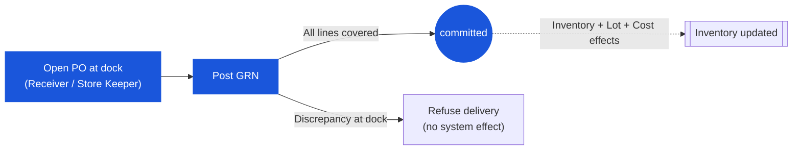
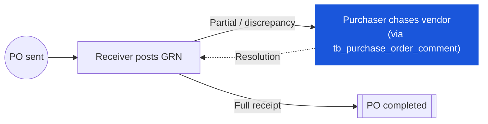
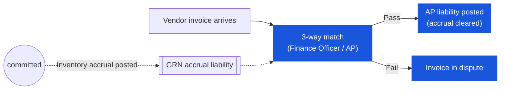
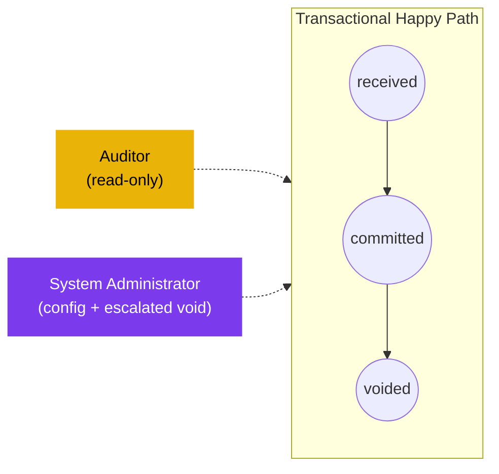

```mermaid
stateDiagram-v2
    [*] --> <first_state>: <create label> (<role>)
    <first_state> --> <next_state>: <transition label>
    <... one line per legal transition ...>
    <terminal_state> --> [*]
```

```mermaid
stateDiagram-v2
    [*] --> received: create (Receiver — from PO or standalone)
    received --> committed: post (Receiver)
    received --> voided: void (Inventory Mgr / Sysadmin; reason required)
    committed --> [*]
    voided --> [*]
```

# Inventory Modules Pattern Rollout — Implementation Plan

> **For agentic workers:** REQUIRED SUB-SKILL: Use superpowers:subagent-driven-development (recommended) or superpowers:executing-plans to implement this plan task-by-task. Steps use checkbox (`- [ ]`) syntax for tracking.

**Goal:** Apply the Mermaid + Permission Matrix + Discrepancy callout pattern (established by `e4c3a4a` for PR/PO) to six inventory modules (GRN, SR, inventory-adjustment, physical-count, spot-check, costing).

**Architecture:** Pure documentation edits in `en/<module>/02-business-rules.md` and `en/<module>/03-user-flow*.md`. No code, no tests, no build. Six independent commits, one per module. Source for every discrepancy callout is `Test_case/System_Process/tx-NN-*.md` (held outside the wiki repo at `/Users/samutpra/GitHub/Test_case/`).

**Tech Stack:** Markdown + Wiki.js YAML frontmatter + Mermaid (rendered natively by Wiki.js).

---

## Pre-Flight

- [ ] **Step 0a: Verify working directory and clean tree**

```bash
cd /Users/samutpra/GitHub/carmensoftware-organize/carmen-wiki
git status
```

Expected: `On branch main`, working tree clean, `e4c3a4a` and `cc82222` in recent log (`git log --oneline -3`).

- [ ] **Step 0b: Confirm Test_case sources exist**

```bash
ls /Users/samutpra/GitHub/Test_case/System_Process/tx-01-grn.md \
   /Users/samutpra/GitHub/Test_case/System_Process/tx-03-sr.md \
   /Users/samutpra/GitHub/Test_case/System_Process/tx-06-stock-in-adj.md \
   /Users/samutpra/GitHub/Test_case/System_Process/tx-07-stock-out-adj.md \
   /Users/samutpra/GitHub/Test_case/System_Process/tx-08-physical-stocktake.md \
   /Users/samutpra/GitHub/Test_case/System_Process/tx-10-spot-check.md \
   /Users/samutpra/GitHub/Test_case/System_Process/proc-03-cost-calculation.md
```

Expected: every path lists with no errors.

---

## Shared Templates

These templates are referenced by name from every module's tasks below. Fill in `<placeholders>` from the reconnaissance notes you produce in each module's recon task.

### Template T1 — State-machine Mermaid (goes in `03-user-flow.md` Section 2)

Use `stateDiagram-v2`. Every `from → to` transition in the existing Section 2 transition table must appear as one `state --> state: label` line.

```markdown

```

### Template T2 — Status Lifecycle table (goes in `02-business-rules.md` § 5.1)

Anchor: if the file has an existing `State diagram (Prisma-canonical):` code block in Section 5, place T2 immediately after that block. Otherwise place T2 at the end of `## 5. Posting Rules` (just before `## 6. Cross-Module Rules`).

```markdown
### 5.1 Status Lifecycle — Live UI vs BRD Mapping

The Prisma enum `enum_<module>_doc_status` documented above is what the live UI uses. BRD `<FR-XXX>` describes the intended status set. The table below maps every observable live-UI status to its BRD equivalent so testers and developers can reconcile the two without ambiguity. Source: `Test_case/System_Process/tx-NN-*.md` (capture date <YYYY-MM-DD>).

| Live UI status | BRD `<FR-XXX>` equivalent | Diff | Notes |
|---|---|---|---|
| `<UI_STATUS>` | `<BRD label>` | ✅ match / 🟡 renamed / 🔴 new / 🔵 BRD only | <one-line note> |
| ... | ... | ... | ... |
```

If the module has no diff (every row ✅), add a single line above the table: `No diff observed against Test_case/System_Process/tx-NN-*.md at <capture date>.`

### Template T3 — Discrepancy callout (goes in `02-business-rules.md` under the rule it relates to, or under a Permission Matrix in a role file)

```markdown
> ⚠️ **Discrepancy — <one-line topic>:** BRD `<FR-XXX>` specifies <X>. The live UI <does Y>. Source: `Test_case/System_Process/tx-NN-*.md` (capture date <YYYY-MM-DD>).
```

Variants:
- `> ℹ️ **Note —** ...` for non-conflicting nuance.
- `> 🟡 **Verification pending —** ...` for Test_case TBC markers.

### Template T4 — Workflow Position Mermaid (goes in each `03-user-flow-{role}.md` Section 1, after the role-description paragraph)

Use `graph LR`. Highlight the role's own nodes with `classDef current fill:#1a56db,color:#fff,stroke:#1a56db;`. For configurational surfaces use a second class `classDef current2 fill:#7c3aed,color:#fff,stroke:#7c3aed;`. For escalation paths use `classDef escalated stroke-dasharray: 4 4,stroke:#555;`.

```markdown
### Workflow position (<role> highlighted)

```mermaid
graph LR
    <node>:::current --> <node>(("<state>"))
    <... edges that show how this role participates ...>
    classDef current fill:#1a56db,color:#fff,stroke:#1a56db;
```
```

### Template T5 — Permission Matrix (goes immediately after T4 in each role file)

Choose ONE variant per role. The variant menu (from spec §5.4) is:

| Variant | Shape | When to use |
|---|---|---|
| **V1** Status × Action | columns = `enum_<module>_doc_status` values seen by this role; rows = actions | Document owner (creator) |
| **V2** Action × Stage Role | columns = sub-roles (HOD / BC / Finance / …); rows = actions | Multi-stage approver |
| **V3** Status × Action + sub-role columns | as V1, with sub-role split per column | Receiver / executor with sub-roles |
| **V4** Event × System Effect mapping | columns = (Internal persona, System surface, Status effect); rows = vendor events | External party |
| **V5** Touchpoint × Action | columns = pre-transmit / post-receipt etc.; rows = actions | Bi-touchpoint role (Finance Mgr / AP) |
| **V6** Action × Sub-persona | columns = Auditor / Sysadmin; rows = actions | Off-path observer |

Body:

```markdown
### Permission Matrix — <V1..V6 label> (<role>)

<1-2 sentence framing paragraph: which states this role sees, what scope server-side rules enforce.>

| <col1> | <col2> | <col3> | ... |
|---|---|---|---|
| <action> | ✅ / ❌ / per-condition | ... | ... |

> ℹ️ **<short label>:** <optional non-obvious caveat — snapshot semantics, send-back loop, segregation of duties>.
```

### Template T6 — Frontmatter date bump

For every edited file, change ONLY the `date:` line in YAML frontmatter. Leave `dateCreated:` untouched.

```yaml
date: 2026-05-16T12:00:00.000Z
```

Use any UTC timestamp on 2026-05-16 with `:00:00.000Z` seconds (hour resolution is sufficient per spec §5.5). All files within a single module-commit should share the same timestamp.

### Template T7 — Commit message

```
docs(<module>): add Mermaid flows, permission matrices, and BRD-vs-live-UI discrepancy callouts

<2-3 sentence body describing what this commit applies to this module — which role files,
which Test_case source, any module-specific notes (e.g. status-enum rename, missing BRD ID).>

Co-Authored-By: Claude Opus 4.7 (1M context) <noreply@anthropic.com>
```

---

## Module 1: Good Receive Note

**Files:**
- Read (recon): `Test_case/System_Process/tx-01-grn.md` (full file), `en/good-receive-note/01-data-model.md` (enum values only), `en/good-receive-note/02-business-rules.md`, `en/good-receive-note/03-user-flow*.md` (all 5 files).
- Modify: `en/good-receive-note/02-business-rules.md`, `en/good-receive-note/03-user-flow.md`, `en/good-receive-note/03-user-flow-purchaser.md`, `en/good-receive-note/03-user-flow-receiver.md`, `en/good-receive-note/03-user-flow-finance.md`, `en/good-receive-note/03-user-flow-audit-config.md`.

### Task 1.1: Reconnaissance — GRN

- [ ] **Step 1: Read Test_case GRN file end-to-end**

Read `/Users/samutpra/GitHub/Test_case/System_Process/tx-01-grn.md`. Capture in a scratchpad (paper notes or a temporary file — does not get committed):
- Capture date: read `last_updated:` from frontmatter (currently `2026-04-27`).
- Status flow string: e.g. `Received → Committed`.
- Creation paths: list each.
- Every changelog entry that says "updated to reflect" / "corrected" — these mark discrepancies.
- Every "TBC" marker in body text.
- Any explicit BR-NN reference.

- [ ] **Step 2: Read `01-data-model.md` for the GRN status enum**

```bash
grep -A 20 "enum_good_receive_note_doc_status\|enum.*grn.*status\|@@map.*good_receive_note" /Users/samutpra/GitHub/carmensoftware-organize/carmen-wiki/en/good-receive-note/01-data-model.md
```

Capture the exact enum value list. This is what populates Template T1 (state machine) and T2 (Status Lifecycle table left column).

- [ ] **Step 3: Read each role file's Section 1 to identify action set**

For each of `03-user-flow-purchaser.md`, `03-user-flow-receiver.md`, `03-user-flow-finance.md`, `03-user-flow-audit-config.md`, read Section 1 only. Note:
- Which role variant (V1-V6) fits — most likely: Receiver = V3, Purchaser = V1, Finance = V5, Audit/Config = V6. Adjust based on what you read.
- The action labels actually used in prose (so the matrix rows match the file's existing vocabulary).
- The status values this role can act on.

- [ ] **Step 4: Read `02-business-rules.md` Section 5 to find the anchor for T2**

```bash
grep -n "^### \|^## \|State diagram" /Users/samutpra/GitHub/carmensoftware-organize/carmen-wiki/en/good-receive-note/02-business-rules.md
```

Identify whether the file has a "State diagram (Prisma-canonical)" code block (T2 anchor #1) or not (use T2 anchor #2 — end of Section 5).

### Task 1.2: Edit `en/good-receive-note/02-business-rules.md`

**Files:** Modify `en/good-receive-note/02-business-rules.md`.

- [ ] **Step 1: Bump frontmatter `date:`**

Apply Template T6 — replace the existing `date:` line with `date: 2026-05-16T12:00:00.000Z`. Leave `dateCreated:` untouched.

- [ ] **Step 2: Insert the Status Lifecycle table (Template T2)**

Apply T2 at the anchor identified in Task 1.1 Step 4. Fill `<UI_STATUS>` rows from the enum read in Task 1.1 Step 2; fill `BRD equivalent` from the Test_case GRN file body ("Status flow: Received → Committed"); set Diff column per the legend.

Common GRN discrepancies observed in Test_case tx-01 (verify against the file you read):
- If wiki's `01-data-model.md` enum uses different labels than Test_case's "Received / Committed", mark 🟡 renamed.
- If wiki has a `draft` or `voided` state that Test_case does not show, mark 🔴 new in live UI.

- [ ] **Step 3: Insert Discrepancy callouts (Template T3) for each gap**

For GRN, the known discrepancies from Test_case changelog include "BR-01 updated to reflect PO-linked and standalone GRN" — there is no Draft state. Insert a ⚠️ callout under whichever `GRN_AUTH_*` or `GRN_POST_*` rule handles "create" / "first status". Body example:

```markdown
> ⚠️ **Discrepancy — no `Draft` state in live UI:** BRD models a `Draft → Posted` flow. The live UI commits GRN directly to `Received` on creation; there is no editable draft. Two creation paths confirmed: from an approved PO, and standalone without a PO reference. Source: `Test_case/System_Process/tx-01-grn.md` (capture date 2026-04-27).
```

Add additional ⚠️ / ℹ️ / 🟡 callouts only for facts you confirmed in Task 1.1.

- [ ] **Step 4: Verify diff**

```bash
git diff en/good-receive-note/02-business-rules.md | head -80
```

Expected: frontmatter `date:` changed, one new `### 5.1` section, at least one `> ⚠️` block.

### Task 1.3: Edit `en/good-receive-note/03-user-flow.md` (overview)

**Files:** Modify `en/good-receive-note/03-user-flow.md`.

- [ ] **Step 1: Bump frontmatter `date:`** (Template T6).

- [ ] **Step 2: Insert state-machine Mermaid (Template T1)**

Place the mermaid block immediately after the introductory paragraph of `## 2. Document Lifecycle` and BEFORE the existing transition table. Build the diagram from the enum values captured in Task 1.1 Step 2 and the transitions enumerated in the existing prose table.

Example shape (replace `<state>` with the actual enum values from the wiki, not guesswork):

```markdown

```

- [ ] **Step 3: Verify diff**

```bash
git diff en/good-receive-note/03-user-flow.md
```

Expected: frontmatter `date:` changed, one new ```` ```mermaid ```` block in Section 2.

### Task 1.4: Edit `en/good-receive-note/03-user-flow-receiver.md`

**Files:** Modify `en/good-receive-note/03-user-flow-receiver.md`.

- [ ] **Step 1: Bump frontmatter `date:`** (Template T6).

- [ ] **Step 2: Insert Workflow Position Mermaid (Template T4)** in Section 1, after the role-description paragraph.

```markdown
### Workflow position (Receiver highlighted)


```

Replace `<state>` placeholders with the actual GRN enum values from Task 1.1.

- [ ] **Step 3: Insert Permission Matrix (Template T5, variant V3 — Status × Action with sub-roles)** immediately after the Mermaid block.

The Receiver sub-roles are typically **Store Keeper** (raises the GRN at the dock) and **Inventory Manager** (closes / voids). Build the table with columns for each status the Receiver sees and explicit sub-role splits where the action authority differs.

Example shape:

```markdown
### Permission Matrix — Status × Action (Receiver sub-roles)

The Store Keeper drives the per-receipt GRN; the Inventory Manager handles voids and end-of-period closure. Segregation of duties (`GRN_AUTH_NNN` — fill in actual rule ID) forbids the GRN poster from being the same user who created or approved the upstream PO.

| Action | received | committed | voided |
|---|---|---|---|
| View GRN | ✅ | ✅ | ✅ |
| Open Receive screen | ✅ | ❌ | ❌ |
| Post GRN (Store Keeper) | ✅ | ❌ | ❌ |
| Enter `received_qty` per line | ✅ | ❌ | ❌ |
| Enter `accepted_qty` per line | ✅ | ❌ | ❌ |
| Void GRN (Inventory Mgr) | ✅ (reason required) | ❌ | — |
| Add Comment | ✅ | ✅ | ✅ |
| Refuse delivery at dock (no GRN) | ✅ | — | — |
| Edit GRN header / lines | ❌ | ❌ | ❌ |
| Post GRN against own-buyer PO | ❌ (segregation of duties) | — | — |
```

Action rows MUST come from the file's Section 2 (Primary Flow) — do not invent actions the file does not describe. If `accepted_qty` is not mentioned in the role file, drop the row.

- [ ] **Step 4: Verify diff**

```bash
git diff en/good-receive-note/03-user-flow-receiver.md
```

Expected: frontmatter `date:` changed, one new `### Workflow position` block, one new `### Permission Matrix` table.

### Task 1.5: Edit `en/good-receive-note/03-user-flow-purchaser.md`

**Files:** Modify `en/good-receive-note/03-user-flow-purchaser.md`.

- [ ] **Step 1: Bump frontmatter `date:`** (Template T6).

- [ ] **Step 2: Insert Workflow Position Mermaid (Template T4)** in Section 1.

The Purchaser is downstream of PO; in GRN their role is monitor + chase vendor. Highlight nodes that the Purchaser actually touches (e.g. they don't post the GRN — they receive notification of the receipt and chase vendor on discrepancies).

```markdown
### Workflow position (Purchaser monitoring)


```

- [ ] **Step 3: Insert Permission Matrix (Template T5, variant V1 — Status × Action)** immediately after the Mermaid block.

Build columns from the GRN status enum; rows from the actions actually described in the role file. The Purchaser likely cannot post or void GRN — most rows should be ❌ with their few "✅" being view / comment / chase actions.

- [ ] **Step 4: Verify diff** — `git diff en/good-receive-note/03-user-flow-purchaser.md` shows the expected three changes.

### Task 1.6: Edit `en/good-receive-note/03-user-flow-finance.md`

**Files:** Modify `en/good-receive-note/03-user-flow-finance.md`.

- [ ] **Step 1: Bump frontmatter `date:`** (Template T6).

- [ ] **Step 2: Insert Workflow Position Mermaid (Template T4)** in Section 1.

Finance's GRN touchpoint is the three-way match (PO ↔ GRN ↔ invoice). Highlight the match step.

```markdown
### Workflow position (Finance — three-way match)


```

- [ ] **Step 3: Insert Permission Matrix (Template T5, variant V5 — Touchpoint × Action)** immediately after.

Finance has no direct GRN status mutation; touchpoints are usually **AP capture + three-way match** + (optionally) **accrual review**. Build the table with those as columns.

Example shape:

```markdown
### Permission Matrix — Touchpoint × Action (Finance)

The Finance Officer / AP runs the three-way match after the Receiver commits the GRN. The Finance Manager may review accrual postings on close-out. GRN status itself is not mutated by Finance.

| Action | AP capture + three-way match | Accrual / close-out review |
|---|---|---|
| View GRN / accrual posting | ✅ | ✅ |
| Capture vendor invoice | ✅ | — |
| Run three-way match (qty / price / product) | ✅ | — |
| Post AP liability on match success | ✅ | — |
| Hold invoice in dispute on match failure | ✅ | — |
| Edit GRN header / lines | ❌ | ❌ |
| Post / Void GRN | ❌ | ❌ |
```

- [ ] **Step 4: Verify diff** — `git diff en/good-receive-note/03-user-flow-finance.md` shows the expected three changes.

### Task 1.7: Edit `en/good-receive-note/03-user-flow-audit-config.md`

**Files:** Modify `en/good-receive-note/03-user-flow-audit-config.md`.

- [ ] **Step 1: Bump frontmatter `date:`** (Template T6).

- [ ] **Step 2: Insert Workflow Position Mermaid (Template T4)** showing Audit/Config as off-path observers.

```markdown
### Position relative to the transactional flow (off-path observers)


```

- [ ] **Step 3: Insert Permission Matrix (Template T5, variant V6 — Action × Sub-persona)** immediately after.

Two columns: `Auditor` and `System Administrator`. Rows: read actions, flag actions (Auditor only), config actions (Sysadmin only), state-change actions (mostly ❌; escalate to Inventory Manager for void).

- [ ] **Step 4: Verify diff** — `git diff en/good-receive-note/03-user-flow-audit-config.md` shows the expected three changes.

### Task 1.8: Verify & commit GRN

- [ ] **Step 1: Aggregate diff stat**

```bash
git diff --stat en/good-receive-note/
```

Expected: 6 files modified (1 rules + 1 overview + 4 role), ~250 lines added.

- [ ] **Step 2: Run pattern checks**

```bash
grep -l "Permission Matrix" en/good-receive-note/03-user-flow-*.md | wc -l
grep -l "mermaid" en/good-receive-note/03-user-flow*.md en/good-receive-note/02-business-rules.md | wc -l
grep -c "classDef current" en/good-receive-note/03-user-flow-*.md
```

Expected:
- `Permission Matrix` count = 4 (one per role file).
- `mermaid` count ≥ 5 (overview + 4 role; business-rules optional).
- `classDef current` count ≥ 1 in every role file that uses `:::current`.

- [ ] **Step 3: Commit (Template T7)**

```bash
git add en/good-receive-note/
git commit -m "$(cat <<'EOF'
docs(grn): add Mermaid flows, permission matrices, and BRD-vs-live-UI discrepancy callouts

Apply the PR/PO documentation pattern to the Good Receive Note module:
state-machine Mermaid in the user-flow overview, per-role workflow Mermaid
+ Permission Matrix (Status × Action for Receiver sub-roles; Touchpoint ×
Action for Finance; Action × Sub-persona for Audit/Config), and Status
Lifecycle mapping + discrepancy callouts citing Test_case/System_Process/
tx-01-grn.md (capture date 2026-04-27).

Co-Authored-By: Claude Opus 4.7 (1M context) <noreply@anthropic.com>
EOF
)"
```

Expected: `git log --oneline -1` shows the new commit on top of `cc82222`.

---

## Module 2: Store Requisition

**Files:**
- Read (recon): `Test_case/System_Process/tx-03-sr.md`, `en/store-requisition/01-data-model.md` (enum), `en/store-requisition/02-business-rules.md`, `en/store-requisition/03-user-flow*.md` (all 6 files).
- Modify: `en/store-requisition/02-business-rules.md`, `en/store-requisition/03-user-flow.md`, `en/store-requisition/03-user-flow-requester.md`, `en/store-requisition/03-user-flow-approver.md`, `en/store-requisition/03-user-flow-fulfiller.md`, `en/store-requisition/03-user-flow-receiver.md`, `en/store-requisition/03-user-flow-audit-config.md`.

### Task 2.1: Reconnaissance — SR

- [ ] **Step 1:** Same as Task 1.1 Step 1 but for `Test_case/System_Process/tx-03-sr.md`. Note: SR has 3-variant nature per Test_case INDEX.md changelog — capture the variants.

- [ ] **Step 2:** Read SR enum:

```bash
grep -A 20 "enum_store_requisition_doc_status\|enum.*sr.*status" /Users/samutpra/GitHub/carmensoftware-organize/carmen-wiki/en/store-requisition/01-data-model.md
```

- [ ] **Step 3:** Read each of 5 role files' Section 1 to map role → variant:
  - Requester → V1 (Status × Action)
  - Approver → V2 (Action × Stage Role) if multi-stage, else V1
  - Fulfiller → V1 or V3 (sub-roles if Store Keeper + Inventory Mgr split)
  - Receiver → V1 or V3
  - Audit/Config → V6

- [ ] **Step 4:** Find T2 anchor in `02-business-rules.md` (same as Task 1.1 Step 4).

### Task 2.2: Edit `en/store-requisition/02-business-rules.md`

- [ ] **Step 1:** Frontmatter `date:` (T6).
- [ ] **Step 2:** Insert T2 Status Lifecycle table at the chosen anchor. SR's 3-variant nature usually shows as separate paths; capture if any status only applies to a specific variant in the Notes column.
- [ ] **Step 3:** Insert T3 callouts for any "TRF/SR clarification" or variant discrepancy captured in recon.
- [ ] **Step 4:** Verify with `git diff en/store-requisition/02-business-rules.md`.

### Task 2.3: Edit `en/store-requisition/03-user-flow.md`

- [ ] **Step 1:** Frontmatter `date:` (T6).
- [ ] **Step 2:** Insert T1 state-machine Mermaid. SR's state machine often forks for the 3 variants — keep the diagram readable by labelling forking edges with the variant name (e.g. `--> "fulfilled (variant A)"`).
- [ ] **Step 3:** Verify diff.

### Tasks 2.4–2.8: Edit each SR role file

For each of `03-user-flow-requester.md`, `03-user-flow-approver.md`, `03-user-flow-fulfiller.md`, `03-user-flow-receiver.md`, `03-user-flow-audit-config.md`:

- [ ] **Step 1:** Frontmatter `date:` (T6).
- [ ] **Step 2:** Insert T4 Workflow Position Mermaid highlighting the role.
- [ ] **Step 3:** Insert T5 Permission Matrix using the variant chosen in Task 2.1 Step 3.
- [ ] **Step 4:** Verify diff for that file.

Action rows MUST be drawn from each role file's existing Section 2 prose — do not invent.

### Task 2.9: Verify & commit SR

- [ ] **Step 1:** `git diff --stat en/store-requisition/` — expected 7 files modified.
- [ ] **Step 2:** Run the same three pattern checks as Task 1.8 Step 2 (adapting `Permission Matrix` count to 5).
- [ ] **Step 3:** Commit with T7 — body cites `Test_case/System_Process/tx-03-sr.md` and captures the 3-variant note. Module slug: `sr`.

---

## Module 3: Inventory Adjustment

**Files:**
- Read (recon): `Test_case/System_Process/tx-06-stock-in-adj.md`, `Test_case/System_Process/tx-07-stock-out-adj.md`, `en/inventory-adjustment/01-data-model.md`, `en/inventory-adjustment/02-business-rules.md`, `en/inventory-adjustment/03-user-flow*.md`.
- Modify: `en/inventory-adjustment/02-business-rules.md`, `en/inventory-adjustment/03-user-flow.md`, plus each of the 5 role files in `en/inventory-adjustment/`.

### Task 3.1: Reconnaissance — inventory-adjustment

- [ ] **Step 1:** Read BOTH `tx-06-stock-in-adj.md` and `tx-07-stock-out-adj.md` in `Test_case/System_Process/`. Note that stock-in and stock-out share the same Carmen module but their lot/cost effects differ (stock-in adds a lot; stock-out consumes oldest lot under FIFO or holds AVCO cost). Capture both capture dates — if they differ, cite both in any callouts that span both files.
- [ ] **Step 2:** Read the adjustment enum from `01-data-model.md`. Confirm whether wiki models stock-in and stock-out as one enum or two.
- [ ] **Step 3:** List each role file in `en/inventory-adjustment/03-user-flow-*.md` and assign a Permission Matrix variant.
- [ ] **Step 4:** Find T2 anchor in `02-business-rules.md`.

### Task 3.2: Edit `en/inventory-adjustment/02-business-rules.md`

- [ ] **Step 1:** Frontmatter `date:`.
- [ ] **Step 2:** Insert T2 Status Lifecycle. If the wiki uses one enum for both stock-in and stock-out, add a Notes column entry indicating which variant a status applies to.
- [ ] **Step 3:** Insert T3 callouts. The most likely discrepancy: BRD treats stock-in and stock-out as distinct flows; live UI may use a single `adjustment_type` field on one document. Verify against `tx-06` and `tx-07` and capture both as separate ⚠️ callouts if needed.
- [ ] **Step 4:** Verify diff.

### Task 3.3: Edit `en/inventory-adjustment/03-user-flow.md`

- [ ] **Step 1:** Frontmatter `date:`.
- [ ] **Step 2:** Insert T1 — use a single state-machine if the wiki models them in one enum; otherwise use two parallel mermaid blocks (one for stock-in, one for stock-out) both inside Section 2.
- [ ] **Step 3:** Verify diff.

### Tasks 3.4–3.8: Edit each adjustment role file

Same shape as Tasks 2.4–2.8. Variants: roles in adjustment modules are typically Creator (V1), Approver (V2), Inventory Manager (V3 if sub-roles), Audit/Config (V6). Pick per role file's actual content.

### Task 3.9: Verify & commit inventory-adjustment

- [ ] **Step 1:** `git diff --stat en/inventory-adjustment/` — expected 7 files.
- [ ] **Step 2:** Pattern checks.
- [ ] **Step 3:** Commit with T7. Body cites BOTH `tx-06-stock-in-adj.md` and `tx-07-stock-out-adj.md`. Module slug: `inv-adj`.

---

## Module 4: Physical Count

**Files:**
- Read (recon): `Test_case/System_Process/tx-08-physical-stocktake.md`, `en/physical-count/01-data-model.md`, `en/physical-count/02-business-rules.md`, `en/physical-count/03-user-flow*.md` (4 role files).
- Modify: `en/physical-count/02-business-rules.md`, `en/physical-count/03-user-flow.md`, + 4 role files.

### Task 4.1: Reconnaissance — physical-count

- [ ] **Step 1:** Read `tx-08-physical-stocktake.md`. Capture especially: period-close prerequisite ("transactions at a location are locked while its Physical Count is IN PROGRESS" per Test_case INDEX.md), variance-handling rules, lot adjustment behaviour.
- [ ] **Step 2:** Read physical-count enum.
- [ ] **Step 3:** Map roles → variants. Typical: Counter (V1), Reviewer / Supervisor (V2 or V3), Inventory Mgr (V3), Audit/Config (V6).
- [ ] **Step 4:** Find T2 anchor.

### Tasks 4.2 → 4.7: Edit phase

Same structure as Module 2. The notable Physical Count discrepancy to watch for: BRD treats "Draft → Finalized" but Test_case has explicit "IN PROGRESS" with the location-lock side-effect; surface this as a ⚠️ callout.

### Task 4.8: Verify & commit physical-count

- [ ] **Step 1:** `git diff --stat` — expected 6 files.
- [ ] **Step 2:** Pattern checks.
- [ ] **Step 3:** Commit (T7). Module slug: `physical-count`. Note period-close prerequisite in body.

---

## Module 5: Spot Check

**Files:**
- Read (recon): `Test_case/System_Process/tx-10-spot-check.md`, `en/spot-check/01-data-model.md`, `en/spot-check/02-business-rules.md`, `en/spot-check/03-user-flow*.md` (4 role files).
- Modify: same shape as Module 4.

### Task 5.1: Reconnaissance — spot-check

- [ ] **Step 1:** Read `tx-10-spot-check.md`. Spot Check is a subset of Physical Count — narrower scope, faster cadence. Capture how the two differ in Test_case.
- [ ] **Step 2:** Read spot-check enum.
- [ ] **Step 3:** Map roles → variants.
- [ ] **Step 4:** Find T2 anchor.

### Tasks 5.2 → 5.7: Edit phase

Same structure. Spot Check's most likely discrepancy: it shares the period-close prerequisite chain with Physical Count — Test_case INDEX.md notes "Stage 2: all Spot Checks Completed" before End Period Close — but BRD may not model this dependency. Add a ⚠️ or ℹ️ callout in `02-business-rules.md` Section 6 (Cross-Module) if the rule isn't already there.

### Task 5.8: Verify & commit spot-check

- [ ] **Step 1–3:** Same as Task 4.8. Module slug: `spot-check`.

---

## Module 6: Costing

**Files:**
- Read (recon): `Test_case/System_Process/proc-03-cost-calculation.md` (primary), plus `tx-01-grn.md`, `tx-06`, `tx-07`, `tx-08` for the transactions that trigger cost recalculation. `en/costing/01-data-model.md` (cost-method enum), `en/costing/02-business-rules.md`, `en/costing/03-user-flow*.md` (4 role files).
- Modify: same shape.

### Task 6.1: Reconnaissance — costing

- [ ] **Step 1:** Read `proc-03-cost-calculation.md` in full. Capture: AVCO formula, FIFO layer behaviour, which transactions trigger recalc, **what does NOT trigger recalc** (per Test_case INDEX swim lane: SR `NOT triggered — goods move at existing cost`).
- [ ] **Step 2:** Read costing enum. Cost-method enum is typically `avco` / `fifo` per Business Unit; check whether the wiki models a doc-status enum for costing or only a method enum.
- [ ] **Step 3:** Map roles → variants. Costing roles tend to be off-path (Finance review, Audit). Use V5 (Touchpoint × Action) for the finance role; V6 for Audit/Config.
- [ ] **Step 4:** Find T2 anchor — if `02-business-rules.md` for costing does NOT have a status enum at all, replace T2 with a **Method × Trigger** table instead:

```markdown
### 5.1 Cost Method × Trigger Mapping — Live UI vs BRD

| Trigger transaction | AVCO effect | FIFO effect | BRD reference | Notes |
|---|---|---|---|---|
| GRN (stock-in) | Re-average | New cost layer | <FR-COST-NN> | Source: tx-01-grn.md |
| Stock-out adj | Hold cost | Consume oldest layer | <FR-COST-NN> | tx-07 |
| ... | ... | ... | ... | ... |
```

### Tasks 6.2 → 6.7: Edit phase

Same structure. Costing's unique discrepancy to surface: per Test_case INDEX, the SR row says "NOT triggered — goods move at existing cost" — this is an important rule that wiki `02-business-rules.md` Section 6 (Cross-Module) should explicitly state. Add a ℹ️ callout if it's missing.

For the Mermaid in `03-user-flow.md`, if costing has no document status enum, use a **process Mermaid** (sequenceDiagram showing GRN → Lot → Cost recalc) instead of stateDiagram-v2. Mirror the swim-lane from `proc-03-cost-calculation.md`.

### Task 6.8: Verify & commit costing

- [ ] **Step 1–3:** Same shape. Module slug: `costing`. Body in T7 should note "no doc-status enum — Method × Trigger table substituted for Status Lifecycle table" if that branch was taken.

---

## Post-Rollout Verification

- [ ] **Step 1: Confirm six commits exist on top of `cc82222`**

```bash
git log --oneline cc82222..HEAD
```

Expected: exactly 6 lines, each starting `docs(<module>):`.

- [ ] **Step 2: Aggregate file count**

```bash
git diff --stat cc82222..HEAD | tail -1
```

Expected: ≈ 38 files changed, ≈ 1,500-1,700 insertions.

- [ ] **Step 3: Cross-module pattern check**

```bash
for m in good-receive-note store-requisition inventory-adjustment physical-count spot-check costing; do
  echo "=== $m ==="
  echo -n "  Permission Matrix files: "
  grep -l "Permission Matrix" en/$m/03-user-flow-*.md 2>/dev/null | wc -l
  echo -n "  Mermaid files: "
  grep -l "mermaid" en/$m/03-user-flow*.md en/$m/02-business-rules.md 2>/dev/null | wc -l
  echo -n "  Status Lifecycle in business-rules: "
  grep -c "Status Lifecycle" en/$m/02-business-rules.md 2>/dev/null
done
```

Expected: every module shows `Permission Matrix files >= 4`, `Mermaid files >= 5`, `Status Lifecycle in business-rules = 1`.

- [ ] **Step 4: Hold for user push approval**

Do NOT push to `origin/main`. Report the six new commits to the user and wait for their explicit push instruction (matches PR/PO rollout convention).

---

## Notes for the Implementing Agent

- **DRY:** Templates T1-T7 above are the only places that define the patterns. Every task references them. If you find yourself rewriting a template inline, stop and reference the template instead.
- **YAGNI:** The spec explicitly forbids screen-level pages, prose rewrites, and unrelated refactoring. Do not add anything beyond Mermaid + Permission Matrix + Discrepancy callouts.
- **No `dateCreated:` edits.** Every recon step verifies you have the right field.
- **Per-module commits.** Do not batch. Each commit must independently pass the per-module verification step.
- **No push.** Final step is always reporting commits and waiting.
- **When in doubt about a role variant**, choose the one used by the closest analogue in PR/PO and add a 1-2 sentence framing paragraph explaining why. Do not invent a seventh variant.
