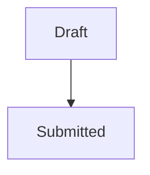
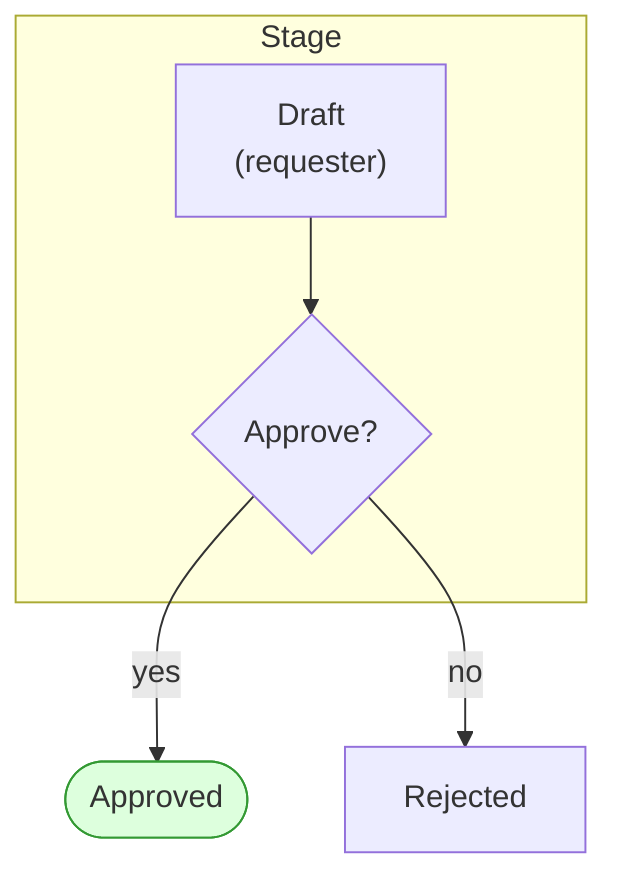
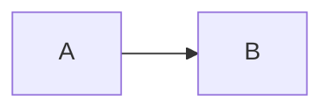
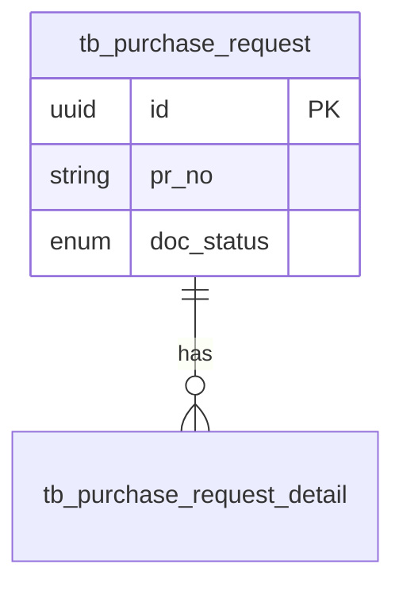
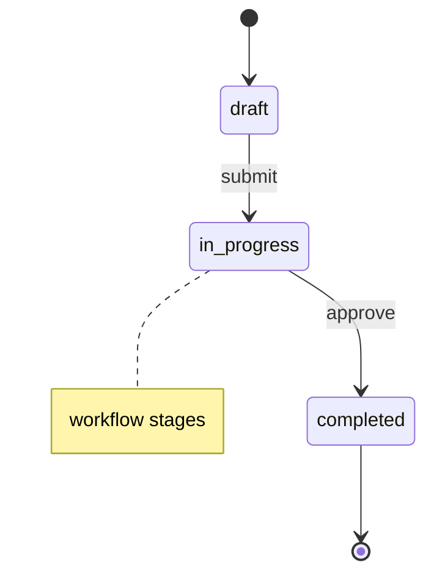
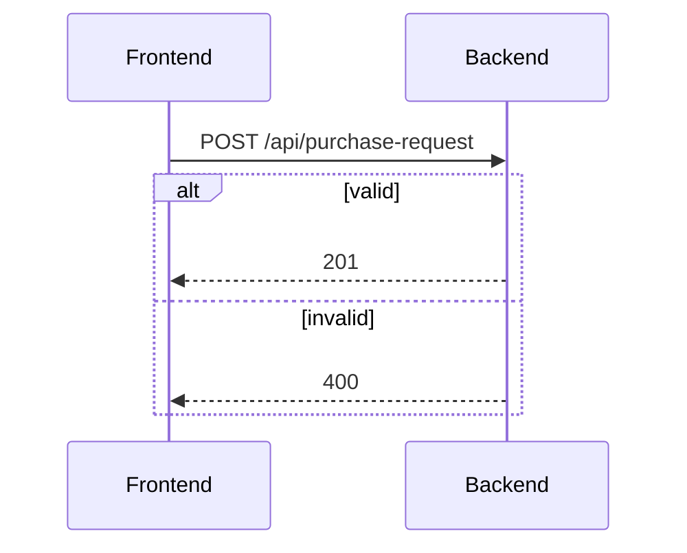
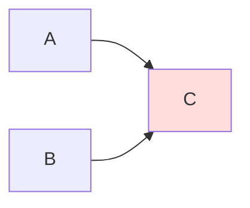

# Diagrams from carmen/docs Implementation Plan

> **For agentic workers:** REQUIRED SUB-SKILL: Use superpowers:subagent-driven-development (recommended) or superpowers:executing-plans to implement this plan task-by-task. Steps use checkbox (`- [ ]`) syntax for tracking.

**Goal:** Enrich existing Inventory-book wiki pages (EN + TH) with Mermaid diagrams adapted from `../carmen/docs/`, each verified against current implementation.

**Architecture:** A stdlib Python script (`scripts/diagram_catalog.py`) catalogs every Mermaid block in `carmen/docs`, maps it to a wiki module, dedups it, and checks EN/TH parity. Decisions live in per-module TSV files that the script re-applies on every rebuild. Six parallel subagents curate and adapt diagrams module-group by module-group; the orchestrator spot-checks, rebuilds the catalog, commits, pushes to dev Wiki.js, and verifies rendering.

**Tech Stack:** Python 3.11+ stdlib, Markdown + Mermaid (Wiki.js 2), `scripts/push_pages.py` (Wiki.js GraphQL), Claude-in-Chrome for render checks.

**Spec:** `docs/superpowers/specs/2026-09-28-diagrams-from-carmen-design.md`

## Global Constraints

- Inventory book only (`en/inventory/`, `th/inventory/`); Platform book untouched.
- Import and adapt only — never draw a diagram without a source block.
- Precedence: E2E tests and implementation beat `carmen/docs`.
- Max **3 diagrams per page**, ~25 nodes per diagram; none on `04-test-scenarios*.md`.
- TH Mermaid block is byte-identical to EN; labels stay English; TH lead-ins/headings in Thai.
- Source line under every imported diagram (English in both locales): `> Diagram adapted from \`carmen/docs/<path>\` · verified against \`<repo>/<path>\`[, …] (2026-09-28)` plus `· Changes: …` when adapted.
- Never renumber existing sections; update frontmatter `date` on every edited page; never touch `dateCreated`.
- Decision statuses: `imported` | `rejected: diverges|covered|unverifiable|too-large|render|page-full`.
- User preference: **no test files** (`test_*.py`) are created; verification is by running the script on scratch fixtures, static checks (`python3 -m py_compile`), and browser checks.
- Subagents never run git; only the orchestrator commits.
- Merge to `main` only after explicit user confirmation.

## Review Focus

1. **Re-running the catalog after decisions exist** — a person expects every recorded `imported`/`rejected` decision and the allow-list to survive a rebuild. Pinned in Task 1 Step 3 (fixture run twice, decision survives).
2. **Fences the parser can mis-read** — indented ```` ```mermaid ````, `~~~` fences, `# comment` lines inside a ```` ```bash ```` block, and a fence never closed. Expected: indented/tilde blocks cataloged, bash comments not taken as headings, unclosed block reported as `rejected: unclosed` rather than swallowing the rest of the file. Pinned in Task 1 Step 3.
3. **Folder-map prefix collisions** — `documents/pr` must not claim `documents/prt/…`, and `physical-count` must not claim `physical-count-management` by string prefix alone. Pinned in Task 1 Step 3.
4. **Pre-existing EN/TH diagram mismatches** — the parity gate must fail only on mismatches this work introduces. Pinned in Task 2 Step 3 (baseline suppresses known lines, new mismatch fails).
5. **A decision file with a typo** (unknown id, bad status, wrong column count) — expected: the build aborts with file:line, rather than silently ignoring the decision. Pinned in Task 1 Step 3.

---

## File Structure

| File | Responsibility |
|---|---|
| `scripts/diagram_catalog.py` (create) | Scan, map, dedup, apply decisions, render catalog; `--summary`, `--require-done`, `--check-parity [--baseline]` |
| `scripts/README.md` (modify) | Usage section for the new script |
| `.specs/diagram-catalog.md` (generated, committed) | Tracker of every source block |
| `.specs/diagram-decisions/<module>.tsv` (created by subagents) | Per-module decisions re-applied on rebuild |
| `.specs/diagram-parity-baseline.txt` (generated, committed) | Pre-existing EN/TH Mermaid mismatches |
| `en/inventory/**/*.md`, `th/inventory/**/*.md` (modify) | Imported diagrams |

---

### Task 0: Worktree

**Files:** none

- [ ] **Step 1: Move the main checkout back to `main` and create the worktree**

```bash
cd /Users/samutpra/GitHub/carmensoftware-organize/carmen-wiki
git checkout main
git worktree add ../carmen-wiki-diagrams docs/diagrams-from-carmen
cp scripts/.env ../carmen-wiki-diagrams/scripts/.env
cd ../carmen-wiki-diagrams && git log --oneline -3
```

Expected: HEAD is the plan commit on `docs/diagrams-from-carmen`. All later tasks run in `/Users/samutpra/GitHub/carmensoftware-organize/carmen-wiki-diagrams` (called `$WT` below). `../carmen/docs` resolves identically from there because both checkouts are siblings of `carmen/`.

---

### Task 1: Catalog script

**Files:**
- Create: `scripts/diagram_catalog.py`
- Modify: `scripts/README.md` (append section)

**Interfaces:**
- Produces: CLI `python3 scripts/diagram_catalog.py [--docs P] [--out P] [--decisions P] [--wiki-root P] [--summary | --require-done | --check-parity [--baseline P]]`; functions `mermaid_blocks(text) -> Iterator[tuple[int, str, str | None]]`, `block_id(body: str) -> str` (10 hex chars), `module_for(rel: str) -> str | None`, `build(docs, decisions_dir, wiki_root) -> list[Row]`.

- [ ] **Step 1: Write the script**

Create `scripts/diagram_catalog.py`:

```python
#!/usr/bin/env python3
"""Catalog Mermaid diagrams in carmen/docs and check EN/TH diagram parity.

Spec: docs/superpowers/specs/2026-09-28-diagrams-from-carmen-design.md §2, §5.3.

  python3 scripts/diagram_catalog.py                 # (re)build .specs/diagram-catalog.md
  python3 scripts/diagram_catalog.py --summary       # print status counts, write nothing
  python3 scripts/diagram_catalog.py --require-done  # exit 1 while any candidate/unmapped remains
  python3 scripts/diagram_catalog.py --check-parity [--baseline FILE]

Decisions live in .specs/diagram-decisions/<module>.tsv as `<id>\\t<status>\\t<page>`
and override the automatic status on every rebuild, so re-running never loses a
decision. The block between the ALLOW-LIST markers in the catalog is kept verbatim.
"""
import argparse, hashlib, re, sys
from collections import Counter, defaultdict
from dataclasses import dataclass
from pathlib import Path

ROOT = Path(__file__).resolve().parent.parent
DEFAULT_DOCS = ROOT.parent / "carmen" / "docs"
DEFAULT_OUT = ROOT / ".specs" / "diagram-catalog.md"
DEFAULT_DECISIONS = ROOT / ".specs" / "diagram-decisions"
OUT = "out-of-scope"
UNCLOSED = "rejected: unclosed"
SKIP_DIRS = {"node_modules", ".git"}

# Source path (relative to carmen/docs) -> wiki module, or OUT.
# A key matches a path equal to it or under it as a directory; the longest key wins.
# Paths matching no key are "unmapped" and must be resolved by editing this map.
MODULE_MAP = {
    # app/ (newest tree)
    "app/finance/account-code-mapping": "general-ledger",
    "app/finance/currency-management": "master-data",
    "app/finance/department-management": "master-data",
    "app/finance/exchange-rate-management": "master-data",
    "app/inventory-management/fractional-inventory": "inventory",
    "app/inventory-management/inventory-adjustments": "inventory-adjustment",
    "app/inventory-management/inventory-overview": "inventory",
    "app/inventory-management/inventory-transactions": "inventory",
    "app/inventory-management/lot-based-costing": "costing",
    "app/inventory-management/period-end": "inventory",
    "app/inventory-management/physical-count": "physical-count",
    "app/inventory-management/physical-count-management": "physical-count",
    "app/inventory-management/spot-check": "spot-check",
    "app/inventory-management/stock-in": "inventory",
    "app/inventory-management/stock-overview": "inventory",
    "app/inventory-management/transaction-categories": "inventory-adjustment",
    "app/inventory-management/transactions": "inventory",
    "app/operational-planning/recipe-management": "recipe",
    "app/operational-planning/demand-forecasting": OUT,
    "app/operational-planning/menu-engineering": OUT,
    "app/procurement/credit-note": "purchase-order",
    "app/procurement/goods-received-notes": "good-receive-note",
    "app/procurement/my-approvals": OUT,
    "app/procurement/purchase-orders": "purchase-order",
    "app/procurement/purchase-request-templates": "templates",
    "app/procurement/purchase-requests": "purchase-request",
    "app/product-management/categories": "product",
    "app/product-management/products": "product",
    "app/product-management/units": "master-data",
    "app/shared-methods/inventory-valuation": "costing",
    "app/store-operations/stock-replenishment": "store-requisition",
    "app/store-operations/store-requisitions": "store-requisition",
    "app/store-operations/wastage-reporting": "inventory-adjustment",
    "app/system-administration/account-code-mapping": "general-ledger",
    "app/system-administration/delivery-points": "master-data",
    "app/system-administration/location-management": "master-data",
    "app/system-administration/monitoring": OUT,
    "app/system-administration/notification-preferences": "reporting-audit",
    "app/system-administration/permission-management": "access-control",
    "app/system-administration/settings": "system-config",
    "app/system-administration/user-management": "access-control",
    "app/system-administration/workflow": "system-config",
    "app/template-guide": OUT,
    "app/vendor-management/price-lists": "vendor-pricelist",
    "app/vendor-management/pricelist-templates": "templates",
    "app/vendor-management/requests-for-pricing": "vendor-pricelist",
    "app/vendor-management/vendor-directory": "master-data",
    "app/vendor-management/vendor-portal": "vendor-pricelist",
    # documents/ (older tree)
    "documents/architecture": OUT,
    "documents/cn": "purchase-order",
    "documents/dashboard": "dashboard",
    "documents/grn": "good-receive-note",
    "documents/inv": "inventory",
    "documents/inventory": "inventory",
    "documents/pc": "physical-count",
    "documents/pm": "product",
    "documents/po": "purchase-order",
    "documents/pr": "purchase-request",
    "documents/prt": "templates",
    "documents/sc": "spot-check",
    "documents/so": "store-requisition",
    "documents/sr": "store-requisition",
    "documents/stakeholders": OUT,
    "documents/store-ops": "store-requisition",
    "documents/vm": "vendor-pricelist",
    "documents/DOCUMENTATION-CATALOG.md": OUT,
    "documents/MERMAID-TEST.md": OUT,
    "documents/SYSTEM-DOCUMENTATION-INDEX.md": OUT,
    "documents/SYSTEM-GAPS-AND-ROADMAP.md": OUT,
    "documents/module-spec-template.md": OUT,
    # loose top-level folders
    "Inventory": "inventory",
    "architecture/fifo-calc.md": "costing",
    "cn": "purchase-order",
    "good-recive-note-managment": "good-receive-note",
    "inventory-adjustment": "inventory-adjustment",
    "pages/po": "purchase-order",
    "pages/pr": "purchase-request",
    "purchase-order-management": "purchase-order",
    "purchase-request-management": "purchase-request",
    "store-requisitions": "store-requisition",
    "system-overview/Procurement-Process-Flow.md": "purchase-request",
    "vendor-pricelist-management": "vendor-pricelist",
    "mobile-app": OUT,
    "recipe-module/mobile-app.md": OUT,
    "platform-notification-service": OUT,
    "design/system-architecture.md": OUT,
    "developer-guides": OUT,
    "prd": OUT,
}

FENCE = re.compile(r"^\s*(`{3,}|~{3,})\s*([\w-]*)")
HEADING = re.compile(r"^#{1,6}\s+(.*?)\s*#*\s*$")
NON_STMT = re.compile(r"^(%%|subgraph\b|end\b|classDef\b|class\b|style\b|linkStyle\b|direction\b|click\b)")
DECISION = re.compile(r"^(imported|rejected: (diverges|covered|unverifiable|too-large|render|page-full))$")
PAGE_BY_TYPE = {"erDiagram": "01-data-model", "stateDiagram-v2": "02-business-rules",
                "stateDiagram": "02-business-rules"}
ALLOW_START, ALLOW_END = "<!-- ALLOW-LIST:START -->", "<!-- ALLOW-LIST:END -->"


@dataclass
class Row:
    id: str
    source: str
    line: int
    heading: str
    dtype: str
    stmts: int
    module: str | None
    page: str = "-"
    status: str = "candidate"


def mermaid_blocks(text):
    """Yield (line_no, heading, body) per ```mermaid fence; body is None when never closed.

    Other fenced blocks are skipped whole, so '# comment' lines inside ```bash are
    not mistaken for headings.
    """
    lines = text.splitlines()
    heading, i = "", 0
    while i < len(lines):
        m = FENCE.match(lines[i])
        if not m:
            h = HEADING.match(lines[i])
            if h:
                heading = h.group(1)
            i += 1
            continue
        fence, info = m.group(1), m.group(2)
        close = re.compile(r"^\s*" + re.escape(fence[0]) + "{" + str(len(fence)) + r",}\s*$")
        end = next((j for j in range(i + 1, len(lines)) if close.match(lines[j])), None)
        if info == "mermaid":
            yield i + 1, heading, None if end is None else "\n".join(lines[i + 1:end])
        if end is None:
            return
        i = end + 1


def block_id(body):
    return hashlib.sha1(" ".join(body.split()).encode()).hexdigest()[:10]


def body_lines(body):
    lines = [l.strip() for l in body.splitlines() if l.strip()]
    if lines and lines[0] == "---":  # mermaid frontmatter (title/config)
        lines = lines[next((k for k in range(1, len(lines)) if lines[k] == "---"), 0) + 1:]
    return [l for l in lines if not l.startswith("%%")]


def diagram_type(body):
    lines = body_lines(body)
    return lines[0].split()[0] if lines else "?"


def statements(body):
    return max(0, len([l for l in body_lines(body) if not NON_STMT.match(l)]) - 1)


def module_for(rel):
    for key in sorted(MODULE_MAP, key=len, reverse=True):
        if rel == key or rel.startswith(key + "/"):
            return MODULE_MAP[key]
    return None


def suggest_page(module, dtype, wiki_root):
    stem = PAGE_BY_TYPE.get(dtype, "03-user-flow")
    if (wiki_root / "en" / "inventory" / module / f"{stem}.md").is_file():
        return f"{module}/{stem}"
    return f"{module}/(choose)"


def rank(r):
    in_scope = 0 if r.module not in (None, OUT) else 1
    tree = 0 if r.source.startswith("app/") else 2 if r.source.startswith("documents/") else 1
    return (in_scope, tree, r.source, r.line)


def load_decisions(ddir):
    out = {}
    if not ddir.is_dir():
        return out
    for f in sorted(ddir.glob("*.tsv")):
        for n, raw in enumerate(f.read_text(encoding="utf-8").splitlines(), 1):
            if not raw.strip() or raw.startswith("#"):
                continue
            parts = raw.split("\t")
            if len(parts) != 3 or not DECISION.match(parts[1]):
                sys.exit(f"{f}:{n}: expected '<id>\\t<status>\\t<page>' with a valid status, got {raw!r}")
            out[parts[0]] = (parts[1], parts[2], f"{f}:{n}")
    return out


def build(docs, ddir, wiki_root):
    if not docs.is_dir():
        sys.exit(f"carmen docs not found: {docs}")
    rows = []
    for f in sorted(docs.rglob("*.md")):
        if SKIP_DIRS & set(f.parts):
            continue
        rel = f.relative_to(docs).as_posix()
        module = module_for(rel)
        for line, heading, body in mermaid_blocks(f.read_text(encoding="utf-8", errors="replace")):
            if body is None:
                rows.append(Row(block_id(f"{rel}:{line}"), rel, line, heading, "?", 0, module,
                                status=UNCLOSED))
                continue
            rows.append(Row(block_id(body), rel, line, heading, diagram_type(body),
                            statements(body), module))
    for r in rows:
        if r.status != "candidate":
            continue
        if r.module is None:
            r.status = "unmapped"
        elif r.module == OUT:
            r.status = OUT
        else:
            r.page = suggest_page(r.module, r.dtype, wiki_root)
    groups = defaultdict(list)
    for r in rows:
        if r.status != UNCLOSED:
            groups[r.id].append(r)
    survivors = {}
    for rid, g in groups.items():
        g.sort(key=rank)
        survivors[rid] = g[0]
        for r in g[1:]:
            r.status, r.page = f"duplicate of {g[0].source}:{g[0].line}", "-"
    for rid, (status, page, where) in load_decisions(ddir).items():
        if rid not in survivors:
            sys.exit(f"{where}: unknown or duplicate-only id {rid}")
        survivors[rid].status, survivors[rid].page = status, page
    return rows


def status_key(status):
    return "duplicate" if status.startswith("duplicate of") else status


def summary(rows):
    c = Counter(status_key(r.status) for r in rows)
    return "\n".join(f"| {k} | {v} |" for k, v in sorted(c.items()))


def allow_list(out_path):
    if out_path.is_file():
        t = out_path.read_text(encoding="utf-8")
        a, b = t.find(ALLOW_START), t.find(ALLOW_END)
        if a != -1 and b > a:
            return t[a:b + len(ALLOW_END)]
    return f"{ALLOW_START}\n_Not recorded yet — filled in by the render check (spec §3)._\n{ALLOW_END}"


def cell(s):
    return s.replace("|", "\\|")[:70]


def render(rows, out_path):
    sections = defaultdict(list)
    for r in rows:
        key = r.module if r.module not in (None, OUT) else f"({'unmapped' if r.module is None else OUT})"
        sections[key].append(r)
    order = sorted(k for k in sections if not k.startswith("(")) + sorted(k for k in sections if k.startswith("("))
    parts = [
        "# Diagram Catalog", "",
        "Generated by `scripts/diagram_catalog.py` — do not edit rows by hand. "
        "Record decisions in `.specs/diagram-decisions/<module>.tsv` and rebuild.", "",
        "Spec: `docs/superpowers/specs/2026-09-28-diagrams-from-carmen-design.md`", "",
        "## Syntax allow-list", "", allow_list(out_path), "",
        "## Summary", "", "| status | count |", "|---|---|", summary(rows), "",
    ]
    for k in order:
        parts += [f"## {k}", "", "| id | source:line | type | stmts | heading | wiki page | status |",
                  "|---|---|---|---|---|---|---|"]
        for r in sorted(sections[k], key=lambda r: (r.source, r.line)):
            parts.append(f"| {r.id} | {r.source}:{r.line} | {r.dtype} | {r.stmts} | {cell(r.heading)} "
                         f"| {r.page} | {r.status} |")
        parts.append("")
    out_path.parent.mkdir(parents=True, exist_ok=True)
    out_path.write_text("\n".join(parts), encoding="utf-8")


def check_parity(wiki_root, baseline):
    known = set(baseline.read_text(encoding="utf-8").splitlines()) if baseline else set()
    en_root = wiki_root / "en"
    pages = [en_root / "inventory.md"] + sorted((en_root / "inventory").rglob("*.md"))
    new = []
    for en in pages:
        if not en.is_file():
            continue
        rel = en.relative_to(en_root).as_posix()
        eh = [block_id(b) for _, _, b in mermaid_blocks(en.read_text(encoding="utf-8")) if b is not None]
        th = wiki_root / "th" / rel
        if not th.is_file():
            line = f"NO-TH  {rel} (en={len(eh)})" if eh else None
        else:
            thh = [block_id(b) for _, _, b in mermaid_blocks(th.read_text(encoding="utf-8")) if b is not None]
            line = None if eh == thh else f"DIFF   {rel} (en={len(eh)} th={len(thh)})"
        if line:
            print(("known  " if line in known else "") + line)
            if line not in known and line.startswith("DIFF"):
                new.append(line)
    print(f"---- parity: {len(new)} new mismatch(es) ----")
    return 1 if new else 0


def main():
    ap = argparse.ArgumentParser(description="Catalog carmen/docs Mermaid diagrams; check EN/TH parity.")
    ap.add_argument("--docs", type=Path, default=DEFAULT_DOCS)
    ap.add_argument("--out", type=Path, default=DEFAULT_OUT)
    ap.add_argument("--decisions", type=Path, default=DEFAULT_DECISIONS)
    ap.add_argument("--wiki-root", type=Path, default=ROOT)
    ap.add_argument("--summary", action="store_true", help="print status counts only")
    ap.add_argument("--require-done", action="store_true", help="exit 1 while candidate/unmapped rows remain")
    ap.add_argument("--check-parity", action="store_true", help="compare EN vs TH Mermaid blocks")
    ap.add_argument("--baseline", type=Path, help="parity lines to treat as pre-existing")
    a = ap.parse_args()
    if a.check_parity:
        return check_parity(a.wiki_root, a.baseline)
    rows = build(a.docs, a.decisions, a.wiki_root)
    print(summary(rows))
    if a.require_done:
        left = [r for r in rows if r.status in ("candidate", "unmapped")]
        for r in left:
            print(f"OPEN   {r.id} {r.source}:{r.line} [{r.status}]")
        return 1 if left else 0
    if not a.summary:
        render(rows, a.out)
        print(f"wrote {a.out}")
    return 0


if __name__ == "__main__":
    sys.exit(main())
```

- [ ] **Step 2: Static check**

Run: `cd $WT && python3 -m py_compile scripts/diagram_catalog.py && echo OK`
Expected: `OK`

- [ ] **Step 3: Manual verification on a scratch fixture (covers Review Focus 1, 2, 3, 5)**

```bash
S=$(mktemp -d); D=$S/docs; W=$S/wiki
mkdir -p $D/app/procurement/purchase-requests $D/documents/pr $D/documents/prt $D/app/inventory-management/physical-count-management $D/zzz $W/en/inventory/purchase-request
printf -- '---\ntitle: x\n---\n' > $W/en/inventory/purchase-request/03-user-flow.md
cat > $D/app/procurement/purchase-requests/a.md <<'MD'
# PR Flow
```bash
# not a heading
```

  ~~~mermaid
  stateDiagram-v2
    [*] --> draft
  ~~~
MD
cp $D/app/procurement/purchase-requests/a.md $D/documents/pr/b.md
printf '```mermaid\ngraph LR\n  X --> Y\n```\n' > $D/documents/prt/t.md
printf '```mermaid\ngraph LR\n  P --> Q\n```\n' > $D/app/inventory-management/physical-count-management/p.md
printf '```mermaid\ngraph LR\n  U --> V\n```\n' > $D/zzz/u.md
printf '## Tail\n```mermaid\ngraph LR\n  never --> closed\n' > $D/zzz/unclosed.md
cd $WT
python3 scripts/diagram_catalog.py --docs $D --out $S/cat.md --decisions $S/dec --wiki-root $W
grep -E 'purchase-requests/a.md|documents/pr/b.md|prt/t.md|physical-count-management|zzz/' $S/cat.md
```

Expected (ids vary):
- `a.md:5` row: type `flowchart`, heading `PR Flow` (not `not a heading`), page `purchase-request/03-user-flow`, status `candidate`.
- `a.md:9` row (tilde, indented): type `stateDiagram-v2`, page `purchase-request/(choose)`, status `candidate`.
- `documents/pr/b.md` rows: status `duplicate of app/procurement/purchase-requests/a.md:5` / `…:9`.
- `prt/t.md` sits under `## templates` (not `purchase-request`).
- `physical-count-management/p.md` sits under `## physical-count`.
- `zzz/u.md` status `unmapped`; `zzz/unclosed.md` status `rejected: unclosed`.

Then check decisions survive and bad decisions abort:

```bash
ID=$(grep '| app/procurement/purchase-requests/a.md:5 |' $S/cat.md | cut -d'|' -f2 | tr -d ' ')  # the duplicate row also mentions a.md:5, so match the source column exactly
mkdir -p $S/dec && printf '%s\timported\tpurchase-request/03-user-flow\n' $ID > $S/dec/purchase-request.tsv
sed -i '' 's/_Not recorded yet.*/- flowchart: OK/' $S/cat.md
python3 scripts/diagram_catalog.py --docs $D --out $S/cat.md --decisions $S/dec --wiki-root $W
grep -c "$ID .*| imported |" $S/cat.md; grep -c 'flowchart: OK' $S/cat.md
printf 'deadbeef00\timported\tx\n' >> $S/dec/purchase-request.tsv
python3 scripts/diagram_catalog.py --docs $D --out $S/cat.md --decisions $S/dec --wiki-root $W; echo "exit=$?"
printf '%s\trejected: nope\tx\n' $ID > $S/dec/purchase-request.tsv
python3 scripts/diagram_catalog.py --docs $D --out $S/cat.md --decisions $S/dec --wiki-root $W; echo "exit=$?"
```

Expected: `1`, `1`, then `…purchase-request.tsv:2: unknown or duplicate-only id deadbeef00` with `exit=1`, then `…purchase-request.tsv:1: expected …` with `exit=1`.

If any expectation fails, fix the script and repeat Step 3.

- [ ] **Step 4: Document the script**

Append to `scripts/README.md`:

````markdown
## diagram_catalog.py

Catalogs every Mermaid block in `../carmen/docs`, maps it to an Inventory wiki
module, dedups, and applies decisions from `.specs/diagram-decisions/<module>.tsv`
(`<id>\t<status>\t<page>`; status `imported` or `rejected: <reason>`).
Design: [`docs/superpowers/specs/2026-09-28-diagrams-from-carmen-design.md`](../docs/superpowers/specs/2026-09-28-diagrams-from-carmen-design.md).

```bash
python3 scripts/diagram_catalog.py                  # rebuild .specs/diagram-catalog.md
python3 scripts/diagram_catalog.py --require-done   # exit 1 while candidate/unmapped rows remain
python3 scripts/diagram_catalog.py --check-parity --baseline .specs/diagram-parity-baseline.txt
```

Unmapped source folders are resolved by editing `MODULE_MAP` in the script.
````

- [ ] **Step 5: Commit**

```bash
cd $WT && git add scripts/diagram_catalog.py scripts/README.md
git commit -m "scripts: diagram_catalog.py — catalog carmen/docs Mermaid blocks, decisions, EN/TH parity"
```

---

### Task 2: Parity baseline

**Files:**
- Create: `.specs/diagram-parity-baseline.txt`

**Interfaces:**
- Consumes: `--check-parity [--baseline]` from Task 1.
- Produces: baseline file used by Task 6 and every subagent self-check.

- [ ] **Step 1: Capture the baseline on the untouched pages**

```bash
cd $WT && python3 scripts/diagram_catalog.py --check-parity | grep -v '^----' > .specs/diagram-parity-baseline.txt; wc -l < .specs/diagram-parity-baseline.txt
```

Expected: a count (possibly 0). Note it for the Task 3 report.

- [ ] **Step 2: Baseline suppresses known lines**

Run: `python3 scripts/diagram_catalog.py --check-parity --baseline .specs/diagram-parity-baseline.txt; echo exit=$?`
Expected: last line `---- parity: 0 new mismatch(es) ----`, `exit=0`.

- [ ] **Step 3: A new mismatch fails (Review Focus 4) — then revert**

```bash
F=th/inventory/purchase-request/02-business-rules.md; cp $F /tmp/pb.bak
printf '\n```mermaid\ngraph LR\n  probe --> only_th\n```\n' >> $F
python3 scripts/diagram_catalog.py --check-parity --baseline .specs/diagram-parity-baseline.txt; echo exit=$?
cp /tmp/pb.bak $F && git diff --quiet -- $F && echo reverted
```

Expected: `DIFF   inventory/purchase-request/02-business-rules.md (…)`, `1 new mismatch(es)`, `exit=1`, then `reverted`.

- [ ] **Step 4: Commit**

```bash
git add .specs/diagram-parity-baseline.txt && git commit -m "specs: EN/TH Mermaid parity baseline before diagram import"
```

---

### Task 3: Build the catalog and checkpoint with the user

**Files:**
- Create: `.specs/diagram-catalog.md`
- Modify (only if needed): `scripts/diagram_catalog.py` `MODULE_MAP`

- [ ] **Step 1: Build**

Run: `cd $WT && python3 scripts/diagram_catalog.py`
Expected: summary table printed; `wrote …/.specs/diagram-catalog.md`. Total rows ≈ 1,862.

- [ ] **Step 2: Report per-module candidate counts and unmapped sources**

```bash
awk '/^## /{m=$2} /\| candidate \|$/{c[m]++} END{for(k in c) printf "%5d %s\n",c[k],k}' .specs/diagram-catalog.md | sort -rn
grep '| unmapped |' .specs/diagram-catalog.md | cut -d'|' -f3 | sed 's/:[0-9]* $//' | sort | uniq -c
```

- [ ] **Step 3: STOP — checkpoint (spec §2.5)**

Report to the user: total, per-status counts, per-module candidates, parity baseline size, and each unmapped source folder with a proposed mapping (module or out-of-scope). **Wait for the user's answer.** If candidates > ~400, agree on extra filtering before continuing (e.g. drop `stmts` > 40, or keep only `docs/app` survivors).

- [ ] **Step 4: Apply the user's decisions**

Edit `MODULE_MAP` in `scripts/diagram_catalog.py` for each unmapped folder as agreed (add `"<path>": "<module>"` or `"<path>": OUT`); apply any agreed filter as code in `build()` that sets `r.status = OUT` with the filter reason noted in a comment. Rebuild and confirm no `unmapped` rows:

Run: `python3 scripts/diagram_catalog.py && grep -c '| unmapped |' .specs/diagram-catalog.md`
Expected: `0`

- [ ] **Step 5: Commit**

```bash
git add scripts/diagram_catalog.py .specs/diagram-catalog.md
git commit -m "specs: diagram catalog of carmen/docs Mermaid blocks (Phase 0)"
```

---

### Task 4: Render check on dev Wiki.js (throwaway)

**Files:**
- Temporary: `en/inventory/zz-diagram-render-test.md` (never committed)
- Modify: `.specs/diagram-catalog.md` (allow-list block only)

- [ ] **Step 1: Write the probe page**

Create `$WT/en/inventory/zz-diagram-render-test.md`:

````markdown
---
title: zz diagram render test
description: Temporary Mermaid render probe — delete after use
published: true
date: 2026-09-28T00:00:00.000Z
tags: test
editor: markdown
dateCreated: 2026-09-28T00:00:00.000Z
---

## P1 flowchart + subgraph + classDef + br


## P2 graph (baseline, known to work)


## P3 erDiagram


## P4 stateDiagram-v2 with note


## P5 sequenceDiagram with alt


## P6 flowchart LR with &-chaining and ::: class

````

- [ ] **Step 2: Push it**

Run: `cd $WT && python3 scripts/push_pages.py en/inventory/zz-diagram-render-test.md`
Expected: `CREATE en:inventory/zz-diagram-render-test (id …)`

- [ ] **Step 3: Inspect in Chrome**

Load Chrome tools in one ToolSearch (`tabs_context_mcp, tabs_create_mcp, navigate, javascript_tool, computer, tabs_close_mcp`), open a new tab at `http://dev.blueledgers.com:3987/en/inventory/zz-diagram-render-test`, wait for load, then run:

```javascript
[...document.querySelectorAll('h2')].map(h => {
  let n = h.nextElementSibling; while (n && !n.matches('.mermaid, pre, div')) n = n.nextElementSibling;
  const svg = n && n.querySelector('svg'); const txt = n ? n.textContent : '';
  return `${h.textContent.trim()} :: ${svg && !/Syntax error|Parse error/i.test(svg.textContent) ? 'RENDERED' : 'FAILED'} ${/error/i.test(txt) ? '(error text)' : ''}`;
}).join('\n')
```

Also take one screenshot to confirm visually. Record RENDERED/FAILED for P1–P6. If P1 fails, split it (push a second probe with P1 minus `classDef`, then minus `<br/>`, then `graph TD` in place of `flowchart TD`) to find the offending construct.

- [ ] **Step 4: Delete the probe**

```bash
python3 scripts/push_pages.py --delete en/inventory/zz-diagram-render-test
rm en/inventory/zz-diagram-render-test.md && git status --short
```

Expected: `DEL   en:inventory/zz-diagram-render-test (id …)`; `git status` shows nothing for the probe.

- [ ] **Step 5: Record the allow-list**

Replace the text between `<!-- ALLOW-LIST:START -->` and `<!-- ALLOW-LIST:END -->` in `.specs/diagram-catalog.md` with one line per construct, recording the observed result and, for each FAILED construct, the rewrite rule or rejection rule. Format:

```
- `graph TD|LR` — OK
- `flowchart TD|LR` — <OK, or FAILED → rewrite header as `graph TD|LR`>
- `subgraph`, `classDef`/`class`, `<br/>` in labels — <OK, or FAILED → rule per construct>
- `A & B --> C`, `:::class` — <OK, or FAILED → expand to separate edges / use `class X y`>
- `erDiagram` — <OK, or FAILED → reject erDiagram candidates as `rejected: render`>
- `stateDiagram-v2` with `note` — <OK, or FAILED → drop notes>
- `sequenceDiagram` with `alt/else` — <OK, or FAILED → drop alt blocks, keep happy path>
(verified on dev Wiki.js 2026-09-28)
```

Rebuild to confirm the block survives: `python3 scripts/diagram_catalog.py && grep -c 'verified on dev Wiki.js' .specs/diagram-catalog.md` → `1`.

- [ ] **Step 6: Commit**

```bash
git add .specs/diagram-catalog.md && git commit -m "specs: Mermaid syntax allow-list from dev Wiki.js render check"
```

---

### Task 5: Dispatch six curation subagents (Phase 1)

**Files (by subagents):**
- Modify: `en/inventory/<module>{.md,/**/*.md}` and `th/inventory/<module>{.md,/**/*.md}` for their modules
- Create: `.specs/diagram-decisions/<module>.tsv` for their modules

**Interfaces:**
- Consumes: catalog rows (Task 3), allow-list (Task 4), parity baseline (Task 2).
- Produces: edited pages (uncommitted) + decision TSVs covering every `candidate` row of the group.

- [ ] **Step 1: Dispatch all six in one message** (general-purpose agents, parallel), one per group:

| Group | Modules |
|---|---|
| G1 | purchase-request, purchase-order, vendor-pricelist |
| G2 | good-receive-note, costing, general-ledger |
| G3 | inventory, inventory-adjustment, store-requisition |
| G4 | physical-count, spot-check, dashboard, reporting-audit |
| G5 | product, master-data, recipe |
| G6 | access-control, system-config, templates |

Prompt template (fill `<GROUP>` and `<MODULES>`):

```
You are curating Mermaid diagrams for the carmen-wiki Inventory book, group <GROUP>, modules: <MODULES>.
Working directory: /Users/samutpra/GitHub/carmensoftware-organize/carmen-wiki-diagrams

READ FIRST, fully:
- docs/superpowers/specs/2026-09-28-diagrams-from-carmen-design.md (§4 verification, §5 placement/format, §5.3 Thai mirror)
- .specs/diagram-catalog.md: the "Syntax allow-list" block and the `## <module>` sections for your modules
- CLAUDE.md (frontmatter + numbering conventions)

FOR EACH row with status `candidate` in your modules' sections:
1. Read the source block at ../carmen/docs/<source>:<line>.
2. Verify it against the implementation (sibling repos under /Users/samutpra/GitHub/carmensoftware-organize/):
   - erDiagram -> carmen-turborepo-backend-v2/packages/prisma-shared-schema-tenant/prisma/schema.prisma
   - stateDiagram-v2 -> Prisma enums + backend services under carmen-turborepo-backend-v2/apps/ + carmen-inventory-frontend-e2e/
   - flowchart/graph (user flow) -> carmen-inventory-frontend-react/src (routes/pages) + carmen-inventory-frontend-e2e/
   - sequenceDiagram -> backend controllers/services + carmen-turborepo-backend-bruno/
   Also read the target wiki page: it was verified against code on 2026-09-22 and is a good map of what exists.
3. Decide per spec §4.3: imported (as-is or adapted) or rejected: diverges|covered|unverifiable|too-large|render|page-full.
   Near-identical blocks: import at most one; mark the rest `rejected: covered`.
4. If imported: place per spec §5.1 (flat entity pages included), max 3 diagrams per page, ~25 nodes, follow the allow-list,
   never renumber sections, lead-in sentence + block + source line:
   > Diagram adapted from `carmen/docs/<source>` · verified against `<repo>/<path>`[, `<repo>/<path>`] (2026-09-28)
   Append ` · Changes: <what you changed and why>` when adapted.
   Mirror into th/inventory/<same path>: byte-identical mermaid block and source line; Thai lead-in/heading; same section number.
   If the TH page does not exist, do NOT create it — record the diagram as imported anyway and list the missing TH page in your report.
   Update frontmatter `date:` to '2026-09-28T12:00:00.000Z' on every page you edit (keep the existing quoting style); never touch dateCreated.
5. Append one line to .specs/diagram-decisions/<module>.tsv (TAB-separated, no header):
   <id>	<status>	<wiki page path without .md, e.g. purchase-request/02-business-rules, or ->

RULES:
- Do NOT write tests. Do NOT run git write commands (no add/commit/stash/checkout/reset). Read-only `git status`/`git diff` is fine.
- Do NOT touch files outside your modules' pages and TSVs. Do NOT edit .specs/diagram-catalog.md.
- Do NOT draw diagrams that have no source block.
- Every claim in a diagram must be checkable in the file you cite. If you cannot find it, reject as unverifiable.

SELF-CHECK before reporting (all must pass):
  python3 scripts/diagram_catalog.py --summary        # aborts on a bad TSV line
  python3 scripts/diagram_catalog.py --check-parity --baseline .specs/diagram-parity-baseline.txt
  for f in $(git status --porcelain -- en/inventory/<m> th/inventory/<m> | awk '{print $2}'); do python3 .specs/verify_frontmatter.py $f; done   # per module
  Also: every `candidate` id in your modules' catalog sections appears in your TSVs.

REPORT: per module — imported count (with target pages), rejected counts by reason, TH pages missing,
and for each imported diagram the exact verification file(s). Keep it under 400 words.
```

- [ ] **Step 2: Wait for all six notifications.** Do not start Task 6 for a group until its agent reports. If an agent fails or leaves candidates, dispatch a fresh agent with the same prompt restricted to the remaining ids.

---

### Task 6: Review, rebuild, commit per group (Phase 2)

**Files:**
- Modify: `.specs/diagram-catalog.md` (rebuild)
- Commit: pages + TSVs per module

For each finished group, in turn:

- [ ] **Step 1: Spot-check two imported diagrams personally**

Pick two `imported` lines from the group's TSVs (prefer one adapted, one erDiagram/stateDiagram). For each: open the page, open every file named in its source line, and confirm each node/state/column/endpoint in the diagram exists there. Confirm the TH block is identical:

```bash
diff <(sed -n '/```mermaid/,/```$/p' en/inventory/<page>.md) <(sed -n '/```mermaid/,/```$/p' th/inventory/<page>.md) && echo identical
```

If either check fails, send the agent (SendMessage) the concrete defect and re-check after the fix; if both of two fail, spot-check two more.

- [ ] **Step 2: Gates**

```bash
cd $WT
python3 scripts/diagram_catalog.py
python3 scripts/diagram_catalog.py --check-parity --baseline .specs/diagram-parity-baseline.txt
for f in $(git status --porcelain -- en th | awk '{print $2}'); do python3 .specs/verify_frontmatter.py $f; done
git diff --stat -- en th | tail -1
git diff -- en th | grep '^-' | grep -v '^---' | grep -v '^-date:' | head -20
```

Expected: catalog rebuilt without abort; `0 new mismatch(es)`; all frontmatter OK; the removed-lines grep shows nothing except intentional replacements (spec §4.3 rule 4) that the agent reported — any other removed line is a defect to fix.

- [ ] **Step 3: Commit per module**

```bash
for m in <MODULES>; do
  git add en/inventory/$m.md en/inventory/$m th/inventory/$m.md th/inventory/$m .specs/diagram-decisions/$m.tsv 2>/dev/null
  git diff --cached --quiet || git commit -m "docs($m): diagrams from carmen/docs (EN+TH)"
done
git add .specs/diagram-catalog.md && git commit -m "specs: diagram catalog after <GROUP>"
```

- [ ] **Step 4: After all six groups — completion gate**

Run: `python3 scripts/diagram_catalog.py --require-done; echo exit=$?`
Expected: `exit=0` (no candidate/unmapped rows).

---

### Task 7: Publish to dev Wiki.js and verify rendering (Phase 3)

**Files:** none

- [ ] **Step 1: Push changed pages**

```bash
cd $WT && git diff --name-only main...HEAD -- en th | grep '\.md$' > /tmp/diagram-pages.txt; wc -l < /tmp/diagram-pages.txt
python3 scripts/push_pages.py $(cat /tmp/diagram-pages.txt)
```

Expected: final line `---- created 0, updated N, failed 0 ----` with N equal to the count.

- [ ] **Step 2: Render verification in Chrome**

Pick at least one EN page per diagram type imported (flowchart/graph, stateDiagram-v2, erDiagram, sequenceDiagram) plus one TH page. For each, open `http://dev.blueledgers.com:3987/<locale>/inventory/<path>` and run:

```javascript
const all = document.querySelectorAll('.mermaid');
const bad = [...all].filter(d => !d.querySelector('svg') || /Syntax error|Parse error/i.test(d.textContent));
`${all.length} diagrams, ${bad.length} failed`
```

Expected: `N diagrams, 0 failed` on every page, with N matching the page's Mermaid block count. For a failure: fix the block (EN+TH) per the allow-list, or remove it and change its TSV line to `rejected: render`; rebuild catalog, commit `fix(diagrams): <page> render`, re-push that page, re-check.

- [ ] **Step 3: Full sweep**

Repeat the Step 2 script across every page in `/tmp/diagram-pages.txt` (navigate + javascript_tool per page) and list any page with failures or a count mismatch. Fix as in Step 2.

---

### Task 8: PR, merge, cleanup

**Files:** memory note (outside repo)

- [ ] **Step 1: Open the PR**

```bash
cd $WT && git push -u origin docs/diagrams-from-carmen
SUMMARY=$(python3 scripts/diagram_catalog.py --summary)
gh pr create --base main --title "docs: diagrams from carmen/docs for the Inventory book (EN+TH)" --body "$(cat <<EOF
Imports Mermaid diagrams from \`carmen/docs\` into existing Inventory pages, each verified against current implementation.

- Spec: docs/superpowers/specs/2026-09-28-diagrams-from-carmen-design.md
- Catalog: .specs/diagram-catalog.md (every source block has a final status)
- Tooling: scripts/diagram_catalog.py (catalog, decisions, EN/TH parity)
- Pages pushed to dev Wiki.js and render-checked

| status | count |
|---|---|
$SUMMARY
EOF
)"
```

- [ ] **Step 2: STOP — ask the user to confirm the merge.**

- [ ] **Step 3: After confirmation — merge, sync, clean**

```bash
gh pr merge --merge --delete-branch
cd /Users/samutpra/GitHub/carmensoftware-organize/carmen-wiki && git checkout main && git pull --ff-only
git worktree remove ../carmen-wiki-diagrams && git branch -d docs/diagrams-from-carmen 2>/dev/null; git fetch --prune
```

- [ ] **Step 4: Save a project memory** `diagrams_from_carmen_2026_09_28.md` (merged PR number, imported/rejected counts, allow-list findings, where decisions live) and add its line to `MEMORY.md`.
