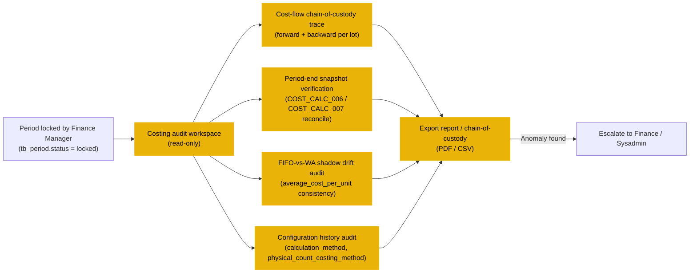

# Costing — User Flow — Auditor

## 1. Role in This Module

The **Auditor** persona is **strictly read-only** across the costing surface — `tb_inventory_transaction_cost_layer` (the canonical cost-flow ledger), `tb_inventory_transaction_detail.cost_per_unit` (the per-line cost on the source-document line), `tb_period_snapshot.closing_cost_per_unit` / `closing_total_cost` (the period-locked valuation), `tb_business_unit.calculation_method` (the configured method and its history), `tb_product.standard_cost` (the reference cost and its update history), and the full configuration history for `enum_physical_count_costing_method` changes. The Auditor's work spans three audit threads. (1) **Verify costed COGS ties back to source receipts** — the cost-flow chain-of-custody trace: walk forward from a `committed` GRN's inbound cost-layer row through every downstream outbound that consumed from the introduced lot (under FIFO) or was costed against the running average the receipt contributed to (under WA); verify each outbound's `cost_per_unit` matches what the engine would have picked at the post timestamp under the then-configured method. (2) **Verify ending inventory ties back** — for any period-end `tb_period_snapshot.closing_total_cost`, drill into the constituent cost-layer rows that built it (residual FIFO lots, or the running WA at period close), verify the closing balance reconciles to the cost-layer sum at period boundary, and verify the `close_period` / `open_period` rollforward preserved the cost across the boundary (FIFO `lot_seq_no` preserved; WA running average carried forward). (3) **Costing-method consistency audit across periods** — verify the business unit's `calculation_method` was not silently changed during a period with non-zero on-hand (would violate `COST_VAL_009`); verify the FIFO-vs-WA-shadow drift is within expected bounds (the `average_cost_per_unit` shadow maintained even under FIFO should reconcile to an independent WA recompute); verify credit-note-amount revaluations correctly affected only the originating lot's `cost_per_unit` and produced the corresponding GL entry. The Auditor's deliverable is the audit report or the chain-of-custody trace — never a write. Critically, the Auditor does **not** edit any cost-layer row (terminal per `COST_AUTH_010`), does **not** approve credit-notes (Finance per `COST_AUTH_005`), does **not** advance period state (Finance Manager per `COST_AUTH_006`), and does **not** configure costing method (Sysadmin per `COST_AUTH_001`).

### Position relative to the transactional flow (off-path observers)

The Auditor is **strictly read-only** and **off the transactional path** — they do not appear in any inventory or cost-layer write sequence. The Auditor's entry point is **after** Finance Manager locks the period, at which point the cost-layer ledger and period snapshot are permanently immutable.

### Permission Matrix — V6 Audit Action × Read Scope (Auditor)

The Auditor is **strictly read-only** across the full costing surface. Costing has no doc-status enum; the Auditor verifies the cost-layer ledger's algorithmic invariants and the period-locked snapshot's integrity. Rows are derived from the audit thread actions in Sections 2.1–2.4 and the authorization rules at [[costing/02-business-rules]] § 4.

| Action | Auditor |
|---|---|
| Read `tb_inventory_transaction_cost_layer` (full dataset) | ✅ (`COST_AUTH_008`) |
| Read `tb_inventory_transaction_detail.cost_per_unit` (per-line cost) | ✅ (`COST_AUTH_008`) |
| Read `tb_period_snapshot` (period-locked valuation) | ✅ (`COST_AUTH_008`) |
| Read `tb_business_unit.calculation_method` and its change history | ✅ (`COST_AUTH_008`) |
| Read `enum_physical_count_costing_method` config and its change history | ✅ (`COST_AUTH_008`) |
| Read `tb_product.standard_cost` and its update history | ✅ (`COST_AUTH_008`) |
| Run cost-flow chain-of-custody trace (forward + backward per lot) | ✅ (`COST_AUTH_008`) |
| Run period-end snapshot verification (cost-layer sum vs snapshot) | ✅ (`COST_AUTH_008`) |
| Run FIFO-vs-WA shadow drift audit (`average_cost_per_unit` consistency) | ✅ (`COST_AUTH_008`) |
| Run configuration history audit (method-change pre-condition verification) | ✅ (`COST_AUTH_008`) |
| Export activity log (plain — no cost / PII fields) | ✅ (no secondary approval) |
| Export activity log (sensitive — unit costs, vendor terms, PII) | ✅ (secondary approval from Controller / DPO required — mirrors GRN audit pattern) |
| Escalate anomaly to Finance / Sysadmin (read-only initiator) | ✅ (initiates; does not resolve) |
| Edit any cost-layer row | ❌ (`COST_AUTH_010` — no role can edit a posted cost-layer row) |
| Approve credit-note revaluation | ❌ (`COST_AUTH_005` — Finance only) |
| Advance period status | ❌ (`COST_AUTH_006` — Finance Manager only) |
| Configure costing method or count-costing method | ❌ (`COST_AUTH_001` / `COST_AUTH_002` — Sysadmin only) |

> ℹ️ **SR cost-flow invariant for audit.** SR does NOT write a cost-layer row at the destination (`COST_XMOD_003`). A correct cost-flow audit trace for an SR source-location outbound will show a `transfer_out` cost-layer row at the inventory source at the existing cost-per-unit — **not** an AVCO re-average or a new FIFO layer. An SR destination that shows a cost-layer write is anomalous and warrants escalation. Source: `Test_case/System_Process/proc-03-cost-calculation.md` § SR Exception — Why No Recalc.

> ℹ️ **Spot Check cost-flow invariant for audit.** Spot Checks do NOT currently post QOH, lot, or cost-layer changes (status: PENDING per `Test_case/System_Process/INDEX.md`). A cost-flow trace that shows a `spot_check` transaction_type on `tb_inventory_transaction_cost_layer` is unexpected and warrants escalation to Sysadmin.

## 2. Entry Point and Primary Flow

**Entry points:** Three audit-workspace paths, plus an external-audit-cycle path.

- **Costing audit workspace** — read-only screen that surfaces `tb_inventory_transaction_cost_layer` rows joined to their source documents (via the polymorphic `inventory_doc_no` on the parent `tb_inventory_transaction`), `tb_period_snapshot` rollups, and the configuration-history feed for `tb_business_unit.calculation_method`, `enum_physical_count_costing_method`, `tb_product.standard_cost`. Filter facets: date range, location, product, lot number, source-document type, period, business unit, `transaction_type`.
- **Cost-flow chain-of-custody trace tool** — accepts a lot number (or GRN reference, or product / location / period range) and produces the forward + backward trace through the cost-layer ledger.
- **Period-end snapshot verification tool** — for a closed or locked period, runs the reconciliation query: cost-layer sum vs snapshot closing bucket, FIFO-WA shadow drift, credit-note-amount revaluation effect.
- **External audit cycle** — driven by the external auditor's request schedule; the internal Auditor produces requested reports / traces / reconciliations from the workspace + tools above.

### 2.1 Cost-flow chain-of-custody trace (forward + backward, 6 steps)

1. **Open the chain-of-custody trace tool.** Accepts a `lot_no` (most common — for recall / vendor audit / quality investigation), a GRN reference (audit the cost-flow downstream of a specific receipt), or a `(product_id, location_id, period)` triple (audit the period's COGS at the product / location grain).
2. **Run backward trace.** From the `lot_no`, identify every inventory transaction that **introduced** the lot — typically a `transaction_type = good_received_note` inbound cost-layer row with `lot_no = X`, optionally plus `adjustment_in` events that added qty to the same lot (rare). Walk back via the cost-layer's `inventory_transaction_detail_id → inventory_transaction_id → inventory_doc_no` to the source GRN. The backward trace returns the receipt date, vendor, vendor pricelist reference (if linked), inbound cost-per-unit, lot expiry / batch metadata.
3. **Run forward trace.** From the `lot_no`, identify every downstream cost-layer row that **consumed** from the lot — `transaction_type ∈ {issue, transfer_out, adjustment_out, credit_note_quantity}` with `from_lot_no = X` and `out_qty > 0`. Walk forward via the cost-layer's `inventory_transaction_detail_id → inventory_transaction_id → inventory_doc_no` to the source SR / stock-out / credit-note. Each consumption row's `cost_per_unit` should equal the lot's `cost_per_unit` at the moment of consumption (the lot's cost may have been revalued by a credit-note-amount adjustment between receipt and consumption — the trace captures the revaluation row and its effect).
4. **Identify revaluations and reconciliation events.** Backward + forward traces include all `credit_note_amount` revaluations (`in_qty = out_qty = 0, diff_amount = X`) affecting the lot, plus the period-end `close_period` / `open_period` anchor rows that tie the lot's cost across period boundaries.
5. **Verify cost-pick-method consistency.** For each downstream consumption row, the Auditor verifies the cost was picked under the **then-configured** `calculation_method` for the business unit (FIFO from the layer; WA at the layer's contemporaneous `average_cost_per_unit`). The configuration history is read to confirm the method in force at each consumption timestamp.
6. **Export the chain-of-custody report.** PDF / CSV with the forward + backward trace, the revaluation history, the method-consistency verification. Sensitive-field exports (vendor cost detail, vendor terms) require secondary approval per the audit pattern.

### 2.2 Period-end snapshot verification (defensive reconciliation, 5 steps)

1. **Open the period-end verification tool** scoped to a specific closed or locked period.
2. **Read `tb_period_snapshot`.** Renders, for each `(period_id, location_id, product_id, lot_no, lot_index)` key: `opening_qty / opening_cost_per_unit / opening_total_cost`, `receipt_qty / receipt_total_cost`, `issue_qty / issue_total_cost`, `adjustment_qty / adjustment_total_cost`, `closing_qty / closing_cost_per_unit / closing_total_cost`, `diff_amount`.
3. **Independently reconstruct from cost-layer.** For each snapshot row, run an independent aggregation on `tb_inventory_transaction_cost_layer` filtered to the same `(at_period, location_id, product_id, lot_no, lot_index)`: `Σ in_qty × cost_per_unit` should match `receipt_total_cost`; `Σ out_qty × cost_per_unit` should match `issue_total_cost`; per `COST_CALC_006`. The closing arithmetic should match per `COST_CALC_006`: `closing_total_cost = opening_total_cost + receipt_total_cost − issue_total_cost + adjustment_total_cost + Σ diff_amount`.
4. **Verify rollforward continuity.** The closing snapshot row's `closing_qty / closing_cost_per_unit` should equal the next period's `opening_qty / opening_cost_per_unit` per `COST_CALC_007`. The `open_period` cost-layer rows in the next period should carry `in_qty = closing_qty`, `cost_per_unit = closing_cost_per_unit`, and (for FIFO) the same `lot_seq_no` as the closed lot. Drift indicates a rollforward bug or an unauthorised configuration change at period boundary.
5. **Export the verification report.** Per-key reconciliation table with the snapshot vs reconstructed values, the rollforward continuity check, the method-consistency annotation. Flagged rows (any mismatch) are highlighted and routed to Finance / Sysadmin for follow-up.

### 2.3 FIFO-vs-WA shadow drift audit (algorithmic invariant, 4 steps)

1. **Open the shadow-drift tool** scoped to a period and a set of products / locations.
2. **Read the FIFO-configured business unit's cost-layer rows.** For each cost-layer row at a FIFO product, the `average_cost_per_unit` shadow column carries the post-movement WA equivalent (maintained even under FIFO per `COST_CALC_004`).
3. **Independently recompute the WA equivalent.** For each timestamp, compute what the running WA would have been if WA had been in force from the first inbound; compare against the shadow. Drift should be near-zero (rounding only). Non-trivial drift indicates either (a) a bug in the shadow maintenance, (b) an unauthorised reset of the shadow, (c) an out-of-order cost-layer write (e.g. backdated inbound after subsequent outbound).
4. **Export the drift report.** Per-product / per-location WA-shadow vs recomputed-WA delta with timestamps and rows. Above-tolerance drift escalates to Finance / Sysadmin.

### 2.4 Configuration history audit (method consistency, 4 steps)

1. **Open the configuration history feed.** Lists every change to `tb_business_unit.calculation_method`, `enum_physical_count_costing_method` config value, `tb_product.standard_cost` (per product), reconciliation tolerance, and the audit-correction events (period re-open, credit-note approvals with above-tolerance `diff_amount`).
2. **Per-change verification.** For each `calculation_method` change, verify the **drain pre-condition** was honoured (no product had non-zero on-hand at the moment of save per `COST_VAL_009`). For `physical_count_costing_method` change, verify the change was applied prospectively (no retroactive count-variance re-resolution). For `standard_cost` update, verify the cadence is consistent and the change is reflected in subsequent `enum_physical_count_costing_method = standard` count-variance posts.
3. **Audit the period boundary.** Verify no `calculation_method` change crossed a period boundary mid-period (would create a method-inconsistency across the period's cost-layer rows).
4. **Export the consistency report.** Per-change verification status, with flagged rows highlighted.

## 3. Decision Branches

- **Trace returns clean chain vs surfaces a gap.** Clean chain (forward + backward reconcile, every consumption cost matches the layer cost picked under the then-configured method) — deliverable is the trace report only. Surfaces a gap (a consumption cost doesn't match, a revaluation effect didn't propagate, a rollforward broke continuity) — escalate to **Finance** (for valuation impact) and **Sysadmin** (for configuration / integration root-cause), with the gap report attached.
- **Snapshot verification clean vs drift.** Clean — snapshot reconciles to independent reconstruction; no follow-up. Drift — escalate; root causes typically a bug in the period-end rollforward, an unauthorised configuration change at period boundary, or a missed credit-note revaluation that should have landed in the closing period.
- **Shadow-drift within tolerance vs above.** Within tolerance (rounding-only, e.g. ฿0.10 per location-product per period) — accept, document. Above tolerance — escalate to Sysadmin for shadow-maintenance bug investigation; escalate to Finance for the valuation implication.
- **Configuration-history clean vs anomaly.** Clean — every change followed the documented pre-condition and post-effect; deliverable is the consistency report. Anomaly (e.g. a `calculation_method` change at a business unit that had non-zero on-hand at the save timestamp — would have failed `COST_VAL_009` if checked; if it slipped through, indicates a configuration-time bug) — escalate to Sysadmin + Finance for forensic investigation.
- **Sensitive-field export — secondary approval required.** Cost-flow exports including vendor cost detail, per-product cost variance, or PII via joined tables (e.g. who created a cost-layer row) require Controller or DPO co-approval per the audit pattern in [[good-receive-note/03-user-flow-audit-config]]. Plain audit-log exports (aggregate movement counts, anonymised lot lists) bypass.

## 4. Exit Point / Handoffs

The Auditor's involvement on a given costing audit thread ends at one of three boundaries:

- **Trace / report generated, no anomaly.** The chain-of-custody / snapshot verification / shadow-drift / configuration-history report is the deliverable; handed off to the requester (external auditor binder, Quality / Recall lead, Controller, Finance Manager, DPO). The Auditor does not edit any cost-layer row, does not initiate any downstream document.
- **Anomaly surfaced — escalation.** A trace gap, a snapshot mismatch, a shadow drift, or a configuration anomaly routes to the owning persona: **Finance** for valuation impact and credit-note / corrective-adjustment path coordination, **Sysadmin** for configuration / integration / shadow-maintenance investigation, **Inventory Controller** for cost-layer-side operational follow-up. The Auditor remains as the read-only reviewer through the resolution cycle but does not act on the resolution.
- **External audit cycle complete.** The external auditor's request schedule is fulfilled; the locked-period valuation is signed off; the audit binder is closed. No further Auditor action on this period until the next external audit cycle or until a forensic event triggers re-review (e.g. a regulatory inquiry, an insurance claim referencing the period's COGS).

## 5. References

- Parent overview: [03-user-flow.md](./03-user-flow.md) — the canonical cost-flow lifecycle the Auditor observes (without altering) and audits; the cross-persona handoff table that anchors Auditor → Finance (anomaly escalation) and Finance Manager → Auditor (period-lock handoff).
- Sibling: [03-user-flow-finance.md](./03-user-flow-finance.md) — Finance's flow that the Auditor reviews: reconciliation passes, credit-note approvals, period-end orchestration, period-lock progression. The Auditor's chain-of-custody traces walk through cost-layer rows Finance and the Controller wrote.
- Sibling: [03-user-flow-inventory-controller.md](./03-user-flow-inventory-controller.md) — Controller's flow that the Auditor reviews: adjustment approvals at picked cost, new-lot cost-basis reviews, variance investigations and corrective adjustments.
- Sibling: [01-data-model.md](./01-data-model.md) — canonical `tb_inventory_transaction_cost_layer` (the Auditor's primary read target), `tb_period_snapshot` (the period-locked valuation target), `tb_business_unit.calculation_method` (the configuration-history target), `tb_product.standard_cost` (the reference-cost-history target), all costing-relevant enums.
- Sibling: [02-business-rules.md](./02-business-rules.md) — calculation rules `COST_CALC_001`–`COST_CALC_010` (the algorithmic invariants the Auditor verifies); authorization rules `COST_AUTH_008` (Auditor read scope), `COST_AUTH_010` (no direct cost-edit — Auditor cannot fix anomalies, only flag); posting rules `COST_POST_001`–`COST_POST_010` (the events the Auditor traces); cross-module rules `COST_XMOD_009` (Finance / GL period-end reconciliation), `COST_XMOD_010` (single chokepoint for cost-flow — the audit-trail tamper-evident property).
- Sibling: [calculation-methods.md](./calculation-methods.md) — Auditor reads to understand the FIFO consumption walk, the WA running-average recompute, the strategy-pattern resolution; the algorithmic invariants documented there are what the Auditor's traces verify at audit.
- Related: [[inventory/03-user-flow-audit-config]] — the parallel inventory-side Audit / Config persona; the Auditor sub-persona there owns lot-recall traces and period-snapshot reconciliation queries on the inventory ledger, which overlap with the cost-flow chain-of-custody trace this page describes (the two are the same query viewed from different angles — qty + cost together).
- Related: [[good-receive-note]] — the upstream origin of every cost-flow chain; the backward trace walks back through the GRN documents to the vendor / pricelist references.
- Related: [[store-requisition]] — the downstream consumption of every cost-flow chain; the forward trace walks through SR issues / transfers.
- Related: credit-note — the cost-revaluation events the Auditor verifies in the chain.
- Related: [[physical-count]] / [[spot-check]] — the count-variance valuation events the Auditor verifies for `enum_physical_count_costing_method` consistency.
