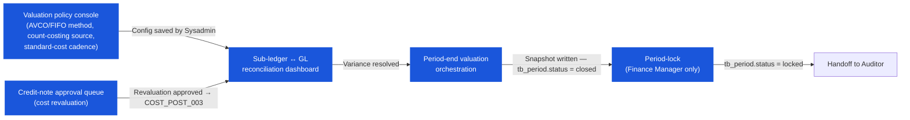

# Costing — User Flow — Finance

## 1. Role in This Module

The **Finance** persona is the **valuation authority** on the costing module. Within this module Finance's work spans five threads. (1) **Own the valuation policy** — choose `tb_business_unit.calculation_method` (FIFO vs `average` per business unit per `COST_AUTH_001`), pick the count-variance valuation source via `enum_physical_count_costing_method` (`standard` / `last` / `average` / `last_receiving` per `COST_AUTH_002`), set the standard cost on `tb_product.standard_cost` for recipes and for count-variance under the `standard` method per `COST_AUTH_003`, configure the reconciliation tolerance and the period-end cadence. The Finance Officer / Cost Controller drives the policy day-to-day; the Finance Manager is the elevated gate at the boundary (method change with non-zero on-hand requires drain — see Decision Branches). (2) **Reconcile the inventory sub-ledger to the GL** — periodic (typically weekly or monthly) reconciliation of `Σ tb_inventory_transaction_cost_layer.total_cost + Σ diff_amount` against the GL Inventory control account net change, per `INV_XMOD_008` / `COST_XMOD_009`. Costing-side variances surface here as e.g. a credit-note-amount adjustment that didn't replicate to GL, an outlier cost-pick that produced unexpected COGS, an FX revaluation gap. (3) **Approve credit-note-amount adjustments** — vendor concessions on a posted GRN's lot cost. Finance approves the `tb_credit_note` document; the inventory module fires the cost-layer revaluation (`COST_POST_003` / `COST_CALC_005`) which adjusts the originating lot's `cost_per_unit` and routes the `diff_amount` to GL via Dr AP / Cr Inventory. (4) **Run period-end valuation** — orchestrate the close-of-period after Inventory Controller variance sign-off; verify the cost-layer-to-snapshot rollup math, sign off the locked `closing_cost_per_unit` / `closing_total_cost`; this is the moment the period's COGS and ending inventory become the audit-anchored balance-sheet figures. (5) **Period-lock progression** at the Finance Manager level — advance `tb_period.status = closed → locked` per `COST_AUTH_006` / `INV_AUTH_006` after the audit window. Critically, Finance does **not** edit `cost_per_unit` or `average_cost_per_unit` directly per `COST_AUTH_010`; cost revaluation always flows through credit-note-amount, compensating stock-in / stock-out, or the period-end rollforward.

### Workflow position (Finance highlighted)

Costing has no per-document state machine. Finance's costing work is anchored to the **cost-layer lifecycle** and the **period valuation lifecycle** — Finance operates at the valuation-policy, credit-note-revaluation, and period-close nodes, not on a document status progression.

### Permission Matrix — V5 Touchpoint × Action (Finance)

Finance is the **valuation authority** in the costing module. Costing has no doc-status enum; there is no GRN-style `draft → saved → committed` lifecycle to gate. Instead, Finance operates across five costing touchpoints described in Sections 2.1–2.5. Rule citations refer to [[costing/02-business-rules]] §§ 4, 5.

| Action | Valuation policy | Sub-ledger reconciliation | Credit-note revaluation | Period-end orchestration | Period-lock (Finance Manager) |
|---|---|---|---|---|---|
| Read cost-layer ledger (`tb_inventory_transaction_cost_layer`) | ✅ (`COST_AUTH_004`) | ✅ (`COST_AUTH_004`) | ✅ (`COST_AUTH_004`) | ✅ (`COST_AUTH_004`) | ✅ (`COST_AUTH_004`) |
| Read period snapshots (`tb_period_snapshot`) | ✅ (`COST_AUTH_004`) | ✅ (`COST_AUTH_004`) | ✅ (`COST_AUTH_004`) | ✅ (`COST_AUTH_004`) | ✅ (`COST_AUTH_004`) |
| Configure `tb_business_unit.calculation_method` (AVCO ↔ FIFO) | ✅ (as requester / co-approver; Sysadmin executes — `COST_AUTH_001`) | ❌ | ❌ | ❌ | ❌ |
| Configure `enum_physical_count_costing_method` | ✅ (as requester; Sysadmin executes — `COST_AUTH_002`) | ❌ | ❌ | ❌ | ❌ |
| Update `tb_product.standard_cost` | ✅ (as requester; Sysadmin executes — `COST_AUTH_003`) | ❌ | ❌ | ❌ | ❌ |
| Post compensating GL journal (sub-ledger variance) | ❌ | ✅ (`COST_XMOD_009`) | ❌ | ❌ | ❌ |
| Route cost-layer variance to Inventory Controller | ❌ | ✅ (`COST_AUTH_004`) | ❌ | ❌ | ❌ |
| Approve `tb_credit_note` (vendor cost revaluation) | ❌ | ❌ | ✅ (`COST_AUTH_005`) | ❌ | ❌ |
| Fire period-end valuation run (close period) | ❌ | ❌ | ❌ | ✅ (`COST_POST_007` / `COST_POST_008`) | ❌ |
| Advance `tb_period.status = closed → locked` | ❌ | ❌ | ❌ | ❌ | ✅ (`COST_AUTH_006`) |
| Re-open a `closed` period (exceptional) | ❌ | ❌ | ❌ | ❌ | ✅ (Finance Manager; audit-logged) |
| Edit `cost_per_unit` or `average_cost_per_unit` directly on a posted row | ❌ (`COST_AUTH_010`) | ❌ (`COST_AUTH_010`) | ❌ (`COST_AUTH_010`) | ❌ (`COST_AUTH_010`) | ❌ (`COST_AUTH_010`) |
| Re-open a `locked` period | ❌ | ❌ | ❌ | ❌ | ❌ (no role can re-open a locked period) |

> ℹ️ **No doc-status transitions by Finance:** Costing has no `doc_status` enum. Finance does not transition any document status. Cost corrections flow through (a) credit-note-amount approval, (b) compensating stock-in / stock-out, or (c) the period-end rollforward — never by direct cost-layer edit.

## 2. Entry Point and Primary Flow

**Entry points:** Five paths, each anchored to a different Finance activity.

- **Valuation policy console** — read / edit `tb_business_unit.calculation_method`, `enum_physical_count_costing_method` value (via business-unit config), reconciliation tolerance, and the `tb_product.standard_cost` cadence (typically a monthly cost-update batch). Drives Section 2.1.
- **Cost-impact / variance reconciliation dashboard** — periodic (e.g. weekly) run comparing cost-layer activity against the GL Inventory control account, with cost-side drill (which `transaction_type`, which product, which lot produced the variance). Drives Section 2.2.
- **Credit-note approval queue** — `tb_credit_note` documents at `pending` awaiting Finance approval, with the inventory-side cost effect previewed (the revaluation `diff_amount`, the affected lot, the post-revaluation `cost_per_unit`). Drives Section 2.3.
- **Period-end valuation orchestration dashboard** — the period-close run from the costing perspective: cost-layer rollforward preview, snapshot computation preview, reconciliation status. Drives Section 2.4.
- **Period-lock dashboard** (Finance Manager) — view of `closed` periods past the audit window awaiting `closed → locked` advance, with the locked valuation summary per business unit / location.

### 2.1 Valuation policy flow (config change / cadence, 4 steps)

1. **Open the valuation policy console.** Renders the current `calculation_method` per business unit, the current `physical_count_costing_method`, the reconciliation tolerance, and the standard-cost-update cadence. Read-only for Finance Officer; editable for Sysadmin under `COST_AUTH_001`–`COST_AUTH_003` with Finance Officer as the requester / co-approver.
2. **Identify the configuration need.** Triggers: a method change at fiscal-year boundary (FIFO ↔ WA), a count-method change (e.g. switching from `last` to `last_receiving` to better track current vendor pricing), a tolerance adjustment after persistent above-tolerance reconciliation patterns, a standard-cost batch refresh (monthly).
3. **Submit the change request to Sysadmin.** For `calculation_method` change, Finance also verifies the **drain pre-condition** per `COST_VAL_009`: no product at the business unit can have non-zero on-hand. Finance coordinates with Inventory Controller and Store Keepers to drain stock (transfer-out, write-off, or run a one-time elevated migration script).
4. **Confirm effective.** Once Sysadmin saves, Finance verifies the next inbound / outbound at the business unit picks up the new rule. Configuration-history records the change for the Auditor's review.

### 2.2 Sub-ledger ↔ GL reconciliation flow (periodic, 6 steps)

1. **Open the reconciliation dashboard.** Renders, for the current open period (and any prior open periods not yet signed off), the sum of cost-layer activity grouped by `inventory`-type location and `transaction_type`: `Σ in_qty × cost_per_unit + Σ diff_amount` (inbound net), `Σ out_qty × cost_per_unit` (outbound), broken down by `good_received_note`, `issue`, `adjustment_in / adjustment_out`, `credit_note_amount / credit_note_quantity`, `transfer_in / transfer_out`. The right side renders the GL Inventory control account's net change for the same period and cost-centre / location.
2. **Compute variance.** For each cost-centre / location, variance = `sub_ledger_net_change − GL_net_change`. Below tolerance — clean. Above tolerance — investigate.
3. **Drill into variances.** From the location-level summary into the cost-layer row list (the actual cost-flow events in the period — receipts, issues, revaluations) and into the GL journal row list. Common costing-side variance causes: a credit-note-amount `diff_amount` that posted to the cost layer but whose GL journal Dr AP / Cr Inventory missed; an outbound cost-pick that produced a `cost_per_unit` outside the expected band (e.g. FIFO consuming an unusually old high-cost lot when a more-recent lot was expected); a count-variance post whose count-costing-method resolution differed from the GL-account expectation.
4. **Resolve variance.** **Sub-ledger right, GL gap** — post compensating GL journal (typical for late integration). **GL right, sub-ledger gap** — investigate the missed cost-layer write; route to Inventory Controller for a corrective stock-in / stock-out under Finance authority. **Both have gaps** — investigate both; route to Sysadmin if the gap is a configuration / integration issue (e.g. `physical_count_costing_method` change wasn't propagated).
5. **Document the reconciliation.** Each resolved variance is logged with the variance amount, the resolution path (compensating journal / corrective adjustment / configuration fix), and the actor.
6. **Carry forward to period close.** Clean reconciliation pass unblocks the period-end run; unresolved variance holds the period at `open`.

### 2.3 Credit-note-amount approval flow (vendor concession, 5 steps)

1. **Open the credit-note approval queue.** Lists `tb_credit_note` documents at `pending` with their originating GRN reference, affected lot(s), proposed `diff_amount` (signed — negative for vendor concession reducing cost), and the post-revaluation `cost_per_unit` preview computed by the engine.
2. **Open the specific credit-note.** The screen renders: the affected lot's current `cost_per_unit`, the credit-note `diff_amount`, the recalculated lot cost, and the impact on any **remaining** lot balance (already-consumed portions are not retroactively adjusted per `COST_CALC_005`). Cross-checks: does the credit-note evidence support the concession? Does the cost reduction match the vendor's documented agreement? Is the affected GRN still committed (not voided)?
3. **Decide outcome.** **Approve** for documented vendor concessions with valid evidence. **Reject** with comment for missing documentation, evidence inconsistency, or wrong cost magnitude. **Investigate** for patterns suggesting systemic vendor pricing issues (route to Sysadmin / Auditor for vendor-history audit without rejecting the specific document).
4. **Approve fires the revaluation.** On Finance approval: credit-note `doc_status = approved`; inventory module fires `INV_POST_007` which invokes the costing engine's `COST_POST_003` writing a new cost-layer row with `in_qty = 0, out_qty = 0, diff_amount = signed_amount`; the originating lot's `cost_per_unit` is recalculated; subsequent FIFO consumption from the lot picks up the new cost. GL: Dr AP / Cr Inventory at the `diff_amount` magnitude.
5. **Reject returns to originator.** On rejection, credit-note returns to the originator (Receiver or Finance Officer who raised it) with comment; revaluation does not fire; lot's `cost_per_unit` is unchanged.

### 2.4 Period-end valuation orchestration flow (close trigger, 7 steps)

1. **Wait for Inventory Controller sign-off.** The dashboard lists the Controller's pre-period-end variance sign-off (from [[inventory/03-user-flow-inventory-controller]] Section 2 / 3). Period close cannot start without it. This is also the moment cost-layer-side variance hold ("a credit-note revaluation deferred from this period") is cleared.
2. **Verify pre-close checklist clear.** All open `tb_credit_note` / `tb_stock_in` / `tb_stock_out` / `tb_count_stock` / GRN / SR documents in the period are at terminal state. Any open credit-note in particular blocks because its revaluation effect on cost-layer cost should land in the closing period not the next.
3. **Run final reconciliation.** Section 2.2 flow run as the final pass; reconciliation passes (variance below tolerance per cost-centre / location).
4. **Verify cost-layer-to-snapshot rollup preview.** The dashboard renders the per-`(period, location, product, lot)` cost-layer rollup: opening from prior period's closing, period inbound / outbound / adjustment / `diff_amount` aggregates, computed closing per `COST_CALC_006`. Finance cross-checks: closing valuation matches the inventory-side closing-on-hand × `closing_cost_per_unit` arithmetic; no nulls in `closing_cost_per_unit` (would fail `COST_VAL_008`).
5. **Fire the period-end job.** Click **Close period**. The system runs `INV_POST_009` + `INV_POST_010` chained, which invoke `COST_POST_007` (write `tb_period_snapshot` rows with `closing_cost_per_unit` / `closing_total_cost`; write `close_period` cost-layer rows tying closing cost to the period anchor) and `COST_POST_008` (write `open_period` cost-layer rows opening the next period at the closing cost; `lot_seq_no` preserved for FIFO continuity).
6. **Verify the snapshot — costing perspective.** Per-location / per-product closing valuation summary; FIFO products show residual lots and per-lot `cost_per_unit`; WA products show running average. Finance cross-checks against the inventory side's `closing_qty` × `closing_cost_per_unit` = `closing_total_cost` arithmetic.
7. **Period closed — valuation locked into snapshot.** `tb_period_snapshot.closing_total_cost` is the audit-anchored ending-inventory balance-sheet figure for the closed period. The next period is `open` with cost-layer continuity (FIFO lot sequence preserved; WA running average carried forward).

### 2.5 Period-lock flow (Finance Manager only, 3 steps)

1. **Wait out the audit window.** Same as the inventory side — typically 30–60 days post-close. Costing-relevant audit reviews during the window: external auditor verifies the closing snapshot's `closing_cost_per_unit` ties back to the cost-layer ledger; the FIFO-vs-WA-shadow consistency check (i.e. the `average_cost_per_unit` shadow at period-end matches an independent recompute); the credit-note-revaluation rollup matches the GL.
2. **Verify audit sign-off received.** External / internal audit has signed off on the period's valuation; no open audit-correction requests; reconciliation report stays clean across the audit window.
3. **Lock the period.** Click **Lock period**. `tb_period.status = closed → locked`; the costing snapshot's `closing_cost_per_unit` / `closing_total_cost` are permanently immutable. No further re-open by any role; cost corrections post into the current open period as restatement (current-period write-down / write-up).

## 3. Decision Branches

- **FIFO vs WA at the business unit.** Choose FIFO when (a) products are perishable and per-lot tracking is required for expiry / recall, (b) per-vendor / per-lot cost traceability is needed for variance analysis, (c) the regulatory framework prefers per-lot matching (rare). Choose WA when (a) products are commodities or fungible (raw materials, bulk goods), (b) price volatility is high and smoothed COGS is preferred, (c) the operational simplicity of one cost per `(location, product)` outweighs the loss of per-lot detail. Mixed methods at the same business unit are **not supported** per `COST_VAL_009`; split into separate business units if required.
- **Count-costing method (`standard` / `last` / `average` / `last_receiving`).** `standard` for tenants whose standard-cost cadence is robust and reflects market reality (recipe-driven tenants prefer this). `last` for tenants who want count variance valued at current market cost regardless of direction (rare). `average` for WA-configured business units (consistent with the cost-pick on regular outbound). `last_receiving` for FIFO-configured business units that want count variance to reflect the most recent inbound price (consistent with FIFO's bias toward newer cost in residual inventory).
- **Reconciliation variance: within tolerance vs investigate vs resolve.** Within tolerance (typically a few cents per location-cost-centre per period) — accept and document. Above tolerance — drill and resolve per Section 2.2 step 4. Persistent unresolved variance — escalate to Auditor (potential data-integrity issue) or to Sysadmin (configuration / integration issue).
- **Credit-note approve vs reject vs investigate.** Approve when the cost is defensible, the vendor evidence supports the concession, the affected GRN is still committed, the post-revaluation cost is sensible. Reject for missing evidence on large revaluations, evidence inconsistency, or anomalous post-revaluation cost (e.g. revaluation drives cost below zero — invalid). Investigate for patterns (concentrated on one vendor / product line / lot batch) — route to Sysadmin / Auditor for vendor or product-line review.
- **Period close gate vs hold.** Close when (a) Controller signed off variance, (b) all source documents in the period (including credit-notes) at terminal state, (c) final reconciliation passes, (d) cost-layer rollup preview balances. Hold when any gate is open — communicate to affected personas with the expected resolution date.
- **Period re-open within audit window.** Re-open when external audit identifies a required adjustment in the closed period that cannot post as a current-period restatement (e.g. a credit-note-amount that materially revalues a closed period's residual inventory; the closing snapshot's `closing_total_cost` was materially overstated). Re-open is audit-logged; the period must be re-closed (which re-runs `COST_POST_007` / `COST_POST_008`) before the next regular close.
- **Period lock — no re-open path.** Lock only when audit window has passed cleanly. After lock, no role can re-open; corrections post as current-period restatement.
- **Method-change with non-zero on-hand.** **Blocked** per `COST_VAL_009`. Resolution: drain stock (rare — requires Inventory Controller and Store Keeper coordination to transfer or write off all on-hand), or run an elevated migration script under Finance Manager + Sysadmin co-authorisation that rebases the cost-layer history under the new method. The migration is typically scheduled at a fiscal-year boundary.

## 4. Exit Point / Handoffs

Finance's involvement on a given costing thread ends at one of five boundaries:

- **Valuation policy applied.** The Sysadmin saves the config change; new movements pick up the new rule. Finance's involvement on the policy thread is done until the next cadence cycle.
- **Reconciliation variance resolved.** The compensating journal / corrective adjustment posts; the reconciliation pass is clean for the period; Finance signs off. Handoff (implicit) to **Auditor** who reviews the reconciliation activity in the audit trail.
- **Credit-note revaluation approved and posted.** The cost-layer revaluation row writes; the originating lot's `cost_per_unit` updates; downstream consumption picks up the new cost. Finance's involvement on this credit-note is done.
- **Period closed (valuation rollup complete).** `tb_period_snapshot.closing_cost_per_unit` / `closing_total_cost` written; `close_period` / `open_period` cost-layer rows written; next period at `open` with cost continuity. Handoff to **Inventory Controller** + **Store Keeper** for the new period's day-to-day cost-pick consumption; handoff to **Finance Manager** for the close-to-lock progression.
- **Period locked.** `tb_period.status = locked`; valuation permanently immutable for that period. Handoff to **Auditor** for the long-term audit-trail review; no further costing-side action on this period.

## 5. References

- Parent overview: [03-user-flow.md](./03-user-flow.md) — the canonical cost-flow lifecycle, the cross-persona handoff table that anchors Inventory Controller → Finance (cost-anomaly escalation, credit-note approval), Finance → Finance Manager (close, lock), and Finance Manager → Auditor (audit-cycle handoff).
- Sibling: [03-user-flow-inventory-controller.md](./03-user-flow-inventory-controller.md) — upstream persona that ensures engine inputs (lot dates, receipt costs, adjustment cost bases) are clean; surfaces cost-anomalies for Finance review; reviews FIFO / WA cost-pick previews on outbound approval.
- Sibling: [03-user-flow-auditor.md](./03-user-flow-auditor.md) — downstream persona that audits the cost-flow chain, verifies costed COGS and ending inventory tie back to source receipts, and validates costing-method consistency across periods.
- Sibling: [01-data-model.md](./01-data-model.md) — canonical `tb_inventory_transaction_cost_layer`, `tb_period_snapshot`, `tb_business_unit.calculation_method` (the policy Finance owns), `tb_product.standard_cost` (the reference cost Finance maintains), `enum_calculation_method` / `enum_physical_count_costing_method` (the policy values).
- Sibling: [02-business-rules.md](./02-business-rules.md) — authorization rules `COST_AUTH_001` (Sysadmin config — Finance is requester), `COST_AUTH_004` (Finance read cost-impact reports), `COST_AUTH_005` (Finance approves credit-note revaluation), `COST_AUTH_006` (Finance Manager period-valuation lock), `COST_AUTH_010` (no direct cost-edit); calculation rules `COST_CALC_005` (credit-note-amount revaluation), `COST_CALC_006` (period snapshot closing cost), `COST_CALC_007` (period rollforward opening cost); posting rules `COST_POST_003` (credit-note-amount), `COST_POST_007` / `COST_POST_008` (period close / open); cross-module rules `COST_XMOD_009` (Finance / GL period-end), `COST_XMOD_006` (credit-note revaluation chain).
- Sibling: [calculation-methods.md](./calculation-methods.md) — Finance reads to understand FIFO vs WA trade-offs, the per-lot vs running-average cost-pick behaviour previewed at outbound approval, and the strategy-pattern resolution at the engine level.
- Related: [[inventory/03-user-flow-finance]] — parallel Finance flow on the inventory module side; the period-close run, the inventory-to-GL reconciliation, and the Finance Manager period-lock are shared events between the two modules (one click runs both).
- Related: [[good-receive-note]] — Finance's reconciliation drills into GRN-side AP-clearing journal posts when a credit-note revaluation gap surfaces; the GRN module's `03-user-flow-finance.md` covers the three-way-match path.
- Related: [[inventory-adjustment]] — corrective stock-in / stock-out path Finance approves for cost-layer gaps that the credit-note path cannot resolve (e.g. clerical-error cost corrections).
- Related: credit note — Finance books credit-notes; the costing-side effect (`credit_note_amount` for revaluation, `credit_note_quantity` for return-from-lot) is part of the reconciliation surface for the period the credit-note posts in.
