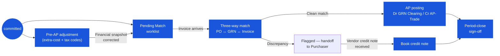

# Good Receive Note (GRN) — User Flow — Finance

## 1. Role in This Module

The **Finance** persona covers the **Finance Officer / AP Clerk** at the front line (day-to-day three-way matching and AP posting) and the **Finance Manager / Controller** at the sign-off boundary (period close, GL reconciliation, dispute resolution). Finance is a **post-commit** participant — they do **not** create, save, or commit the GRN; entry to this flow presupposes that the Inventory Manager has already fired the `saved → committed` transition on the Receiver path, which has already raised the inventory accrual (`Dr Inventory / Cr GRN Clearing`, `GRN_POST_006`) and incremented on-hand. Two distinct activities live under this persona. **First**, *pre-AP financial adjustment* on `committed` GRNs while the vendor invoice has not yet arrived — review the extra-cost allocation that the Inventory Manager finalised on commit, correct the allocation method (`manual`, `by_value`, `by_qty` — the three-mode `enum_allocate_extra_cost_type` is canonical; the legacy five-mode list is not), correct tax-code assignment on lines where the receiver guessed the wrong rate, and persist the corrected financial snapshot. Allocation edits in this window are explicitly permitted by `GRN_AUTH_007`; corrections after AP has posted require a `tb_credit_note` instead. **Second**, *three-way match* when the vendor invoice arrives — match the invoice against the upstream PO and the committed GRN(s) on qty and price within tenant tolerance, post the AP-side journal on success (`Dr GRN Clearing / Cr AP-Trade`, `GRN_POST_008`), and flag the discrepancy back to the Purchaser on failure (`GRN_POST_009`). On the close cadence, the Finance Manager runs *period-close sign-off*: reconcile the inventory sub-ledger against the GL inventory control account, confirm that every `committed` GRN in the period has either matched to an invoice or been correctly held in the GRN Clearing accrual, age open GRN Clearing balances, and sign off on receipt activity for the period. Critically: **the GRN's `doc_status` enum is not transitioned by Finance** — `saved → committed` is the only posting event the document undergoes, and post-commit match outcome lives on a separate match flag, not on the four-state enum. Discrepancies do not roll the GRN back; they live as activity-log entries and flow back to the Purchaser for vendor-side resolution.

### Workflow position (Finance highlighted)

### Permission Matrix — Touchpoint × Action (Finance)

Finance operates across two distinct touchpoints on a `committed` GRN: **AP capture + three-way match** (from invoice arrival to match outcome) and **Accrual / close-out review** (period-close reconciliation of GRN Clearing balances and the inventory sub-ledger). Finance has **no direct GRN status mutation** — the four-state `enum_good_received_note_status` is not transitioned by Finance; match outcomes live on a separate match flag.

| Action | AP capture + three-way match | Accrual / close-out review |
|---|---|---|
| View committed GRN (read) | ✅ — Pending Match worklist and PO Receiving History | ✅ — period-close dashboard |
| Review extra-cost allocation | ✅ — pre-AP adjustment per `GRN_AUTH_007` | ✅ (historical review only) |
| Adjust extra-cost allocation method (`manual` / `by_value` / `by_qty`) | ✅ — while invoice not yet posted | ❌ (frozen after AP posting) |
| Adjust tax-code / rate per line | ✅ — `is_tax_adjustment` override pre-AP | ❌ (frozen after AP posting) |
| Run three-way match (PO ↔ GRN ↔ invoice) | ✅ | ❌ |
| Post AP on clean match (`Dr GRN Clearing / Cr AP-Trade`) | ✅ — `GRN_POST_008` | ❌ |
| Flag discrepancy (handoff to Purchaser) | ✅ — `GRN_POST_009` | ❌ |
| Book credit note against GRN | ✅ — vendor concession path | ✅ (post-close correction) |
| Reconcile inventory sub-ledger vs GL | ❌ | ✅ — Finance Manager |
| Age GRN Clearing open balances | ❌ | ✅ — Finance Manager |
| Period-close sign-off | ❌ | ✅ — Finance Manager |
| Mutate GRN `doc_status` | ❌ | ❌ |
| Void / reverse GRN (co-auth) | ✅ (elevated co-auth with Inventory Manager, `GRN_POST_010`) | ❌ |

> ℹ️ **GRN status immutable by Finance:** Finance never transitions `doc_status`. The three-way match outcome is captured on a separate match flag (`unmatched` → `matched` / `flagged` / `partially_matched`). `doc_status` stays at `committed` through the full Finance lifecycle — clean match, discrepancy, credit note, and period close.

## 2. Entry Point and Primary Flow

**Entry point:** Two equivalent paths, each gated by `doc_status = committed`:

- **GRN module → Pending Match worklist** — pre-filtered list of GRNs at `doc_status = committed` with the match flag `unmatched`, ordered by commit date. Used as the daily AP queue.
- **AP module → Invoice receipt** — when a vendor invoice is keyed in (or auto-ingested from EDI / e-invoice intake), the AP screen looks up open GRN(s) for the same `(vendor_id, po_no)` and deep-links into the GRN match screen with the invoice pre-attached.
- **Period-close dashboard** — Finance Manager view that lists GRN Clearing aging, sub-ledger vs GL variance, and unmatched-GRN count for the closing period.

### 2.1 Pre-AP adjustment (committed GRN, invoice not yet arrived) — 5 steps

1. **Open the committed GRN** from the Pending Match worklist or from the PO module's Receiving History tab. The header is read-only on stock-impacting fields (vendor, currency, exchange rate, receipt date, line quantities) but the extra-cost and tax-code panels remain editable under `GRN_AUTH_007` until AP posts.
2. **Review extra-cost lines.** The screen lists every `tb_extra_cost` row tied to this GRN (freight, duty, brokerage, landed-cost components) with its `allocate_extra_cost_type`, net amount, tax, and the per-line allocations that the Inventory Manager finalised on commit. Verify the cost evidence (carrier invoice, customs entry) attached to each row.
3. **Adjust the allocation method if needed.** The Prisma enum offers three modes — `manual` (per-line amounts entered by the user; sum must equal `tb_extra_cost.net_amount` within `0.01`), `by_value` (pro-rata on `line.net_amount`), `by_qty` (pro-rata on `line.received_base_qty` in base UoM). Switching modes recomputes the per-line allocation snapshot per `GRN_CALC_009`–`GRN_CALC_011`; the last line absorbs the rounding remainder.
4. **Review tax codes per line.** Verify the line-level `tax_rate` and `is_tax_adjustment` against the vendor's tax profile, the product's tax class, and the receipt jurisdiction. Override at the line if the receiver picked the wrong rate; `is_tax_adjustment = true` persists the override amount per `GRN_VAL_010`. The tax recompute follows `GRN_CALC_003` (tax-exclusive) or `GRN_CALC_004` (tax-inclusive).
5. **Save the adjusted financial snapshot.** Roll-ups recompute via `GRN_CALC_007` and `GRN_CALC_008`; the GL accrual recorded at commit (`GRN_POST_006`) is adjusted by a compensating entry for the delta in inventory cost and input-tax. The GRN `doc_status` remains `committed`; only the financial snapshot moves. The activity log records the adjustment with the user, timestamp, and delta amount.

### 2.2 Three-way match (vendor invoice arrives) — 7 steps

1. **Invoice arrives** through AP intake (key entry, EDI, or e-invoice). The system captures invoice number, invoice date, vendor, currency, line-level item / qty / price, tax, and any vendor-side freight or surcharge lines.
2. **Look up the open GRN(s).** AP scopes the candidate set by `(vendor_id, po_no, invoice_no)` against `committed` GRNs whose match flag is `unmatched` or `partially_matched`. A single invoice may match one GRN (1:1), several GRNs against the same PO (1:N partial-receipt consolidation), or one GRN against several invoices (N:1 multi-invoice split-billing).
3. **Run the match.** For each line on the invoice, the system pairs against the GRN line (via `purchase_order_detail_id` for PO-sourced GRNs) and compares: **qty** (invoice qty vs GRN `received_qty` — strict equality required, no negative tolerance) and **price** (invoice unit price vs GRN `base_price`, tax, and discount) within the tenant-configured price tolerance (typically expressed as percent or absolute amount per `GRN_POST_007`). The three-way match also re-checks against the PO line's `order_qty` and `order_unit_price` to detect upstream drift.
4. **Resolve match outcome.** **Clean match** (qty and price within tolerance on every line): proceed to step 5. **Discrepancy** (qty mismatch, or price gap outside tolerance, or missing GRN, or missing invoice line): proceed to step 6.
5. **Post AP on success.** Two journal legs run atomically: (a) **Dr Inventory / Cr GRN Clearing** was already posted by the receipt event at commit (`GRN_POST_006`); the match now (b) posts **Dr GRN Clearing / Cr AP-Trade** at the matched amount, clearing the accrual against the vendor AP liability (`GRN_POST_008`). Tax accruals on the input-tax control account are reconciled to the invoice tax. The GRN's match flag flips to `matched`; the invoice posts to AP for the payment cycle. The inventory sub-ledger entry written at commit stands; no inventory adjustment is needed.
6. **Flag discrepancy on failure.** AP holds the invoice in `disputed` state. A `system` comment is appended on the GRN and on the PO recording the discrepancy type (qty / price / line-coverage), the gap amount, and the invoice reference. The match flag flips to `flagged`. The GRN itself stays at `doc_status = committed` — there is no enum transition on match failure (`GRN_POST_009`); the four-state enum does not reflect match outcome.
7. **Hand off the discrepancy.** Route the flagged GRN back to the **Purchaser** for vendor-side resolution (credit-note negotiation, invoice correction request, replacement-shipment booking). Finance does **not** edit the GRN to resolve the discrepancy — resolution lives on a `tb_credit_note` against the GRN (for vendor concession), on an amended vendor invoice (re-keyed in AP), or on a compensating inventory adjustment in `[[inventory-adjustment]]` for physical-stock corrections.

## 3. Decision Branches

- **Clean match** (qty equal, price within tolerance, all GRN lines covered, all invoice lines covered): post AP per step 5; flip match flag to `matched`. The GRN's GL accrual is fully cleared; the AP liability is recognised for payment.
- **Qty discrepancy** (invoice qty ≠ GRN `received_qty` on any line): flag back to Purchaser. Two sub-cases: invoice over-bills receipt — vendor is asked to credit the over-bill; invoice under-bills receipt — vendor is asked to invoice the remainder, or the GRN sits at `partially_matched` until the second invoice arrives. The GRN's `received_qty` is the source of truth; AP does not adjust the GRN.
- **Price discrepancy within tolerance** (gap ≤ tenant tolerance, expressed as percent or absolute amount): auto-pass the match; post AP at the invoice price. The price gap is absorbed into a price-variance account (or capitalised into inventory, per tenant policy), with the variance posting on the AP-clearing leg. No Purchaser handoff.
- **Price discrepancy outside tolerance**: flag back to Purchaser. Vendor is asked to issue a credit (downward gap) or amended invoice (upward gap); Purchaser may also raise a `[[vendor-pricelist]]` amendment so future POs price correctly. The GRN is held at `committed` with the match flag at `flagged`.
- **Missing GRN** (invoice arrives before any GRN for the PO is committed): hold the invoice in AP at `awaiting_receipt`; do not run the match. Re-poll on each GRN commit against the same PO. The AP module sweeps awaiting-receipt invoices on a schedule.
- **Multi-invoice partial-then-full match** against the same GRN: first invoice covers a subset of the GRN's lines or quantities — match flag flips to `partially_matched`, partial AP-clearing posts (`Dr GRN Clearing / Cr AP-Trade` at the matched amount only); residual GRN Clearing balance stays open. Subsequent invoices match the remainder; on the final match the flag flips to `matched` and the residual clears.
- **Period-close gate** (Finance Manager): the period cannot close until (a) inventory sub-ledger balances reconcile against the GL inventory control account, (b) every GRN Clearing balance is either matched within the period or aged into the next period with documented justification, (c) the unmatched-GRN report has been reviewed and signed off. Open exceptions roll forward and feed the next period's Pending Match worklist.

## 4. Exit Point / Handoffs

Finance's involvement on a given GRN ends at one of four boundaries:

- **Match clean — AP posted.** The match-success journal (`Dr GRN Clearing / Cr AP-Trade`) clears the accrual; the GRN's match flag flips to `matched`; the invoice enters the payment cycle. The GRN's `doc_status` remains `committed`; **no enum transition occurs**. Inventory sub-ledger and GL are reconciled for this receipt.
- **Match failed — discrepancy handed off to Purchaser.** The match flag flips to `flagged`; the GRN stays at `doc_status = committed`. Handoff to **Purchaser** ([03-user-flow-purchaser.md](./03-user-flow-purchaser.md)) for vendor-side resolution (credit-note negotiation, invoice amendment, replacement-shipment booking). Finance re-enters the flow when the vendor's response document arrives (credit note booked against the GRN, amended invoice keyed into AP).
- **Post-commit financial correction via credit note.** Where the vendor concedes a credit for damaged goods, short-ship, or price variance (originating from the Purchaser handoff), Finance books the `credit note` against the GRN's AP accrual or the posted AP-Trade liability; the GRN itself is not edited. The credit-note posting reverses the proportional GRN Clearing balance or AP-Trade balance depending on whether the AP match has already posted.
- **Period-close sign-off — handoff to Controller.** At period end, the Finance Manager runs the inventory-sub-ledger-vs-GL reconciliation, ages the GRN Clearing balance, reviews the unmatched-GRN exception list, and signs off on receipt activity for the period. Sign-off handoffs to the **Controller** for the closing journal and the period-end statutory reporting cycle. Open exceptions roll into the next period.

## 5. References

- Parent overview: [03-user-flow.md](./03-user-flow.md) — the canonical four-state lifecycle (`draft / saved / committed / voided`) on `enum_good_received_note_status`, the global state machine that this persona observes (without altering), and the cross-persona handoff table (Receiver → Finance on commit; Finance ↔ Purchaser on discrepancy).
- Sibling: [03-user-flow-receiver.md](./03-user-flow-receiver.md) — upstream persona that creates, saves, and commits the GRN at the dock; the `saved → committed` transition raises the inventory accrual that this persona's three-way match clears.
- Sibling: [03-user-flow-purchaser.md](./03-user-flow-purchaser.md) — bounce-back target for every flagged discrepancy. The Purchaser owns vendor-side resolution (credit-note negotiation, invoice amendment, replacement-shipment booking) for short-ship, damaged goods, wrong-item, and price-variance discrepancies surfaced at three-way match.
- Sibling: [03-user-flow-audit-config.md](./03-user-flow-audit-config.md) — System Administrator (tax-profile configuration, match tolerance configuration, period-lock controls) and Auditor (read-only review of AP postings, credit notes, and period-close sign-off).
- Sibling: [01-data-model.md](./01-data-model.md) — canonical `enum_good_received_note_status` (four values), `enum_allocate_extra_cost_type` (three values: `manual`, `by_value`, `by_qty`), `tb_extra_cost`, and the divergence catalogue clarifying that the legacy five-mode allocation enum is not implemented at the schema level.
- Sibling: [02-business-rules.md](./02-business-rules.md) — Section 5 Posting Rules (`GRN_POST_006` accrual at commit, `GRN_POST_007` match anchor, `GRN_POST_008` match success, `GRN_POST_009` match failure) and Section 6 Cross-Module Rules (`GRN_XMOD_007` Finance / three-way match) — the canonical reference for the journal legs and the match-failure handling in steps 5 and 6 of the primary flow.
- Related: [[purchase-order]] — the third leg of the three-way match; the PO's `order_qty` and `order_unit_price` are re-checked at match time to detect upstream drift.
- Related: [[inventory]] — the inventory sub-ledger that the period-close reconciliation balances against the GL inventory control account; `tb_inventory_transaction` rows written at GRN commit feed the sub-ledger.
- Related: [[costing]] — landed-cost feed (extra-cost allocation per `GRN_CALC_009`–`GRN_CALC_011`) flows into FIFO / average-cost layers on `tb_inventory_transaction_cost_layer.cost_per_unit`; Finance's extra-cost adjustments in step 3–5 of the pre-AP path update this feed via the compensating journal entry.
- Related: credit note — the downstream document that books vendor concessions for flagged discrepancies; the post-commit correction path for both AP-pending (GRN Clearing offset) and AP-posted (AP-Trade offset) GRNs.
- `../carmen/docs/good-recive-note-managment/GRN-User-Experience.md` — carmen/docs source for the Finance Officer persona (goals: ensure accurate financial records, verify costs and tax calculations, reconcile GRNs with vendor invoices, process payments efficiently; pain points: managing exchange rates, allocating additional costs, handling tax complexities, reconciling price discrepancies).
- `../carmen/docs/good-recive-note-managment/GRN-Overview.md` — carmen/docs module overview: financial integration (journal entries, landed costs, tax calculation, currency conversion), AP integration (invoice matching, payment processing), and the GRN's role as the receiving leg of the three-way match.
