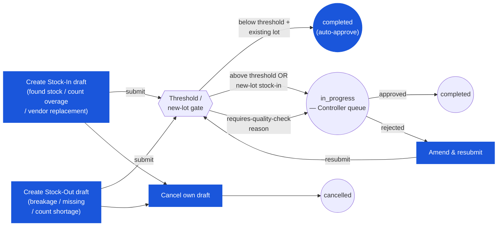

# Inventory Adjustment — User Flow — Store Keeper

### Workflow position (Store Keeper highlighted)

### Permission Matrix — V1 Status × Action (Store Keeper)

The Store Keeper holds create and edit rights at `draft`, auto-approve authority for below-threshold existing-lot documents, and read-only visibility once `in_progress` or `completed`. Rows are derived from Section 2 (Entry Point and Primary Flow) of this file; rule citations refer to [[inventory-adjustment/02-business-rules]] § 4 (Authorization Rules) and § 5 (Posting Rules).

| Action | `draft` | `in_progress` | `completed` | `cancelled` / `voided` |
|---|---|---|---|---|
| Create `tb_stock_in` (stock-in adjustment) | ✅ (`ADJ_AUTH_001`) | — | — | — |
| Create `tb_stock_out` (stock-out adjustment) | ✅ (`ADJ_AUTH_001`) | — | — | — |
| Edit header (location, reason, description, department) | ✅ (`ADJ_AUTH_001`) | ❌ read-only while awaiting approval | ❌ (`ADJ_VAL_013`) | ❌ |
| Add / edit / delete lines (product, qty, lot) | ✅ (`ADJ_AUTH_001`) | ❌ | ❌ (`ADJ_VAL_013`) | ❌ |
| Enter `cost_per_unit` (stock-in, new lot) | ✅ (`ADJ_AUTH_001`) — routes to Controller per `ADJ_AUTH_003` | ❌ | ❌ | ❌ |
| Attach supporting evidence (photos, damage report, lot label) | ✅ (`ADJ_VAL_010`) | ✅ (comment only) | ❌ | ❌ |
| Submit — below threshold + existing lot (auto-approve) | ✅ (`ADJ_AUTH_002`) | — | — | — |
| Submit — above threshold or new-lot stock-in | ✅ (`ADJ_AUTH_003`) — routes to Controller | — | — | — |
| Cancel own draft | ✅ (`ADJ_POST_003`) | ❌ | ❌ | — |
| View document (read-only) | ✅ | ✅ | ✅ | ✅ |
| Raise large stock-out for lot they received (SoD) | ❌ (`ADJ_AUTH_010` — SoD restriction above threshold) | ❌ | — | — |

> ℹ️ **Auto-approve fast path:** When the aggregate document cost is below the tenant auto-approve threshold (default `฿500`) and the stock-in is for an **existing lot** (not a new-lot creation), the document cascades `draft → in_progress → completed` in a single submit action. The inventory transaction and GL entry post immediately. The Store Keeper's work ends at this point with no Controller handoff.

> ℹ️ **New-lot stock-in always routes to Controller:** Even when cost is below the auto-approve threshold, a stock-in that creates a **new lot** (`info.isNewLot = true`) always routes to Inventory Controller for approval per `ADJ_AUTH_003`. This is a sensitive event — new lots can mask cost manipulation — so the Controller validates lot identity and `cost_per_unit` defensibility before approving.

## 1. Role in This Module

The **Store Keeper** persona (folded with Warehouse Staff in the carmen/docs source) is the floor-level operator who **identifies discrepancies, initiates the adjustment, attaches supporting evidence, and documents the reason**. Within the inventory-adjustment module the Store Keeper holds:

- **Create authority** on `tb_stock_in` (inbound: found stock, count overage, recall replacement, vendor-supplied free replacement, data fix) and `tb_stock_out` (outbound: breakage, expiry write-off, theft write-off, count shortage) documents within their `tb_user_location` scope per `ADJ_AUTH_001`.
- **Auto-approve post authority** on below-threshold documents (default `฿500` aggregate cost, tenant-configurable) per `ADJ_AUTH_002` — the document `draft → in_progress → completed` cascades on submit, the inventory transaction posts immediately, and the Store Keeper's work on that document ends.
- **No approval authority** on above-threshold documents (route to Inventory Controller per `ADJ_AUTH_004`), no approval authority on new-lot stock-in regardless of cost (always routes to Controller per `ADJ_AUTH_003`), no configuration authority on `tb_adjustment_type` reason codes (System Administrator owns), no edit authority on `completed` documents (immutable per `ADJ_VAL_013`), and no period-related authority.

Segregation of duties under `ADJ_AUTH_010` adds one further constraint: a Store Keeper cannot raise a large write-off (`tb_stock_out` above SoD threshold) against a lot they themselves received via a GRN. Routine small write-offs are exempt; large write-offs require an independent adjuster (a different Store Keeper, or Inventory Controller raising the document directly).

The Store Keeper's inventory-adjustment ownership begins when a discrepancy is identified at the floor (during a bin check, count execution, breakage discovery, expiry sweep, vendor handover) and ends at one of the boundaries enumerated in Section 4 below.

## 2. Entry Point and Primary Flow

**Entry points:** Three doors into a Store-Keeper-initiated adjustment, plus a fourth implicit door (count-rollup) where the Store Keeper is the count executor.

- **Inventory Adjustment module → New Stock-In** — manual inbound for found-stock, count-overage (one-off, ad-hoc), vendor-replacement, data-fix. Creates `tb_stock_in` at `doc_status = draft`.
- **Inventory Adjustment module → New Stock-Out** — manual outbound for breakage, expiry write-off, theft write-off, count-shortage (one-off, ad-hoc). Creates `tb_stock_out` at `doc_status = draft`.
- **Quick-action from Inventory dashboard** — "Report damage" / "Report found stock" shortcuts that pre-fill the reason code and route to the same Stock-In / Stock-Out forms above.
- *(Implicit)* **Physical Count / Spot Check run** — when the count completes with variances, the Inventory Controller's commit triggers auto-rollup `tb_stock_in` / `tb_stock_out` documents per `ADJ_POST_006`. The Store Keeper is the count executor (not the document creator on the auto-rollup), but their count work is the upstream input. The full count flow lives in [[physical-count]] / [[spot-check]] persona files.

**Primary flow (manual stock-in for found stock, 9 steps — illustrative of the inbound pattern):**

1. **Identify the discrepancy.** During a routine bin-stock check or shelf restocking, the Store Keeper sees more physical stock than the system shows. They recount to confirm, check the lot label (if lot-tracked), photograph the lot tag / physical evidence, and note the supplier / batch reference.
2. **Open the Stock-In screen.** Inventory Adjustment module → New Stock-In. The screen creates `tb_stock_in` at `doc_status = draft` with the Store Keeper as `created_by_id`, current date / time as `si_date`, and the assigned location pre-filled from the user's primary `tb_user_location` mapping (overridable to any other in-scope location). Auto-numbering generates `si_no` per `ADJ_VAL_001`.
3. **Pick the adjustment reason.** Required: `adjustment_type_id` references `tb_adjustment_type` filtered by `type = STOCK_IN` per `ADJ_VAL_002`. Typical reasons: `FOUND_STOCK`, `COUNT_OVERAGE`, `RECALL_REPLACEMENT`, `VENDOR_FREE_REPLACEMENT`, `DATA_FIX`. The reason code drives downstream GL classification (`info.glAccount`) and may flag `requiresDocument` / `requiresQualityCheck`.
4. **Enter the description.** Required header-level free-text per `ADJ_VAL_004` — explains the why and when (e.g. "Bin check 2026-05-15 14:00; 5 units of P-1 found on lower shelf, not previously recorded; batch label LOT-1 matches existing system lot"). Soft-fail at save; hard-fail at submit.
5. **Add lines.** Per product: `product_id` (auto-completes from product catalogue), `qty` (positive integer or decimal up to 5dp), the lot's `lot_no` (existing lot if the stock matches a known label; new lot if true found-stock with no prior record). For existing lots, `cost_per_unit` auto-fills from the lot's most recent cost-layer and is read-only. For new lots, `cost_per_unit` is editable but the document then routes for Controller approval regardless of threshold per `ADJ_AUTH_003`. For perishable products on new lots, `expiryDate` is required per `ADJ_VAL_009`.
6. **Attach supporting evidence.** Drag-and-drop photos / scanned documents into the comment / attachment area. When the reason's `info.requiresDocument = true` (typical for `RECALL_REPLACEMENT`, large `FOUND_STOCK`), at least one attachment is required per `ADJ_VAL_010` — submit-side hard-fail otherwise. Attachments persist on `tb_stock_in_comment.attachments` JSON array as `{originalName, fileToken, contentType}`.
7. **Set the department / cost-centre.** Required: `dimension` JSON entry `[{type: "department", id: "<uuid>", code: "<dept_code>"}, ...]` per `ADJ_VAL_005`. Usually pre-filled from the user's default department. The department drives the GL cost-centre on the resulting journal entry.
8. **Submit.** Click **Submit**. The system runs all `ADJ_VAL_*` rules + the inventory-side pre-checks (no-negative-balance does not apply to stock-in; period-containment per `ADJ_VAL_011` does). Validation passes:
    - **Below auto-approve threshold + not new-lot:** `draft → in_progress → completed` cascades per `ADJ_POST_001` / `ADJ_POST_002`. Inventory transaction posts immediately. Activity log: `{action: 'auto_approve_post', threshold: <amount>}`. Skip to step 9.
    - **Above threshold OR new-lot stock-in:** `draft → in_progress`. Document appears in Inventory Controller's queue per `ADJ_AUTH_003` / `ADJ_AUTH_004`. Document is read-only to the Store Keeper while `in_progress` (they can comment but not edit lines). Wait for Controller approval / rejection.
9. **Post fires.** Inventory write per [[inventory/02-business-rules]] `INV_POST_001`: `tb_inventory_transaction` (`inventory_doc_type = stock_in`, `inventory_doc_no = tb_stock_in.id`); `tb_inventory_transaction_detail` (`qty > 0`, `cost_per_unit`, `total_cost`, `current_lot_no`); `tb_inventory_transaction_cost_layer` (`in_qty > 0`, `transaction_type = adjustment_in`, `cost_per_unit`, `lot_no`, `lot_index`, `lot_seq_no`, `at_period`, `period_id`); weighted-average refresh per `ADJ_CALC_005` if the product is WA. GL journal: `Dr Inventory / Cr <FOUND_STOCK gain GL account>` at the document total. The detail's `inventory_transaction_id` is stamped. On-hand at `(location, product, lot)` is now the new derived value per `INV_CALC_004`. The Store Keeper's work on this document ends.

The **stock-out** flow follows the same shape with key differences:

- Reason picker filtered to `type = STOCK_OUT` (`BREAKAGE`, `EXPIRY_WRITE_OFF`, `THEFT_WRITE_OFF`, `COUNT_SHORTAGE`, `RECALL_WRITE_OFF`).
- `cost_per_unit` on the line is **not user-entered** — the engine picks at post time per `ADJ_CALC_006` (FIFO) or `ADJ_CALC_007` (WA). The screen renders a preview ("FIFO would consume from LOT-1 at ฿10.00 first, then LOT-2 at ฿12.00") so the Store Keeper can flag anomalous picks.
- Lot picker defaults to FIFO order but can be overridden for `EXPIRY_WRITE_OFF` (write off the expired lot, not the oldest); the override is recorded in `info.lotOverride`.
- No-negative-balance check fires at submit per `ADJ_VAL_012` / `INV_VAL_005`. If `qty` exceeds available on-hand at the picked lot, submit rejects with `"Outbound movement would drive on-hand below zero."` — the Store Keeper reduces `qty`, picks a different lot, or escalates to Controller.
- SoD constraint per `ADJ_AUTH_010`: large write-off of a lot the Store Keeper themselves received is rejected at submit; an independent adjuster is required.
- Reason flags `info.requiresDocument` more often (breakage, theft, expiry-write-off typically require photo / sign-off evidence) — at least one attachment per `ADJ_VAL_010`.

The **count-rollup** flow is owned by [[physical-count]] / [[spot-check]] persona files; the Store Keeper executes the count, the variance lines stage, and the Inventory Controller commits — which triggers auto-rollup `tb_stock_in` / `tb_stock_out` documents per `ADJ_POST_006`. The Store Keeper does not create or own the rollup documents themselves.

## 3. Decision Branches

- **Existing-lot vs new-lot inbound.** Existing lot — cost-per-unit auto-fills from the lot's most recent cost-layer, document follows the standard threshold-vs-auto-approve gate. New lot — `cost_per_unit` is editable but the document **always routes for Controller approval** regardless of cost impact, because new-lot creation is a sensitive event that can mask cost manipulation.
- **Below vs above auto-approve threshold.** Below — document auto-advances to `completed` on submit, inventory transaction posts immediately. Above — document routes to Inventory Controller's queue; Store Keeper waits (read-only while `in_progress`).
- **Stock-out cost-per-unit not user-entered.** For stock-out, the Store Keeper enters `qty` only. The cost preview shows FIFO ordering (or current WA); on submit, the engine picks the actual cost. The Store Keeper sees the picked cost in the activity log post-completion. Anomalous-cost concerns are escalated to Controller before submit, not after.
- **Lot override for expiry write-off.** Default lot-pick is FIFO (`lot_seq_no` ascending). For `EXPIRY_WRITE_OFF`, the Store Keeper overrides the FIFO default with the specific expired lot — the system records `info.lotOverride = <lot_no>` for the audit trail. The override is justified by the reason code; non-`EXPIRY_WRITE_OFF` documents with a lot override may flag for Controller review.
- **Negative-balance attempt rejected.** Stock-out submit rejects at the validation layer per `ADJ_VAL_012` / `INV_VAL_005` when `qty` would drive on-hand below zero at the picked lot. The Store Keeper reduces `qty`, splits across lots (multi-line document), or escalates to Controller to investigate (the discrepancy may indicate a missed inbound — e.g. unrecorded receipt — that warrants a separate stock-in to fix the balance first).
- **Location-type gate.** The location picker filters to `enum_location_type ∈ {inventory, consignment}` per `ADJ_VAL_003` and [[inventory]] `INV_VAL_009`. Direct-cost locations carry no balance and are not adjustable. The Store Keeper sees a disabled option with tooltip if they try to switch.
- **Multi-line consolidation.** A single stock-in or stock-out document can carry multiple product lines (typical for a count-variance rollup or a multi-product write-off). The auto-approve threshold is **aggregate across lines**, not per line — a multi-line document with total cost above threshold routes to Controller even if each line is below threshold.
- **Reason flagged requires-quality-check.** For reasons where `info.requiresQualityCheck = true` (typically expiry-write-off, recall-write-off, large breakage), the auto-approve fast path is bypassed and the document **always routes to Controller** for human review regardless of cost impact.

## 4. Exit Point / Handoffs

The Store Keeper's involvement on a given adjustment ends at one of six boundaries:

- **Auto-approve post complete.** Below-threshold, non-new-lot, non-requires-quality-check stock-in / stock-out posts immediately on submit. `doc_status = completed`; inventory transaction posted; GL entry generated. The Store Keeper's work is done; no handoff. Activity log records `auto_approve_post`.
- **Above-threshold handoff to Inventory Controller.** Document at `tb_stock_in.doc_status = in_progress` (or `tb_stock_out.doc_status = in_progress`) routes to **Inventory Controller** ([03-user-flow-inventory-controller.md](./03-user-flow-inventory-controller.md)) for approval. The Store Keeper re-engages only if the Controller rejects (document returns to `draft`) or asks for additional evidence on the activity log.
- **New-lot handoff to Inventory Controller.** Identical to above-threshold but triggered by the new-lot rule per `ADJ_AUTH_003`. The Controller specifically validates new-lot identity / cost-per-unit defensibility before approving.
- **Count-execution handoff via count document.** When the Store Keeper's day-to-day work is executing a [[physical-count]] or [[spot-check]] run, the inventory-adjustment effect (variance rollup auto-post) is triggered by Inventory Controller's commit, not by the Store Keeper directly. The handoff anchor is `tb_count_stock.status = completed`.
- **Document cancelled pre-post.** If the Store Keeper realises mid-draft that the discrepancy was a counting error or the document is wrong, they cancel — `doc_status = cancelled` with reason text. No inventory effect. The cancelled document remains in DB for audit. Terminal state from the Store Keeper's side.
- **Document rejected by Controller.** If the Controller rejects the document, `doc_status` returns to `draft` with the rejection comment in `workflow_history`. The Store Keeper edits and re-submits, or cancels if the issue cannot be resolved (e.g. a recount confirmed there was no discrepancy after all).

## 5. References

- Parent overview: [03-user-flow.md](./03-user-flow.md) — canonical document lifecycle (Section 2 document-level transitions; Section 2.2 auto-approve fast path; Section 2.3 posting fan-out) that this persona's path traverses; cross-persona handoff table that anchors Store Keeper → Inventory Controller boundaries.
- Sibling: [03-user-flow-inventory-controller.md](./03-user-flow-inventory-controller.md) — downstream persona that picks up above-threshold, new-lot, and requires-quality-check documents for approval; commits count-variance rollups.
- Sibling: [03-user-flow-finance.md](./03-user-flow-finance.md) — further downstream persona for above-Controller-threshold approvals (large recall write-offs, large damage write-offs).
- Sibling: [03-user-flow-audit-config.md](./03-user-flow-audit-config.md) — System Administrator who configures the `tb_adjustment_type` list the Store Keeper picks from, the auto-approve threshold the gate compares against, and the `tb_user_location` mapping that scopes their pickable locations.
- Sibling: [01-data-model.md](./01-data-model.md) — canonical `tb_stock_in` / `tb_stock_out` shape (referenced in steps 2–7 of the primary flow), `tb_inventory_transaction` shape (step 9), `enum_adjustment_type` values (`STOCK_IN` / `STOCK_OUT`), `enum_doc_status` lifecycle.
- Sibling: [02-business-rules.md](./02-business-rules.md) — validation rules `ADJ_VAL_001` (doc number unique), `ADJ_VAL_002` (reason matches direction), `ADJ_VAL_003` (location active + non-direct), `ADJ_VAL_004` (description required), `ADJ_VAL_005` (department in dimension), `ADJ_VAL_006` (product active), `ADJ_VAL_007` (qty > 0), `ADJ_VAL_008` (non-negative cost), `ADJ_VAL_009` (lot identity), `ADJ_VAL_010` (attachment when required), `ADJ_VAL_011` (period gate), `ADJ_VAL_012` (no-negative-balance on stock-out); auth rules `ADJ_AUTH_001`–`ADJ_AUTH_003` (Store Keeper create / auto-approve / new-lot gates), `ADJ_AUTH_010` (SoD); posting rules `ADJ_POST_001` (submit), `ADJ_POST_002` (post fan-out).
- Related: [[inventory]] — every adjustment posts to inventory; the inventory module's `INV_VAL_005` (no negative balance), `INV_VAL_008` (period gate), `INV_VAL_009` (direct-cost gate), `INV_CALC_005` / `INV_CALC_006` (cost picks), `INV_POST_001` / `INV_POST_002` (posting effects) are the canonical ledger-side rules.
- Related: [[physical-count]] — count execution at the location level; variance rollup auto-creates adjustment documents via `ADJ_POST_006` / `ADJ_XMOD_002`. The Store Keeper executes the count, but does not create the rollup documents directly.
- Related: [[spot-check]] — partial count; same auto-rollup pattern as physical-count per `ADJ_XMOD_003`.
- Related: [[good-receive-note]] — the Store Keeper is the same physical operator at the dock; large damage-recall write-off may cross-link the originating GRN lot data via the inventory transaction's polymorphic source link.
- Related: [[costing]] — FIFO and WA cost picking on outbound; the WA refresh on inbound that the post engine applies after the Store Keeper's submit.
