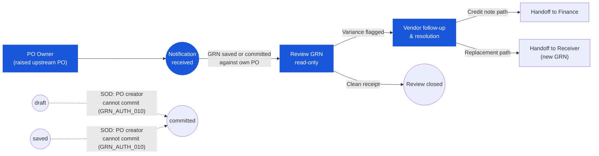

# Good Receive Note (GRN) — User Flow — Purchaser

> **At a Glance**
> **Persona:** Purchaser / Procurement Officer (+ Department Manager subset) &nbsp;·&nbsp; **Module:** [good-receive-note](/en/inventory/good-receive-note) &nbsp;·&nbsp; **Workflow stages:** Notified on `saved` / `committed` against own PO — read-only review of receipt vs PO, lot data, packing slips, variance comments; vendor-side follow-up (chase / credit-note / substitution / re-negotiation) &nbsp;·&nbsp; **Key permissions:** read-only on GRN document; SoD (`PO_AUTH_010`) forbids posting GRN against own PO
> **What this persona does:** Reviews own-PO GRNs for receiving variances and drives vendor-side resolution; does not alter GRN document state.

## 1. Role in This Module

The **Purchaser** persona covers the **Purchaser / Procurement Officer** who raised the upstream PO and, as a subset, the **Department Manager** who owns the cost-centre that the GRN posts against. Within the GRN module the Purchaser is a **review-only** participant — they do **not** create the GRN at the dock, do **not** save line entries, and do **not** post the commit. Segregation of duties (`PO_AUTH_010`, carried over from the upstream PO persona) explicitly forbids the user who created or transmitted the PO from posting the GRN against it; the `saved → committed` transition is reserved for the Inventory Manager on the Receiver path. The Purchaser is notified when a GRN goes `saved` or `committed` against one of their POs, opens the document in read mode to review receiving information against the PO they own (`received_qty` vs `order_qty`, `accepted_qty` vs `received_qty`, lot / expiry data on the linked `tb_inventory_transaction_detail`, attached packing slips and quality evidence, and any variance comment written by the Receiver), and owns the **vendor-side follow-up** for every variance flagged on the GRN — short-ship chase, return / credit-note negotiation for damaged goods, substitution for wrong items, and renegotiation when the GRN unit price drifts from the active vendor pricelist. The Department Manager subset reviews GRNs hitting their department's cost-centre, validates that what was received matches what was ordered for the department, and monitors price variance against `[vendor-pricelist](/en/inventory/vendor-pricelist)` for budget control. Neither sub-persona alters the GRN document state — their resolution lives on the vendor's response document (credit note, replacement GRN) or on the upstream PO via amendment.

### Workflow position (Purchaser highlighted)

### Permission Matrix — Status × Action (Purchaser)

The Purchaser is a **review-only** participant in the GRN module. Segregation of duties (`GRN_AUTH_010`, mirroring `PO_AUTH_010`) explicitly forbids the user who created or transmitted the upstream PO from committing the GRN against it. The Purchaser observes all non-`voided` states and owns vendor-side resolution; they do not alter the document state.

| Action | draft | saved | committed | voided |
|---|---|---|---|---|
| View GRN (read) | ❌ (not yet visible to Purchaser) | ✅ | ✅ | ✅ (audit only) |
| Receive notification (GRN saved / committed) | ❌ | ✅ | ✅ | ❌ |
| Review `received_qty` vs `order_qty` | ❌ | ✅ | ✅ | ❌ |
| Review `accepted_qty` vs `received_qty` | ❌ | ✅ | ✅ | ❌ |
| Review lot / expiry data (read-only) | ❌ | ✅ | ✅ | ❌ |
| Review attached packing slips / evidence | ❌ | ✅ | ✅ | ❌ |
| Check vendor pricelist deviation | ❌ | ✅ | ✅ | ❌ |
| Add comment / log vendor resolution | ❌ | ✅ | ✅ | ❌ |
| Edit header (vendor, currency, lines) | ❌ | ❌ | ❌ | ❌ |
| Save GRN / save for review | ❌ | ❌ | ❌ | ❌ |
| Commit GRN (`saved → committed`) | ❌ | ❌ (`GRN_AUTH_010`) | ❌ | ❌ |
| Void GRN | ❌ | ❌ | ❌ | ❌ |
| Raise PO amendment / cancel line | ❌ | ❌ (own PO, not GRN) | ✅ (own PO, not GRN) | ❌ |
| Handoff credit note reference to Finance | ❌ | ❌ | ✅ | ❌ |

> ⚠️ **Discrepancy — standalone GRN (no PO reference):** `Test_case/System_Process/tx-01-grn.md` BR-01 documents that a GRN can be created independently by the Receiver without a PO reference (`doc_type = manual`). For manual GRNs there is no upstream Purchaser — the "My POs filter" and "Receiving History tab" entry points do not surface manual GRNs, and the Purchaser has no notification entitlement. Testers should verify that manual GRNs are not routed to Purchaser notification queues. Source: `Test_case/System_Process/tx-01-grn.md` (capture date 2026-04-27).

## 2. Entry Point and Primary Flow

**Entry point:** Three equivalent paths into the read-only review screen — no path opens the GRN in editable mode for this persona.

- **Notification from activity log** — the Receiver's `draft → saved` transition (when a variance comment is written on any line) and the Inventory Manager's `saved → committed` transition both fire a notification to the PO owner; clicking the notification deep-links into the GRN read view scoped to the lines that belong to the Purchaser's PO.
- **PO module → Receiving History tab** — open the PO at `po_status ∈ {sent, partial, completed}`; the Receiving History tab lists every GRN (`saved` and `committed`) referencing this PO via `tb_good_received_note_detail.purchase_order_detail_id`, with per-line `received_qty` / `accepted_qty` running totals; click a row to open the GRN read view.
- **GRN module → My POs filter** — the GRN list pre-filtered by `purchase_order_detail.created_by = current_user`, surfacing every GRN (any state except `voided`) that the Purchaser owns the source PO for.

**Primary flow (review-and-resolve path, 7 steps):**

1. **Receive the notification** that a GRN against one of the Purchaser's POs has gone `saved` (review-while-uncommitted, variance flagged) or `committed` (post-posting review, vendor follow-up required if any variance comment is present). The notification payload carries the GRN number, the source PO number, and a summary flag (`clean` / `short` / `over` / `quality-reject` / `price-variance` / `wrong-item`).
2. **Open the GRN in read mode** from the notification or from the PO module's Receiving History tab. The header shows `doc_status`, `vendor_id`, `receipt_date`, currency, and exchange rate; the lines show `order_qty`, `received_qty`, `accepted_qty`, the running pending balance on the source PO, and the variance comment written by the Receiver.
3. **Review variance versus the PO.** For each line: compare `received_qty` to `pending_qty` (`= order_qty − received_qty − cancelled_qty`) at the moment the GRN was saved, compare `accepted_qty` to `received_qty` to read the quality-rejection variance, open the linked `tb_inventory_transaction_detail` to inspect lot numbers, expiry dates, and per-lot quantities, and open the attachment list to view packing slips and damage photos.
4. **Check vendor pricelist deviation.** The screen renders the GRN line's effective unit price beside the active `[vendor-pricelist](/en/inventory/vendor-pricelist)` price for the vendor / item / receipt-date window; the price-variance flag fires when the GRN price drifts by more than the tenant tolerance. (Department Manager subset reviews the same panel scoped to lines on the department's cost-centre.)
5. **Decide resolution path.** If every line is clean (`received_qty = pending_qty`, `accepted_qty = received_qty`, price within tolerance, no quality comment): close the review ticket and stop — no vendor contact needed. If any line is flagged: proceed to step 6.
6. **Contact the vendor.** Raise the vendor-side conversation against the variance type — chase the short-ship for the unfulfilled balance, negotiate credit / replacement for damaged or quality-rejected goods, request return-shipment authorisation for a wrong-item delivery, or renegotiate the price for a pricelist drift. The conversation lives outside the GRN document (email, vendor portal, phone log).
7. **Log resolution on the GRN activity log.** Write a Purchaser-side comment back to the GRN recording the vendor response (credit-note number, replacement-shipment ETA, return-merchandise-authorisation reference, pricelist amendment) and, where applicable, hand off to Finance for credit-note booking or raise a PO amendment to cover replacement quantity. The GRN document itself is **not** edited — the audit trail lives in the activity log and on the upstream PO / downstream credit-note documents.

## 3. Decision Branches

- **Clean receipt** (`received_qty = pending_qty`, `accepted_qty = received_qty`, GRN unit price within pricelist tolerance, no Receiver-written variance comment): close the Purchaser review ticket; no vendor contact, no Finance handoff. The PO line transitions naturally on commit (`sent → partial → completed`); the Purchaser's involvement ends here.
- **Short receipt** (`received_qty < pending_qty`): chase the vendor for the remainder. The source PO stays at `po_status = partial` with the unfulfilled balance open; no PO amendment is required — the next shipment will create a second `committed` GRN against the same PO and close the balance. If the vendor cannot fulfil the shortfall, raise a PO line cancellation (handled on the `[purchase-order](/en/inventory/purchase-order)` flow) to release the open commitment.
- **Damaged goods** (`accepted_qty < received_qty` with quality comment): negotiate credit note or replacement with the vendor. Two sub-paths: (a) **credit note** — hand off to Finance with the credit-note reference for AP offset against the committed GRN; the rejected-quantity gap stays on the GRN as the vendor's liability and feeds vendor-performance metrics. (b) **Replacement** — raise a follow-up PO amendment (or new PO) for the replacement quantity; the replacement shipment generates its own GRN when received.
- **Wrong item** (delivery refused at the dock — no GRN line saved for the wrong item by the Receiver): log the vendor-side error on the PO activity log, request return-merchandise authorisation if the wrong item physically arrived, and either amend the PO with a substitution line (if the vendor offers an equivalent item) or release the open commitment. No GRN-side action — the Receiver never recorded the wrong item.
- **Price variance vs vendor pricelist** (GRN unit price ≠ active pricelist price beyond tenant tolerance): renegotiate with the vendor. Two sub-paths: (a) **Vendor concedes** — vendor issues a credit note for the price gap; hand off to Finance for AP offset, no PO change. (b) **Pricelist out of date** — raise a pricelist amendment on `[vendor-pricelist](/en/inventory/vendor-pricelist)` so future POs price correctly; the current GRN price stands. Department Manager subset triggers the same branch when the variance hits their cost-centre.
- **Department Manager cost-centre review** (Department Manager subset): independent of variance — for every `committed` GRN posting to the department's cost-centre, review that the received goods match what was ordered for the department, confirm the inventory location / department-cost-centre allocation, and sign off on price-variance lines surfaced by the pricelist check. Disagreement on cost-centre allocation is escalated to Finance for re-allocation via journal adjustment; the GRN itself is not edited.

## 4. Exit Point / Handoffs

The Purchaser's involvement on a given GRN ends at one of four boundaries:

- **Clean review — ticket closed.** No variance, no vendor contact needed; the Purchaser closes the review ticket and the GRN proceeds to Finance on the normal three-way-match path. The Department Manager's clean-receipt review closes in the same way with a cost-centre signoff written to the activity log.
- **Variance resolved with credit note — handoff to Finance.** Vendor concedes credit for damaged goods, short-ship, or price variance; the Purchaser logs the credit-note reference on the GRN activity log and hands off to **Finance** for the credit-note booking against the AP accrual raised at commit. Finance then performs the offset on the three-way match (see [03-user-flow-finance.md](./03-user-flow-finance.md)).
- **Variance resolved with replacement — handoff to vendor and back to Receiver.** Vendor agrees to replacement shipment for damaged / wrong-item / short-ship; the Purchaser raises a PO amendment (or follow-up PO) covering the replacement quantity. The replacement shipment, when it arrives, re-enters the Receiver flow ([03-user-flow-receiver.md](./03-user-flow-receiver.md)) and generates its own GRN. The original GRN stays `committed` with the variance recorded; the audit trail is closed by the replacement GRN.
- **Department Manager cost-centre signoff.** Department Manager subset signs off on the cost-centre allocation for every `committed` GRN hitting their department, with a comment on the GRN activity log recording the budget impact. Disagreement on cost-centre allocation handoffs to Finance for journal re-allocation; the GRN itself is not edited.

## 5. References

- Parent overview: [03-user-flow.md](./03-user-flow.md) — the canonical four-state lifecycle (`draft / saved / committed / voided`) on `enum_good_received_note_status`, the global state machine that this persona observes (without altering), and the cross-persona handoff table.
- Sibling: [03-user-flow-receiver.md](./03-user-flow-receiver.md) — upstream persona that creates, saves, and commits the GRN at the dock; flags variance on the line that lands in the Purchaser's notification queue.
- Sibling: [03-user-flow-finance.md](./03-user-flow-finance.md) — downstream persona that books credit notes coordinated by the Purchaser, runs the three-way match (PO ↔ GRN ↔ invoice), and offsets AP accruals on resolved variance.
- Sibling: [03-user-flow-audit-config.md](./03-user-flow-audit-config.md) — System Administrator (RBAC keeping `PO_AUTH_010` segregation between PO owner and GRN commit) and Auditor (read-only review of variance-resolution activity logs).
- Sibling: [01-data-model.md](./01-data-model.md) — `tb_good_received_note_detail.purchase_order_detail_id` (the link the Purchaser's "My POs" filter and PO Receiving History tab follow), and the variance fields (`received_qty`, `accepted_qty`) reviewed in step 3.
- Sibling: [02-business-rules.md](./02-business-rules.md) — price-variance tolerance and pricelist-check rules referenced in step 4 of the primary flow.
- Related: [purchase-order](/en/inventory/purchase-order) — upstream module owned by this persona; the source of `pending_qty`, `po_status`, and the activity log that captures vendor-side resolution (chase, amendment, cancellation).
- Related: [vendor-pricelist](/en/inventory/vendor-pricelist) — the active pricing reference used at step 4 to detect GRN unit-price drift and on every Department Manager cost-centre review.
- Related: credit note — the downstream document that books the AP offset when the Purchaser secures a credit from the vendor for damaged / short / price-variance receipts.
- `../carmen/docs/good-recive-note-managment/GRN-User-Experience.md` — carmen/docs source for the Procurement Manager persona (goals: monitor vendor performance, analyse procurement metrics, ensure policy compliance) and the variance-handling user flow.
- `../carmen/docs/good-recive-note-managment/GRN-Overview.md` — carmen/docs module overview: PO reconciliation as the GRN's purpose, vendor performance tracking on receipt outcomes, and the integration points between the GRN module and the Purchase Order / Vendor Management modules.
