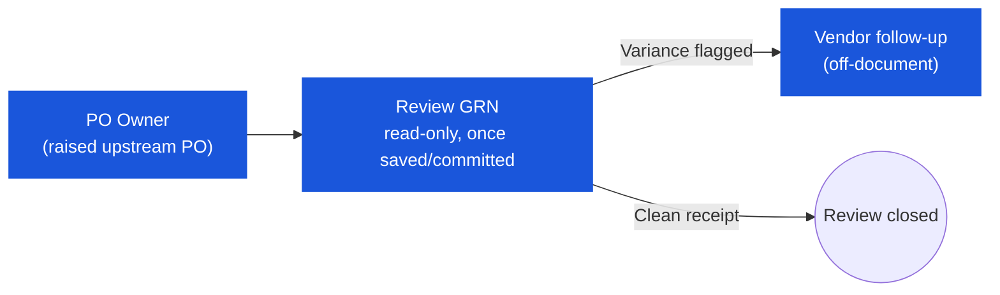

# Good Receive Note (GRN) — User Flow — Purchaser

> **At a Glance**
> **Persona:** Purchaser / Procurement Officer (+ Department Manager subset) &nbsp;·&nbsp; **Module:** [good-receive-note](/en/inventory/good-receive-note) &nbsp;·&nbsp; **Workflow stages:** Reviews own-PO GRNs once `saved` or `committed` — read-only review of receipt vs PO, lot data, packing slips; vendor-side follow-up (chase / replacement) for variance &nbsp;·&nbsp; **Key permissions:** read-only on GRN document
> **What this persona does:** Reviews own-PO GRNs for receiving variances and drives vendor-side resolution; does not alter GRN document state.
> **Corrected this pass (2026-07-15):** the previous version of this page referenced an `accepted_qty` field (no such field exists — see [01-data-model.md](./01-data-model.md)), a segregation-of-duties rule enforced in code (unconfirmed — no matching guard found), and a Finance/three-way-match handoff for credit notes (unconfirmed — see [03-user-flow-finance.md](./03-user-flow-finance.md)). Corrections are inline below.

## 1. Role in This Module

The **Purchaser** persona covers the **Purchaser / Procurement Officer** who raised the upstream PO and, as a subset, the **Department Manager** who owns the cost-centre that the GRN posts against. Within the GRN module the Purchaser is a **review-only** participant — they do **not** create the GRN at the dock, do **not** save it, and do **not** commit (commit is what posts inventory and advances the PO — see [03-user-flow-receiver.md](./03-user-flow-receiver.md)). The Purchaser opens the document in read mode to review receiving information against the PO they own (`received_qty` vs `order_qty`, `received_price` vs `order_price`, `expired_at`, the lots on the Stock Movement tab once committed, attached packing slips, and any comment written by the Receiver), and owns the **vendor-side follow-up** for a flagged variance — short-ship chase, substitution for wrong items. The Department Manager subset reviews GRNs hitting their department's cost-centre and validates that what was received matches what was ordered for the department. Neither sub-persona alters the GRN document state.

**Re-checked 2026-09-22 — still not in code:**
- **Segregation of duties (Receiver ≠ Purchaser):** no `buyer_id` cross-check exists in `good-received-note.service.ts` / `.logic.ts`; whoever holds `procurement.goods_received_note.commit` can save and commit any GRN. Mirrors the PO module's `PO_AUTH_010`.
- **Price variance against the vendor pricelist:** no pricelist lookup exists inside the GRN module (`GRN_XMOD_008`). What exists instead is a **PO-price deviation ceiling** enforced at save (`GRN_VAL_007`, `tb_product.price_deviation_limit`), so a receipt priced above the PO by more than the product's limit never reaches the Purchaser as a `saved` document.
- **Credit-note / Finance handoff for damaged goods or price variance:** no three-way match or AP feature exists — see [03-user-flow-finance.md](./03-user-flow-finance.md). The real correction document is the credit note (one per product per GRN).
- **Purchaser-scoped visibility:** the GRN list is not filtered to the Purchaser's own POs by the backend (`findAll` has no `buyer_id` filter); "own PO" review below is a working convention, not an enforced scope.

### Workflow position (Purchaser highlighted)

```mermaid
graph LR
    poOwner["PO Owner<br/>(raised upstream PO)"]:::current --> review["Review GRN<br/>read-only, once saved/committed"]:::current
    review -->|"Variance flagged"| resolve["Vendor follow-up<br/>(off-document)"]:::current
    review -->|"Clean receipt"| done(("Review closed"))
    classDef current fill:#1a56db,color:#fff,stroke:#1a56db;
```

### Permission Matrix — Status × Action (Purchaser)

The Purchaser is a **review-only** participant in the GRN module — they observe non-`voided` states and own vendor-side resolution outside the document.

| Action | draft | saved | committed | voided |
|---|---|---|---|---|
| View GRN (read) | ❌ (not yet visible) | ✅ | ✅ | ✅ (audit only) |
| Review `received_qty` vs `order_qty` | ❌ | ✅ | ✅ | ❌ |
| Review lot / expiry data (read-only) | ❌ | ✅ | ✅ | ❌ |
| Review attached packing slips / evidence | ❌ | ✅ | ✅ | ❌ |
| Add comment | ❌ | ✅ | ✅ | ✅ |
| Edit header (vendor, currency, lines) | ❌ | ❌ | ❌ | ❌ |
| Save / commit / void GRN | ❌ | ❌ | ❌ | ❌ |
| Raise PO amendment / cancel line | ❌ | ✅ (own PO, not GRN) | ✅ (own PO, not GRN) | ❌ |

## 2. Entry Point and Primary Flow

**Entry point:** No path opens the GRN in editable mode for this persona.

- **PO module → Receiving History tab** — open the PO at `po_status ∈ {approved, sent_or_print, partial, completed}` (the PO enum renamed `sent → sent_or_print` and added `approved` on 2026-09-14); lists every GRN referencing this PO via `tb_good_received_note_detail.purchase_order_detail_id`, with per-line `received_qty` running totals (advanced only by `committed` GRNs); click a row to open the GRN read view. The GRN's own **Reference documents** list (`GET …/good-received-notes/:id/ref`, 2026-09-21) links back to the source PO(s).
- **GRN module → list, filtered by owned PO** — the GRN list scoped to POs the Purchaser owns.

**Primary flow (review path, 5 steps):**

1. **Open the GRN in read mode** from the PO module's Receiving History tab or the GRN list. The header shows `doc_status`, vendor, `grn_date`, currency, and exchange rate (always 5 dp); each line row shows `order_qty` / `order_price`, `received_qty` / `received_price`, `foc_qty`, discount and tax, and the pending balance on the source PO. In read mode the action column shows the source document link (`dab3505d`).
2. **Review variance versus the PO.** For each line: compare `received_qty` to `order_qty`, `received_price` to `order_price`, check `expired_at`, open the **Stock Movement** tab (visible once `committed`) to see the generated lot numbers and posted cost, and open the attachment list to view packing slips.
3. **Decide resolution path.** If every line is clean (`received_qty = pending_qty`): no vendor contact needed. If any line is short or wrong-item: proceed to step 4.
4. **Contact the vendor.** Raise the vendor-side conversation against the variance type — chase the short-ship for the unfulfilled balance, request return-shipment authorisation for a wrong-item delivery. The conversation lives outside the GRN document (email, vendor portal, phone log) — no dedicated vendor-communication screen was found in the GRN module.
5. **Log resolution on the GRN activity log** (comment) recording the vendor response and, where applicable, raise a PO amendment to cover a replacement quantity. The GRN document itself is **not** edited.

## 3. Decision Branches

- **Clean receipt** (`received_qty = pending_qty`, no Receiver-written variance comment): no vendor contact needed. The PO line advances at the Receiver's commit (`approved` / `sent_or_print → partial → completed`); the Purchaser's involvement ends here.
- **Short receipt** (`received_qty < pending_qty`): chase the vendor for the remainder. The source PO stays at `po_status = partial` with the unfulfilled balance open; the next shipment creates a second GRN against the same PO. If the vendor cannot fulfil the shortfall, raise a PO line cancellation on the `[purchase-order](/en/inventory/purchase-order)` flow.
- **Wrong item** (delivery refused at the dock — no GRN line saved by the Receiver): log the vendor-side error on the PO activity log and either amend the PO with a substitution line or release the open commitment.
- **Department Manager cost-centre review** (Department Manager subset): independent of variance — for every GRN posting to the department's cost-centre, review that the received goods match what was ordered for the department. **Unconfirmed:** no dedicated cost-centre-allocation override or signoff screen was found in current source; department/cost-centre context lives in the header's `dimension` JSON array (see [01-data-model.md](./01-data-model.md)), not a structured workflow field.

## 4. Exit Point / Handoffs

- **Clean review** — no variance, no vendor contact needed.
- **Variance chased with the vendor** — the Purchaser logs the vendor response on the GRN activity log; a replacement shipment, if any, re-enters the Receiver flow ([03-user-flow-receiver.md](./03-user-flow-receiver.md)) and generates its own GRN. The original GRN is unchanged.

## 5. References

- Parent overview: [03-user-flow.md](./03-user-flow.md) — the canonical four-state lifecycle and the cross-persona handoff table.
- Sibling: [03-user-flow-receiver.md](./03-user-flow-receiver.md) — upstream persona whose commit posts the receipt and advances the PO; variance is flagged on the line at save.
- Sibling: [03-user-flow-finance.md](./03-user-flow-finance.md) — correction page: why no three-way-match / credit-note handoff was confirmed.
- Sibling: [03-user-flow-audit-config.md](./03-user-flow-audit-config.md) — correction page.
- Sibling: [01-data-model.md](./01-data-model.md) — `tb_good_received_note_detail.purchase_order_detail_id` (the link the PO's Receiving History tab follows).
- Sibling: [02-business-rules.md](./02-business-rules.md) — validation and posting rules referenced above; `GRN_AUTH_010` (segregation of duties — marked unconfirmed this pass).
- Related: [purchase-order](/en/inventory/purchase-order) — upstream module owned by this persona; the source of `pending_qty`, `po_status`, and the activity log that captures vendor-side resolution.
- `../carmen/docs/good-recive-note-managment/GRN-User-Experience.md` — carmen/docs source for the Procurement Manager persona and the variance-handling user flow (treat as design intent, not verified current behavior, for anything beyond read-only review).
