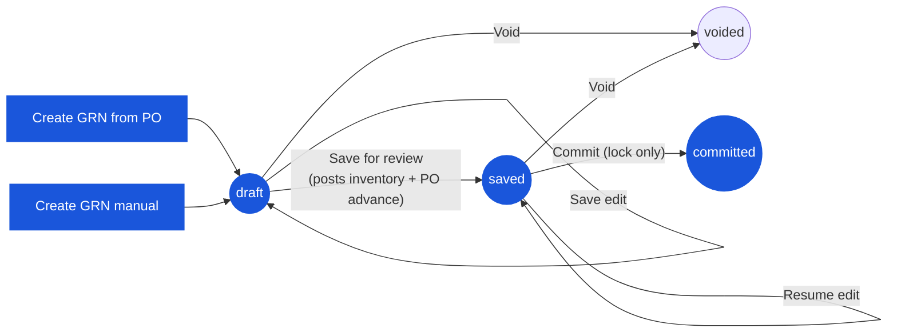

# Good Receive Note (GRN) — User Flow — Receiver

> **At a Glance**
> **Persona:** Receiver (Store Keeper / Receiving Clerk + Store / Inventory Manager) &nbsp;·&nbsp; **Module:** [good-receive-note](/en/inventory/good-receive-note) &nbsp;·&nbsp; **Workflow stages:** `(none) → draft` (create against PO or manual) &nbsp;·&nbsp; `draft → saved` — **the posting event** (inventory increment + cost-layer write + PO `received_qty` advance) &nbsp;·&nbsp; `saved → committed` (Inventory Manager — locks the document; no further posting found) &nbsp;·&nbsp; `draft / saved → voided` &nbsp;·&nbsp; **Key permissions:** create / edit draft (Store Keeper); commit (Inventory Manager)
> **What this persona does:** Records dock receipt, captures lot / expiry, saves for review (which posts the stock movement), then commits to lock the document.
> **Corrected this pass (2026-07-15):** the previous version of this page described commit as the posting event, an `accepted_qty` field distinct from `received_qty` for a per-line "quality inspection" gate, a batch-commit screen, and a Finance/AP handoff on commit. None of these match current source — see the inline corrections below and [02-business-rules.md](./02-business-rules.md) §1.

## 1. Role in This Module

The **Receiver** persona covers the **Store Keeper / Receiving Clerk** at the dock and the **Store Manager / Inventory Manager** who supervises the receipt. The Store Keeper owns the editable draft — they create the GRN against the upstream PO (or manually for ad-hoc receipts), count the physical delivery against the PO and the vendor delivery note, record `received_qty` (and, for FOC bundles, a separate `foc_qty`) per receipt event, capture lot numbers and expiry dates through the linked inventory transaction (`tb_inventory_transaction_detail`, addressed from the GRN detail_item via `inventory_transaction_id`), attach packing slips, and save the document for review. **Saving is the posting step**: `GoodReceivedNoteLogic.save()` writes the `tb_inventory_transaction` rows, creates the FIFO cost layer (or recomputes the weighted average), and advances the source PO line's `received_qty` (and `po_status`) — all before an Inventory Manager ever touches the document. The Inventory Manager's subsequent commit (`saved → committed`) only flips `doc_status` and locks the document against further edits; no additional inventory, PO, or GL effect was found in `commit()` in current source. `voided` is reachable from `draft` or `saved` by either sub-persona with a reason; the backend `/void` endpoint has no `doc_status` precondition of its own beyond "not already voided", but the frontend only renders the Void action while the GRN is not yet `committed`.

**Unconfirmed / removed this pass:** a per-line `accepted_qty` field distinct from `received_qty` (a "quality inspection" step where the Store Keeper records what was received vs. what passed inspection) does not exist anywhere in the schema or application code — a repo-wide search of the Prisma schema and both frontend and backend source for `accepted_qty` returned zero hits. A receiving shortfall or rejection is recorded simply by entering a lower `received_qty` than ordered; there is no separate acceptance quantity. A "batch commit" screen (Inventory Manager committing multiple `saved` GRNs at once) and a scheduled "end-of-period auto-commit" sweep were also not found anywhere in the backend (no batch endpoint, no cron job) — treat both as design intent, not implemented behavior. Segregation of duties (Receiver ≠ Purchaser on the same PO) is likewise unconfirmed — no `buyer_id` cross-check was found in `save()` or `commit()`.

### Workflow position (Receiver highlighted)

### Permission Matrix — Status × Action with Sub-roles (Receiver)

The Receiver persona covers two sub-roles: **Store Keeper / Receiving Clerk** (creates and edits the GRN, `draft` and `saved` owner) and **Inventory Manager / Store Manager** (commits the GRN, `saved → committed`). Both sub-roles operate on GRNs across both PO-sourced and manual creation paths.

| Action | draft | saved | committed | voided | Store Keeper | Inventory Manager |
|---|---|---|---|---|---|---|
| Create GRN (from PO) | ✅ → creates `draft` | ❌ | ❌ | ❌ | ✅ | ❌ |
| Create GRN (manual) | ✅ → creates `draft` | ❌ | ❌ | ❌ | ✅ | ❌ |
| Edit header (vendor, currency, date) | ✅ | ✅ | ❌ | ❌ | ✅ | ✅ |
| Add / edit lines and detail_items | ✅ | ✅ | ❌ | ❌ | ✅ | ✅ |
| Enter `received_qty` per receipt event | ✅ | ✅ | ❌ | ❌ | ✅ | ✅ |
| Record lot / expiry (via linked inventory transaction) | ✅ | ✅ | ❌ | ❌ | ✅ | ✅ |
| Attach packing slips / evidence | ✅ | ✅ | ✅ | ✅ | ✅ | ✅ |
| Save for review (`draft → saved`, posts inventory) | ✅ | ❌ | ❌ | ❌ | ✅ | ❌ |
| Resume edit (stay in `saved`) | ❌ | ✅ | ❌ | ❌ | ✅ | ✅ |
| Commit (`saved → committed`, lock only) | ❌ | ✅ | ❌ | ❌ | ❌ per `GRN_AUTH_005` | ✅ |
| Void (`draft → voided` or `saved → voided`) | ✅ | ✅ | ❌ | ❌ | ✅ (own document) | ✅ |
| Add comment | ✅ | ✅ | ✅ | ✅ | ✅ | ✅ |
| View (read only) | ✅ | ✅ | ✅ | ✅ | ✅ | ✅ |

> ℹ️ **Void has no server-side status guard.** The `/void` endpoint (`GoodReceivedNoteService.voidGrnById`) only rejects re-voiding an already-`voided` GRN — it does not check `doc_status` otherwise. The frontend hides the Void button once `doc_status = committed` (`canEdit = !isCommitted && !isVoid` in `grn-header.tsx`), so this is a client-side restriction rather than a rule enforced by the endpoint itself; neither `/void` nor `/reject` reverses any inventory transaction, cost layer, or PO advance already written at save. See `GRN_POST_010`.

## 2. Entry Point and Primary Flow

**Entry point:** Two equivalent paths into draft creation:

- **GRN module → Create GRN → From Purchase Order** — pick the vendor, then the open PO(s) (multi-PO consolidation is supported when every selected PO shares the same vendor and currency; the create wizard rejects a mixed-currency selection); GRN detail rows are pre-populated from `tb_purchase_order_detail` with `pending_qty` (`= order_qty − received_qty − cancelled_qty`) as the default editable received quantity.
- **GRN module → Create GRN → Manual** — `doc_type = manual`; vendor, currency, exchange rate, and receipt date entered directly; no `purchase_order_detail_id` written on any line. Used for emergency / no-PO receipts.

**Primary flow (happy path, 8 steps):**

1. **Open the PO** (or start the manual receipt) at the dock alongside the physical delivery. The screen shows each line's `order_qty` and the running `received_qty` / `cancelled_qty`.
2. **Verify the physical delivery against the PO and vendor delivery note** — match the delivery note / packing list to the PO lines, count cartons, identify any short delivery, over delivery, or wrong item **before** opening the GRN.
3. **Start the GRN.** The system writes `tb_good_received_note` at `doc_status = draft` (initial editable state, no stock or GL impact); header fields are inherited from the PO snapshot (`vendor_id`, `currency_id`, `exchange_rate`) or entered directly for manual receipts.
4. **Enter `received_qty` per receipt event** — what physically arrived, in the receiving UoM. A shortfall or rejection is recorded as a lower `received_qty` (no separate acceptance-quantity field exists).
5. **Record lot numbers and expiry dates for lot-tracked items.** Lot data is **not** stored directly on the GRN line — the GRN `detail_item` row links to a `tb_inventory_transaction` (via `inventory_transaction_id`) whose `tb_inventory_transaction_detail` children carry the `lot_no`, `expiry_date`, and per-lot quantity. The lot number is auto-generated in the fixed format `RC{YY}{MM}{4-digit sequence}` and may be overridden manually.
6. **Attach packing slips and supporting evidence** — delivery note, photos of damaged cartons. Attachments are scoped to the GRN header or to individual lines.
7. **Save the GRN for review** (`draft → saved`). This is the posting step: line-level rules must pass, and on success the system writes the `tb_inventory_transaction` rows, creates the FIFO cost layer (or recomputes the weighted average), and advances the source PO line's `received_qty` — flipping `po_status` toward `partial` or `completed`. The document becomes visible to the Inventory Manager for review while remaining editable by the Receiver as the owner.
8. **Inventory Manager commits** (`saved → committed`). This locks the document against further edits. **Corrected this pass:** no additional inventory, PO, or GL effect was found in `commit()` beyond the status change — the stock and PO effects already happened at step 7.

## 3. Decision Branches

- **Short delivery** (`received_qty < pending_balance`): save the GRN with what physically arrived. The source PO transitions to (or stays at) `partial`; the unfulfilled balance remains open for a subsequent GRN against the same PO. The Receiver may re-enter this flow when the next shipment arrives.
- **Over delivery** (`received_qty > pending_balance`): the GRN screen gates the entry against the tenant over-receipt tolerance. **Within tolerance** — `received_qty` is accepted, the save posts, and `po_status` may flip to `completed` if every line is now fully received. **Out of tolerance** — the save is rejected; the Receiver caps `received_qty` at the pending balance.
- **Wrong item** (delivery does not match the PO product): do not save a GRN line for the wrong item. For mixed deliveries (correct items + wrong items), save the GRN for the correct lines only.
- **Partial GRN now, remainder later**: save today's GRN for what arrived; the PO becomes `partial`. When the next shipment arrives, repeat the primary flow against the same PO; multiple `committed` GRNs may exist against a single PO.
- **Delivery rejected before save**: if the entire delivery is refused at the dock, do not create a GRN — there is nothing to record. If a `draft` or `saved` GRN already exists and needs to be abandoned, void it with a reason (`draft → voided` or `saved → voided`, no inventory/GL impact for a still-`draft` GRN; a `saved` GRN's already-posted inventory and PO advance are **not** reversed by voiding — see the note above).

## 4. Exit Point / Handoffs

The Receiver's involvement on a given GRN ends at one of two boundaries:

- **Save succeeds (`draft → saved`)** — inventory is posted and the PO advances; the document waits for the Inventory Manager to commit (lock). **Unconfirmed:** no downstream Finance / AP handoff was found on either save or commit — see [03-user-flow-finance.md](./03-user-flow-finance.md) for the searches that established this.
- **Commit succeeds (`saved → committed`)** — the document is locked. Any subsequent correction is via a `tb_credit_note` against the GRN (a real, separately implemented document — see [purchase-order/credit-note](/en/inventory/purchase-order/credit-note)) or a compensating adjustment in [inventory-adjustment](/en/inventory/inventory-adjustment).
- **Variance flagged on a saved or committed GRN** — the Purchaser may be informed via a comment for vendor follow-up (short-ship chase, replacement); this coordination happens off-document (email, vendor portal) — no dedicated variance-workflow screen was found in current source.

## 5. References

- Parent overview: [03-user-flow.md](./03-user-flow.md) — the canonical four-state lifecycle (`draft / saved / committed / voided`) on `enum_good_received_note_status`, corrected this pass to show `save`, not commit, as the posting transition.
- `../carmen/docs/good-recive-note-managment/GRN-User-Experience.md` — carmen/docs source for the Receiving Clerk and Inventory Manager personas (legacy `DRAFT / PENDING_APPROVAL / APPROVED / REJECTED / CANCELLED` model is **not** canonical; this page follows the four-state Prisma enum).
- `../carmen/docs/good-recive-note-managment/GRN-Overview.md` — carmen/docs module overview.
- Sibling: [03-user-flow-purchaser.md](./03-user-flow-purchaser.md) — downstream persona that reviews variance and coordinates vendor follow-up.
- Sibling: [03-user-flow-finance.md](./03-user-flow-finance.md) — correction page: why no Finance / three-way-match handoff was confirmed after save or commit.
- Sibling: [01-data-model.md](./01-data-model.md) — canonical `enum_good_received_note_status` and the inventory-transaction linkage (`tb_good_received_note_detail_item.inventory_transaction_id` → `tb_inventory_transaction_detail.lot_no` / `expiry_date`) used in step 5.
- Sibling: [02-business-rules.md](./02-business-rules.md) — validation rules and the corrected Section 5 posting-rule table (save is the posting event; commit only locks).
- Related: [purchase-order](/en/inventory/purchase-order) — upstream module; on save the GRN advances `tb_purchase_order_detail.received_qty` and may flip `po_status` (toward `partial` / `completed`).
- Related: [inventory](/en/inventory/inventory) — downstream module; on save `tb_inventory_transaction` carries the lot, expiry, and cost-layer data, and on-hand is incremented by `received_qty`.
- Related: [costing](/en/inventory/costing) — FIFO / average-cost layer creation on the `draft → saved` transition.
