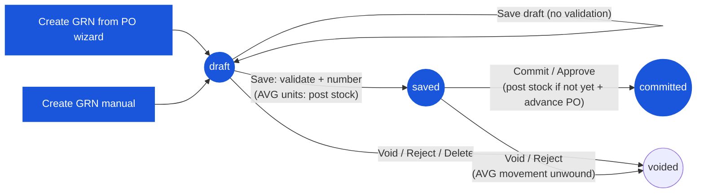

# Good Receive Note (GRN) — User Flow — Receiver

> **At a Glance**
> **Persona:** Receiver (Store Keeper / Receiving Clerk + Store / Inventory Manager) &nbsp;·&nbsp; **Module:** [good-receive-note](/en/inventory/good-receive-note) &nbsp;·&nbsp; **Workflow stages:** `(none) → draft` (create from the PO wizard or manually) &nbsp;·&nbsp; `draft → draft` (save draft, no validation) &nbsp;·&nbsp; `draft → saved` (validate + issue `grn_no`; **average-costed units post stock here**) &nbsp;·&nbsp; `saved → committed` — **the posting event** (stock if not yet + PO `received_qty` advance) &nbsp;·&nbsp; `draft / saved → voided` &nbsp;·&nbsp; **Key permissions:** `procurement.goods_received_note.create` / `.update` / `.commit` / `.delete` (`constant/permissions.ts:68-73`); gateway guards `goodReceivedNote.create|update|commit|delete|reject|approve`
> **What this persona does:** Records dock receipt, enters received / FOC quantity, received price and expiry per line, saves, then commits — which posts stock (FIFO units) and advances the PO.
> **Re-verified 2026-09-22:** the 2026-07-15 version said save posted stock and commit only locked. The backend has since moved posting to commit (`c815d67ce`) and made average-costed units post stock at save (`7d6556dd0`). Still not in code: `accepted_qty`, batch commit, auto-commit, Finance/AP handoff, segregation of duties.

## 1. Role in This Module

The **Receiver** persona covers the **Store Keeper / Receiving Clerk** at the dock and the **Store Manager / Inventory Manager** who supervises the receipt. The Store Keeper owns the editable draft — they create the GRN against the upstream PO(s) (or manually for ad-hoc receipts), count the physical delivery against the PO and the vendor delivery note, record `received_qty` and `foc_qty` per receipt event, the unit price actually received (`received_price` — mandatory whenever `received_qty > 0`), and the lot's `expired_at`, attach packing slips, and either **save the draft** (stored as-is, no validation — `use-grn-form-actions.ts:400-411`) or **save** the document (`draft → saved`). Save runs the server checklist — per-product deviation ceilings on quantity and price versus the PO line, and a cap that discount and tax may not exceed the line value — and spends the real running number. **On average-costed business units, save also posts the stock movement** (`GoodReceivedNoteLogic.save()` → `postGrnLedger(…, atSave = true)`, `logic.ts:105-143`) so the product average moves immediately; on FIFO units it does not. The Inventory Manager's **commit** (`saved → committed`, `PATCH …/commit`; `POST …/approve` is an equivalent entry point) is **the posting event**: `postReceipt()` writes the ledger if it is not there yet and advances the PO junction rows, `tb_purchase_order_detail.received_qty`, and `po_status` (`logic.ts:228-270,500-570`). A draft can be committed in one click — the UI chains `PATCH → /save → /commit` (`use-grn-form-actions.ts:486-513`). `voided` is reachable from `draft` or `saved` via **Void** (`DELETE …/void`) or **Reject** (`POST …/reject`); the server now refuses to void a `committed` GRN (`GRN_COMMITTED_NOT_VOIDABLE`) and, on average units, unwinds a movement posted at save unless a received lot was already issued (`GRN_RECEIPT_ALREADY_CONSUMED`).

**Not in code (re-checked 2026-09-22):** a per-line `accepted_qty` or quality-inspection status (a shortfall is recorded by entering a lower `received_qty`); a manual lot-number field (the lot is generated at posting as `<location_code><YYMM><run>`); batch commit or a scheduled auto-commit sweep; a segregation-of-duties check between the PO buyer and the receiver; a tenant-wide over-receipt tolerance (the ceilings are `tb_product.qty_deviation_limit` / `price_deviation_limit`).

### Workflow position (Receiver highlighted)

### Permission Matrix — Status × Action (Receiver)

The Receiver persona covers two functional sub-roles: **Store Keeper / Receiving Clerk** (creates and edits the draft) and **Inventory Manager / Store Manager** (commits). In code there is no role split — each action is gated by one permission key, and `PATCH …/save` and `PATCH …/commit` share the same guard (`goodReceivedNote.commit`, `good-received-notes.controller.ts:1369,1626`), so whoever can save can also commit.

| Action | draft | saved | committed | voided | Permission key |
|---|---|---|---|---|---|
| Create GRN (from PO wizard / manual) | ✅ → creates `draft` | ❌ | ❌ | ❌ | `…create` |
| Edit header / lines / extra cost (`PATCH …/:id`) | ✅ | ⚠️ UI hides editing (`canEdit = !isCommitted && !isVoid && !isSaved`); server accepts a PATCH, detail endpoints refuse | ❌ | ❌ | `…update` |
| Save draft (no validation) | ✅ | ❌ | ❌ | ❌ | `…update` |
| Save (`draft → saved`; AVG units post stock) | ✅ | ❌ (`GRN_ONLY_DRAFT_SAVABLE`) | ❌ | ❌ | `…commit` |
| Commit / Approve (`saved → committed`, posts + advances PO) | ✅ via UI chain `PATCH → /save → /commit` | ✅ | ❌ (`GRN_ONLY_SAVED_COMMITTABLE`) | ❌ | `…commit` (`goodReceivedNote.approve` for `/approve`) |
| Void (`DELETE …/void`) | ✅ | ✅ (AVG movement unwound; 409 if consumed) | ❌ (`GRN_COMMITTED_NOT_VOIDABLE`) | ❌ (`GRN_ALREADY_VOIDED`) | `…delete` |
| Reject (`POST …/reject`, notifies creator) | ✅ | ✅ | ❌ | ❌ | `goodReceivedNote.reject` |
| Delete (soft) | ✅ | ❌ | ❌ | ❌ | `…delete` |
| Attach packing slips / comments | ✅ | ✅ | ✅ | ✅ | comment endpoints |
| View, export, print, Stock Movement tab | ✅ | ✅ | ✅ (Stock Movement tab visible only here) | ✅ | `…view` |

> ℹ️ **Void guard is now server-side.** `voidGrnById()` (`good-received-note.service.ts:2231-2270`) refuses `committed` and `voided` GRNs; the UI additionally hides Void / Commit once committed (`grn-footer-action.tsx:27`). Because the PO is only advanced at commit, voiding a `saved` GRN never leaves a stale PO quantity behind. See `GRN_POST_010`.

## 2. Entry Point and Primary Flow

**Entry point:** Two equivalent paths into draft creation:

- **GRN list → New → From Purchase Order** — opens the two-step wizard at `/procurement/goods-receive-note/from-po` (`from-po/step-select-vendor.tsx`, `from-po-content.tsx`): step 1 picks a vendor that has receivable POs (`GET …/purchase-orders/grn/vendors`), step 2 multi-selects that vendor's POs at `approved` / `sent_or_print` / `partial` (rows the backend flags `can_use: false` are shown greyed, `grn-po-usable.ts`); Confirm rejects a mixed-currency selection, stores the selection in `sessionStorage` (`grn-wizard-data`), and navigates to `/procurement/goods-receive-note/new?doc_type=purchase_order`, where lines are pre-filled with `order_qty`, `order_price`, and the PO's remaining quantity as the editable `received_qty`.
- **GRN list → New → Manual** — `/procurement/goods-receive-note/new`; `doc_type = manual`; vendor, currency, exchange rate, and `grn_date` entered directly; no `purchase_order_detail_id` and no `order_price`, so no price-deviation check applies.

**Primary flow (happy path, 8 steps):**

1. **Open the PO** (or start the manual receipt) at the dock alongside the physical delivery. Each pre-filled line shows `order_qty`, `order_price`, and the pending quantity.
2. **Verify the physical delivery against the PO and vendor delivery note** — count cartons, identify any short delivery, over delivery, or wrong item **before** saving.
3. **Create the GRN.** The system writes `tb_good_received_note` at `doc_status = draft` with a `draft-{seq}` placeholder number, stamps `received_by_*` from the caller, and sends a "GRN created" notification; no stock or PO impact. An incomplete document can be parked with **Save draft** (no form validation).
4. **Enter `received_qty`, `foc_qty`, and `received_price` per receipt event** — what physically arrived, in the receiving UoM (the unit must be one of the product's order units; the conversion factor is resolved server-side). A shortfall is recorded as a lower `received_qty`; the frontend requires a unit price whenever quantity is received.
5. **Record the expiry date** (`expired_at`) for perishable lines — optional and deliberately not validated against `grn_date`. There is **no** lot-number field: the lot is generated when the receipt posts (`<location_code><YYMM><run>`) and is visible afterwards on the Stock Movement tab.
6. **Enter extra costs** (freight, duty…) on the extra-cost panel with the allocation mode (`by_qty` = equal share per line, `by_value` = weighted by stock quantity; `manual` allocates nothing) and attach packing slips / photos (header- or line-level comments).
7. **Save** (`draft → saved`). The server runs the save checklist — quantity / price deviation ceilings per product, discount / tax not above line value — and issues the real `grn_no`. **Average-costed business units:** the stock movement is posted now (`grn_date` must fall in an open period) so the product average moves immediately. **FIFO units:** nothing posts yet. The PO is untouched. The document becomes read-only in the UI.
8. **Commit** (`saved → committed`; **the posting event**). The server re-checks the open period, writes the ledger if it is not there yet (FIFO units), advances the PO junction rows and `tb_purchase_order_detail.received_qty` (paid and FOC quantities), recomputes `po_status` (`partial` / `completed`), and locks the document. From a `draft` the UI runs steps 7 and 8 back-to-back; if `grn_date` is outside the current open period the commit dialog asks whether to keep the date or move it to the period start (`PeriodDateChoice`).

## 3. Decision Branches

- **Short delivery** (`received_qty < order_qty`): never blocked (`percentOverage` scores shortfalls 0). At commit the source PO becomes (or stays) `partial`; the balance remains open for a later GRN against the same PO.
- **Over delivery / over price**: policed at **save** by the product master — `qty_deviation_limit` (percent over `order_base_qty`) and `price_deviation_limit` (percent over `order_price` per base unit); `0` / `NULL` means no ceiling. Exceeding either rejects the **whole document** with `GRN_DEVIATION_LIMIT_EXCEEDED` listing each offending line. There is no tenant-wide tolerance and no cap at the PO's remaining balance. `POST …/verify` with `verify_state = save` reports the same result without side effects.
- **Discount or tax larger than the line**: rejected at save (`GRN_DISCOUNT_EXCEEDS_LINE_AMOUNT` / `GRN_TAX_EXCEEDS_LINE_AMOUNT`).
- **Receipt date outside the open inventory period**: the movement cannot post — `GRN_DATE_OUTSIDE_OPEN_PERIOD` (422) at save (average units), commit, or approve; the UI offers to move `grn_date` into the current period before committing.
- **Wrong item** (delivery does not match the PO product): do not receive a line for the wrong item; for mixed deliveries, receive the correct lines only.
- **Partial GRN now, remainder later**: commit today's GRN for what arrived; the PO becomes `partial`. When the next shipment arrives, repeat the flow against the same PO; multiple `committed` GRNs may exist against a single PO.
- **Delivery rejected before posting**: if the entire delivery is refused at the dock, do not create a GRN. An unwanted `draft` can be deleted; a `draft` or `saved` GRN can be voided or rejected with a reason. On average units a movement posted at save is unwound automatically — unless stock from it has already been issued, in which case the void is refused (409) and a credit note / adjustment is the correction path.

## 4. Exit Point / Handoffs

The Receiver's involvement on a given GRN ends at one of two boundaries:

- **Save succeeds (`draft → saved`)** — the document is numbered and read-only; on average units stock is already on hand. It waits for commit. No Finance / AP handoff exists — see [03-user-flow-finance.md](./03-user-flow-finance.md).
- **Commit succeeds (`saved → committed`)** — stock is posted, the PO is advanced, the Stock Movement tab shows the lots, and the document is locked. Any subsequent correction is via a `tb_credit_note` against the GRN (one credit per product per GRN — see [purchase-order/credit-note](/en/inventory/purchase-order/credit-note)) or a compensating adjustment in [inventory-adjustment](/en/inventory/inventory-adjustment).
- **Variance flagged on a saved or committed GRN** — the Purchaser may be informed via a comment for vendor follow-up (short-ship chase, replacement); this coordination happens off-document (email, vendor portal) — no dedicated variance-workflow screen was found in current source.

## 5. References

- Parent overview: [03-user-flow.md](./03-user-flow.md) — the canonical four-state lifecycle (`draft / saved / committed / voided`) on `enum_good_received_note_status`, re-verified 2026-09-22 (commit posts; average units post stock at save).
- `../carmen/docs/good-recive-note-managment/GRN-User-Experience.md` — carmen/docs source for the Receiving Clerk and Inventory Manager personas (legacy `DRAFT / PENDING_APPROVAL / APPROVED / REJECTED / CANCELLED` model is **not** canonical; this page follows the four-state Prisma enum).
- `../carmen/docs/good-recive-note-managment/GRN-Overview.md` — carmen/docs module overview.
- Sibling: [03-user-flow-purchaser.md](./03-user-flow-purchaser.md) — downstream persona that reviews variance and coordinates vendor follow-up.
- Sibling: [03-user-flow-finance.md](./03-user-flow-finance.md) — correction page: why no Finance / three-way-match handoff was confirmed after save or commit.
- Sibling: [01-data-model.md](./01-data-model.md) — canonical `enum_good_received_note_status`, `expired_at` / `received_price` / `order_price` on the receipt event, and the ledger-side lot link (`tb_inventory_transaction_detail.good_received_note_detail_item_id`) used in step 5.
- Sibling: [02-business-rules.md](./02-business-rules.md) — validation rules (`GRN_VAL_002`, `006`–`008`) and the Section 5 posting-rule table (commit posts stock and PO; average units post stock at save).
- Related: [purchase-order](/en/inventory/purchase-order) — upstream module; at commit the GRN advances `tb_purchase_order_detail.received_qty` and flips `po_status` to `partial` / `completed`.
- Related: [inventory](/en/inventory/inventory) — downstream module; the ledger carries the lot and cost-layer data, and on-hand is incremented by `received_base_qty + foc_base_qty`.
- Related: [costing](/en/inventory/costing) — FIFO / average cost-layer creation at commit (or at save on average-costed units), with landed cost including the allocated extra cost.
- Frontend: `../carmen-inventory-frontend-react/routes/procurement/goods-receive-note/` — `use-grn-form-actions.ts`, `grn-header.tsx`, `grn-footer-action.tsx`, `grn-stock-table.tsx`, `from-po/`.
