# Good Receive Note (GRN) — User Flow

> **At a Glance**
> **Module:** [good-receive-note](/en/inventory/good-receive-note) &nbsp;·&nbsp; **Personas:** Receiver (Store Keeper + Inventory Manager) &nbsp;·&nbsp; Purchaser (review-only) &nbsp;·&nbsp; Finance (correction page — no matching feature confirmed) &nbsp;·&nbsp; Audit / Config (correction page — no matching feature confirmed)
> **Workflow lifecycle:** `draft → saved → committed`, or `voided` from `draft`/`saved`, per `enum_good_received_note_status`. **Re-verified 2026-09-22:** the posting event is **`saved → committed`** (`commit()` / `approve()` → `postReceipt()`, `good-received-note.logic.ts:228-270`) — ledger write plus PO `received_qty` advance. On average-costed business units the ledger half already fires at **`draft → saved`** (`logic.ts:105-143`); the PO half never does. No AP accrual anywhere; the GL module that now exists is not called from GRN code.
> **Drill into per-persona views below for action-level detail**

## 1. Overview

This page is the **overview entry point** for the user-flow set of the `good-receive-note` module. A Good Receive Note (GRN) is the document that records the **physical receipt of goods** from a vendor — a header row in `tb_good_received_note` together with one or more `tb_good_received_note_detail` lines and their child `tb_good_received_note_detail_item` receipt-event rows. A GRN may be raised against one or more upstream Purchase Orders at `approved` / `sent_or_print` / `partial` (`doc_type = purchase_order`, via the two-step **Create from PO** wizard at `/procurement/goods-receive-note/from-po`, which hands its selection to the `/new` form through `sessionStorage`) or as a manual receipt with no PO (`doc_type = manual`). **Re-verified 2026-09-22 (reverses the 2026-07-15 reading):** the mutating step is **`saved → committed`** — `commit()` (and its twin `approve()`) writes the inventory transaction rows and FIFO / average cost layers if they are not there yet, then advances the source PO's junction rows, `received_qty`, and `po_status`, all in one transaction. `draft → saved` validates the document (deviation ceilings, discount/tax caps), issues the real GRN number, and **on average-costed business units only** also posts the stock movement early so the product average moves at once. **Still unconfirmed / not found:** vendor-invoice capture, AP-liability posting, three-way match — none exist; the frontend `routes/accounting` area is mock data. Treat any such claim on this page or its sub-pages as design intent, not implemented behavior.

Section 2 below is the **global state machine** — the canonical list of legal transitions across the four values of `enum_good_received_note_status` (`draft`, `saved`, `committed`, `voided`), independent of who acts. Each per-persona file (linked from Section 3) describes that persona's *path through* the state machine — their entry point, the actions available to them, the decision branches they face, and the handoff that ends their involvement. Section 4 then summarises the cross-persona handoffs that stitch the individual paths together. Read this overview first to anchor the lifecycle, then drill into the persona file that matches your role.

## 2. Document Lifecycle

The GRN document status is stored on `tb_good_received_note.doc_status` and constrained to the four values declared in `enum_good_received_note_status`: `draft` (editable, may be stored incomplete, placeholder number `draft-{seq}`; no stock or PO impact), `saved` (validated and numbered; read-only in the UI; **on average-costed units the stock movement is already posted**, on FIFO units nothing is), `committed` (**the posting event** — ledger written if not yet, PO advanced; locked; not voidable), and `voided` (cancellation from `draft` or `saved`; a movement posted at save is unwound). The transitions below cover the legal moves between them. Receipt-driven downstream effects (PO `received_qty` advance and `po_status` progression, FIFO / average cost-layer creation in [costing](/en/inventory/costing)) are catalogued in [02-business-rules.md](./02-business-rules.md) Section 5.

```mermaid
stateDiagram-v2
    [*] --> draft: create from PO wizard / manual (Receiver)
    draft --> draft: save draft (Receiver) — no validation
    draft --> saved: save (Receiver) — validate + number; AVG units post stock
    draft --> voided: void / reject
    draft --> [*]: delete (soft)
    saved --> committed: commit or approve — post stock (if not yet) + advance PO
    saved --> voided: void / reject — AVG movement unwound (409 if a lot was consumed)
    committed --> [*]
    voided --> [*]
```

**Corrected 2026-09-22:** the 2026-07-15 version of this diagram showed save as the posting transition and commit as lock-only; the backend moved posting to commit (`c815d67ce`) and then made average-costed units post stock at save (`7d6556dd0`). "Batch commit", "auto-commit scheduled", and "committed → voided" still do not exist.

| From state | Action | To state | Allowed for | Pre-conditions |
| ---------- | ------ | -------- | ----------- | -------------- |
| `(none)` | create (against PO) | `draft` | `procurement.goods_received_note.create` | `doc_type = purchase_order`; source PO(s) at `po_status ∈ {approved, sent_or_print, partial}` sharing vendor and currency (wizard `from-po-content.tsx`); header populated from the PO snapshot; each line carries `purchase_order_detail_id`, `order_qty`, `order_price`. The wizard itself creates nothing — the form at `/new` does. |
| `(none)` | create (manual) | `draft` | same | `doc_type = manual`; vendor / currency / `grn_date` entered directly; no `purchase_order_detail_id` on any line; `order_price = NULL` so no price-deviation check applies. |
| `draft` | save draft | `draft` | `…update` | **No form validation** (`use-grn-form-actions.ts:400-411`, `b67c6a38`): a receiver who does not yet know the price or invoice number can store what they have. Server still resolves references and recomputes money fields. |
| `draft` | save | `saved` | `…commit` (gateway guard `goodReceivedNote.commit` on `PATCH …/save`) | Frontend zod schema passes (product, location, unit, unit price, invoice no/date, vendor, currency, ≥1 line); server save checklist passes (deviation ceilings `GRN_VAL_006`/`007`, amount caps `GRN_VAL_008`); real `grn_no` issued. **Average units:** `grn_date` must be in an open period; stock movement posted with `posted_at_save`. **FIFO units:** no ledger write. PO untouched. |
| `saved` | edit | `saved` | — (UI hides editing; `PATCH` still accepted server-side) | Detail endpoints are `draft`-only; a header PATCH on an average-costed `saved` GRN that changes qty/cost voids and re-posts the movement (`GRN_POST_013`). |
| `saved` | commit / approve — **the posting event** | `committed` | `…commit` (`PATCH …/commit`) or `goodReceivedNote.approve` (`POST …/approve`) | `doc_status = saved`; `grn_date` in an open period (re-checked here even if checked at save). `postReceipt()` writes the ledger if no receipt event carries `inventory_transaction_id`, advances the PO junction/detail `received_qty` (+ FOC received) and `po_status`, stamps `po_receiving_applied`. A `draft` can be committed in one click — the client runs `PATCH → /save → /commit` and, if the date is outside the open period, offers to move it to the period start. |
| `draft` | void / reject | `voided` | `…delete` (`DELETE …/void`) / `goodReceivedNote.reject` (`POST …/reject`) | Nothing to unwind. Reject also notifies the creator. |
| `saved` | void / reject | `voided` | same | **Average units:** the movement posted at save is soft-deleted, `inventory_transaction_id` cleared, product average re-stamped — refused with `GRN_RECEIPT_ALREADY_CONSUMED` (409) if any received lot has already been issued. **FIFO units:** nothing to unwind. PO untouched (never advanced before commit). |
| `draft` | delete | (soft-deleted) | `…delete` (`DELETE …/:id`) | `draft` only (`GRN_POST_011`). |
| `voided` | (no further action) | `voided` | — | Terminal. Any subsequent receipt is a new GRN. |
| `committed` | (no further action) | `committed` | — | Terminal. `DELETE …/void` returns `GRN_COMMITTED_NOT_VOIDABLE`. Corrections require a `tb_credit_note` against this GRN (one credit per product per GRN, `findFullyCreditedGrnIds`) or a compensating adjustment in [inventory-adjustment](/en/inventory/inventory-adjustment). No batch commit, auto-commit, or post-commit reversal exists. |

## 3. Persona Index

Each persona below has a dedicated drill-down file describing their entry point, primary flow, decision branches, and exit point. Slugs match the persona role; clicking the link opens the per-persona view.

- [Receiver](./03-user-flow-receiver.md) — Receiver / Store Keeper (and the Inventory Manager subset that performs commit). Creates the GRN at the dock against a PO or manually, counts the goods, records received quantity, FOC quantity, received price and expiry per line, saves (validate + number; average units post stock here), and — when authorised — commits, which posts stock (FIFO units) and advances the PO.
- [Purchaser](./03-user-flow-purchaser.md) — Owner of the upstream PO. Reviews receiving information once a GRN is `saved` or `committed`, investigates qty / price variance flagged by the Receiver, coordinates resolution with the vendor (short-ship, substitution, return). The Department Manager reviews cost-centre variance on the same flagged GRNs.
- [Finance](./03-user-flow-finance.md) — **Correction page.** No three-way match, AP-posting, or Finance-role feature was confirmed for this module in current source; see the page for the searches run.
- [Audit / Config](./03-user-flow-audit-config.md) — **Correction page.** No dedicated GRN "configuration console" (lot-format editor, RBAC panel, integration wiring) or lot-recall tool was confirmed in current source; see the page for what is actually available.

## 4. Cross-Persona Handoffs

The table below captures the moments where the GRN moves from one persona's responsibility to another's. Each handoff is anchored to the document state at the point of transfer. **Corrected this pass:** rows describing a Finance handoff, a scheduled auto-commit sweep, and a post-commit reversal are marked unconfirmed / not implemented — see [03-user-flow-finance.md](./03-user-flow-finance.md) and [03-user-flow-audit-config.md](./03-user-flow-audit-config.md) for the searches that established this.

| From persona | Trigger | To persona | Document state at handoff |
| ------------ | ------- | ---------- | ------------------------- |
| Receiver | Save (validate + number; average units post stock) | Inventory Manager | `saved` (FIFO units: nothing posted; average units: stock posted, PO not yet advanced; awaiting commit) |
| Receiver / Inventory Manager | Commit / approve posts the receipt and advances the PO | [purchase-order](/en/inventory/purchase-order) (`po_status → partial / completed`), [inventory](/en/inventory/inventory) (Stock Movement tab now visible), [costing](/en/inventory/costing) (layers with landed cost + `extra_cost_amount`) | `committed` (no Finance / GL handoff — see Finance correction page) |
| Receiver | Save with variance noted on a line (e.g. short receipt) | Purchaser | `saved` or `committed` (comment written; vendor-side coordination is manual, off-document) |
| System Administrator | RBAC / running-code change applied | All personas | (no document state change; new rules apply prospectively to subsequent GRNs) |

## 5. References

- `../carmen/docs/good-recive-note-managment/GRN-User-Experience.md` — carmen/docs user-experience source: persona descriptions and main user flow (note: legacy 5-state model `DRAFT / PENDING_APPROVAL / APPROVED / REJECTED / CANCELLED` is **not** canonical here; this page follows the Prisma 4-state enum).
- `../carmen/docs/good-recive-note-managment/GRN-User-Flow-Diagram.md` — carmen/docs flow diagrams (lifecycle, integration, mobile); referenced for shape only, status values realigned to the Prisma enum.
- `../carmen/docs/good-recive-note-managment/GRN-Overview.md` — carmen/docs module overview: purpose, scope, audience, integration points.
- Sibling: [01-data-model.md](./01-data-model.md) — canonical `enum_good_received_note_status` (the four-state enum used in Section 2) and the carmen/docs divergences (Section 5 of the data model).
- Sibling: [02-business-rules.md](./02-business-rules.md) Section 5 — posting effects and authorization gates referenced by each row of Section 2 (re-verified 2026-09-22: commit posts stock and PO; average units post stock at save).
- Related modules: [purchase-order](/en/inventory/purchase-order) (upstream source; commit advances PO `received_qty` and flips `po_status` to `partial`/`completed`), [inventory](/en/inventory/inventory) (downstream — inventory transactions are where lot and cost-layer data live), [costing](/en/inventory/costing) (FIFO / average cost-layer creation at commit, or at save on average units), [inventory-adjustment](/en/inventory/inventory-adjustment) (post-commit corrections).
