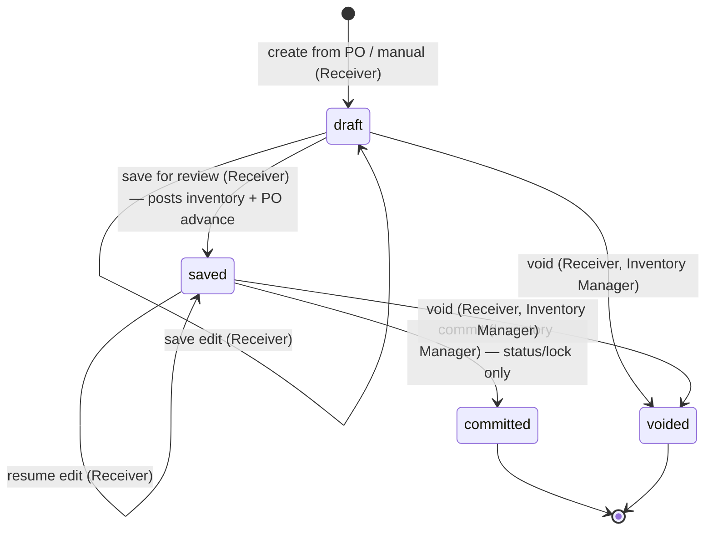

# Good Receive Note (GRN) — User Flow

> **At a Glance**
> **Module:** [good-receive-note](/en/inventory/good-receive-note) &nbsp;·&nbsp; **Personas:** Receiver (Store Keeper + Inventory Manager) &nbsp;·&nbsp; Purchaser (review-only) &nbsp;·&nbsp; Finance (correction page — no matching feature confirmed) &nbsp;·&nbsp; Audit / Config (correction page — no matching feature confirmed)
> **Workflow lifecycle:** `draft → saved → committed`, or `voided` from `draft`/`saved`, per `enum_good_received_note_status`. **Corrected this pass:** the posting event is `draft → saved` (inventory increment, cost-layer write, PO line `received_qty` advance all fire there) — `saved → committed` only locks the document. No AP accrual was found anywhere in current source.
> **Drill into per-persona views below for action-level detail**

## 1. Overview

This page is the **overview entry point** for the user-flow set of the `good-receive-note` module. A Good Receive Note (GRN) is the document that records the **physical receipt of goods** from a vendor — a header row in `tb_good_received_note` together with one or more `tb_good_received_note_detail` lines and their child `tb_good_received_note_detail_item` receipt-event rows. A GRN may be raised against an upstream Purchase Order (`doc_type = purchase_order`, the standard path) or as a manual receipt with no PO (`doc_type = manual`, e.g. ad-hoc / emergency purchases). **Corrected this pass:** the mutating step is `draft → saved` — `GoodReceivedNoteLogic.save()` creates the inventory transaction rows, writes the FIFO / average-cost layer, and advances the source PO line's `received_qty`, all in one transaction. `saved → committed` only flips `doc_status` and locks the document; no further inventory or PO-side effect was found in `commit()`. **Unconfirmed:** no vendor-invoice capture, AP-liability posting, or three-way-match (PO ↔ GRN ↔ invoice) feature was found anywhere in the current frontend or backend — a repo-wide search for `three-way`, `vendor_invoice`, and `tb_invoice` returned zero hits (mirrors the identical finding already confirmed for the `purchase-order` module). Treat any such claim on this page or its sub-pages as design intent, not implemented behavior.

Section 2 below is the **global state machine** — the canonical list of legal transitions across the four values of `enum_good_received_note_status` (`draft`, `saved`, `committed`, `voided`), independent of who acts. Each per-persona file (linked from Section 3) describes that persona's *path through* the state machine — their entry point, the actions available to them, the decision branches they face, and the handoff that ends their involvement. Section 4 then summarises the cross-persona handoffs that stitch the individual paths together. Read this overview first to anchor the lifecycle, then drill into the persona file that matches your role.

## 2. Document Lifecycle

The GRN document status is stored on `tb_good_received_note.doc_status` and constrained to the four values declared in `enum_good_received_note_status`: `draft` (initial editable state, no stock or GL impact), `saved` (**the posting event** — inventory incremented, cost layers written, PO line advanced; document remains editable), `committed` (document locked against further edits; no additional inventory/PO/GL effect found), and `voided` (administrative cancellation from `draft` or `saved`; the UI does not expose Void once `committed`, though the backend `/void` endpoint itself has no status guard beyond "not already voided" — see [02-business-rules.md](./02-business-rules.md) `GRN_POST_010`). The transitions below cover the legal moves between them; everything else is rejected by the workflow engine. Receipt-driven downstream effects (PO `received_qty` advance and `po_status` progression, FIFO / average-cost layer creation in [costing](/en/inventory/costing)) fire on the `draft → saved` transition — see [02-business-rules.md](./02-business-rules.md) Section 5 for posting rules.

**Corrected this pass:** a prior version of this diagram and table showed `saved → committed` as the posting transition, plus "batch commit", "auto-commit scheduled", and a "committed → voided post-commit reversal" edge. None of these four match current source — see the row-by-row corrections below.

| From state | Action | To state | Allowed for | Pre-conditions |
| ---------- | ------ | -------- | ----------- | -------------- |
| `(none)` | create (against PO) | `draft` | Receiver | `doc_type = purchase_order`; source PO has `po_status ∈ {sent, partial}` and at least one line with pending qty; header fields populated from the PO snapshot (`vendor_id`, `currency_id`, `exchange_rate`). |
| `(none)` | create (manual) | `draft` | Receiver | `doc_type = manual`; vendor / currency / receipt date entered directly; no `purchase_order_detail_id` written on any line. |
| `draft` | save (edit) | `draft` | Receiver (owner) | Header and line validation rules in [02-business-rules.md](./02-business-rules.md) Section 2 pass at save time (header rules) or warn-only (line rules); document remains editable. |
| `draft` | save for review — **the posting event** | `saved` | Receiver (owner) | Line-level rules pass; receipt events recorded on every line. **Triggers inventory increment, cost-layer write (FIFO / average per tenant costing method), and PO line `received_qty` advance** (`GoodReceivedNoteLogic.save()`). Document remains editable by the Receiver as owner. |
| `saved` | resume edit | `saved` | Receiver (owner) | Document still uncommitted; edits are written in-place; remains in `saved`. |
| `saved` | commit | `committed` | Inventory Manager (and Receiver subset where RBAC permits) | **Corrected this pass:** commit only flips `doc_status`/`doc_version` and locks the document against further edits — no inventory, PO, or GL effect was found in `GoodReceivedNoteLogic.commit()` beyond the status change (those effects already happened at save). |
| `draft` | void | `voided` | Receiver (own draft), Inventory Manager | No inventory or GL impact — nothing has posted yet. |
| `saved` | void | `voided` | Receiver (own document), Inventory Manager | Reverses nothing automatically: the inventory transaction, cost layer, and PO `received_qty` advance already written at save are **not** compensated by the `/void` endpoint in current source (`voidGrnById()` only sets `doc_status = voided`). Treat "void reverses the receipt" as unconfirmed. |
| `voided` | (no further action) | `voided` | — | Terminal state. The voided document is retained for audit; any subsequent receipt must be raised as a new GRN. |
| `committed` | (no further action) | `committed` | — | Terminal state. Corrections require a `tb_credit_note` against this GRN or a compensating adjustment in [inventory-adjustment](/en/inventory/inventory-adjustment); the GRN itself remains locked. **Unconfirmed:** "batch commit", "end-of-period auto-commit", and a "committed → voided post-commit reversal with elevated co-authorisation" path were all described in a prior version of this table — no batch-commit endpoint, scheduled job, or reversal-workflow code was found anywhere in `carmen-turborepo-backend-v2` during this pass. The backend `/void` endpoint itself has no `doc_status` precondition beyond "not already voided" (see [02-business-rules.md](./02-business-rules.md) `GRN_POST_010`), but the frontend only renders the Void action while `doc_status ∉ {committed, voided}`, so this path is not reachable through the UI as currently built. |

## 3. Persona Index

Each persona below has a dedicated drill-down file describing their entry point, primary flow, decision branches, and exit point. Slugs match the persona role; clicking the link opens the per-persona view.

- [Receiver](./03-user-flow-receiver.md) — Receiver / Store Keeper (and the Inventory Manager subset that performs commit). Creates the GRN at the dock against a PO or manually, counts the goods, records lot / expiry data (via the linked inventory transaction, not directly on the GRN line), saves for review — which posts inventory and advances the PO — and, when authorised, commits to lock the document.
- [Purchaser](./03-user-flow-purchaser.md) — Owner of the upstream PO. Reviews receiving information once a GRN is `saved` or `committed`, investigates qty / price variance flagged by the Receiver, coordinates resolution with the vendor (short-ship, substitution, return). The Department Manager reviews cost-centre variance on the same flagged GRNs.
- [Finance](./03-user-flow-finance.md) — **Correction page.** No three-way match, AP-posting, or Finance-role feature was confirmed for this module in current source; see the page for the searches run.
- [Audit / Config](./03-user-flow-audit-config.md) — **Correction page.** No dedicated GRN "configuration console" (lot-format editor, RBAC panel, integration wiring) or lot-recall tool was confirmed in current source; see the page for what is actually available.

## 4. Cross-Persona Handoffs

The table below captures the moments where the GRN moves from one persona's responsibility to another's. Each handoff is anchored to the document state at the point of transfer. **Corrected this pass:** rows describing a Finance handoff, a scheduled auto-commit sweep, and a post-commit reversal are marked unconfirmed / not implemented — see [03-user-flow-finance.md](./03-user-flow-finance.md) and [03-user-flow-audit-config.md](./03-user-flow-audit-config.md) for the searches that established this.

| From persona | Trigger | To persona | Document state at handoff |
| ------------ | ------- | ---------- | ------------------------- |
| Receiver | Save for review (posts stock) | Inventory Manager | `saved` (inventory already incremented, PO already advanced; awaiting commit to lock) |
| Receiver / Inventory Manager | Commit locks the document | — | `committed` (no further module handoff was confirmed — see Finance correction page) |
| Receiver | Save with variance noted on a line (e.g. short receipt) | Purchaser | `saved` or `committed` (comment written; vendor-side coordination is manual, off-document) |
| System Administrator | RBAC / running-code change applied | All personas | (no document state change; new rules apply prospectively to subsequent GRNs) |

## 5. References

- `../carmen/docs/good-recive-note-managment/GRN-User-Experience.md` — carmen/docs user-experience source: persona descriptions and main user flow (note: legacy 5-state model `DRAFT / PENDING_APPROVAL / APPROVED / REJECTED / CANCELLED` is **not** canonical here; this page follows the Prisma 4-state enum).
- `../carmen/docs/good-recive-note-managment/GRN-User-Flow-Diagram.md` — carmen/docs flow diagrams (lifecycle, integration, mobile); referenced for shape only, status values realigned to the Prisma enum.
- `../carmen/docs/good-recive-note-managment/GRN-Overview.md` — carmen/docs module overview: purpose, scope, audience, integration points.
- Sibling: [01-data-model.md](./01-data-model.md) — canonical `enum_good_received_note_status` (the four-state enum used in Section 2) and the carmen/docs divergences (Section 5 of the data model).
- Sibling: [02-business-rules.md](./02-business-rules.md) Section 5 — posting effects and authorization gates referenced by each row of Section 2 (corrected this pass to show save, not commit, as the posting event).
- Related modules: [purchase-order](/en/inventory/purchase-order) (upstream source; save advances PO `received_qty` and may flip `po_status` toward `partial`/`completed`), [inventory](/en/inventory/inventory) (downstream — inventory transactions are where lot, expiry, and cost-layer data live), [costing](/en/inventory/costing) (FIFO / average-cost layer creation at save), [inventory-adjustment](/en/inventory/inventory-adjustment) (post-commit corrections).
