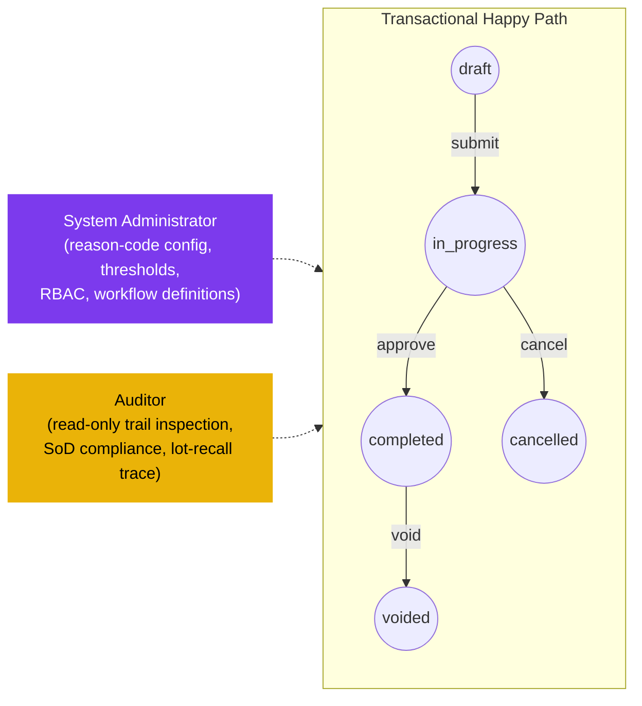

# Inventory Adjustment — User Flow — Audit & Config

> **At a Glance**
> **Persona:** Audit / Config (Auditor + System Administrator) &nbsp;·&nbsp; **Module:** [inventory-adjustment](/en/inventory/inventory-adjustment) &nbsp;·&nbsp; **Workflow stages:** Off-path observers — Sysadmin owns reason-code list (`tb_adjustment_type`), thresholds, RBAC, period config; Auditor reads the full adjustment dataset including soft-deleted compensating reversals &nbsp;·&nbsp; **Key permissions:** Sysadmin configures rules and thresholds; Auditor read-only (no document state writes)
> **What this persona does:** Configures adjustment-module rules / thresholds / reason codes (Sysadmin); audits document trails and compensating-reversal chains (Auditor).

### Position relative to the transactional flow (off-path observers)

### Permission Matrix — V6 Action × Sub-persona (Audit / Config)

Both sub-personas are non-transactional — they do not raise, approve, edit, post, or void adjustment documents. Their work is on the boundaries: configuration (System Administrator) and read-only inspection (Auditor). Rows are derived from Section 2 (Entry Point and Primary Flow) of this file; rule citations refer to [inventory-adjustment/02-business-rules](/en/inventory/inventory-adjustment/02-business-rules) § 4 (Authorization Rules) and § 5 (Posting Rules).

| Action | System Administrator | Auditor |
|---|---|---|
| View all `tb_stock_in` / `tb_stock_out` (any status, incl. soft-deleted) | ✅ | ✅ (`ADJ_AUTH_009`) |
| View `workflow_history`, `last_action_by_id`, approval signatures | ✅ | ✅ (`ADJ_AUTH_009`) |
| View attachments (photos, damage reports, recall notices) | ✅ | ✅ (`ADJ_AUTH_009`) |
| View inventory transaction and cost-layer effects | ✅ | ✅ |
| Export sensitive fields (cost-per-unit, vendor terms) | ✅ | ✅ (secondary-approval audit pattern) |
| CRUD on `tb_adjustment_type` reason codes (`ADJ_AUTH_008`) | ✅ (`ADJ_AUTH_008`) | ❌ |
| Set `info.glAccount`, `info.requiresDocument`, `info.requiresQualityCheck` | ✅ (`ADJ_AUTH_008`) | ❌ |
| Configure threshold ladder (auto-approve / Controller / Finance / SoD) | ✅ (`ADJ_AUTH_008`) | ❌ |
| Manage `tb_user_location` scope and RBAC | ✅ | ❌ |
| Define `tb_workflow` stages for adjustment documents | ✅ | ❌ |
| SoD compliance check (`ADJ_AUTH_010` — receiver ≠ adjuster) | ❌ | ✅ — flag violations in audit report |
| Verify void chains (compensating reversal exists per `ADJ_POST_004`) | ❌ | ✅ — orphaned voids are hard-fail audit findings |
| Lot-recall trace (receipt → consumption → adjustment → void chain) | ❌ | ✅ — via shared `tb_inventory_transaction` join |
| Raise / approve / void adjustment documents | ❌ (`ADJ_AUTH_008` — config only) | ❌ |

> ℹ️ **Configuration scope:** System Administrator changes apply **prospectively** — new and future draft documents inherit the updated reason codes, thresholds, and workflow stages. Existing `draft` / `in_progress` documents retain the config active at their submit time. `completed` documents are immutable and retain their reason-code snapshot per [inventory-adjustment/01-data-model](/en/inventory/inventory-adjustment/01-data-model) § 3.

> ℹ️ **Sensitive-field export:** Single-Auditor export of cost-per-unit and joined vendor-pricelist data requires a secondary-approval step per the audit pattern. This is enforced at the platform layer, not within the adjustment module itself.

## 1. Role in This Module

The **Audit / Config** persona group folds two carmen/docs roles — **Auditor** and **System Administrator** — that share the property of being **non-transactional** in the adjustment module. Neither raises, approves, edits, posts, nor voids adjustment documents; their work is on the **boundaries** of the transactional flow (read-only inspection, master-data configuration, integration).

**Auditor responsibilities:**

- Read-only access to all `tb_stock_in` / `tb_stock_out` documents across the property, including soft-deleted (`deleted_at` non-null), `cancelled`, and `voided` documents per `ADJ_AUTH_009`.
- End-to-end inspection of the adjustment trail: reason codes (and their `info.glAccount` mappings at the time of post — via cost-layer snapshot), attachments (photos, vendor RMAs, recall notices, supervisor sign-offs), approval signatures (`workflow_history`, `last_action_by_id`, `last_action_at_date`), journal entries (resolved via the inventory transaction → cost-layer ledger join → Finance subsystem), and **void chains** (compensating-reversal sequences per `ADJ_POST_004`).
- SoD compliance checks per `ADJ_AUTH_010` — flag cases where the same user appears as both receiver and adjuster for the same lot above the SoD threshold.
- Lot-recall trace combining adjustment documents with [good-receive-note](/en/inventory/good-receive-note) receipts and [store-requisition](/en/inventory/store-requisition) / [physical-count](/en/inventory/physical-count) consumption / variance data via the shared `tb_inventory_transaction` join.
- Export of sensitive-field data (cost-per-unit, vendor terms via joined source documents) under secondary-approval audit pattern.

**System Administrator responsibilities:**

- Master data CRUD on `tb_adjustment_type` (reason codes) per `ADJ_AUTH_008`:
    - `code`, `name`, `description`
    - `type` (`stock_in` or `stock_out`) — the direction filter
    - `is_active` flag
    - `info.glAccount` — GL account mapping that drives the post's journal entry
    - `info.requiresDocument` — flag forcing attachment requirement per `ADJ_VAL_010`
    - `info.requiresQualityCheck` — flag bypassing auto-approve and forcing Controller review
- Tenant-config of threshold ladder: Store-Keeper auto-approve threshold, Inventory Controller threshold, Finance threshold, SoD threshold per `ADJ_AUTH_010`.
- `tb_user_location` mapping — scopes which Store Keepers can act on which locations.
- RBAC: which users hold Store Keeper / Inventory Controller / Finance / Auditor / Sysadmin roles, and what their threshold parameters are.
- Integration endpoints — connection to the Finance GL subsystem (for the post-time journal entries), to the document-management subsystem (for attachment storage), to the workflow engine.
- Workflow definitions — the `tb_workflow` rows referenced by `tb_stock_in.workflow_id` / `tb_stock_out.workflow_id` that drive the stage-by-stage approval routing.

Neither role can post / approve / void / edit adjustment documents directly. Configuration changes apply prospectively (existing `draft` / `in_progress` documents inherit at-submit-time config; `completed` documents are immutable). Sensitive Sysadmin operations (reason-code GL-account change, threshold change) are audit-logged.

## 2. Entry Point and Primary Flow

### 2.1 Auditor flow

**Entry points:** Four doors into Auditor work on adjustments.

- **Audit module → Adjustment Trail report** — periodic (typically post-period-lock) review of all `completed` / `voided` adjustments in the period. Default filters: period, location, reason. Driven by external audit cycle.
- **Audit module → SoD Compliance report** — runs the SoD check across all `tb_stock_out` write-offs in the period, flagging cases where the same user appears as both `tb_good_received_note.created_by_id` (receiver) and `tb_stock_out.created_by_id` (adjuster) for the same lot above the SoD threshold.
- **Audit module → Lot Recall Trace** — chain-of-custody query for a specific lot: receipt (GRN) → consumption (SR / stock-out) → adjustments (stock-in / stock-out) → void chains.
- **Reactive — investigation triggered by Finance or external audit** — drill into a specific document, period, location, or user.

**Auditor primary flow (Adjustment Trail review for an audit window, 7 steps):**

1. **Open the Adjustment Trail report.** Audit module → Adjustment Trail → `<period range>`. The report aggregates: total stock-in cost (period), total stock-out cost (period), by reason, by location, by department, by user.
2. **Filter to anomaly candidates.** Apply filters for high-cost-impact, repeat-offender users, repeat-offender locations, void chains, SoD-flagged documents.
3. **Drill into specific documents.** For each candidate, the detail view shows the full chain: header (creator, approver, reason, location, department), lines (product, qty, lot, cost), attachments (download as evidence pack), `workflow_history` (stage-by-stage transitions with actor / timestamp), the resulting `tb_inventory_transaction` row(s) with cost-layer effects, and (for posted documents) the GL journal entries.
4. **Verify approval signatures.** Cross-check that the document followed the threshold ladder correctly: below-threshold auto-approved, above-threshold Controller-approved, above-Controller-threshold Finance-approved. Mis-routed documents (e.g. above-threshold auto-approved due to a threshold-config gap at the time of submit) are flagged.
5. **Verify SoD compliance.** For each large write-off (above SoD threshold), confirm the adjuster is not the receiver of the lot per `ADJ_AUTH_010`. Violations are flagged with the offending pair (receiver / adjuster IDs).
6. **Verify void chains.** For each `voided` document, confirm the compensating reversal exists per `ADJ_POST_004` (look for a paired `tb_stock_in` / `tb_stock_out` with `info.voidsAdjustmentId = <original>`). Orphaned voids (status `voided` without compensating reversal) are flagged.
7. **Compile audit report.** Export the trail (with attachments, where authorised). Findings tracked in the audit-report workflow outside the adjustment module.

**Auditor secondary flow — Lot Recall Trace (4 steps):**

1. **Open the Lot Recall Trace screen.** Enter `lot_no` and `product_id`.
2. **Forward trace.** All movements consuming from the lot: SR issues (per [store-requisition](/en/inventory/store-requisition) join), stock-out write-offs (`tb_stock_out_detail` join via `current_lot_no` on the inventory-side), credit-note quantity adjustments, transfer-outs.
3. **Backward trace.** The originating GRN (or compensating reversal for a stock-in-introduced lot) — the receipt that created the lot's first cost-layer row.
4. **Render chain-of-custody.** Both directions in a single report — receipt date, recipient, all downstream movements with dates / actors / qtys / cost impacts. No write operations; read-only.

### 2.2 System Administrator flow

**Entry points:** Four doors into Sysadmin configuration work for adjustments.

- **Admin module → Adjustment Types** — CRUD on `tb_adjustment_type` reason codes. Exercised by the E2E spec `031-adjustment-type.spec.ts`.
- **Admin module → Thresholds** — tenant-config screen for the threshold ladder (Store-Keeper auto-approve, Inventory Controller, Finance, SoD).
- **Admin module → RBAC** — user → role mappings, location-scope assignment per `tb_user_location`, threshold-parameter overrides per user / department.
- **Admin module → Workflows** — `tb_workflow` definitions for adjustment documents (stage-by-stage approval routing).

**Sysadmin primary flow (add a new adjustment-type reason code, 7 steps):**

1. **Open the Adjustment Types admin screen.** Admin module → Master Data → Adjustment Types → New.
2. **Enter the reason code data.** `code` (e.g. `INSURANCE_WRITE_OFF`), `name` (display name), `description`, `type` (`stock_out` for write-offs), `is_active = true`.
3. **Set the `info` JSON.** Critical fields:
    - `glAccount`: the GL expense / loss account for the reason (e.g. `6535 — Insurance-claimable Losses`).
    - `requiresDocument`: typically `true` for insurance-claimable losses (need the claim reference / photos).
    - `requiresQualityCheck`: typically `true` (bypass auto-approve to force Controller review).
4. **Save.** Server validates `ADJ_VAL_001`-equivalent (code uniqueness on `tb_adjustment_type`), `info.glAccount` resolves to a valid GL account, code-and-name non-empty.
5. **Sysadmin-approval audit log.** The change is recorded in the platform audit log (separate from adjustment workflow history) — actor, timestamp, before / after JSON.
6. **Communicate to users.** The new reason code is immediately available in Store Keeper / Controller / Finance pickers for new documents (existing draft / in-progress documents retain their original reason). Documentation update outside the system.
7. **Backfill (rare).** If a previously-mis-classified set of historical adjustments should be re-classified under the new reason, that requires void + compensating-reversal cycle on each affected document — Finance-coordinated, not a Sysadmin mass-update.

**Sysadmin secondary flow — Threshold change:**

Change auto-approve / Controller / Finance / SoD thresholds. Audit-logged. Applies prospectively at submit time — documents already at `in_progress` retain the threshold-routing they entered with; new submits use the new threshold.

## 3. Decision Branches

### Auditor

- **Soft-fail vs hard-fail on audit findings.** Soft-fail (note in audit report, not a control breach): cost-anomaly outliers, reason-code mismatches with evidence that the Controller may have rationalised. Hard-fail (control breach, report to compliance): SoD violations, orphaned void chains, missing approval signatures on above-threshold posts, posting into closed periods (should not occur post-`ADJ_VAL_011` but historical instances may surface).
- **Sensitive-field export — secondary approval.** Cost-per-unit and joined vendor-pricelist data export requires a second-Auditor approval per the audit pattern; single-Auditor export is restricted.
- **Scope of recall trace.** Limited to the lot's history; cross-lot tracing (e.g. all lots from a vendor) is a different query supported by the platform but treated as a different audit object.

### System Administrator

- **Add reason vs modify existing.** Add a new reason for new business cases (insurance claim, new write-off category). Modify existing only for clarification (rename, description update, `info.glAccount` correction); never repurpose an existing reason (would corrupt historical reporting).
- **GL-account change on an active reason.** Forward-only — existing posted documents retain their original mapping via the cost-layer snapshot pattern. The Sysadmin must coordinate with Finance to ensure the new mapping is consistent with chart-of-accounts changes (e.g. a department restructure).
- **Threshold change scope.** Tenant-wide (global) vs department-specific vs user-specific (override). User-specific overrides are reserved for narrow cases (e.g. a particular Store Keeper trusted with a higher auto-approve threshold); department-specific is the typical scope.
- **Deactivating a reason.** `is_active = false` hides the reason from new-document pickers but does not invalidate historical documents. Soft-delete (`deleted_at`) is more aggressive — used when the reason was created in error and should not appear in reporting; rare.

## 4. Exit Point / Handoffs

The Audit / Config persona's involvement on a given adjustment / configuration ends at one of the following boundaries:

- **Auditor — read-only review complete.** Findings recorded in the audit report; no state change on any adjustment document. Handoffs are out-of-band — to Compliance / Finance / Internal Audit committee, not back into the adjustment module.
- **Sysadmin — configuration saved.** New / updated `tb_adjustment_type` row, threshold change, RBAC change, workflow change. Applies prospectively at submit; existing in-flight documents retain their original config. No handoff for the configuration itself; downstream personas (Store Keeper / Controller / Finance) inherit at next submit / approval.
- **Sysadmin — backfill request.** When a configuration error is discovered post-hoc that requires historical correction (rare), the Sysadmin coordinates with Finance / Inventory Controller to raise corrective void + compensating-reversal cycles per `ADJ_POST_004` — but Sysadmin does not initiate those documents directly.

## 5. References

- Parent overview: [03-user-flow.md](./03-user-flow.md) — canonical document lifecycle and cross-persona handoff table (Sysadmin configuration change → all personas; Auditor read-only review).
- Sibling: [03-user-flow-store-keeper.md](./03-user-flow-store-keeper.md) — Sysadmin configures the `tb_adjustment_type` reasons and `tb_user_location` scope the Store Keeper picks from.
- Sibling: [03-user-flow-inventory-controller.md](./03-user-flow-inventory-controller.md) — Sysadmin configures the Controller threshold; Auditor reviews the Controller's approval history for SoD and reason-code-mismatch findings.
- Sibling: [03-user-flow-finance.md](./03-user-flow-finance.md) — Sysadmin configures the Finance threshold and the `info.glAccount` mappings Finance verifies; Auditor reviews the period-end adjustment trail Finance signs off.
- Sibling: [01-data-model.md](./01-data-model.md) — `tb_adjustment_type` shape (Sysadmin CRUD target), `tb_user_location` (Sysadmin scoping target), `tb_workflow` reference, `workflow_history` JSON (Auditor primary read target).
- Sibling: [02-business-rules.md](./02-business-rules.md) — `ADJ_AUTH_008` (Sysadmin configuration scope), `ADJ_AUTH_009` (Auditor read scope), `ADJ_AUTH_010` (SoD — Auditor primary verification target), `ADJ_VAL_002` (reason-direction match — Sysadmin design constraint), `ADJ_VAL_010` (requiresDocument flag), `ADJ_POST_004` (void chain — Auditor primary verification target).
- Related: [inventory](/en/inventory/inventory) — `INV_AUTH_008` (Sysadmin configuration scope spanning location-type / costing-method / period definitions in addition to adjustment-type), `INV_AUTH_009` (Auditor read scope spanning all inventory data).
- Related: [good-receive-note](/en/inventory/good-receive-note) — Auditor's lot-recall trace joins adjustments with GRN receipts via the shared inventory transaction; the Auditor flow pattern mirrors [good-receive-note/03-user-flow-audit-config](/en/inventory/good-receive-note/03-user-flow-audit-config).
- Related: [physical-count](/en/inventory/physical-count) / [spot-check](/en/inventory/spot-check) — Auditor reviews variance-rollup auto-posts (initiated by `ADJ_POST_006` on count commit) for reasonableness and SoD compliance.
- E2E: [`../carmen-inventory-frontend-e2e/tests/031-adjustment-type.spec.ts`](../../../carmen-inventory-frontend-e2e/tests/031-adjustment-type.spec.ts) — the canonical Sysadmin CRUD spec for `tb_adjustment_type`; covers reason-code uniqueness, code-and-name validation, list / search / pagination, security cases.
