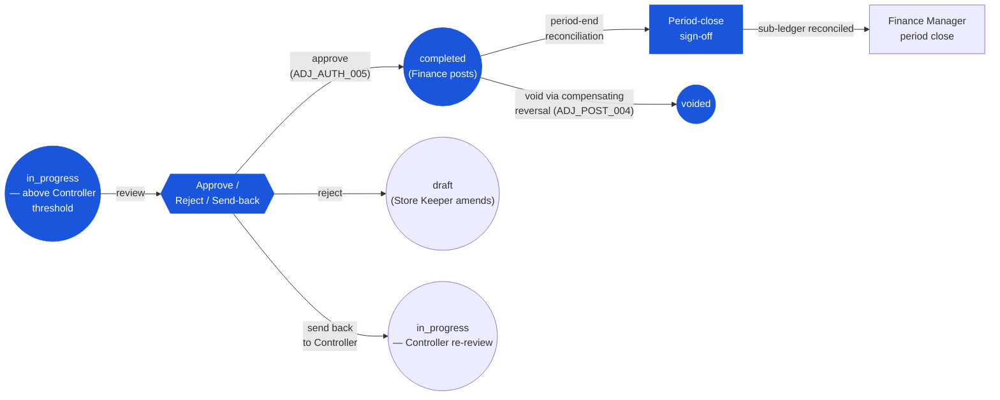

# Inventory Adjustment — User Flow — Finance

> **At a Glance**
> **Persona:** Finance &nbsp;·&nbsp; **Module:** [inventory-adjustment](/en/inventory/inventory-adjustment) &nbsp;·&nbsp; **Workflow stages:** Above-Controller-threshold queue — review at `in_progress`; approve to `completed` (`ADJ_AUTH_005`), reject to `draft`, send back to Controller; GL mapping verification; period-end sign-off &nbsp;·&nbsp; **Key permissions:** approve above Finance threshold (`ADJ_AUTH_005`); period-close gate
> **What this persona does:** Reviews cost-impact of above-threshold adjustments, posts to `completed`, and signs off the period-end inventory-to-GL reconciliation for the module.

### Workflow position (Finance highlighted)

### Permission Matrix — V5 Touchpoint × Action (Finance)

Finance operates across two distinct touchpoints: **large-cost approval** (above-Controller-threshold documents in the Finance queue) and **period-end reconciliation** (verifying the adjustment activity rolls up correctly into the inventory sub-ledger and GL). Finance has no authority over below-Controller-threshold documents. Rows are derived from Section 2 (Entry Point and Primary Flow) of this file; rule citations refer to [inventory-adjustment/02-business-rules](/en/inventory/inventory-adjustment/02-business-rules) § 4 (Authorization Rules) and § 5 (Posting Rules).

| Action | Large-cost approval (Finance queue) | Period-end reconciliation |
|---|---|---|
| View `in_progress` documents above Controller threshold | ✅ (`ADJ_AUTH_005`) | ✅ (historical view) |
| Verify reason-code GL-account mapping (`info.glAccount`) | ✅ — confirms correct expense / loss account | ✅ (historical verification) |
| Verify FIFO / WA cost-per-unit pick defensibility | ✅ — cross-check against vendor pricelist | ✅ |
| Verify department / cost-centre (`dimension.department`) | ✅ — confirms budget responsibility | ✅ |
| Approve above-Controller-threshold adjustment (`in_progress → completed`) | ✅ (`ADJ_AUTH_005`) — fires posting per `ADJ_POST_002` | ❌ |
| Reject document (`in_progress → draft`) | ✅ (`ADJ_AUTH_005`) | ❌ |
| Send back to Controller for re-investigation | ✅ (comment only; document stays `in_progress`) | ❌ |
| Void `completed` document (compensating reversal) | ✅ (`ADJ_POST_004`) — for prior-period cost-mapping errors | ✅ |
| Reconcile inventory sub-ledger vs GL Inventory control | ❌ | ✅ (`ADJ_XMOD_007`) |
| Period-end sign-off (pre-condition for Finance Manager close) | ❌ | ✅ (`ADJ_CALC_010` period-impact aggregation) |
| Edit below-Controller-threshold documents | ❌ (Controller domain) | ❌ |
| Configure `tb_adjustment_type` reason codes / thresholds | ❌ (System Administrator per `ADJ_AUTH_008`) | ❌ |
| Edit `completed` document directly | ❌ (`ADJ_VAL_013` — immutable) | ❌ |

> ℹ️ **Finance cannot initiate a void without a compensating reversal:** The `completed → voided` transition requires a compensating `tb_stock_in` (if voiding a stock-out) or `tb_stock_out` (if voiding a stock-in) to post first per `ADJ_POST_004`. Finance may initiate and approve the compensating document; only after that post does the original move to `voided`.

## 1. Role in This Module

The **Finance** persona owns **cost-impact and GL-mapping verification** for the adjustment module. Their authority focuses on the financial integrity of adjustment posts — verifying that the reason code resolves to the correct GL account, that the cost impact is reasonable against the vendor-pricelist / costing-engine baseline, that the inventory sub-ledger reconciles to the GL Inventory control account at period close, and that period-end adjustment activity is defensible to external auditors. Within the module Finance holds:

- **Approve / reject authority** on `in_progress` documents above the Inventory Controller threshold (typically `฿10,000` aggregate cost, tenant-configurable) per `ADJ_AUTH_005` — large recall write-offs, large damage write-offs, large theft write-offs, large data-fix corrections.
- **Cost-impact verification scope** — verifies the picked `cost_per_unit` (FIFO from the oldest layer, or current WA) is consistent with recent vendor-pricelist entries and with the costing engine's baseline. Outlier costs flagged for further investigation.
- **GL-account mapping verification** — the resolved `info.glAccount` from `tb_adjustment_type` must map to a valid, period-open GL account in the chart of accounts. Mis-mapped reason codes are flagged for Sysadmin re-configuration.
- **Period-end sign-off authority** — verifies the period's adjustment activity rolls up correctly into the inventory sub-ledger and that the sub-ledger reconciles to GL Inventory control. Signs off as a pre-condition to Finance Manager's period close on `tb_period.status` per [inventory](/en/inventory/inventory) `INV_AUTH_006`.
- **Compensating-reversal authority** — initiates void on `completed` documents when a prior period's adjustment proves wrong (typically a cost-mapping error or a duplicate-post identified post-fact) per `ADJ_POST_004`.

Finance does **not** edit `completed` documents directly (immutable per `ADJ_VAL_013`), does not raise adjustments for non-financial reasons (Store Keeper / Controller domain), does not approve below-Controller-threshold documents (Controller's domain), and does not configure reason-code masters or thresholds (Sysadmin per `ADJ_AUTH_008`).

The Finance persona group also fronts the **Period Close** workflow in [inventory](/en/inventory/inventory) — at period end, Finance reconciles the inventory adjustment activity to the GL Inventory control account and signs off the period as ready to close. The actual `tb_period.status` transitions (`open → closed → locked`) are owned by Finance Manager per [inventory](/en/inventory/inventory) `INV_AUTH_006`; this page focuses on the adjustment-side review that feeds those transitions.

The Finance persona's adjustment-module ownership begins when an above-Controller-threshold document hits the Finance approval queue, or at scheduled period-end review, and ends at one of the boundaries enumerated in Section 4.

## 2. Entry Point and Primary Flow

**Entry points:** Four doors into a Finance action on adjustments.

- **Inventory Adjustment module → Finance Approval queue** — lists `in_progress` documents above the Controller threshold. Driven by Controller forward / direct create above-Controller-threshold. Primary daily entry during high-cost-impact periods.
- **Period-end Review dashboard** — aggregated view of all `completed` adjustments in the period by reason, location, department, with cost-impact totals and reconciliation against the GL Inventory control account.
- **Cost-anomaly alerts** — notification when a posted adjustment hits a configured anomaly threshold (e.g. cost per unit > 3× the 90-day vendor average for the product). Reactive review entry — the adjustment is already `completed`, but Finance investigates for follow-up (corrective entry, Sysadmin re-config, fraud investigation).
- **Reconciliation discrepancy alerts** — when the period-end reconciliation detects variance between inventory sub-ledger and GL Inventory control, Finance investigates and traces back to specific adjustment posts.

**Primary flow (review and approve an above-Controller-threshold stock-out, 10 steps):**

1. **Open the Finance Approval queue.** Inventory Adjustment module → Finance Approvals. The queue shows the Controller-forwarded `tb_stock_out` at `doc_status = in_progress` with reason `RECALL_WRITE_OFF`, total cost `฿85,000` (above Controller threshold), creator (Store Keeper), Controller (who forwarded), age in queue.
2. **Open the document detail.** Click into the row. The detail view shows the full context: header (location, reason, description, department), lines (product, qty, FIFO-picked lot / cost per unit, total per line), all attachments (recall notice from vendor, photos of the lot identifiers, signed-off recall checklist), `workflow_history` (Store Keeper submit → Controller forward at `<timestamp>` with comment).
3. **Verify the recall context.** Cross-check the recall notice — vendor reference, lot numbers affected, geographic / product scope — against the document's lines. Any mismatch (e.g. a line for a lot not on the recall notice) is grounds for rejection.
4. **Verify the cost-per-unit picked.** The FIFO pick (e.g. `฿42.50` per unit from `LOT-2023-Q4`) — cross-check against the originating GRN's `tb_good_received_note_detail_item.cost_per_unit` and the vendor pricelist at the time of receipt. Outlier picks (cost differs substantially from receipt cost) suggest a cost-layer integrity issue — escalate to Sysadmin / Inventory Controller for investigation.
5. **Verify the GL-account mapping.** The reason `RECALL_WRITE_OFF`'s `info.glAccount` resolves to a specific account (e.g. `6540 — Product Recall Loss`). Verify:
    - The account is active and not locked for the document's date.
    - The account belongs to the correct cost-centre type (typically an expense account).
    - The account matches the chart-of-accounts policy for recall losses (vs damage, vs expiry, vs theft — different sub-classifications).
6. **Verify the department / cost-centre.** From the document's `dimension.department`, confirm the department holds budget responsibility for the recall write-off. For multi-department-impact recalls, the document may need splitting into per-department adjustments (request to Controller / Store Keeper for re-submission).
7. **Check insurance / vendor-recovery angle.** Large recall losses often qualify for vendor recovery via credit note (preferred channel per [inventory](/en/inventory/inventory) `INV_XMOD_007`) or insurance claim. Verify that a parallel recovery is in flight; if not, the write-off proceeds full-amount, but document the missing recovery in a comment for follow-up.
8. **Approve, reject, or send back.**
    - **Approve:** Click **Approve**. Document transitions `in_progress → completed` per `ADJ_POST_002`. Inventory transaction posts; cost-layer rows write; GL journal generates (`Dr Product Recall Loss ฿85,000 / Cr Inventory ฿85,000`). `workflow_history` records `{stage: 'completed', action: 'finance_approved', by: <finance_id>}`.
    - **Reject:** Enter rejection reason — typically cost-mapping issue, missing recovery path, scope-mismatch with vendor notice. Document returns to `draft` for Store Keeper edit + Controller re-forward.
    - **Send back to Controller:** Comment-only — request the Controller revisit specific aspects (e.g. confirm a particular lot is actually affected). Document stays `in_progress`; Controller re-investigates.
9. **Post fires (on Approve).** Same fan-out as Controller-approved post per [inventory](/en/inventory/inventory) `INV_POST_002`: `tb_inventory_transaction`, detail, cost-layer rows, GL journal. The detail's `inventory_transaction_id` is stamped.
10. **Optional: chain the credit-note creation.** For vendor-recall write-offs where a vendor credit is also in flight, Finance may immediately raise a `tb_credit_note` ([good-receive-note](/en/inventory/good-receive-note) credit-note flow) against the originating GRN to recover the cost. This is a parallel financial workflow, not part of the adjustment document itself.

**Period-end review flow (5 steps, illustrative):**

1. **Open Period-end Review dashboard.** Inventory Adjustment module → Period Review → `<YYMM>`. The dashboard renders:
    - All `completed` adjustments in the period, grouped by reason.
    - Per-reason cost-impact aggregate.
    - Per-location adjustment density (count, total cost).
    - Variance % against historical baseline (current period vs 90-day rolling average) — flagging outlier reasons / locations per `ADJ_CALC_008`.
    - Reconciliation against the GL Inventory control account: `Σ adjustment_cost_impact` vs the GL Inventory net adjustment debit / credit for the period.
2. **Investigate flagged outliers.** For each flagged item, drill into the contributing documents — confirm each is correctly approved, correctly posted, correctly classified.
3. **Verify reconciliation.** Variance between inventory sub-ledger and GL Inventory control account must be ≤ tenant tolerance (typically zero). Any variance is traced to specific posting events; correction posts as a Finance-raised stock-in / stock-out with reason `DATA_FIX` or as a manual GL journal entry (outside the adjustment module).
4. **Sign-off.** Click **Period Approve**. Finance Manager (who may be the same user or a different one) then performs the actual `tb_period.status = open → closed` transition per [inventory](/en/inventory/inventory) `INV_AUTH_006`.
5. **Handoff to external audit.** After period lock (`closed → locked`), the period's adjustment trail is the audit-grade record. Auditor reviews the trail per [03-user-flow-audit-config.md](./03-user-flow-audit-config.md) Auditor flow.

## 3. Decision Branches

- **Approve vs reject vs send-back on cost-anomaly.** Approve when the cost is defensible (matches GRN history, matches vendor pricelist), reject when the cost is materially wrong (likely a cost-layer corruption needing root-cause investigation), send-back when the cost is plausibly right but the Controller's review missed a piece of evidence.
- **GL-account mapping override request.** When the reason-code's default `info.glAccount` is wrong for the specific transaction (e.g. a "BREAKAGE" event that's actually a theft suspected to be insurance-claimable), Finance does not directly override (Finance can't edit the document line). Instead, Finance rejects and asks for re-submission with the correct reason — or requests Sysadmin to add a more-specific reason code, then re-process.
- **Recovery-channel routing.** When the adjustment write-off has a parallel vendor-credit or insurance recovery, Finance verifies the recovery channel is initiated. The adjustment proceeds at full cost; the recovery is a credit reducing the net loss separately. Mis-routed cases (write-off taken when credit-note path was appropriate, double-counting recovery) require Finance to coordinate with the Controller / Store Keeper.
- **Period close: zero-tolerance vs allowance.** Period-end reconciliation defaults to zero-tolerance (any sub-ledger / GL variance blocks close). Tenant config may relax to ± X% allowance for certain reasons (e.g. small rounding tolerance on weighted-average products). Variance above tolerance triggers Finance investigation and (potentially) a corrective stock-in / stock-out adjustment before close.
- **Re-open after close.** When external audit (post-period-lock) identifies a missing or wrong adjustment, the re-open path through Finance Manager per [inventory](/en/inventory/inventory) `INV_AUTH_006` (closed period only, not locked) is reserved for exceptional cases. Audit-grade justification required; re-close must follow before the next regular period close.

## 4. Exit Point / Handoffs

The Finance persona's involvement on a given adjustment / period ends at one of four boundaries:

- **Approval → post complete.** Above-Controller-threshold document approved; `doc_status = completed`; inventory transaction posted; GL journal generated. No further persona handoff for that document.
- **Rejection → back to Store Keeper.** Document returns to `draft` with rejection comment. Store Keeper edits and re-submits per [03-user-flow-store-keeper.md](./03-user-flow-store-keeper.md); Controller re-forwards if still above-Controller-threshold.
- **Send-back → Controller re-review.** Document stays `in_progress` with comment requesting Controller follow-up. Controller re-engages.
- **Period-end approve → Finance Manager close.** Finance signs off the period's adjustment activity; Finance Manager runs `tb_period.status = open → closed` per [inventory](/en/inventory/inventory) `INV_AUTH_006`. After close + audit-window, Finance Manager runs `closed → locked`. Adjustment work for the period is terminal; new period begins.

## 5. References

- Parent overview: [03-user-flow.md](./03-user-flow.md) — canonical document lifecycle and cross-persona handoff table.
- Sibling: [03-user-flow-store-keeper.md](./03-user-flow-store-keeper.md) — original creator of above-Controller-threshold documents.
- Sibling: [03-user-flow-inventory-controller.md](./03-user-flow-inventory-controller.md) — upstream persona whose forward routes documents into the Finance queue.
- Sibling: [03-user-flow-audit-config.md](./03-user-flow-audit-config.md) — Sysadmin who configures `info.glAccount` mappings Finance verifies; Auditor who reviews the period-end adjustment trail Finance signs off.
- Sibling: [01-data-model.md](./01-data-model.md) — `tb_adjustment_type.info.glAccount` Finance verifies; `tb_stock_in.info` / `tb_stock_out.info` extension fields Finance reads (count source, void chain).
- Sibling: [02-business-rules.md](./02-business-rules.md) — `ADJ_AUTH_005` (Finance approval), `ADJ_POST_002` (post fan-out), `ADJ_POST_004` (void via compensating reversal), `ADJ_CALC_008` (variance %), `ADJ_CALC_010` (period impact), `ADJ_XMOD_007` (Finance / GL reconciliation).
- Related: [inventory](/en/inventory/inventory) — `INV_AUTH_005` (Finance approval scope), `INV_AUTH_006` (Finance Manager period transitions), `INV_XMOD_008` (inventory-to-GL reconciliation at period close).
- Related: [good-receive-note](/en/inventory/good-receive-note) — Finance may chain the credit-note flow for vendor-recall recovery against the originating GRN.
- Related: [vendor-pricelist](/en/inventory/vendor-pricelist) — Finance cross-checks cost-per-unit picks against historical vendor pricing for outlier detection.
- Related: [costing](/en/inventory/costing) — Finance verifies the FIFO / WA cost picks on outbound adjustments are consistent with the costing-engine baseline.
