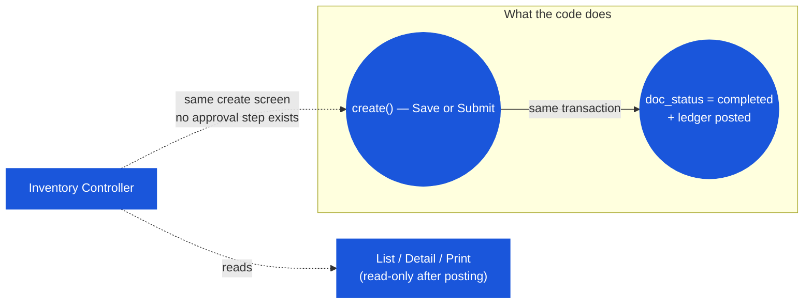

# Inventory Adjustment — User Flow — Inventory Controller

> **At a Glance**
> **Persona:** Inventory Controller (any user with `inventory_management.view` — same permission as Store Keeper) &nbsp;·&nbsp; **Module:** [inventory-adjustment](/en/inventory/inventory-adjustment) &nbsp;·&nbsp; **What this persona can do that a Store Keeper cannot:** nothing distinct — there is no approval action, no pending-approval queue, and no permission key that separates the two roles anywhere in this module's code
> **What this persona actually does:** raises adjustments directly on the same screen, and reads the resulting list/detail/print output as the after-the-fact record.

### Position relative to the "lifecycle"

## 1. Role in This Module

A previous version of this page described the Inventory Controller as an above-threshold approval authority who reviews `in_progress` documents, validates new-lot stock-ins, and commits count-variance rollups. None of that has a matching route, permission key, or backend code path:

- There is no `in_progress` status ever assigned by this module's `create()` — so there is nothing sitting in a queue to approve.
- There is no per-user threshold, no `enum_stage_role` distinguishing this persona from the person who filled out the form, and the nav entry / create screen / list all gate on the same `inventory_management.view` permission used by every other user of the module.
- The real Void endpoint (`voidStockIn`/`voidStockOut`) exists in the backend and would be a natural fit for a "Controller reverses a bad entry" story, but the UI button that would trigger it is unreachable for any persisted document — see [03-user-flow.md](./03-user-flow.md) § 1 and [02-business-rules.md](./02-business-rules.md) § 5 `ADJ_POST_004`.

What this persona realistically does with the module is: (a) use the identical Add Stock-In/Add Stock-Out screen described in [03-user-flow-store-keeper.md](./03-user-flow-store-keeper.md) when they themselves need to raise a correction, and (b) read the list, the detail view, and the print output as the historical record of what was posted — since there is nothing left in a reviewable state to act on.

## 2. Entry Point and Primary Flow

**Entry points:**

- **Inventory Adjustment module → list** — the same list Store Keeper uses; filterable by type (Stock-In/Stock-Out) and status. Since every document lands at `completed` immediately, filtering by status mostly distinguishes `completed` from `voided` (the latter only reachable via direct API call, and — because void also sets `deleted_at` — a voided document disappears from this list once voided anyway).
- **Inventory Adjustment module → detail (click a row)** — opens the read-only view. **Print** is the only action button that reliably renders (`canPrint = isView && !!id`, always true for a persisted document).
- **Direct create** — same screen as Store Keeper, no different entry point or extra fields.

**Primary flow (reviewing a posted document, 4 steps — there is no approval step to perform):**

1. **Open the list.** Filter by type/status/date/search as needed.
2. **Open a row.** The detail view renders the header (reason, location, description, date) and the line items, all read-only.
3. **Print, if needed**, via the always-available Print button (routes to the FastReport viewer through `inventory-adjustments.print-to-report`).
4. **There is no step 4.** No Approve, Reject, or Void button renders for this view given the document's `doc_status` is always `completed` — confirmed by tracing `isView && !isReadOnly` (false) and `canVoid = isEdit && ...` (also false, since `isEdit` is unreachable).

## 3. Decision Branches

There are no decision branches to document for this persona in the current implementation — every document that exists has already been posted, and no in-app action changes that. The only meaningful "decision" available is whether to raise a new, opposite-direction adjustment as a manual correction for a mistaken prior entry, which is identical to the Store Keeper flow.

## 4. Exit Point

Not applicable — there is no handoff into or out of this persona's involvement, since no document is ever left in a state requiring their action.

## 5. References

- Parent overview: [03-user-flow.md](./03-user-flow.md) — the always-completed lifecycle and the dead Edit/Void code path this page is built on.
- Sibling: [03-user-flow-store-keeper.md](./03-user-flow-store-keeper.md) — the create flow, identical for this persona.
- Sibling: [02-business-rules.md](./02-business-rules.md) — `ADJ_POST_004` (the real, currently-unreachable void endpoint).
- Sibling: [01-data-model.md](./01-data-model.md) — `doc_status` reality and the void-also-soft-deletes behavior.
- Related: [inventory](/en/inventory/inventory) — the ledger effect of every posting, viewable via the Transaction Log.
