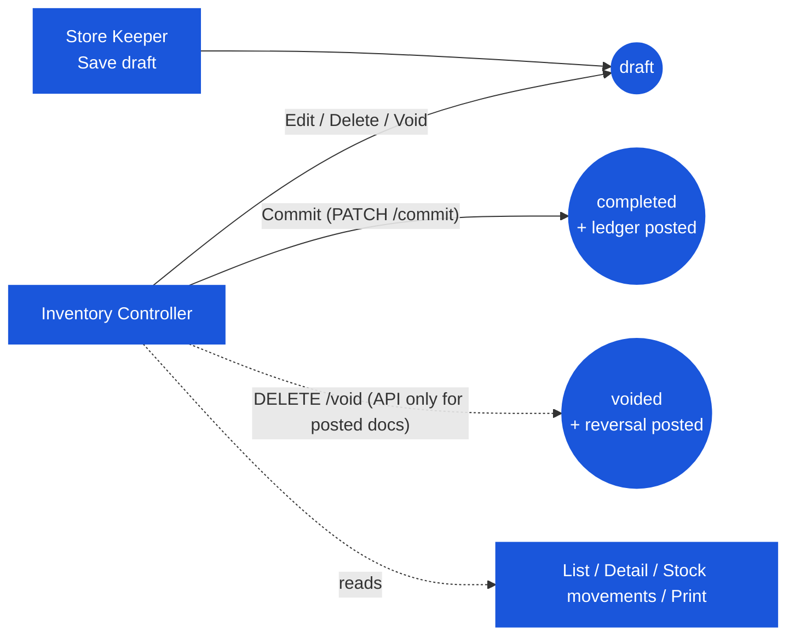

# Inventory Adjustment — User Flow — Inventory Controller

> **At a Glance**
> **Persona:** Inventory Controller (any user with `inventory_management.view` — same permission as Store Keeper) &nbsp;·&nbsp; **Module:** [inventory-adjustment](/en/inventory/inventory-adjustment) &nbsp;·&nbsp; **What this persona can do that a Store Keeper cannot:** nothing enforced — there is no approval action or permission key separating the two; the *practice* is that the Controller commits what others drafted and reverses what went wrong
> **What this persona actually does:** filters the list to `Draft`, opens each draft, edits / deletes / voids or **Commit**s it; reads completed documents (detail, **Stock movements**, Print); voids posted documents through the API when a reversal is needed.

### Position relative to the lifecycle

## 1. Role in This Module

A 2026-05 draft of this page described an above-threshold approval authority reviewing `in_progress` documents; the 2026-07-15 revision then (correctly, for that code) said nothing was ever left in a reviewable state. Since 2026-07-30 there **is** something to review: drafts. What still does not exist:

- No `in_progress` status is ever assigned by this module (`create` → `draft`, `commit` → `completed`, `void` → `voided`); the list's `In Progress` status filter is a shared component option that never matches a stock-in/stock-out.
- No per-user threshold, no `enum_stage_role`, no workflow orchestrator call — the nav entry and every route gate on `inventory_management.view`.
- No Approve / Reject action — **Commit** is the only "approval", and anyone with the module permission can press it.

## 2. Entry Point and Primary Flow

**Entry points:**

- **Inventory Adjustment module → list** — filter by type (`adj_type` URL param: Stock-In / Stock-Out), status (`Draft` / `Completed` / `Voided`; status icons + labels since 2026-08-24), date, search. Voided documents are soft-deleted by the void endpoint and therefore do not appear in the list.
- **Inventory Adjustment module → detail (click a row)** — opens the document in view mode. A `draft` shows **Edit** and **Delete**; a `completed` document shows **Print** and the **Stock movements** panel (`GET /stock-ins/{id}/stock-movements`, `buildStockMovements`) listing the posted lines with lot, quantity, cost and transaction type.

**Primary flow (review and commit a draft, 5 steps):**

1. **Filter the list to `Draft`** (and the direction of interest).
2. **Open the draft.** Check reason, location, date (must be inside the period), lines and — for stock-in — the entered `cost_per_unit`.
3. **Fix or discard if needed.** **Edit** → change header/lines → **Save** (`PATCH /{id}/save`, `doc_version` checked); or **Delete** (view mode, `DELETE /{id}`); or **Edit** → **Void** with a reason (`DELETE /{id}/void` — on a draft this only marks it `voided` + soft-deleted, nothing to reverse).
4. **Commit.** **Commit** → confirm dialog → `PATCH /{id}/commit` with the current `doc_version`. Stock-out: the service first checks on-hand per product (`STOCK_OUT_INSUFFICIENT_STOCK`); both directions re-check the document date against the period. On success the ledger rows exist, `inventory_transaction_id` is stamped on each line and the document is `completed`.
5. **Verify.** Re-open the document → **Stock movements** shows the lot(s) and `adjustment_in` / `adjustment_out` layers; the Transaction Log ([inventory/transaction](/en/inventory/inventory/transaction)) shows the same rows under the SI / SO number.

**Reversal of a posted document (API):** `DELETE /{bu}/stock-ins/{id}/void` (`{ void_reason }`) — `voidStockIn` first checks that on-hand at the location can absorb the reversal of every posted line (`Cannot void: product … has insufficient on-hand qty (…) to reverse …`), then posts an `adjustment_out` per line at the cost the ledger resolves now, and marks the header `voided` + `deleted_at`. `voidStockOut` mirrors it with `adjustment_in` legs. The document then disappears from list/detail queries.

## 3. Decision Branches

- **Draft looks wrong.** Edit and Save, or Delete / Void — no stock has moved, so nothing needs reversing.
- **Commit fails on stock.** The draft survives with the shortfall message; reduce the quantity or receive stock first.
- **Commit fails on date.** `STOCK_IN_DATE_OUTSIDE_OPEN_PERIOD` / `STOCK_OUT_DATE_NOT_CURRENT_PERIOD` — re-date the draft (a stock-out cannot be dated in a previous, still-open period).
- **Posted document is wrong.** Void via the API (UI has no button for a completed document) or raise the opposite adjustment.
- **Period end is coming.** Every `draft` stock-in / stock-out dated in the period blocks **Start Period Close** — commit or delete them first ([inventory/period-end](/en/inventory/inventory/period-end)).

## 4. Exit Point

A committed document is immutable in the UI; a voided document leaves the list. Handoffs: to the Store Keeper (fix the draft), or to the period-end operator once no drafts remain for the period.

## 5. References

- Parent overview: [03-user-flow](/en/inventory/inventory-adjustment/03-user-flow) — lifecycle and endpoint map.
- Sibling: [03-user-flow-store-keeper](/en/inventory/inventory-adjustment/03-user-flow-store-keeper) — the entry flow.
- Sibling: [02-business-rules](/en/inventory/inventory-adjustment/02-business-rules) — `ADJ_POST_002`–`ADJ_POST_005` (save / commit / delete / void), `ADJ_VAL_010`–`ADJ_VAL_014`.
- Sibling: [01-data-model](/en/inventory/inventory-adjustment/01-data-model) — `doc_status` values and the void-also-soft-deletes behaviour.
- Frontend: `ia-component.tsx` (list filters), `ia-form.tsx` / `ia-form-hero.tsx` (Edit / Delete / Void / Commit / Print gating), `use-inventory-adjustment.ts`.
- Backend: `stock-in.service.ts` / `stock-out.service.ts` (`commit`, `voidStockIn` / `voidStockOut`, `findStockShortage`, `getStockMovements`).
- Related: [inventory](/en/inventory/inventory) — the ledger effect of commit and void, viewable via the Transaction Log.
