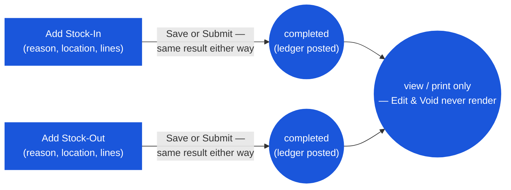

# Inventory Adjustment — User Flow — Store Keeper

> **At a Glance**
> **Persona:** Store Keeper (any user with `inventory_management.view`) &nbsp;·&nbsp; **Module:** [inventory-adjustment](/en/inventory/inventory-adjustment) &nbsp;·&nbsp; **What happens:** fill the form, click Save or Submit — either button creates the document already `completed` and already posted to the ledger &nbsp;·&nbsp; **Key permission:** `inventory_management.view` (generic; no dedicated create/edit permission key is checked anywhere in this module's routes)
> **What this persona does:** Opens Add Stock-In / Add Stock-Out, picks a reason and location, enters product lines, submits.

### Workflow position

## 1. Role in This Module

There is no code-level distinction between a "Store Keeper" and any other user of this screen — the nav entry and the create/edit routes all gate on the single generic permission `inventory_management.view`. This page describes the flow from the perspective of whoever is physically entering the document (found stock, breakage, count discrepancy). Within the module, that user:

- Opens **Add Stock-In** (`/inventory-management/inventory-adjustment/new?type=stock-in`) or **Add Stock-Out** (`...?type=stock-out`).
- Picks a reason from the direction-filtered list (`tb_adjustment_type` rows where `type` matches), a location (filtered to Inventory/Consignment types client-side), and one or more product lines.
- Clicks **Save** or **Submit** — both call the identical `create()` mutation, and the backend writes `doc_status = completed` and posts to the ledger regardless of which one was clicked (see [02 — Business Rules](/en/inventory/inventory-adjustment/02-business-rules) § 1).
- Has no further action available on that document once it exists — the Edit and Void buttons never render for a persisted document (see the module landing page § 1), and the list's Delete action, though it always renders, always fails server-side.

## 2. Entry Point and Primary Flow

**Entry points:**

- **Inventory Adjustment module → Add Stock-In** — for found stock, count overage, or any other positive correction.
- **Inventory Adjustment module → Add Stock-Out** — for breakage, expiry, count shortage, or any other negative correction.

**Primary flow (Stock-In, 6 steps):**

1. **Open Add Stock-In.** The form's date defaults to today, capped at the current period's end (`resolveDefaultDate`).
2. **Pick the reason.** The **Reason** field (`adjustment_type_id`) lists only active `tb_adjustment_type` rows with `type = stock_in`, filtered client-side.
3. **Pick the location.** `LookupUserLocation` filters to Inventory/Consignment location types.
4. **Add lines.** Clicking **Add Item** requires a location to already be selected. Each line: pick a product (scoped to the selected location via `LookupProductInLocation`), enter `qty` (must be `>= 1`), and `cost_per_unit` — pre-filled from the product's current average cost at that location as a starting suggestion, but fully editable; whatever value is submitted becomes the new cost layer's cost.
5. **Enter an optional description** (max 256 characters; not required).
6. **Click Save or Submit.** Either posts immediately: the document is created at `doc_status = completed`, `tb_inventory_transaction` + cost-layer rows are written in the same transaction, and the user is returned to the list.

**Stock-Out differs in two ways:**

- The `cost_per_unit` column is hidden entirely from the line grid — there is nothing to enter for cost.
- The actual cost is resolved automatically by the ledger at write time: FIFO products consume from the oldest cost layer first; Average-costed products are charged at the current BU-wide average. If the requested `qty` exceeds on-hand at the location (Average-costed products only, confirmed), the whole create fails with `"Insufficient stock. Requested: <X>, Available: <Y>"` and no document is created.

## 3. Decision Branches

- **Save vs Submit.** No difference — both produce an immediately posted, `completed` document (see [03-user-flow.md](./03-user-flow.md) § 2.1).
- **Stock-In cost entry.** The suggested cost from `useProductCostByLocationQty` can be overridden freely; there is no approval gate on doing so, regardless of how far the entered cost is from the suggestion.
- **Insufficient stock on Stock-Out.** Rejected only for Average-costed products in this pass's read of the source; FIFO-costed products' behavior when qty exceeds availability was not independently confirmed and should be treated as unverified.
- **Mistake after posting.** There is no in-app correction path — Edit and Void are both unreachable for a persisted document. The only way to reverse a wrong entry currently requires a direct API call to the void endpoint, or (in practice) raising an opposite-direction adjustment as a manual correction.

## 4. Exit Point

The document is `completed` the moment `create()` returns successfully — there is no handoff to a reviewer, because there is no reviewer role in the code. The user's involvement ends at that point; the document is thereafter visible only in the list/detail/print views.

## 5. References

- Parent overview: [03-user-flow.md](./03-user-flow.md) — the always-completed lifecycle and the dead Edit/Void code path.
- Sibling: [03-user-flow-inventory-controller.md](./03-user-flow-inventory-controller.md) — same screen, described from the review-after-the-fact angle.
- Sibling: [02-business-rules.md](./02-business-rules.md) — `ADJ_VAL_001`–`ADJ_VAL_013`, `ADJ_CALC_001`–`ADJ_CALC_007`, `ADJ_POST_001`.
- Sibling: [01-data-model.md](./01-data-model.md) — `tb_stock_in`/`tb_stock_out` field shapes referenced in steps 2–5 above.
- Related: [inventory](/en/inventory/inventory) — the ledger every posting writes to.
- Related: [costing](/en/inventory/costing) — FIFO/Average cost resolution on Stock-Out; weighted-average recompute on Stock-In.
