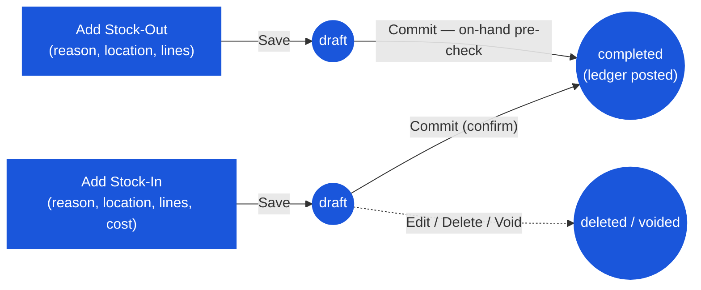

# Inventory Adjustment — User Flow — Store Keeper

> **At a Glance**
> **Persona:** Store Keeper (any user with `inventory_management.view`) &nbsp;·&nbsp; **Module:** [inventory-adjustment](/en/inventory/inventory-adjustment) &nbsp;·&nbsp; **What happens:** fill the form, **Save** a `draft` (nothing moves), **Commit** to post — `PATCH /{id}/commit` writes the ledger and locks the document &nbsp;·&nbsp; **Key permission:** `inventory_management.view` (generic; no dedicated create/commit permission is checked in this module's routes)
> **What this persona does:** Opens Add Stock-In / Add Stock-Out, picks a reason and location, enters product lines, saves, commits.

### Workflow position

## 1. Role in This Module

There is no code-level distinction between a "Store Keeper" and any other user of this screen — the nav entry and the routes gate on the single generic permission `inventory_management.view`. This page describes the flow from the perspective of whoever is physically entering the document (found stock, breakage, count discrepancy). Within the module, that user:

- Opens **Add Stock-In** (`/inventory-management/inventory-adjustment/new?type=stock-in`) or **Add Stock-Out** (`…?type=stock-out`).
- Picks a reason from the direction-filtered list (`tb_adjustment_type` rows where `type` matches), a location (filtered to Inventory/Consignment types client-side), and one or more product lines.
- Clicks **Save** to keep a `draft` (`POST /stock-ins` | `/stock-outs`; the app stays on the new document in view mode), or **Commit** to post it. Commit from a never-saved form first creates the draft, then calls `PATCH /{id}/commit` (`confirmCommit`, `ia-form.tsx`).
- Can re-open a draft (**Edit**), change header and lines (`PATCH /{id}/save`), **Delete** it from view mode, or **Void** it from Edit mode.

## 2. Entry Point and Primary Flow

**Entry points:**

- **Inventory Adjustment module → Add Stock-In** — for found stock, count overage, or any other positive correction.
- **Inventory Adjustment module → Add Stock-Out** — for breakage, expiry, count shortage, or any other negative correction.

**Primary flow (Stock-In, 7 steps):**

1. **Open Add Stock-In.** The form's date defaults to today, capped at the current period's end (`resolveDefaultDate`); it must fall inside the current period window (Zod) and, server-side, inside an open/locked inventory period.
2. **Pick the reason.** The **Reason** field (`adjustment_type_id`) lists only active `tb_adjustment_type` rows with `type = stock_in`, filtered client-side.
3. **Pick the location.** `LookupUserLocation` filters to Inventory/Consignment location types.
4. **Add lines.** Clicking **Add Item** opens the product picker immediately (`1f0f1f1a`) and warns if no location is selected yet. Each line: product (scoped to the selected location), `qty` (`≥ 0` in Zod, `min(0)`), `cost_per_unit` — pre-filled from the product's current cost at that location (`useProductCostByLocationQty`, `e246abaa`) but editable. (The API also accepts `expired_at` per line; the form has no field for it.)
5. **Enter an optional description** (max 256 characters; not required).
6. **Save.** `POST /stock-ins` creates the header at `draft` with `si_no` numbered from `si_date`; the screen switches to view mode on the new document. Nothing has moved yet.
7. **Commit.** The form is validated first, then a confirm dialog ("commit = post to stock, no further edits") opens; on confirm `PATCH /stock-ins/{id}/commit` with the current `doc_version` posts every line (`executeAdjustmentIn` — new cost layer at the entered cost, `at_period` from `si_date`), stamps `inventory_transaction_id`, sets `completed`, and returns to the list.

**Stock-Out differs in three ways:**

- The `cost_per_unit` column is hidden — the cost is resolved by the ledger at commit (FIFO oldest layer first; Average at the current BU average) and never persisted on `tb_stock_out_detail`.
- The date must be inside the **current** period (`STOCK_OUT_DATE_NOT_CURRENT_PERIOD`), not just any open one.
- Commit pre-checks on-hand per product: a shortfall returns `Insufficient stock for {product} at {location}: on hand {x}, requested {y}` (400) and nothing is written.

## 3. Decision Branches

- **Save vs Commit.** Save = editable draft, no stock effect. Commit = irreversible posting (only Void via the API reverses it afterwards).
- **Stock-In cost entry.** The suggested cost can be overridden freely; there is no approval gate on doing so.
- **Insufficient stock on Stock-Out.** Rejected at commit for both costing methods (service pre-check `findStockShortage`); the draft survives so the quantity can be corrected.
- **Date outside the period.** Rejected at save (422) and again at commit; re-date the draft.
- **Mistake before commit.** Edit the draft, Delete it (view mode), or Void it (Edit mode → Void with a reason).
- **Mistake after commit.** The UI offers no Void on a completed document (`canVoid` requires Edit mode, which completed documents cannot enter). Either call `DELETE /{id}/void` directly or raise an opposite-direction adjustment.

## 4. Exit Point

A committed document is `completed` the moment `commit()` returns; the user's involvement ends there. Drafts stay in the list (status filter `Draft`) until committed, deleted, or voided.

## 5. References

- Parent overview: [03-user-flow](/en/inventory/inventory-adjustment/03-user-flow) — the draft → commit → void lifecycle and endpoint map.
- Sibling: [03-user-flow-inventory-controller](/en/inventory/inventory-adjustment/03-user-flow-inventory-controller) — same screen, described from the review-and-commit angle.
- Sibling: [02-business-rules](/en/inventory/inventory-adjustment/02-business-rules) — `ADJ_VAL_001`–`ADJ_VAL_014`, `ADJ_CALC_001`–`ADJ_CALC_007`, `ADJ_POST_001`–`ADJ_POST_006`.
- Sibling: [01-data-model](/en/inventory/inventory-adjustment/01-data-model) — `tb_stock_in`/`tb_stock_out` field shapes referenced above.
- Frontend: `ia-form.tsx` (`confirmCommit`, `isReadOnly`), `ia-form-hero.tsx`, `use-ia-item-table.tsx` (cost prefill), `ia-form-schema.ts`, `use-inventory-adjustment.ts`.
- Related: [inventory](/en/inventory/inventory) — the ledger every commit writes to; [costing](/en/inventory/costing) — FIFO/Average cost resolution.
