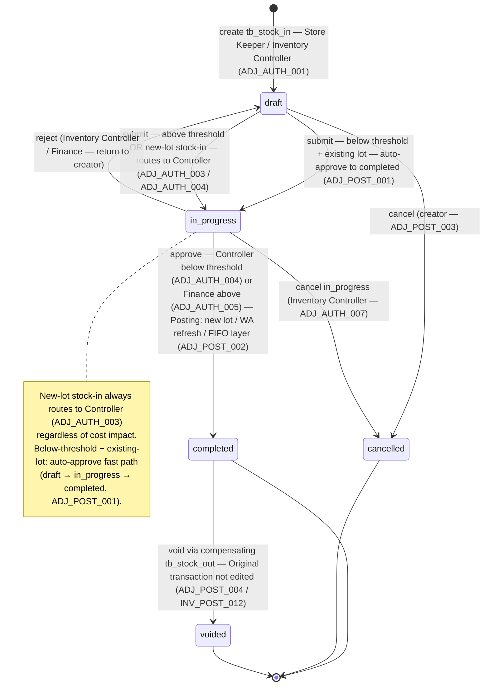
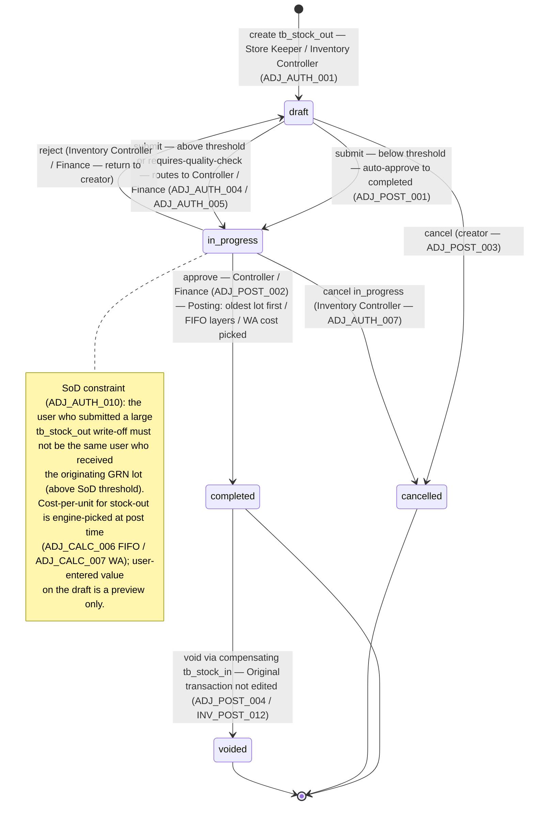

# Inventory Adjustment — User Flow

> **At a Glance**
> **Module:** [inventory-adjustment](/en/inventory/inventory-adjustment) &nbsp;·&nbsp; **Personas:** Store Keeper &nbsp;·&nbsp; Inventory Controller &nbsp;·&nbsp; Finance &nbsp;·&nbsp; Audit / Config (Auditor + Sysadmin)
> **Workflow lifecycle:** `draft → in_progress → completed → (voided via compensating)` per `enum_doc_status`; pre-post cancel via `draft / in_progress → cancelled`. Two parallel trees — `tb_stock_in` (IN) and `tb_stock_out` (OUT). Below-threshold + existing-lot auto-approves; above-threshold or new-lot routes to Controller / Finance.
> **Drill into per-persona views below for action-level detail**

## 1. Overview

This page is the **overview entry point** for the user-flow set of the `inventory-adjustment` module. The adjustment module is a **classic document-driven module** unlike its sibling [inventory](/en/inventory/inventory) — the work moves along a tangible header that personas see, edit, and act on: a `tb_stock_in` (inbound write-on) or `tb_stock_out` (outbound write-off) document carrying a `doc_status` lifecycle (`draft → in_progress → completed → cancelled / voided`), workflow state, comments / attachments, and per-product detail lines. What makes adjustments different from a PR or PO is the strict link to the inventory ledger: every `completed` document writes one `tb_inventory_transaction` per detail line with `enum_inventory_doc_type = stock_in` / `stock_out`, and that ledger write is **the** financial / audit anchor. Once posted, the document is immutable; corrections require a void + new compensating adjustment per [inventory-adjustment/02-business-rules](/en/inventory/inventory-adjustment/02-business-rules) `ADJ_POST_004` and [inventory](/en/inventory/inventory) `INV_POST_012`.

Section 2 below describes the **document lifecycle state machine** — the canonical set of legal `doc_status` transitions, independent of who acts. Each per-persona file (linked from Section 3) describes that persona's *path through* this state space — their entry point, the actions they can take, the decision branches they face, and the handoff that ends their involvement. Section 4 then summarises the cross-persona handoffs that stitch the individual paths together (Store Keeper → Inventory Controller for above-threshold approval; Inventory Controller → Finance for large-cost approval; Finance → ledger close; System Administrator → all personas for reason-code / threshold configuration). Read this overview first to anchor the lifecycle, then drill into the persona file that matches your role.

## 2. Document Lifecycle

The document follows the five-state Prisma lifecycle on `enum_doc_status`. The carmen/docs framing of "Draft → Posted → Void" collapses the explicit workflow stage (`in_progress`) and the pre-post cancel state (`cancelled`); the table below uses the five-state Prisma reality per [inventory-adjustment/01-data-model](/en/inventory/inventory-adjustment/01-data-model) § 5 item 4.

The adjustment module uses **two parallel document trees** — `tb_stock_in` (direction IN / stock-in adjustment) and `tb_stock_out` (direction OUT / stock-out adjustment) — both governed by the same five-state `enum_doc_status`. The diagrams below show the legal `doc_status` transitions for each document tree. The `enum_adjustment_type` classifier (`STOCK_IN` / `STOCK_OUT`) on the reason-code master (`tb_adjustment_type`) gates which tree a given reason can be used on.

**Stock-in adjustment (`tb_stock_in`) — direction IN (green badge):**

**Stock-out adjustment (`tb_stock_out`) — direction OUT (red badge):**

> ℹ️ **Note — single `enum_doc_status`, two document trees:** Both `tb_stock_in` and `tb_stock_out` share the same `enum_doc_status` (`draft`, `in_progress`, `completed`, `cancelled`, `voided`). The two diagrams above show the same transition rules applied to each tree; the key behavioural difference is in the posting fan-out: stock-in creates a new lot and adds a cost layer (or refreshes WA), while stock-out consumes existing lots oldest-first and picks cost at post time. Count-rollup documents (`ADJ_POST_006`) auto-advance to `completed` under Inventory Controller commit authority, bypassing the explicit `in_progress` approval queue.

### 2.1 Document-level transitions

| From state | Action | To state | Allowed for | Pre-conditions |
| ---------- | ------ | -------- | ----------- | -------------- |
| `(none)` | create new `tb_stock_in` / `tb_stock_out` | `draft` | Store Keeper, Inventory Controller, Finance (for ad-hoc); System for count-rollup | User within `tb_user_location` scope per `ADJ_AUTH_001`; location is inventory- or consignment-type per `ADJ_VAL_003`. Auto-numbering generates `si_no` / `so_no` per `ADJ_VAL_001`. |
| `draft` | edit lines / attachments / description / reason | `draft` | Creator + Inventory Controller (within scope) | Validation `ADJ_VAL_002`–`ADJ_VAL_010` runs at save (soft-fail for some). No inventory effect yet. |
| `draft` | submit | `in_progress` (above threshold or new-lot) | Creator | All `ADJ_VAL_001`–`ADJ_VAL_011` pass; `INV_VAL_005` (no negative balance) pre-check passes for stock-out. Document routes to Controller queue. `workflow_history` appended; `last_action = submitted`. |
| `draft` | submit auto-approve | `completed` (cascade through `in_progress`) | Store Keeper | All validations pass; aggregate document cost below auto-approve threshold per `ADJ_AUTH_002`; not a new-lot stock-in per `ADJ_AUTH_003`. The system auto-fires `ADJ_POST_002` posting per `ADJ_POST_001`. |
| `draft` | cancel | `cancelled` | Creator | No inventory effect; reason text required. Document remains in DB for audit. Terminal. |
| `in_progress` | approve | `completed` | Inventory Controller (below `ADJ_AUTH_005` threshold) or Finance (above) | All validations re-checked; period containment re-checked at post per `ADJ_VAL_011`. `ADJ_POST_002` fires — writes the inventory transaction, cost-layer rows, GL entries. Document becomes immutable. |
| `in_progress` | reject | `draft` | Inventory Controller, Finance | Reviewer comment / reason recorded in `workflow_history`; document returns to creator for edit or cancellation. No inventory effect. |
| `in_progress` | cancel | `cancelled` | Reviewer (Controller / Finance) | Reviewer concludes the adjustment is not warranted (e.g. recount resolved the discrepancy). No inventory effect; terminal. |
| `completed` | view / report | `completed` | All personas (per scope) | Terminal active state. Activity log, journal entries, inventory transaction join all readable. Document is immutable per `ADJ_VAL_013`. |
| `completed` | void via compensating adjustment | `voided` | Inventory Controller, Finance | A compensating `tb_stock_in` / `tb_stock_out` is raised with reversed direction and `info.voidsAdjustmentId = <original>`; the compensating document submits and posts per `ADJ_POST_002` (writes the reversal inventory transaction). Only after that post does the original document's `doc_status` move to `voided` per `ADJ_POST_004`. The original inventory transaction is **not** edited per [inventory](/en/inventory/inventory) `INV_POST_012`. |
| `completed` / `voided` / `cancelled` | soft-delete | (same state) with `deleted_at` set | Inventory Controller, Finance | For `completed`: compensating reversal must exist per `ADJ_VAL_014`. For `cancelled` / `voided`: direct soft-delete allowed. Hides from default queries; preserves for audit. |

### 2.2 Auto-approve fast path

For below-threshold documents (cost impact under tenant auto-approve threshold, default `฿500`), the lifecycle compresses to `draft → completed` in a single submit action — the system cascades through `in_progress` invisibly. The audit trail still records both transitions in `workflow_history` with `auto_approve = true` annotation. This fast-path applies to:

- **Store Keeper** routine stock-in for existing lots (below threshold).
- **Store Keeper** routine stock-out for breakage / shortage (below threshold).
- **System** count-rollup auto-post (any threshold, by virtue of Controller's count-commit signature serving as the approval).

It does **not** apply to:

- **New-lot stock-in** by Store Keeper — always routes for Controller approval regardless of cost per `ADJ_AUTH_003`.
- Above-threshold documents — route to Controller or Finance queue per `ADJ_AUTH_004` / `ADJ_AUTH_005`.
- Reason codes flagged `info.requiresQualityCheck = true` — bypass auto-approve to force Controller review.

### 2.3 Posting fan-out

The `in_progress → completed` transition (whether auto or via approval) is the **posting event**. Per `ADJ_POST_002`:

- One `tb_inventory_transaction` per detail line.
- One `tb_inventory_transaction_detail` per line, with `qty` signed by direction.
- One or more `tb_inventory_transaction_cost_layer` rows: single inbound row for stock-in; FIFO multi-row or WA single row for stock-out.
- GL journal entry — `Dr/Cr` resolved from the adjustment-type's `info.glAccount` and the document's `dimension.department`.

The detail row's `inventory_transaction_id` is stamped after the inventory transaction is committed. Failure at any step rolls the whole transaction back; the document stays `in_progress` and the reviewer sees the error.

## 3. Persona Index

Each persona below has a dedicated drill-down file describing their entry point, primary flow, decision branches, and exit point. The 4 persona groups collapse 6 carmen/docs personas: `Store Keeper` (= Warehouse Staff), `Inventory Controller` (= Inventory Manager, plus Department Manager review responsibility), `Finance`, `Audit / Config` (= Auditor + System Administrator).

- [Store Keeper](./03-user-flow-store-keeper.md) — identifies discrepancies on the floor (during bin checks, count execution, vendor handover, breakage discovery), initiates `tb_stock_in` / `tb_stock_out` at `draft`, attaches supporting evidence (photos, damage reports, expiry labels, count sheets), picks the reason code, enters product / qty / lot data, submits. Their inventory-adjustment ownership ends when (a) the document auto-approves and posts (below threshold), or (b) the document routes to Inventory Controller for above-threshold or new-lot approval.
- [Inventory Controller](./03-user-flow-inventory-controller.md) — owns **adjustment governance** above the auto-approve threshold. Reviews submitted adjustments for accuracy and reasonableness; investigates oversize variances and unusual reason-code patterns by location / department / time; approves / rejects per `ADJ_AUTH_004`; posts (`in_progress → completed`) so the inventory transaction and GL entry fire. Also commits count-variance rollups arising from [physical-count](/en/inventory/physical-count) / [spot-check](/en/inventory/spot-check). The Department Manager review responsibility (read-only cost-centre oversight, escalation flagging) is folded into this persona group.
- [Finance](./03-user-flow-finance.md) — owns **cost-impact and GL mapping verification**. Approves above-Controller-threshold adjustments per `ADJ_AUTH_005`; verifies the GL account mapping per reason code matches the chart of accounts; reconciles inventory sub-ledger against GL at period close; signs off on the adjustment activity report at period end. Cannot edit adjustments directly — corrections flow through the void + compensating adjustment pattern.
- [Audit / Config](./03-user-flow-audit-config.md) — System Administrator (configures `tb_adjustment_type` reason codes including `info.glAccount` mapping, `requiresDocument` / `requiresQualityCheck` flags, tenant thresholds for auto-approve / Controller / Finance, RBAC, integration endpoints) and Auditor (read-only inspection of the adjustment trail end-to-end — reason codes, attachments, approval signatures, journal entries, void chains, SoD compliance per `ADJ_AUTH_010`).

## 4. Cross-Persona Handoffs

The table below captures the moments where adjustment work moves from one persona's responsibility to another's. Each handoff is anchored to the system state at the point of transfer.

| From persona | Trigger | To persona | System state at handoff |
| ------------ | ------- | ---------- | ----------------------- |
| Store Keeper | Document submitted at or above auto-approve threshold | Inventory Controller | `tb_stock_in.doc_status = in_progress` (or `tb_stock_out.doc_status = in_progress`); no inventory transaction written yet. Document in Controller's approval queue. |
| Store Keeper | New-lot stock-in submitted (regardless of cost) | Inventory Controller | `tb_stock_in.doc_status = in_progress`; document flagged with `info.requires_new_lot_review = true`. |
| Store Keeper | Count execution complete, variance lines staged | Inventory Controller | `tb_count_stock.status = completed` (in [physical-count](/en/inventory/physical-count) / [spot-check](/en/inventory/spot-check)); staged variance lines exist but not yet posted. Controller commit triggers `ADJ_POST_006` auto-rollup. |
| Inventory Controller | Document approved below Finance threshold | (Posting — no further persona handoff) | `tb_stock_in.doc_status = completed`; inventory transaction posted; activity log records `{ actor: controller, action: 'approve_post' }`. |
| Inventory Controller | Document cost impact exceeds Controller threshold | Finance | Document remains `in_progress`; routes to Finance queue per `ADJ_AUTH_005`. Cost-impact preview, reason-code, GL-account mapping all visible to Finance. |
| Inventory Controller | Document rejected (recount resolves, reason incorrect, etc.) | Store Keeper | `doc_status = draft`; reviewer comment in `workflow_history`. Store Keeper edits / re-submits or cancels. |
| Inventory Controller | Count-variance commit | (Auto-post — no further handoff for the adjustment) | Auto-rollup `tb_stock_in` (overage) / `tb_stock_out` (shortage) auto-advances to `completed`; `tb_count_stock.status = completed_posted`. |
| Finance | Above-Controller-threshold document approved | (Posting — no further handoff) | `doc_status = completed`; inventory transaction posted; GL journal entry generated and queued for the Finance subsystem. |
| Finance | Period-end adjustment-activity review complete | Finance Manager (period close in [inventory](/en/inventory/inventory)) | All in-period `completed` adjustments reconciled to inventory sub-ledger; variance under tolerance; period ready to close. Cross-references [inventory/03-user-flow](/en/inventory/inventory/03-user-flow) period-level transitions. |
| Inventory Controller / Finance | Compensating reversal needed (post-fact correction) | Original creator (or Controller / Finance themselves) | Original `tb_stock_in` / `tb_stock_out` at `completed`. A new compensating document of opposite direction is raised; submits + posts; original then moves to `voided`. |
| System Administrator | Reason-code configuration change (new reason added, `info.glAccount` updated, threshold changed) | All personas | No transaction state change; new rules apply prospectively to new draft documents. Existing `draft` / `in_progress` documents may need re-evaluation per the snapshot rule. |
| Auditor | Adjustment audit trail review (reason codes, attachments, approval signatures, journal entries, void chains) | (Read-only — no further handoff) | All `completed` / `voided` documents readable; SoD violations flagged; reconciliation queries run. |

## 5. References

- `../carmen/docs/inventory-adjustment/INV-ADJ-User-Flow-Diagram.md` — carmen/docs user-flow diagram for the adjustment module (note: realigns the three-state `Draft → Posted → Void` to the Prisma five-state lifecycle per [inventory-adjustment/01-data-model](/en/inventory/inventory-adjustment/01-data-model) § 5 item 4).
- `../carmen/docs/inventory-adjustment/INV-ADJ-Page-Flow.md` — page-flow doc (empty / placeholder in current carmen/docs).
- `../carmen/docs/inventory-adjustment/INV-ADJ-Overview.md` — module overview, the source of the 6-persona role list this page collapses to 4 groups.
- Sibling: [01-data-model.md](./01-data-model.md) — canonical `tb_stock_in` / `tb_stock_out` shape, `enum_doc_status` values, the divergences against carmen/docs that shape the lifecycle framing in Section 2.
- Sibling: [02-business-rules.md](./02-business-rules.md) — validation, calculation, authorization, posting, and cross-module rules referenced by each transition row in Section 2 (notably `ADJ_VAL_001`–`ADJ_VAL_014`, `ADJ_AUTH_001`–`ADJ_AUTH_010`, `ADJ_POST_001`–`ADJ_POST_010`, `ADJ_XMOD_001`–`ADJ_XMOD_009`).
- Sibling: [inventory/03-user-flow](/en/inventory/inventory/03-user-flow) — the canonical movement-and-period lifecycle that adjustment posts feed into; period-level transitions (`open → closed → locked`) anchor the period-end side of the adjustment review process.
- Related modules: [inventory](/en/inventory/inventory) (every adjustment posts to inventory), [costing](/en/inventory/costing) (FIFO / WA cost picks on outbound, layer refresh on inbound), [physical-count](/en/inventory/physical-count) / [spot-check](/en/inventory/spot-check) (variance rollup that auto-creates adjustment documents per `ADJ_XMOD_002` / `ADJ_XMOD_003`), [good-receive-note](/en/inventory/good-receive-note) (vendor-replacement parallel; large damage-recall write-offs cross-link the GRN lot data), [product](/en/inventory/product) (carries the `costing_method` that gates outbound cost-pick).
