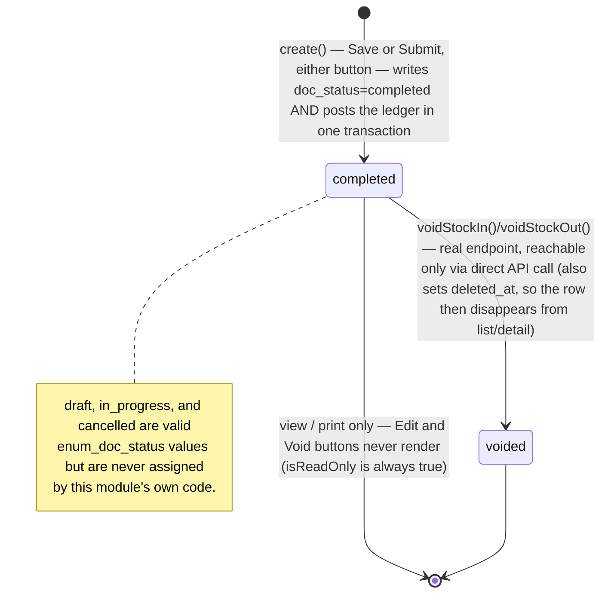

# Inventory Adjustment — User Flow

> **At a Glance**
> **Module:** [inventory-adjustment](/en/inventory/inventory-adjustment) &nbsp;·&nbsp; **Personas:** two undifferentiated screens (Store Keeper, Inventory Controller); Finance and Audit/Config have no matching route or permission — see their pages for the correction notice
> **Lifecycle:** creation *is* posting — `doc_status = completed` is written unconditionally by `create()`, in the same transaction as the ledger write. No draft, no approval queue, no in-app Void (see [02 — Business Rules](/en/inventory/inventory-adjustment/02-business-rules) § 5)
> **Drill into per-persona views below for action-level detail**

## 1. Overview

Inventory Adjustment is a **document-driven module in name only** — the create screen looks like a normal draft-then-submit form (it has both a **Save** and a **Submit** button), but both buttons call the same `create()` mutation, and the backend ignores whichever `doc_status` the client sends and always writes `completed`. The ledger write (`executeAdjustmentIn`/`executeAdjustmentOut`) happens inside the very same database transaction as the header/detail insert. So the entire "lifecycle" a tester needs to reason about is: **fill the form, click either button, and the stock is already moved.**

The knock-on effect touches the whole screen. The detail view's `isReadOnly` flag is `doc_status === 'voided' || doc_status === 'completed'`, which is true for every document the instant it exists. The **Edit** button only shows when `!isReadOnly`, so it never shows for a real document; the **Void** button only shows in Edit mode, so it never shows either. The list view's row-menu **Delete** action *does* render for every row, but clicking it and confirming always fails server-side with a "cannot delete a completed document" error, since server-side delete also requires `doc_status === draft`. Functionally, once a Stock-In or Stock-Out document exists, the only things you can do with it through the UI are **view it and print it**.

## 2. Document "Lifecycle"

```mermaid
stateDiagram-v2
    [*] --> completed : create() — Save or Submit, either button — writes doc_status=completed AND posts the ledger in one transaction
    completed --> [*] : view / print only — Edit and Void buttons never render (isReadOnly is always true)
    completed --> voided : voidStockIn()/voidStockOut() — real endpoint, reachable only via direct API call (also sets deleted_at, so the row then disappears from list/detail)
    voided --> [*]

    note right of completed
        draft, in_progress, and cancelled are valid
        enum_doc_status values but are never assigned
        by this module's own code.
    end note
```

### 2.1 What actually happens on Save vs Submit

| UI action | Client-set `doc_status` before submit | What the backend does |
| --------- | -------------------------------------- | ---------------------- |
| Click **Save** | `"draft"` | Ignored — `create()` writes `enum_doc_status.completed` regardless. Ledger posts immediately. |
| Click **Submit** | `"completed"` | Same result. |

There is no functional difference between the two buttons at creation time. (`update()` does honour a client-sent `doc_status`, but `update()` is only reachable when the stored status is already `draft` — which, per the above, never happens for a document created through this module.)

### 2.2 Posting fan-out (fires at creation, per line)

1. One `tb_inventory_transaction` row (`inventory_doc_type = stock_in` / `stock_out`).
2. One `tb_inventory_transaction_detail` row (Stock-In: `qty` positive at the user-entered `cost_per_unit`; Stock-Out: `qty` negative at a cost the ledger resolves itself — FIFO oldest-layer-first or the current BU average).
3. One or more `tb_inventory_transaction_cost_layer` rows (Stock-In: a single new inbound layer, split for rounding per `splitFifoCost`; Stock-Out FIFO: one row per consumed lot; Stock-Out Average: one row at the current average).
4. The detail line's `inventory_transaction_id` stamped.

No GL/journal entry is produced anywhere in this fan-out.

## 3. Persona Index

The code does not implement distinct roles for this module — there is one create/edit screen and one list, gated by the single generic `inventory_management.view` permission, with no workflow stage or `enum_stage_role` assignment anywhere in `stock-in.service.ts` / `stock-out.service.ts`. The two persona pages below describe the same screen from two angles (who typically fills the form vs who typically reviews the resulting ledger), not two different permission levels:

- [Store Keeper](./03-user-flow-store-keeper.md) — the day-to-day user who opens Add Stock-In / Add Stock-Out, picks a reason and location, enters lines, and clicks Save or Submit — either way, the document exists and is already posted.
- [Inventory Controller](./03-user-flow-inventory-controller.md) — uses the identical screen to raise adjustments directly, and otherwise reads the list/detail/print output — there is no approval action for this persona to perform, since nothing is ever left in a reviewable pending state.
- [Finance](./03-user-flow-finance.md) — no matching route, permission, or backend endpoint found. Correction notice only.
- [Audit / Config](./03-user-flow-audit-config.md) — no matching route, permission, or backend endpoint found. Correction notice only.

## 4. Cross-Module Notes

- [physical-count](/en/inventory/physical-count) — `PhysicalCountService.submit()` creates `tb_stock_in`/`tb_stock_out` rows directly at `completed`, with no reason code, as the audit record of a count's variance lines. Whether that path also drives the ledger the same way this module's own `create()` does was not confirmed in this pass — treat as pending re-verification during that module's own resync.
- [inventory](/en/inventory/inventory) — every stock-in/stock-out posting calls the same `InventoryTransactionService` that GRN, SR, and period-end also call.
- [costing](/en/inventory/costing) — FIFO layer creation (Stock-In) / FIFO consumption or weighted-average recompute (Stock-Out) is the shared costing engine, not specific to this module.

## 5. References

- Sibling: [01-data-model.md](./01-data-model.md) — schema and the "always completed" finding in full, plus the void-also-soft-deletes behavior.
- Sibling: [02-business-rules.md](./02-business-rules.md) — the module's real validation, calculation, and posting rules.
- Frontend: `ia-form.tsx` (mode state, `submitWith("draft"|"completed")`), `ia-form-hero.tsx` (the Edit/Void/Delete gating logic), `ia-component.tsx` (list-view Delete action).
- Backend: `stock-in.service.ts` / `stock-out.service.ts` `create()`/`update()`/`delete()`/`voidStockIn()`/`voidStockOut()`.
