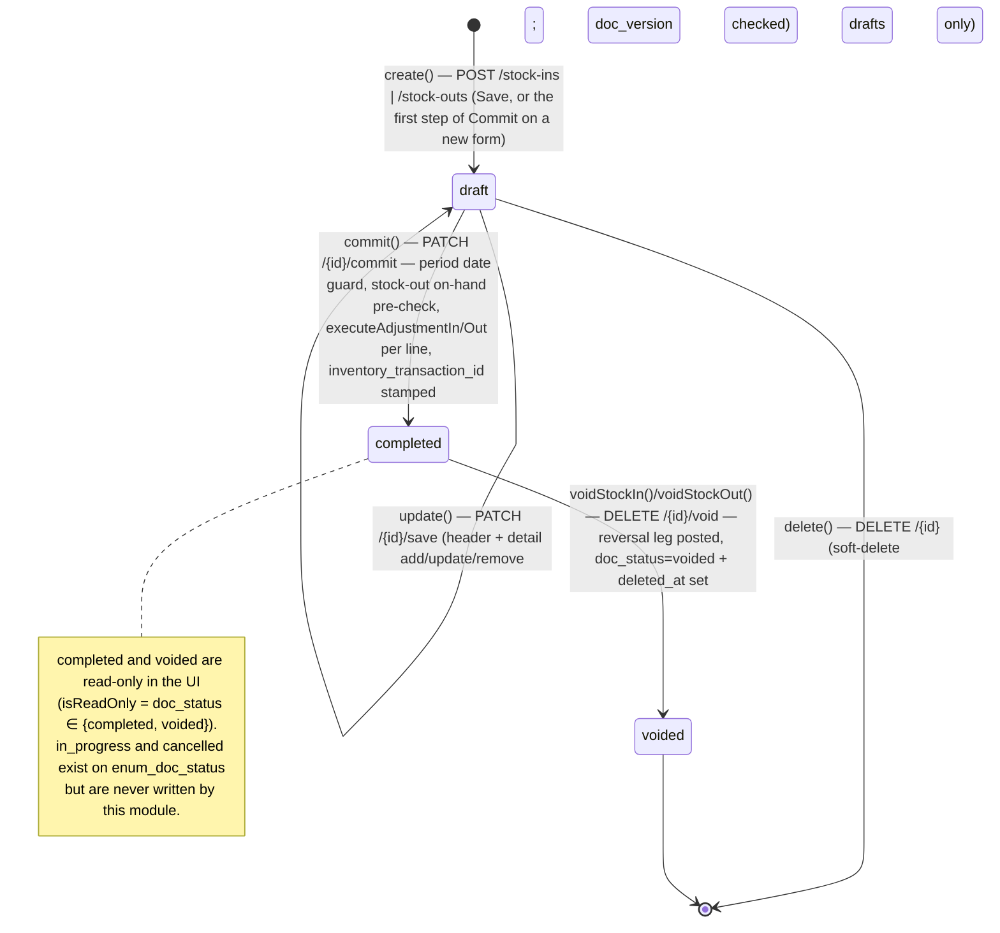

# Inventory Adjustment — User Flow

> **At a Glance**
> **Module:** [inventory-adjustment](/en/inventory/inventory-adjustment) &nbsp;·&nbsp; **Personas:** two undifferentiated views of one screen (Store Keeper, Inventory Controller); Finance and Audit/Config have no matching route or permission — see their pages for the correction notice
> **Lifecycle (since 2026-07-30, backend `281a16399`):** `create` → **`draft`** (nothing posted) → **Commit** (`PATCH /{id}/commit`) → `completed` (ledger posted, immutable) → **Void** (`DELETE /{id}/void`) → `voided` (reversal posted, row soft-deleted). `in_progress` / `cancelled` are never assigned.
> **Drill into per-persona views below for action-level detail**

## 1. Overview

The 2026-07-15 revision of this module described a screen where *creation was posting* — both Save and Submit produced an immediately `completed`, immutable document, and Edit / Void were dead buttons. That was accurate for the code of the time and is **no longer true**: on 2026-07-30 the backend changed `StockInService.create` / `StockOutService.create` to write `doc_status = draft` and moved the ledger write into a dedicated `commit` method (`PATCH /stock-ins/{id}/commit`, `PATCH /stock-outs/{id}/commit`), and the frontend form was redesigned the same day (`198d83c1`) with **Save**, **Commit**, **Void** and **Delete** actions. A tester now has a real three-state lifecycle to reason about: a draft you can edit or delete, a commit that moves stock, and a void that reverses it.

## 2. Document Lifecycle

```mermaid
stateDiagram-v2
    [*] --> draft : create() — POST /stock-ins | /stock-outs (Save, or the first step of Commit on a new form)
    draft --> draft : update() — PATCH /{id}/save (header + detail add/update/remove; doc_version checked)
    draft --> [*] : delete() — DELETE /{id} (soft-delete; drafts only)
    draft --> completed : commit() — PATCH /{id}/commit — period date guard, stock-out on-hand pre-check, executeAdjustmentIn/Out per line, inventory_transaction_id stamped
    completed --> voided : voidStockIn()/voidStockOut() — DELETE /{id}/void — reversal leg posted, doc_status=voided + deleted_at set
    voided --> [*]

    note right of completed
        completed and voided are read-only in the UI
        (isReadOnly = doc_status ∈ {completed, voided}).
        in_progress and cancelled exist on enum_doc_status
        but are never written by this module.
    end note
```

### 2.1 What each button does

| UI action | Endpoint | Precondition | Effect |
| --------- | -------- | ------------ | ------ |
| **Save** (new form) | `POST /{bu}/stock-ins` \| `/stock-outs` | Zod form valid; `si_date`/`so_date` inside an open period (SI) / the current period (SO) — checked server-side too | Header + lines created at `draft`; `si_no`/`so_no` allocated from the document date; the app stays on the document (`/{id}?type=stock-in|stock-out`) in view mode |
| **Save** (existing draft) | `PATCH /{id}/save` | `doc_status = draft`; `doc_version` matches | Header fields and line add/update/remove applied; `doc_version` incremented. Sending any `doc_status` other than `draft` is rejected (`STOCK_IN_STATUS_CHANGE_NOT_ALLOWED`: "doc_status cannot be changed on save — use the commit or void endpoint") |
| **Commit** | (`POST` first if never saved) then `PATCH /{id}/commit` with `{ doc_version }` | Form valid (validated before the confirm dialog opens); `doc_status = draft` (`STOCK_IN_ONLY_DRAFT_COMMITTABLE`); location + ≥ 1 line; date inside the period; stock-out: on-hand ≥ requested per product | Per line `executeAdjustmentIn` / `executeAdjustmentOut` writes the ledger rows and stamps `inventory_transaction_id`; header → `completed`, `doc_version + 1`; navigates back to the list |
| **Delete** | `DELETE /{id}` | `doc_status = draft` (view mode is enough — no Edit needed, `ed37e6b0`) | Soft-delete; completed documents answer `STOCK_IN_COMPLETED_NO_DELETE` ("Cannot delete a completed Stock In — inventory has already been adjusted") |
| **Void** | `DELETE /{id}/void` with a reason | Document opened in **Edit** mode (`canVoid = isEdit && !isReadOnly`) — so effectively a `draft`; a posted document can be voided through the API | Posted lines are reversed with the opposite adjustment leg at current cost (stock-in void first checks on-hand can absorb the reversal); header → `voided`, `deleted_at` set, `info.void_reason` stored. The row then disappears from list/detail queries (`deleted_at: null` filter) |

### 2.2 Posting fan-out (fires at commit, per line)

1. One `tb_inventory_transaction` row (`inventory_doc_type = stock_in` / `stock_out`, `inventory_doc_no` = the document id).
2. One `tb_inventory_transaction_detail` row (Stock-In: `qty` positive at the user-entered `cost_per_unit`; Stock-Out: `qty` negative at a cost the ledger resolves itself — FIFO oldest-layer-first or the current BU average).
3. One or more `tb_inventory_transaction_cost_layer` rows with `at_period` / `period_id` from the **document date's** period (`resolvePeriodForDate(si_date)` for stock-in; `resolveCurrentPeriod` for stock-out consumption) and lot `{location_code}{YYMM}{seq4}`.
4. The detail line's `inventory_transaction_id` stamped; `GET /{id}/stock-movements` (2026-09-17) shows exactly these lines back on the document.

No GL/journal entry is produced anywhere in this fan-out.

## 3. Persona Index

The code does not implement distinct roles for this module — there is one create/edit screen and one list, gated by the single `inventory_management.view` permission (`constant/module-list.ts`), with no workflow stage or `enum_stage_role` assignment anywhere in `stock-in.service.ts` / `stock-out.service.ts`. The gateway does distinguish `stockIn.create / update / commit / delete / print / findOne / findAll / getStockMovements` guard keys (`stock-ins.controller.ts`), but the frontend's permission catalog only declares `inventory_management.stock_in.*` / `.stock_out.*` CRUD keys and uses them for the two Store Operations nav entries (Stock Replenishment, Wastage Reporting), not for this screen.

- [Store Keeper](/en/inventory/inventory-adjustment/03-user-flow-store-keeper) — enters the document: Add Stock-In / Add Stock-Out, Save as draft, Commit to post.
- [Inventory Controller](/en/inventory/inventory-adjustment/03-user-flow-inventory-controller) — same screen; reviews drafts before commit, voids mistakes, reads list / detail / stock movements / print.
- [Finance](/en/inventory/inventory-adjustment/03-user-flow-finance) — no matching route, permission, or backend endpoint found. Correction notice only.
- [Audit / Config](/en/inventory/inventory-adjustment/03-user-flow-audit-config) — no matching route, permission, or backend endpoint found. Correction notice only.

## 4. Cross-Module Notes

- [physical-count](/en/inventory/physical-count) — `PhysicalCountService.submit()` writes `tb_stock_in`/`tb_stock_out` rows directly at `completed`, with no reason code, as the audit record of a count's variance lines — and **does not** call `executeAdjustmentIn/Out` (confirmed 2026-09-22: no `inventoryTransactionService` reference in `physical-count/*.ts`). Those rows show in this module's list as completed documents that never moved stock.
- [inventory-adjustment/wastage-reporting](/en/inventory/inventory-adjustment/wastage-reporting) — `POST /wastage-reporting` creates one `tb_stock_out` per location and commits it in the same call (draft → `executeAdjustmentOut` → `completed`).
- [inventory/period-end](/en/inventory/inventory/period-end) — a `draft` stock-in / stock-out dated in the period blocks **Start Period Close**; the close gate only counts `in_progress` SI/SO (never produced here).
- [inventory](/en/inventory/inventory) — every commit calls the same `InventoryTransactionService` that GRN, SR, and period-end also call.
- [costing](/en/inventory/costing) — FIFO layer creation (Stock-In) / FIFO consumption or weighted-average recompute (Stock-Out) is the shared costing engine.

## 5. References

- Sibling: [01-data-model](/en/inventory/inventory-adjustment/01-data-model) — schema, `doc_status` reality, `expired_at` on stock-in lines.
- Sibling: [02-business-rules](/en/inventory/inventory-adjustment/02-business-rules) — the module's real validation, calculation, and posting rules.
- Frontend: `../carmen-inventory-frontend-react/routes/inventory-management/inventory-adjustment/` — `ia-form.tsx` (mode state, `confirmCommit`, `isReadOnly`), `ia-form-hero.tsx` (Edit / Delete / Print gating), `use-inventory-adjustment.ts` (`useCreate…`, `useUpdate…` → `/save`, `useCommit…` → `/commit`, `useVoid…` → `/void`, `useDelete…`), `ia-component.tsx` (list, `adj_type` + status filters).
- Backend: `../carmen-turborepo-backend-v2/apps/micro-business/src/inventory/stock-in/stock-in.service.ts` / `.../stock-out/stock-out.service.ts` (`create`, `update`, `commit`, `delete`, `voidStockIn`/`voidStockOut`, `getStockMovements`); gateway `apps/backend-gateway/src/application/stock-ins/`, `stock-outs/`, `inventory-adjustments/` (merged read-only list + print).
- Bruno: `../carmen-turborepo-backend-bruno/collections/carmen-inventory/inventory/stock-in/` (`POST-create`, `PATCH-update`, `PATCH-commit`, `DELETE-void-stock-in`, `DELETE-remove`, `GET-print-to-report`, `GET-by-id`, `GET-list`), `inventory/stock-out/` (same set), `inventory/inventory-adjustment/` (list, by-id, print).
