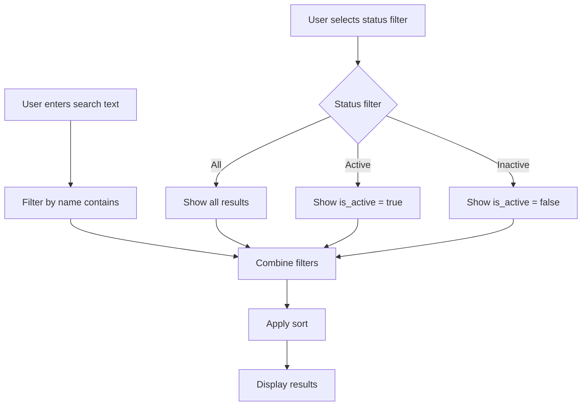
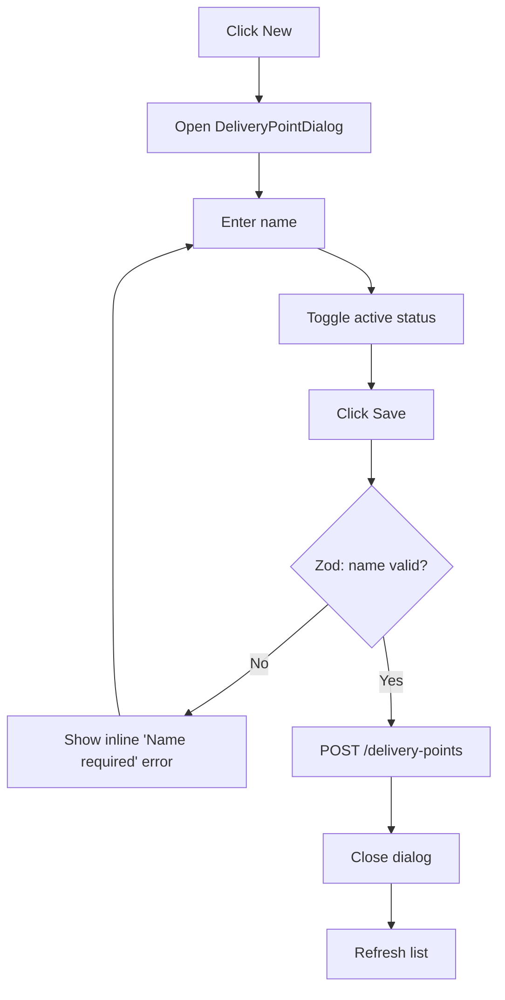
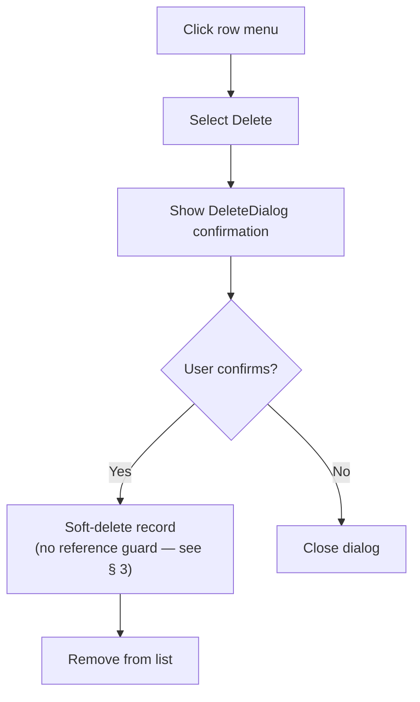

# Delivery Point

> **At a Glance**
> **Owner:** Product Admin &nbsp;·&nbsp; **Table:** `tb_delivery_point` &nbsp;·&nbsp; **Used by:** PO, GRN, locations &nbsp;·&nbsp; Physical drop-off address for vendor deliveries.

## 1. What & Who

A **delivery point** is the physical address a vendor ships goods to — a loading dock, a back-of-house entrance, a remote-site receiving bay. POs carry the delivery point so the vendor knows where to drop; the GRN records the actual receiving point; and inventory **locations** can be tagged with a default delivery point so GRN routing has a sensible destination.

A property typically has a handful of delivery points (Main Dock, Banquet Dock, Spa Receiving) regardless of how many inventory locations exist downstream. **Maintained by** Product Admin; **read by** developers and testers on PO / GRN routing.

## 2. Common Tasks

| Task | Where | Notes |
|---|---|---|
| Add a delivery point | Configuration → Master Data → Delivery Point → **New** | Required: `name` |
| Deactivate | Toggle `is_active` | Hidden from PO/GRN pickers; historical docs still resolve |
| Tag a location's default | [master-data/location](/en/inventory/master-data/location) detail | Sets `tb_location.delivery_point_id` |
| Override on GRN | GRN header field | GRN inherits from PO but may override on receipt |

The list, create, and delete flows on this simple two-field entity:

> Diagram adapted from `carmen/docs/app/system-administration/delivery-points/FD-delivery-points.md` · verified against `carmen-inventory-frontend-react/routes/config/delivery-point/delivery-point-component.tsx` (2026-09-28) · Changes: renamed `isActive` to the real `is_active` column.

> Diagram adapted from `carmen/docs/app/system-administration/delivery-points/FD-delivery-points.md` · verified against `carmen-inventory-frontend-react/routes/config/delivery-point/delivery-point-component.tsx`, `components/templates/config-entity-dialog.tsx:222-226`, `components/share/delivery-point-dialog.tsx:15-22` (2026-09-28) · Changes: named the real `DeliveryPointDialog` component and the real create endpoint in place of the source's generic "Create record". Corrected the fix from the prior pass — the Save button is not disabled while the name is invalid (`config-entity-dialog.tsx:222-226` disables it only `while isPending`); an empty name is instead caught by the zod schema on submit (`delivery-point-dialog.tsx:15-22`), which shows an inline "Name required" field error.

> Diagram adapted from `carmen/docs/app/system-administration/delivery-points/FD-delivery-points.md` · verified against `carmen-inventory-frontend-react/components/templates/config-list-template.tsx` (2026-09-28) · Changes: named the real `DeleteDialog` component in place of the source's generic "Show confirmation", and noted the unconfirmed delete guard per § 3.

## 3. Validation & Errors

| Symptom / Message | Cause | Action |
|---|---|---|
| "Name already in use" | Duplicate `name` on a non-deleted row | Pick a different name |
| "Name required" | Empty `name` | Add a display name |
| **Unconfirmed** — no delete guard found | `delivery-point.service.ts`'s `delete()` is an unconditional soft-delete (`is_active: false` + `deleted_at`) with no check for PO/GRN/location references | A prior version of this page asserted "cannot delete — referenced by POs / GRNs / locations" as an enforced error; treat it as **not enforced** until re-verified |
| Location shows stale delivery-point name | `tb_location.delivery_point_name` snapshot wasn't refreshed after rename | Backfill via maintenance job |

## 4. Edge Cases

- **Rename propagation.** Documents store the FK so display refreshes automatically. Locations that **snapshot the name** (`tb_location.delivery_point_name`) need a backfill if the rename must show on legacy lookups.
- **Inactivation** hides from pickers but leaves historical references resolvable.
- **No code field** — only `name` is the identity here.

---

## 5. Data Model (Dev)

Source: tenant schema.

### 5.1 `tb_delivery_point`

| Field | Prisma Type | Nullable | Description |
| --- | --- | --- | --- |
| `id` | `String @db.Uuid` | No | Primary key. |
| `name` | `String @db.VarChar` | No | Display name (e.g. `Main Dock`). |
| `is_active` | `Boolean?` | Yes | Active flag, defaults `true`. |
| `note`, `info`, `dimension` | — | Yes | Standard metadata. |
| `doc_version` | `Int` | No | Optimistic-lock version (default `0`). |
| Audit columns | — | Yes | `created_*`, `updated_*`, `deleted_*`. |

**Constraints:** `@@unique([name, deleted_at])` map `deliverypoint_name_u`. Index on `name`. Reverse relations to `tb_location`, `tb_purchase_request_detail`, and PO-PR linkage tables.

## 6. Business Rules

- **Uniqueness.** `name` unique among non-deleted rows (DB-enforced).
- **Deletion guards — unconfirmed.** No reference check was found in `delete()`; soft-delete succeeds unconditionally even with open PO/GRN/location references.
- **Validation.** `name` required.
- **Lifecycle.** Inactive points stay readable on historical documents; hidden from pickers.
- **Rename propagation.** Documents resolve via FK; snapshotted name on `tb_location` needs backfill.
- **PO header FK is real since 2026-09-15.** `tb_purchase_order.delivery_point_id` (FK `tb_purchase_order_delivery_point_id_fkey`) + `delivery_point_name` were added by `20260915120000_po_header_delivery_point`; the PO `group-pr` / `confirm-pr` flows accept the delivery point on the header (backend `c467a287d`). Before that the reference lived only on PR detail / PO-PR junction rows.
- **Default sort.** `GET /delivery-points` with no `?sort=` returns `name:asc, id:asc` (`delivery-point.service.ts`, `withDefaultSort`, 2026-09-13).

## 7. Cross-References

- [purchase-order](/en/inventory/purchase-order) — PO header carries delivery-point reference.
- [good-receive-note](/en/inventory/good-receive-note) — GRN inherits from PO, may override.
- [master-data/location](/en/inventory/master-data/location) — each location can tag a default delivery point.
- [purchase-request](/en/inventory/purchase-request) — PR detail may hold a delivery-point hint that propagates to PO.

## 8. References

- **Prisma:** `../carmen-turborepo-backend-v2/packages/prisma-shared-schema-tenant/prisma/schema.prisma` — `tb_delivery_point` (line ~641).
- **Migration:** `20260915120000_po_header_delivery_point`.
- **E2E:** `../carmen-inventory-frontend-e2e/tests/079-delivery-point.spec.ts` + `docs/test-cases/gaps/079-delivery-point-gap.md` (30 uncovered cases).
- **Frontend:** `../carmen-inventory-frontend-react/routes/config/delivery-point/`.
