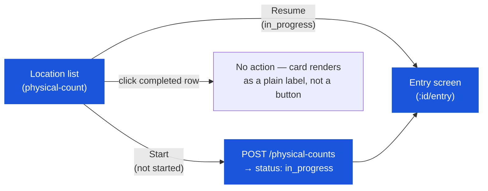

# Physical Count — User Flow — List Screen

> **At a Glance**
> **Screen:** `physical-count` (`pc-component.tsx`) &nbsp;·&nbsp; **Module:** [physical-count](/en/inventory/physical-count) &nbsp;·&nbsp; **Role:** any user holding `inventory_management.physical_count` — this is the same single role documented in [03-user-flow-counter.md](/en/inventory/physical-count/03-user-flow-counter), viewed from the list screen rather than the entry/review screens
> **What this screen does:** shows the current (or a previously-selected) counting period's locations grouped by status, and starts or resumes a count for one location.

## 1. Screen Scope

This page — carried over from an earlier draft's "Count Lead" persona name — documents the `physical-count` list screen. There is no code-level distinction between a "Count Lead" and a "Counter": both this screen and the entry/review screens in [03-user-flow-counter.md](/en/inventory/physical-count/03-user-flow-counter) are gated by the identical `inventory_management.physical_count` permission, and the same user typically moves through both in one session.

### Screen layout (`pc-component.tsx`)

### What the screen shows

- **Period selector** — the current open fiscal period's physical-count period is loaded via `GET /physical-count-periods/current`; a dropdown (`LookupPhysicalCountPeriod`) lets the user instead pick a previously-closed period (`GET /physical-count-periods/:id`) to review its locations read-only.
- **KPI tiles** — All / In Progress / Not Started / Complete counts, each clickable as a filter.
- **"Include not-counted locations" checkbox** — toggles `include_not_count` on the period-fetch call; unchecked (default), only locations with `physical_count_type = yes` are listed; checked, locations with `physical_count_type = no` are included too (still restricted to `location_type ∈ {inventory, consignment}` and `is_active = true`).
- **Search bar** — filters the visible location cards by name/code, client-side.
- **Location cards** (`PcLocationCard`) — one per location, showing a progress bar (`product_counted`/`product_total`), a "Count"/"Not Count" badge sourced from the location's own `physical_count_type` flag, and an action button whose label/behaviour depends on status (§ 3).

## 2. Entry Point

- **Location list** (`physical-count`) — the only entry point; there is no separate "period scheduler" or calendar screen. A period is auto-provisioned (at `status: draft`) the first time this screen loads for a newly-opened fiscal period.

## 3. Primary Actions

| Action | State precondition | State effect | Notes |
| ------ | ------------------ | ------------ | ----- |
| Start a count for a not-started location | Location has no `tb_physical_count` for this period (`physical_count_id === null`) | `POST /physical-counts` creates a new document directly at `in_progress`; navigates to `/:id/entry` | Per `PHC_VAL_001`–`002`. Requires the period to already be `counting` — if the auto-provisioned period is still `draft`, this call is rejected (see [03-user-flow.md](/en/inventory/physical-count/03-user-flow) § 2 note). |
| Resume a count for an in-progress location | `physical_count_id` is set and status is `in_progress` | Navigates directly to `/:id/entry` — no new document created | No API call; a pure client-side route change. |
| Click a completed location's card | Status is `completed` | **No action.** `PcLocationCard` renders a plain "Done" label (not a button) for `completed` items — there is no `onClick` handler at all in that state. | The list component's own `handleAction` still contains a branch that would show a "Coming Soon" dialog for a completed item, but it is unreachable dead code since the card never calls `onAction` when `actionType === "done"`. There is currently no way to view a completed count's detail from this screen. |
| Switch to a previous period | Pick a period from the `LookupPhysicalCountPeriod` dropdown | Loads that period's locations read-only via `GET /physical-count-periods/:id` | Badge switches from "Current Period" to "Previous Period"; the same card grid renders, but completed/in-progress locations from a closed period are still only viewable in the same limited way as above. |

## 4. Decision Points

- **Include not-counted locations or not.** Unchecked (default) shows only locations flagged `physical_count_type = yes` — the same set that gates period-end close (`period-end.validate.ts`). Checking it also surfaces locations flagged `no`, which do not block period close but can still be counted manually.
- **Start vs. resume vs. do nothing.** Driven entirely by the location's derived `physical_count_status` (`not_started` / `in_progress` / `completed`) — there is no separate scheduling, scope-configuration, or mode-selection decision to make; the only real choice a user makes on this screen is *which location to count next*.

## 5. Exit / Handoff

| Trigger | Handoff to | Artefact |
| ------- | ---------- | -------- |
| Start / Resume a count | [Entry screen](/en/inventory/physical-count/03-user-flow-counter) — same user, same session | `tb_physical_count` in `in_progress`. |
| All required locations reach `completed` | [system-config/period](/en/inventory/system-config/period) — period-end close gate | `period-end.validate.ts`'s `validatePhysicalCount` stops blocking period close. |

## 6. References

- **Frontend:** `../carmen-inventory-frontend-react/routes/inventory-management/physical-count/pc-component.tsx`, `routes/inventory-management/shared/pc-location-card.tsx`.
- **Backend:** `../carmen-turborepo-backend-v2/apps/micro-business/src/inventory/physical-count/physical-count.service.ts` (`create`), `.../physical-count-period/physical-count-period.service.ts` (`findCurrent`).
- **E2E:** `../carmen-inventory-frontend-e2e/tests/` — no physical-count spec currently exists.
- Related: [physical-count/03-user-flow](/en/inventory/physical-count/03-user-flow) (overview), [physical-count/02-business-rules](/en/inventory/physical-count/02-business-rules) (`PHC_VAL_001`–`003`, `PHC_AUTH_001`), [physical-count/03-user-flow-counter](/en/inventory/physical-count/03-user-flow-counter) (the same role's entry/review journey).
