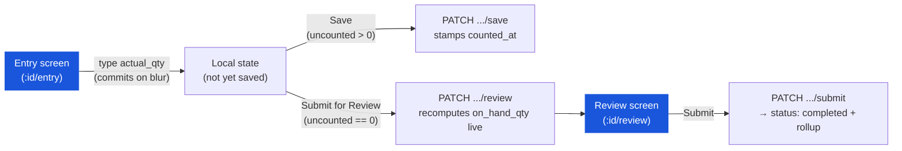

# Physical Count — User Flow — Entry & Review Screens

> **At a Glance**
> **Screens:** `physical-count/:id/entry` (`pc-entry-component.tsx`) and `physical-count/:id/review` (`pc-review-component.tsx`) &nbsp;·&nbsp; **Module:** [physical-count](/en/inventory/physical-count) &nbsp;·&nbsp; **Role:** the same single `inventory_management.physical_count`-gated user documented in [03-user-flow-count-lead.md](/en/inventory/physical-count/03-user-flow-count-lead)
> **What this persona does:** enters `actual_qty` per product line, optionally attaches a note/photo per line, saves progress, submits for review, and confirms the final submit.

## 1. Screen Scope

This page — carried over from an earlier draft's "Counter" persona name — documents the real line-entry and review screens. There is no zone assignment, no counter-to-zone grant, and no restriction limiting which lines a given user can edit: any user holding the module permission can edit any line on any in-progress count.

### Entry screen actions (`pc-entry-component.tsx`)

### What the entry screen shows

- **Header** (`pc-entry-header.tsx`) — location name/code, status badge, `counted/total` count, percent complete, a progress bar, `start_counting_at` date, and a client-side-only "last saved" timestamp.
- **Search + status filter pills** — All / Counted / Uncounted, filtering the visible product cards client-side; search matches product name/code/SKU/local name.
- **Refresh button** — calls `PATCH .../refresh`, which re-runs the same product-union query used at creation and appends any newly-qualifying product to the sheet.
- **Import / Export** — Export writes an `.xlsx` of the current effective counts (id, product code/name/local name/SKU, unit, `actual_qty`); Import reads a spreadsheet back and matches rows by SKU, reporting matched/skipped counts.
- **Product cards** (`EntryItemRow`, virtualized) — product name/code/local name/SKU, an `actual_qty` number input (committed on blur, clamped to `≥ 0` client-side), a calculator button (`CalculatorDialog`, for computing a total from case/unit quantities), a unit-of-measure label, and an "Add Notes" link opening a shared notes dialog (free text + photo attachments, backed by `tb_physical_count_detail_comment`). Book quantity (`on_hand_qty`) is **never shown** on this screen.
- **"Set uncounted to zero"** — bulk-fills every still-blank line's local value to `0` (does not save by itself).
- **Save vs. Submit for Review** — the footer shows **Save** whenever any line is still uncounted; once every line has a value (from local edits or a prior save), Save disappears and only **Submit for Review** remains.

### What the review screen shows (`pc-review-component.tsx` via the shared `ReviewComponent`)

- Location name/code, and four summary counts computed client-side from the review payload: **matches** (`diff_qty === 0`), **variances**, **overages** (`diff_qty > 0`), **shortages** (`diff_qty < 0`).
- A list of variance-only lines, each showing system quantity (`on_hand_qty`), actual quantity, variance (`diff_qty`), and unit.
- A single **Submit** button, which is the final, terminal action for the whole document.

## 2. Entry Points

- **From the list screen** — Start/Resume navigates directly to `physical-count/:id/entry` (see [03-user-flow-count-lead.md](/en/inventory/physical-count/03-user-flow-count-lead)).
- **From the period-end review page** (`pe-review.tsx`) — an in-progress location's card there also links to `physical-count/:id/entry`; a completed location's card there, like on the main list, renders no clickable action.

## 3. Primary Actions

| Action | State precondition | State effect | Notes |
| ------ | ------------------ | ------------ | ----- |
| Enter/edit `actual_qty` on a line | Document `in_progress` | Local state only, until Save or Submit for Review | Value clamped to `≥ 0` client-side (`entry-item-row.tsx`); no server-side minimum was confirmed. |
| Attach a note/photo to a line | Any time | `POST /physical-count-detail-comments/:detailId` (multipart: `message`, `type`, `files`) | Backed by `tb_physical_count_detail_comment`; the same shared notes-dialog component used by other entry-style screens in this codebase. |
| Save | At least one line has a value; document not `completed` | `PATCH .../save` — stamps `counted_at`/`counted_by_id` and recomputes `diff_qty` on the submitted lines against whatever `on_hand_qty` is currently stored (usually still `0` pre-review); requires `doc_version` | Repeatable; does not change `tb_physical_count.status`. |
| Submit for Review | Every line has an effective value (`uncountedCount === 0`) | `PATCH .../review` — recomputes `on_hand_qty`/`diff_qty` for **every** line from the live ledger balance; navigates to `/review` | Does not stamp `counted_at`; does not change `status`. Requires `doc_version`. See the counted_at caveat in [02-business-rules.md](/en/inventory/physical-count/02-business-rules) `PHC_VAL_004`. |
| Submit (final, from `/review`) | Every line's `counted_at != null` | `PATCH .../submit` — `status → completed`; fires the variance rollup into `tb_stock_in`/`tb_stock_out` | Terminal; per `PHC_POST_001`–`004`. Requires `doc_version`. |
| Refresh products | Document not `completed` | `PATCH .../refresh` — appends newly-qualifying products to the sheet | Does not remove or re-price existing lines. |

## 4. Decision Points

- **Save now vs. keep typing.** Saving early is the only way to have `counted_at` stamped on a line before the final Submit's completeness check (`PHC_VAL_004`); relying solely on Submit for Review to fill in the last few lines risks the edge case noted in [02-business-rules.md](/en/inventory/physical-count/02-business-rules) `PHC_VAL_004`, where a line's `actual_qty` is set but `counted_at` stays null.
- **Zero on shelf vs. leaving a line blank.** A blank line has no effective value and counts toward "uncounted"; entering `0` explicitly is a real, distinct count.
- **Import vs. manual entry.** Import matches rows to lines by product SKU and reports a matched/skipped count — useful for bulk-loading a handheld scanner export, but it does not itself validate quantities against tolerance (no such mechanism exists).

## 5. Exit / Handoff

| Trigger | Handoff to | Artefact |
| ------- | ---------- | -------- |
| Submit (final) | System — variance rollup | `tb_physical_count.status = completed`; `tb_stock_in`/`tb_stock_out` created (see [02-business-rules.md](/en/inventory/physical-count/02-business-rules) § 5). |
| Navigate back | [List screen](/en/inventory/physical-count/03-user-flow-count-lead) | No state change. |

## 6. References

- **Frontend:** `../carmen-inventory-frontend-react/routes/inventory-management/physical-count/pc-entry-component.tsx`, `pc-review-component.tsx`, `pc-entry-header.tsx`, `pc-entry-notes-dialog.tsx`; `routes/inventory-management/shared/entry-item-row.tsx`, `review-component.tsx`.
- **Backend:** `../carmen-turborepo-backend-v2/apps/micro-business/src/inventory/physical-count/physical-count.service.ts` (`save`, `reviewItems`, `submit`, `refresh`).
- **E2E:** `../carmen-inventory-frontend-e2e/tests/` — no physical-count spec currently exists.
- Related: [physical-count/03-user-flow](/en/inventory/physical-count/03-user-flow) (overview), [physical-count/02-business-rules](/en/inventory/physical-count/02-business-rules) (`PHC_VAL_004`–`007`, `PHC_POST_001`–`004`), [physical-count/03-user-flow-count-lead](/en/inventory/physical-count/03-user-flow-count-lead) (the same role's list-screen journey).
