# Physical Count — User Flow

> **At a Glance**
> **Module:** [physical-count](/en/inventory/physical-count) &nbsp;·&nbsp; **Persona:** one undifferentiated role, gated by a single permission (`inventory_management.physical_count`) — the two files linked below split its journey by screen (list vs. entry/review), not by a real role difference
> **Workflow lifecycle:** Period (`enum_physical_count_period_status`): `draft → counting → completed` (no confirmed code transitions `draft → counting`). Per-document (`enum_physical_count_status`): created directly at `in_progress → completed` — `pending` is not reachable through the confirmed create path. Final Submit fires the variance rollup directly into `tb_stock_in`/`tb_stock_out` (see [02-business-rules](/en/inventory/physical-count/02-business-rules) § 5).
> **Real screens:** `physical-count` (list) → `physical-count/:id/entry` (line entry) → `physical-count/:id/review` (variance review + final submit)

## 1. Overview

This page is the **overview entry point** for the user-flow set of the `physical-count` module. The real implementation is a single continuous journey with no hand-off between different people: one permission-gated user opens the location list for the current fiscal period (`physical-count`), starts or resumes a count for one location (creating a `tb_physical_count` directly at `in_progress`, or resuming an existing one), walks the entry screen (`physical-count/:id/entry`) entering `actual_qty` per product line, clicks **Submit for Review** once every line has a value, reviews the computed variance on `physical-count/:id/review`, and clicks the final **Submit** — the single action that both closes the count (`status = completed`) and creates the variance rollup documents.

Section 2 below describes the real document-lifecycle state machines for `tb_physical_count_period.status` and `tb_physical_count.status`. Section 3 links two files that describe the same real flow from two screen-based angles — the list screen (`03-user-flow-count-lead.md`) and the entry/review screens (`03-user-flow-counter.md`) — retained as separate pages for continuity with this wiki's page layout, not because a distinct "lead" and "counter" role exists in code. Section 4 is a correction note pointing at `03-user-flow-audit-config.md`, which documents the confirmed absence of any Approver/Auditor/Sysadmin surface for this module.

## 2. Document Lifecycle

**Period-level state machine (`enum_physical_count_period_status`):**

```mermaid
stateDiagram-v2
    [*] --> draft : Auto-created by GET /physical-count-periods/current the first time it is called for a newly-opened fiscal period (physical-count-period.service.ts findCurrent())
    draft --> counting : No confirmed code path found anywhere in frontend or backend
    counting --> completed : All child tb_physical_count rows reach completed (system-driven; period locked)
    completed --> [*]

    note right of draft
        create() on physical-count.service.ts unconditionally rejects
        with "Physical Count Period is not in counting status" unless
        the period is already counting — the only way to reach that
        status appears to be an explicit POST /physical-count-periods
        call with status set directly in the request body; no frontend
        screen was found that does this.
    end note
```

**Document-level state machine (`enum_physical_count_status`):**

```mermaid
stateDiagram-v2
    [*] --> in_progress : Create (POST /physical-counts) — start_counting_at/by_id stamped immediately (PHC_VAL_001–002)
    in_progress --> in_progress : Save (PATCH .../save) stamps counted_at per line; Submit for Review (PATCH .../review) recomputes on_hand_qty/diff_qty live for every line
    in_progress --> completed : Submit (PATCH .../submit) — every line counted_at != null (PHC_VAL_004); fires the variance rollup (PHC_POST_001)
    completed --> [*]

    note right of in_progress
        The pending enum value is never assigned by the confirmed
        create() path — documents start at in_progress directly.
        No location lock, tolerance threshold, or recount flow exists;
        Refresh (PATCH .../refresh) can append newly-qualifying
        products to the sheet at any point before completed.
    end note
```

### 2.1 Period-level transitions (`enum_physical_count_period_status`)

| From state | Action | To state | Allowed for | Pre-conditions |
| ---------- | ------ | -------- | ----------- | -------------- |
| `(none)` | `GET /physical-count-periods/current` auto-provisions a period for the currently-open `tb_period` if none exists | `draft` | Any user with the module permission (implicit, via the list screen) | An open `tb_period` exists. |
| `draft` | — | `counting` | Unconfirmed | No code path found; see § 2 note above. |
| `counting` | all child `tb_physical_count` rows reach `completed` | `completed` | System | Every `tb_physical_count` under the period is `completed`. |

### 2.2 Document-level transitions (`enum_physical_count_status`)

| From state | Action | To state | Allowed for | Pre-conditions |
| ---------- | ------ | -------- | ----------- | -------------- |
| `(none)` | Create (`POST /physical-counts`) | `in_progress` | Any user with `inventory_management.physical_count` | Period is `counting` (`PHC_VAL_001`); location exists (`PHC_VAL_002`). Product lines seeded from the union of `tb_product_location` assignments and any product with non-zero stock at the location. |
| `in_progress` | Save (`PATCH .../save`) | `in_progress` | Same user | Any subset of lines; stamps `counted_at`/`counted_by_id` on the lines submitted. |
| `in_progress` | Submit for Review (`PATCH .../review`) | `in_progress` (no status change) | Same user | Recomputes `on_hand_qty`/`diff_qty` for every line from the live ledger balance; navigates to `/review`. |
| `in_progress` | Submit (`PATCH .../submit`, from `/review`) | `completed` | Same user | Every line has `counted_at != null` (`PHC_VAL_004`); fires the variance rollup (`PHC_POST_001`–`004`). |
| `completed` | view only | `completed` | Any user with the module permission (read) | Terminal; blocked from further Save/Review/Submit/Delete (`PHC_VAL_006`). There is no route that opens a `completed` document's detail from the list screen — see § 3 note in [03-user-flow-count-lead.md](/en/inventory/physical-count/03-user-flow-count-lead). |

### 2.3 Variance-rollup fan-out

The final Submit is the **rollup event**. Per `PHC_POST_001`–`003`:

- Lines with `diff_qty > 0` group into **one** new `tb_stock_in`, inserted directly at `doc_status = completed`.
- Lines with `diff_qty < 0` group into **one** new `tb_stock_out`, inserted directly at `doc_status = completed`.
- Lines with `diff_qty = 0` produce no rollup row.
- Neither created header nor any detail row is linked back to the source count by any structured field — only a shared description string.
- **No `tb_inventory_transaction` row is written by this action** — the rollup documents are records only; they do not themselves move the on-hand balance.

## 3. Persona Files

Both files below describe the **same single permission-gated role**, split by which screen it is using:

- **[List screen](/en/inventory/physical-count/03-user-flow-count-lead)** — opening the current period's location list, starting or resuming a count.
- **[Entry / Review screens](/en/inventory/physical-count/03-user-flow-counter)** — line entry, notes, import/export, Submit for Review, and the final Submit.

## 4. Confirmed-Absent Persona Group

An earlier draft of this wiki module described a third persona group — Approver/Finance Reviewer, Auditor, and Sysadmin — reviewing rollup adjustments, inspecting the audit chain, and configuring tolerance/costing-method defaults. A targeted search of the frontend, backend, and Bruno collection found no matching permission key, route, workflow stage, or configuration screen for any of these. See [03-user-flow-audit-config.md](/en/inventory/physical-count/03-user-flow-audit-config) for the correction note.

## 5. References

- **Frontend:** `../carmen-inventory-frontend-react/routes/inventory-management/physical-count/` (`pc-component.tsx`, `pc-entry-component.tsx`, `pc-review-component.tsx`).
- **Backend:** `../carmen-turborepo-backend-v2/apps/micro-business/src/inventory/physical-count/physical-count.service.ts`, `.../physical-count-period/physical-count-period.service.ts`.
- **E2E:** `../carmen-inventory-frontend-e2e/tests/` — no physical-count spec currently exists.
- Related flow pages: [inventory-adjustment/03-user-flow](/en/inventory/inventory-adjustment/03-user-flow) (the module the rollup writes into), [spot-check](/en/inventory/spot-check) (partial-count cousin flow).
