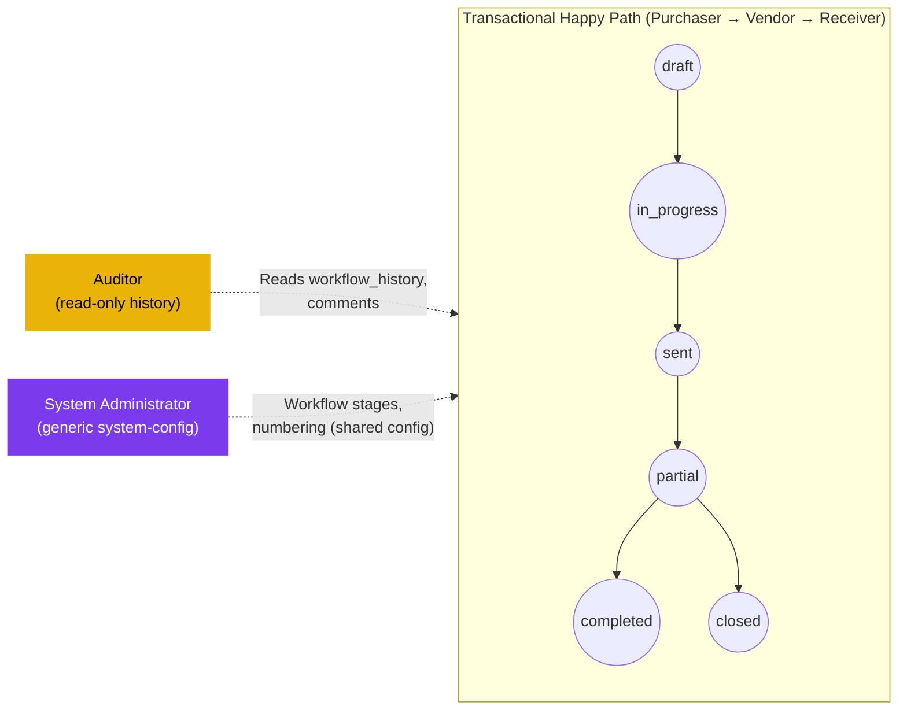

# Purchase Order — User Flow — Audit & Config

> **At a Glance**
> **Persona:** Audit / Config (Auditor + System Administrator) &nbsp;·&nbsp; **Module:** [purchase-order](/en/inventory/purchase-order) &nbsp;·&nbsp; **Confirmed surface:** generic per-document activity/history view (Auditor, read-only); generic workflow-stage and running-code (numbering) configuration shared across document types (System Administrator) &nbsp;·&nbsp; **Not confirmed:** a dedicated cross-document "audit workspace" query builder, or a PO-specific configuration workbench (numbering scheme editor, threshold editor, vendor-ranking editor, PR-to-PO grouping-rule editor, delegation-window manager)

> ⚠️ **Major correction this pass.** The previous version of this page described a dedicated **"Procurement Activity Queries"** audit workspace (query templates, filter chips, export-approval workflow, case-file notes) and a dedicated **"Configuration workspace"** with child surfaces for PO Numbering & Templates, PO Workflow Settings (including a high-value threshold and approval delegations), RBAC & Roles, Integration Settings, and PR-to-PO Rules. None of this was found in current source:
> - No route or component matching an "audit workspace," "activity queries," or a PO-specific configuration workbench was located in `carmen-inventory-frontend-react`.
> - A repo-wide search for `threshold`, `segregation`, and delegation-window code returned nothing relevant anywhere in `carmen-turborepo-backend-v2`.
> - Generic configuration surfaces **do** exist elsewhere in the product — workflow stage definitions and running-code (document numbering) are configured in the **system-config** module, shared across document types (PR, PO, GRN, etc.), not as a PO-specific screen. This page's prior version conflated "PO uses a workflow and a numbering scheme" (true, and documented in [01-data-model.md](./01-data-model.md) / [02-business-rules.md](./02-business-rules.md)) with "PO has its own dedicated configuration workspace" (not confirmed).
> - This exact pattern (an elaborate audit-workspace + configuration-workspace narrative with no matching route) was also flagged as unverified/deferred in the `purchase-request` module's prior resync pass. Given this pass's broader, repo-wide searches turned up nothing supporting either workspace anywhere in the product, treat both as not confirmed rather than merely deferred.

## 1. Role in This Module

The **Auditor** is a read-only role. The one confirmed surface is the PO detail page's own activity/history — `workflow_history`, `history`, and `tb_purchase_order_comment` — which any user with read access to a PO can already see; whether a distinct "Auditor" role or a dedicated cross-document query workspace exists on top of that was not confirmed this pass. The Auditor cannot approve, transmit, reject, close, or edit lines.

The **System Administrator** configures the workflow definition referenced by `tb_purchase_order.workflow_id` (stages, `stage_role`, and `user_action.execute[]` membership — this is generic system-config functionality shared across document types, not PO-specific) and the running-code scheme that generates `po_no`. RBAC role-to-permission mapping is likewise a generic system-config concern. No PO-specific numbering template, integration-settings screen, PR-to-PO grouping-rule editor, or amount-threshold editor was found.

### Position relative to the transactional flow

### Permission Matrix — Action × Sub-persona (Audit / Config)

| Action | Auditor | System Administrator |
|---|---|---|
| Read PO `workflow_history` / `tb_purchase_order_comment` | ✅ | ✅ |
| Read header / lines / snapshots | ✅ | ✅ |
| Walk PR→PO bridge (`tb_purchase_order_detail_tb_purchase_request_detail`) | ✅ | ✅ |
| Edit workflow stages / `stage_role` / `user_action.execute[]` (generic system-config) | ❌ | ✅ |
| Edit running-code (`po_no`) scheme (generic system-config) | ❌ | ✅ |
| Edit RBAC permission map | ❌ | ✅ (via generic system-config, not confirmed as a PO-specific screen) |
| Edit PO header / lines / vendor / qty | ❌ | ❌ |
| Approve / Transmit / Send-back / Reject | ❌ | ❌ |
| Close a PO | ❌ | ❌ (escalate to Procurement Manager or Inventory Manager under `PO_AUTH_008`) |

## 2. Entry Point and Primary Flow

### 2.1 Auditor

**Entry point:** Open a PO's detail page → **Activity Log** / history view. **Unconfirmed:** a dedicated cross-document audit query builder spanning PR → PO → GRN.

**Confirmed flow:** Open the PO, read `workflow_history` (stage transitions, actor, timestamp) and `tb_purchase_order_comment` (user and system comments). Walk the PR→PO bridge for PR-sourced POs to see the originating PR(s). No PO state is changed by any of this.

### 2.2 System Administrator

**Entry point:** the system-config module's workflow-definition screen (shared across document types) and running-code screen — see [system-config/workflow](/en/inventory/system-config/workflow) and [system-config/running-code](/en/inventory/system-config/running-code) for the actual screens, which this page does not duplicate.

**Confirmed flow:** define or edit the workflow's stages and `stage_role` per stage; assign users/roles to `user_action.execute[]`; configure the numbering pattern that generates `po_no`. These changes affect new POs going forward; POs already `in_progress` carry their assigned `workflow_id` and stage cursor, so an in-flight PO is not silently rerouted mid-workflow by a later stage-definition edit (this follows from the workflow being referenced by ID on the PO row, not re-resolved from a live definition on every read — the practical extent of "snapshot" behavior beyond that was not verified this pass).

## 3. Decision Branches

- **If the Auditor finds a workflow-history gap or an out-of-order timestamp**: escalate outside the PO module — no PO-module "case file" or flagging feature was confirmed. A generic activity-log or audit trail feature, if one exists, is documented in [reporting-audit](/en/inventory/reporting-audit), not here.
- **If a Sysadmin needs to end a stuck PO** (e.g., no eligible approver remains at a stage after an RBAC change): the confirmed remediation is a Procurement Manager or Inventory Manager action (**Cancel**/**Close**/**Reject**, as documented in [03-user-flow-procurement-manager.md](./03-user-flow-procurement-manager.md)) — there is no confirmed Sysadmin-level override that directly mutates PO state.

## 4. Exit Point / Handoffs

Neither role transitions a PO across `enum_purchase_order_doc_status`. The Auditor's read never changes state; the System Administrator's workflow/numbering edits apply to future POs.

## 5. References

- Parent overview: [03-user-flow.md](./03-user-flow.md)
- Authorization rules: [02-business-rules.md](./02-business-rules.md) Section 4 — `PO_AUTH_011` (workflow-derived stage-gated approval).
- Data model: [01-data-model.md](./01-data-model.md) — `enum_purchase_order_doc_status` values, the PR→PO bridge, and the `workflow_history` / `tb_purchase_order_comment` audit surface.
- Related (generic config, not PO-specific): [system-config/workflow](/en/inventory/system-config/workflow), [system-config/running-code](/en/inventory/system-config/running-code).
- `../carmen/docs/purchase-order-management/purchase-order-module.md` — carmen/docs source for the legacy RBAC and audit-workspace design; treat as design intent, not verified current behavior.
- Sibling: [03-user-flow-purchaser.md](./03-user-flow-purchaser.md) — upstream persona whose actions populate the activity log.
- Sibling: [03-user-flow-procurement-manager.md](./03-user-flow-procurement-manager.md) — the confirmed remediation path (cancel / close / reject) for a stuck or non-compliant PO.
- Sibling: [03-user-flow-vendor.md](./03-user-flow-vendor.md), [03-user-flow-receiver.md](./03-user-flow-receiver.md), [03-user-flow-finance.md](./03-user-flow-finance.md) — other persona files whose events would appear in the activity log.
- Cross-link: [purchase-request](/en/inventory/purchase-request) — upstream module whose PR records are walked via the PR→PO bridge.
- Cross-link: [good-receive-note](/en/inventory/good-receive-note) — downstream module whose GRN postings drive `PO_POST_006` / `PO_POST_007`.
