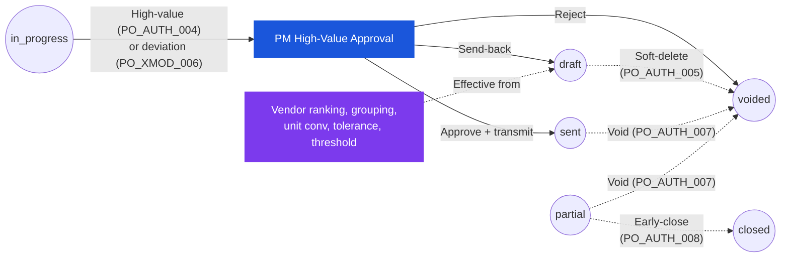

# Purchase Order — User Flow — Procurement Manager

> **At a Glance**
> **Persona:** Procurement Manager &nbsp;·&nbsp; **Module:** [purchase-order](/en/inventory/purchase-order) &nbsp;·&nbsp; **Workflow stages:** High-value approval at final stage (`in_progress → sent` per `PO_POST_004`) — approve-and-transmit, send-back to Purchaser, or reject to `voided` (`PO_POST_010`); soft-delete-in-draft (`PO_AUTH_005`); void from non-terminal (`PO_AUTH_007`); early-close `partial → closed` (`PO_POST_011`); rule-tuning workbench (vendor master, grouping rules, unit conversions, pricelist tolerance, high-value threshold) &nbsp;·&nbsp; **Key permissions:** high-value approve / send-back / reject (`PO_AUTH_004`); override authorities (`PO_AUTH_005` / `PO_AUTH_007` / `PO_AUTH_008`)
> **What this persona does:** High-value approval gate and procurement-rule administrator; holds the override authorities the Purchaser cannot exercise.

## 1. Role in This Module

The **Procurement Manager** owns oversight of the procurement function and engages with the PO module across **two distinct surfaces**. The **transactional surface** is the high-value approval gate at the final stage of the workflow chain — POs whose `tb_purchase_order.total_amount` exceeds the tenant high-value threshold (or whose pricelist deviation exceeds tolerance per `PO_XMOD_006`) are routed here for the `in_progress → sent` transition that the Purchaser cannot self-approve under `PO_AUTH_004`, and the Manager either approves-and-transmits (`PO_POST_004`), sends the PO back to the Purchaser for revision (`PO_POST_005`), or rejects to terminate the workflow at `voided` (`PO_POST_010`). The **configurational surface** is the rule-tuning workbench where the Manager maintains the vendor master and ranking, the `(vendor_id, currency_id)` grouping rules used by Convert-to-PO, the unit-conversion factors that drive `PO_VAL_009` / `PO_CALC_011`, the pricelist tolerance band that gates `PO_XMOD_006`, and the high-value threshold itself on the workflow definition referenced by `tb_purchase_order.workflow_id`. The Manager additionally holds the **override authorities** that the Purchaser cannot exercise: soft-delete-in-draft (`PO_AUTH_005`), void from any non-terminal state (`PO_AUTH_007`, `PO_POST_010`), early-close from `partial → closed` (`PO_POST_011`, shared with Inventory Manager per `PO_AUTH_008`), and the override of a Purchaser's send-back where a return-to-draft would otherwise stall a time-critical PO. The Manager operates under `enum_stage_role = approve` at the high-value stage and additionally as a configuration administrator outside the transactional workflow.

### Workflow position (PM transactional + override paths highlighted)

### Permission Matrix — Surface × Action (Procurement Manager)

The Manager's authority spans the transactional approval gate and the configuration / override surfaces. Receipt-driven transitions (`sent → partial → completed`) are not part of this role.

| Action | Transactional (High-value approval) | Override (any non-terminal state) | Configurational (Rule workbench) |
|---|---|---|---|
| View PO | ✅ | ✅ | — |
| Approve & Transmit (`in_progress → sent`) | ✅ (`PO_POST_004`) | — | — |
| Send-back (`in_progress → draft`) | ✅ (`PO_POST_005`) | — | — |
| Reject (`in_progress → voided`) | ✅ (`PO_POST_010`) | — | — |
| Soft-delete draft (`PO_AUTH_005`) | — | ✅ (`PO_POST_012`) | — |
| Void from `sent` / `partial` (`PO_AUTH_007`) | — | ✅ (`PO_POST_010`) | — |
| Early-close `partial → closed` (`PO_AUTH_008`, shared with Inv Mgr) | — | ✅ (`PO_POST_011`) | — |
| Override Purchaser send-back (re-submit + approve) | ✅ | — | — |
| Maintain vendor ranking & performance score | — | — | ✅ |
| Edit Convert-to-PO grouping key (vendor + currency, optional secondary) | — | — | ✅ |
| Edit unit-conversion factors (drives `PO_VAL_009` / `PO_CALC_011`) | — | — | ✅ |
| Edit pricelist tolerance band (gates `PO_XMOD_006`) | — | — | ✅ |
| Edit high-value threshold (gates `PO_AUTH_004`) | — | — | ✅ |
| Save rule version with `effective_from` (in-flight snapshot preserved) | — | — | ✅ |
| Roll back rule version | — | — | ✅ |
| Bulk Void / Bulk Close | — | ✅ | — |
| Edit header / lines (qty, price, tax, FOC) | ❌ | ❌ | — |

> ℹ️ **Snapshot principle:** rule changes apply **forward-only**. POs already at `in_progress`, `sent`, or `partial` retain their snapshot of `vendor_id`, `currency_id`, `exchange_rate`, line `price`, `order_unit_conversion_factor`, and workflow threshold — they do not re-evaluate under the new rule.

## 2. Entry Point and Primary Flow

The Procurement Manager works two flows in parallel — a **transactional flow** triggered by an escalated PO arriving in the approval queue, and a **configuration flow** driven on a slower cadence to keep the rules current. Each surface has its own entry point and decision rhythm.

### Transactional flow — high-value approval

**Entry point:** In-app notification "Purchase Order [PO-No] Awaiting High-Value Approval" or email digest deep-link into the **Approvals → Pending** queue filtered to `workflow_current_stage = <high-value stage>`. Alternatively Sidebar → **Purchase Order** module → **My Approvals** list, sorted by `total_amount` descending.

**Primary flow (happy path):**

1. Receive the escalation. The notification fires when a PO transitions `draft → in_progress` (`PO_POST_002`) and the workflow stage cursor lands on the high-value approval stage — either because `tb_purchase_order.total_amount` exceeds the tenant threshold (`PO_AUTH_004`) or because a pricelist deviation above tolerance has force-routed the PO here under `PO_XMOD_006`. The Manager's user-id is in the populated `user_action.execute` set for the current stage.
2. Open the **PO detail** page from the approval queue. Review the header (vendor, currency, exchange rate, credit term, order and delivery dates) for accuracy against `PO_VAL_002`–`PO_VAL_006`. Confirm that the workflow path is the one expected for this amount tier and that no validation flag (deviation, missing pricelist coverage per `PO_XMOD_005`, segregation-of-duties warning per `PO_AUTH_010`) is outstanding.
3. Walk the **Items** tab. For each line check the pricelist deviation indicator, the `is_foc` flag, the `cancelled_qty` (should be zero at this stage), the linked PR via the bridge table for PR-sourced POs (`PO_XMOD_001`), and the per-line `delivery_date`. The Manager re-validates the calculation roll-up: `total_price`, `total_tax`, `total_amount` per `PO_CALC_008`–`PO_CALC_010`.
4. Review the **Attachments** and **Comments** tabs. The Manager looks for the vendor quote, the buyer's justification note, any prior-stage approver comments, and (for deviation-routed POs) the explicit reason recorded in `tb_purchase_order_detail_comment`. The `history` and `workflow_history` JSON columns surface the full chain of `created → submitted → approved` events.
5. Decide. The Manager has three actions at this stage:
   - **Approve at final stage** — clicks **Approve & Transmit**. `po_status` transitions `in_progress → sent` via `PO_POST_004`, `approval_date = now()`, `last_action = approved`, and the system fires the transmit handler under `PO_AUTH_006` to email / EDI / portal-post the PO to the vendor. The soft budget commitment hardens into a vendor liability.
   - **Send back** — clicks **Return to Buyer** and enters a mandatory reason. `po_status` transitions `in_progress → draft` via `PO_POST_005`, `workflow_current_stage` resets to the start, `last_action = rejected`, and the reason is appended to `tb_purchase_order_comment` (type `system`). The Purchaser picks the PO up from their **Returned** queue.
   - **Reject / void** — clicks **Reject** and enters a mandatory reason. `po_status` transitions `in_progress → voided` via `PO_POST_010`, `is_active = false`, the workflow terminates, and any soft budget commitment is reversed. `voided` is terminal.
6. (After approve-and-transmit) confirm the transmission outcome. The activity log records the channel and the timestamp; vendor acknowledgement (where the channel supports it) feeds the **Sent POs awaiting acknowledgement** view that the Manager monitors at a glance.
7. (Optional, override path) intervene on a PO at higher states. From the PO detail page the Manager can void a `sent` or `partial` PO (`PO_AUTH_007`, `PO_POST_010`) — for example when the vendor cancels — or close a `partial` PO early (`PO_AUTH_008`, `PO_POST_011`) when the vendor cannot supply the outstanding balance. Both actions require a reason text and are recorded in the activity log. See Section 3 for the decision conditions.

### Configuration flow — rule tuning

**Entry point:** Sidebar → **Procurement → Configuration** → choose the rule set: **Vendor Ranking & Allocation**, **Convert-to-PO Grouping**, **Unit Conversion**, **Pricelist Tolerance**, or **Workflow Threshold**. The configuration screens are gated by the Procurement Manager role; ordinary Purchasers have read-only visibility on the same screens.

**Primary flow (happy path):**

1. Open the target rule workbench. The screen lists the current rule set with metadata: rule id, effective-from date, last-updated-by, and the count of in-flight POs that hold a snapshot of the prior version. The **Vendor Ranking & Allocation** screen sorts vendors by performance score (on-time delivery rate, three-way-match success rate, deviation rate); the **Convert-to-PO Grouping** screen exposes the `(vendor_id, currency_id)` grouping key and any optional secondary keys (delivery location, payment term) that the tenant has enabled; the **Unit Conversion** screen lists per-product `order_unit → base_unit` factors that feed `PO_VAL_009` and `PO_CALC_011`; the **Pricelist Tolerance** screen exposes the `±X%` band that gates `PO_XMOD_006`; the **Workflow Threshold** screen exposes the high-value cutoff that triggers `PO_AUTH_004`.
2. Edit the rule. Adjust the parameter — re-rank a vendor up or down, change the grouping key, update a conversion factor, widen or narrow the tolerance band, raise or lower the threshold. The system flags any in-flight PO that currently snapshots the prior value and warns that the change will only affect **new** POs (per the snapshot principle below).
3. Save the change. The system writes the new rule version with an effective-from timestamp, increments the rule's version counter, and records the change in the configuration audit log with the Manager's user-id, the prior value, and the new value. New POs created from this point forward consume the new rule; PO drafts already in `in_progress` and POs already at `sent` / `partial` retain their snapshot.
4. Notify affected users. The system fires a configuration-change notification to Purchasers ("Vendor ranking updated", "Convert-to-PO grouping rule updated", "Unit conversion factor changed for product [SKU]") so the buyer team is aware before the next Convert-to-PO run.
5. (Optional) test the change. For grouping and threshold rules the Manager can run a dry-run preview against a synthetic PR set to confirm the rule produces the expected grouping or escalation pattern before relying on it in production.
6. (Optional) roll back. If a downstream report or a buyer escalation surfaces an issue, the Manager re-opens the rule workbench, restores the prior version (which the audit log preserves), and the new version takes effect for POs created after the rollback timestamp.

## 3. Decision Branches

- **If a complex escalation arrives where the high-value PO is technically valid but commercially questionable** (e.g. price above the previous benchmark, alternate vendor known to be cheaper, FOC line that should be charged): the Manager reviews the vendor quote in **Attachments**, the prior-PO history in the [vendor-pricelist](/en/inventory/vendor-pricelist) activity, and the Purchaser's justification in **Comments**. If the answer is "this is the right vendor at the right price" the Manager approves-and-transmits. If the answer is "this needs the buyer to renegotiate or pick a different vendor" the Manager sends back to the Purchaser with the renegotiation reason recorded as a comment. If the answer is "this PO should not happen at all" the Manager rejects to `voided` (`PO_POST_010`) and informs the Purchaser through the standard reason field; the workflow terminates and the soft commitment is released.
- **If the Manager wants to change a rule that an in-flight PO has already snapshotted** (e.g. raise the high-value threshold while a borderline PO is sitting at `in_progress` on the high-value stage): the rule-edit screen warns of the in-flight PO and offers two paths. (a) **Save and apply going forward** — the new threshold takes effect for new POs only; the in-flight PO continues through the high-value stage on the old threshold. (b) **Save and re-route in-flight** — only available when the workflow definition supports re-routing; the in-flight PO is bumped back to `draft` (with a system comment), the new threshold is evaluated against `total_amount`, and the PO either skips the high-value stage on resubmission or stays on it depending on the new value. Most tenants disable (b) for audit safety and use (a) exclusively, which is why the snapshot-on-submit rule (Section 2 step 2 of the transactional flow) is documented as the default.
- **If a bulk action is needed on stuck POs** (e.g. a vendor has gone out of business and 12 active POs at `sent` / `partial` need to be voided or early-closed in one operation): from the PO list, the Manager filters by vendor and status, multi-selects the affected rows, and runs **Bulk Void** (`PO_AUTH_007`, `PO_POST_010`) or **Bulk Close** (`PO_AUTH_008`, `PO_POST_011`). Each action requires a single reason text that is recorded per-PO in the activity log. For `partial` POs the bulk-close path writes the remainder of each line as `cancelled_qty` so `received_qty + cancelled_qty = order_qty`. POs already at `completed`, `closed`, or `voided` are skipped from the bulk action (terminal states cannot be re-transitioned).
- **If the Manager overrides a Purchaser's send-back** (a buyer has returned a PO to draft that the Manager believes should proceed — for example a time-critical PO where the buyer's concern is non-blocking): the override path is to re-submit the PO from `draft` on behalf of the buyer (the Manager's role inherits Purchaser permissions per the role hierarchy) and approve at the high-value stage as normal. The override is recorded as two distinct events in the audit log — the original send-back from the buyer, and the Manager's re-submission with a justification comment. Alternative path: the Manager re-routes the workflow definition to bypass the buyer's stage entirely for this PO and approves directly — only available when the tenant workflow allows manual re-routing.
- **If a deviation-routed PO arrives that should not have been routed here** (the deviation flag was raised by `PO_XMOD_006` but on review the price is correct and the pricelist itself is stale): the Manager approves-and-transmits as normal and additionally opens the **Pricelist Tolerance** rule workbench to either refresh the underlying pricelist row in [vendor-pricelist](/en/inventory/vendor-pricelist) or adjust the tolerance band so the next similar PO does not re-route unnecessarily. This is the loop that keeps the transactional and configurational surfaces synchronised.
- **If the Manager soft-deletes a draft PO** (a buyer has raised a PO in error and abandoned it, or a PO is duplicate of another active one): from the draft PO detail page the Manager runs **Delete Draft** (`PO_AUTH_005`, `PO_POST_012`); `deleted_at` and `deleted_by_id` are set, and the row remains in the database for audit. Because the unique index on `po_no` includes `deleted_at`, the same `po_no` is freed for re-use. The buyer is notified by the standard delete-event notification.

## 4. Exit Point / Handoffs

The Procurement Manager's involvement on a given PO and a given rule set ends at one of the following documented handoffs.

### Transactional handoffs

- **Final approval → transmit to vendor** — the Manager approves at the high-value stage and `po_status` transitions `in_progress → sent` via `PO_POST_004`. Handoff is to the **Vendor**; document state at handoff is `sent`. The PO is now a firm commitment; the **Purchaser** monitors vendor acknowledgement and the eventual GRN-driven receipt transitions on the Open POs dashboard. See [03-user-flow-vendor.md](./03-user-flow-vendor.md) for the external-side flow.
- **Reject → terminal voided** — the Manager rejects with reason and `po_status` transitions `in_progress → voided` via `PO_POST_010`. Handoff is to the **Auditor** for post-hoc review only; document state at handoff is `voided` (terminal). Any soft budget commitment is reversed. The Purchaser is notified and can use the reason to inform the requestor or re-raise a corrected PO if the underlying need persists.
- **Send back → revision by buyer** — the Manager returns the PO to draft with reason and `po_status` transitions `in_progress → draft` via `PO_POST_005`. Handoff is to the **Purchaser**; document state at handoff is `draft`. The Purchaser picks the PO up from their **Returned** queue, edits per the Manager's reason, and re-submits through the full approver chain. The Manager's involvement resumes if the resubmitted PO again hits the high-value stage.
- **Void at non-draft / early-close** — the Manager voids a `sent` or `partial` PO (`PO_AUTH_007`, `PO_POST_010`) or early-closes a `partial` PO (`PO_AUTH_008`, `PO_POST_011`). Handoff is to **Finance** (for AP close-out review of any accrual already raised by GRN postings) and to the **Auditor**; document state at handoff is `voided` or `closed` respectively (both terminal). See [03-user-flow-finance.md](./03-user-flow-finance.md) for the AP-side close-out.

### Configurational handoffs

- **Rule change saved → effective for new POs** — the Manager saves a change to vendor ranking, Convert-to-PO grouping, unit conversion, pricelist tolerance, or the high-value threshold. Handoff is to the **Purchaser** community via the configuration-change notification; effect is on new POs only. **In-flight POs retain their snapshot** of the prior rule version — drafts already at `in_progress` continue on the old workflow stage, POs already at `sent` retain their stored `vendor_id`, `currency_id`, `exchange_rate`, line `price`, and line `order_unit_conversion_factor` regardless of any subsequent rule edit. This snapshot principle is what makes the configurational surface safe to operate on a different cadence from the transactional surface.
- **Rule rollback → prior version restored** — the Manager rolls back a rule change. Handoff is again to the **Purchaser** community via notification; the prior rule version is restored for POs created from the rollback timestamp forward. The forward-only-effect principle continues to apply: POs created between the original save and the rollback retain the (now-superseded) rule version they snapshotted.

Receipt-driven transitions (`sent → partial → completed` via `PO_POST_006`/`PO_POST_007`) are not Procurement Manager actions — they are driven by the **Receiver** through GRN posting. The Manager observes these transitions on the dashboard and intervenes only via the early-close or void override paths described above.

## 5. References

- Parent overview: [03-user-flow.md](./03-user-flow.md) — global PO state machine and cross-persona handoff table.
- Sibling: [03-user-flow-purchaser.md](./03-user-flow-purchaser.md) — upstream persona who submits the PO that escalates to the Manager and who picks up the send-back at `draft`.
- Sibling: [03-user-flow-vendor.md](./03-user-flow-vendor.md) — downstream external party that receives the transmitted PO at `po_status = sent`.
- Sibling: [03-user-flow-finance.md](./03-user-flow-finance.md) — AP-side close-out of any GRN accrual when the Manager voids or early-closes a `partial` PO.
- Sibling: [03-user-flow-audit-config.md](./03-user-flow-audit-config.md) — System Administrator who configures workflow definitions and RBAC bindings that the Manager's rule edits depend on; Auditor who reviews the activity log of the Manager's approve / reject / void / config-change actions.
- Authorization rules: [02-business-rules.md](./02-business-rules.md) Section 4 — `PO_AUTH_004` (high-value approval), `PO_AUTH_005` (delete-in-draft), `PO_AUTH_007` (void from non-draft), `PO_AUTH_008` (early-close from partial), `PO_AUTH_010` (segregation of duties), `PO_AUTH_011` (workflow stage gating).
- Posting rules: [02-business-rules.md](./02-business-rules.md) Section 5 — `PO_POST_004` (final approval and transmit), `PO_POST_005` (send-back to draft), `PO_POST_010` (void from any non-terminal state), `PO_POST_011` (early-close from partial), `PO_POST_012` (soft-delete in draft).
- Cross-module rules: [02-business-rules.md](./02-business-rules.md) Section 6 — `PO_XMOD_001` / `PO_XMOD_002` (PR bridge linkage), `PO_XMOD_005` / `PO_XMOD_006` (vendor-pricelist snapshot and deviation routing), `PO_XMOD_007` (three-way-match AP interaction on void / close).
- `../carmen/docs/purchase-order-management/purchase-order-module.md` — primary carmen/docs source for the PO module business analysis, RBAC table, and state diagram referenced by this flow.
- Related: [vendor-pricelist](/en/inventory/vendor-pricelist) — vendor master, pricelist coverage, and tolerance band that the Manager tunes from the configuration surface.
- Related: [purchase-request](/en/inventory/purchase-request) — upstream module whose PR-to-PO conversion is governed by the grouping rule the Manager configures.
- Related: [good-receive-note](/en/inventory/good-receive-note) — downstream fulfilment whose receipt postings the Manager observes; early-close and void from `partial` interact with GRN accruals via `PO_XMOD_007`.
