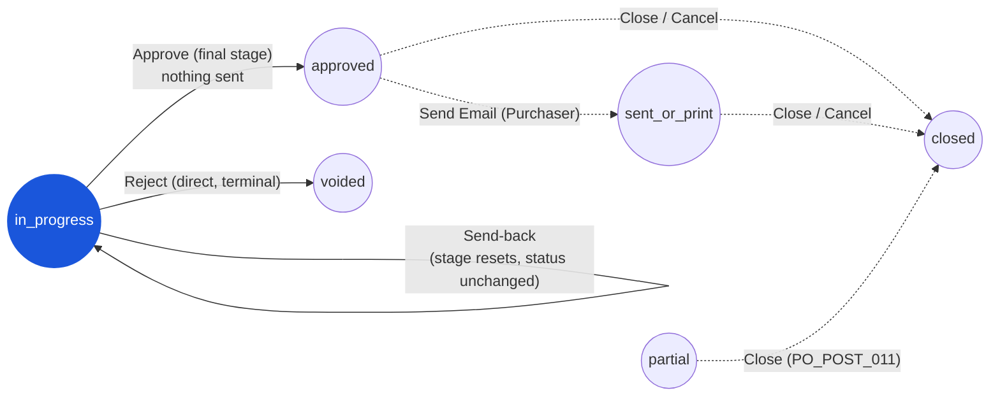

# Purchase Order — User Flow — Procurement Manager

> **At a Glance**
> **Persona:** Procurement Manager &nbsp;·&nbsp; **Module:** [purchase-order](/en/inventory/purchase-order) &nbsp;·&nbsp; **Workflow stages:** Approves at whichever stage the assigned workflow gives them (`in_progress → approved` on the final stage per `PO_POST_004` — approval no longer transmits), send-back (stage resets, `po_status` unchanged, `PO_POST_005`), or reject to `voided` (direct, terminal); Close / Cancel &nbsp;·&nbsp; **Key permissions:** stage-gated approval (`PO_AUTH_011`); swipe-approve (`PO_AUTH_012`)
> **What this persona does:** Acts as an approver on whichever workflow stage is configured for this role. Re-synced 2026-09-22 — delete-in-draft is an owner right, not a Manager right.

> ⚠️ **Corrected this pass — twice over.** The previous version of this page described a Procurement-Manager-specific "high-value approval gate" triggered by `total_amount` exceeding a tenant threshold or a pricelist-deviation percentage, plus an entire "configurational surface" (rule-tuning workbench for vendor ranking, Convert-to-PO grouping, unit-conversion factors, pricelist tolerance, and the threshold itself), a Manager-only "void from any non-terminal state," and bulk void/close actions. The configurational surface, Manager-exclusive void, pricelist-deviation-percentage routing, and bulk actions were not found in current source: a repo-wide search of `carmen-turborepo-backend-v2` and `carmen-inventory-frontend-react` for `segregation`, vendor-ranking, and bulk-action code returned nothing relevant; `enum_stage_role` has no deviation-aware member; and the only path to `voided` is the direct `in_progress → voided` reject, available to whichever approver holds the current stage, not reserved to this role.
>
> **The amount-threshold half of that same claim was itself wrongly dismissed by an earlier correction pass** — a follow-up search confirms `total_amount`-based stage routing is real, just not a Procurement-Manager-specific or PO-specific mechanism: it's the generic workflow `routing_rules` (`tb_workflow.data.routing_rules`, configured from the **Routing** tab of `/system-admin/workflow`, shared by PR/PO/SR) evaluated by `evaluateCondition`/`findNextStep` in `workflows.navagation.service.ts` on every submit/approve. See § 1 and the Permission Matrix below for the corrected picture.

## 1. Role in This Module

The **Procurement Manager** engages with the PO module as a **workflow-stage approver** — the same generic mechanism any `stage_role = approve` user uses. When a PO is submitted (`draft → in_progress`), the workflow definition referenced by `tb_purchase_order.workflow_id` determines how many stages exist and who is assigned to each (`user_action.execute[]`); the Procurement Manager is simply whichever user (or role) the tenant's workflow configuration puts on one or more of those stages. At the final stage, approving authorizes the commitment — `po_status: in_progress → approved`, `approval_date` set (`performApprove` in `purchase-order.logic.ts` L424-436, `PO_POST_004`) — **but does not transmit anything**; sending is the Purchaser's separate **Send Email** step (`PO_POST_004b`). At any non-final stage, approving only advances `workflow_current_stage` (`po_status` stays `in_progress`). The Manager can also **send back** an in-progress PO — this resets `workflow_current_stage` to an earlier stage (typically back to the creator) without changing `po_status` (`PO_POST_005`) — or **reject** it, which is a direct, terminal `in_progress → voided` transition (no intermediate state, no return to `draft`). From a mobile client the Manager can **swipe-approve** several POs at once (`POST .../purchase-orders/swipe-approve`, `PO_AUTH_012`). Like any user with the PO open, the Manager can **Close** an `in_progress` / `approved` / `sent_or_print` / `partial` PO early (`PO_POST_011`) or **Cancel** a `draft` / `in_progress` / `approved` / `sent_or_print` one (`PO_POST_010`) — both write the remaining open quantity to `cancelled_qty`. **Corrected 2026-09-22:** soft-delete-in-draft is **not** a Manager privilege — `remove()` allows only the document's creator or a platform super-admin (`PO_AUTH_005`). **Confirmed, corrected this pass:** the workflow assigned to the PO can carry `routing_rules` that skip or jump stages based on `total_amount` (Σ line `total_price`) — evaluated on every submit/approve, configured generically from the **Routing** tab of `/system-admin/workflow` (shared by PR/PO/SR, not PO- or Manager-specific). No pricelist-deviation-percentage routing field, vendor-ranking configuration, or bulk-action surface was found in current source; treat any such claim elsewhere as unconfirmed design intent rather than live behavior.

### Workflow position (PM approver + override paths)

```mermaid
graph LR
    inprog(("in_progress")):::current -->|"Approve (final stage)<br/>nothing sent"| approved(("approved"))
    inprog -->|"Send-back<br/>(stage resets, status unchanged)"| inprog
    inprog -->|"Reject (direct, terminal)"| voided(("voided"))
    approved -.->|"Send Email (Purchaser)"| sent(("sent_or_print"))
    approved -.->|"Close / Cancel"| closed(("closed"))
    sent -.->|"Close / Cancel"| closed
    partial(("partial")) -.->|"Close (PO_POST_011)"| closed
    classDef current fill:#1a56db,color:#fff,stroke:#1a56db;
```

### Permission Matrix — Action (Procurement Manager)

| Action | Availability |
|---|---|
| View PO | ✅ all statuses |
| Approve at own stage (`in_progress`) | ✅ when assigned via `user_action.execute[]` for the current stage (`PO_AUTH_011`) — authorization itself is not amount-gated, though which stage the cursor reaches can be (workflow `routing_rules`, see § 1) |
| Approve at final stage (`in_progress → approved`) | ✅ when the current stage is the workflow's final stage (`PO_POST_004`); no transmission |
| Swipe-approve a batch (`POST /swipe-approve`) | ✅ for approval-stage users on `in_progress` POs where the caller is an action user (`PO_AUTH_012`); refused for `stage_role = purchase` |
| Send-back (stage resets, `po_status` unchanged) | ✅ when assigned to the current stage (`PO_POST_005`) |
| Reject (`in_progress → voided`, direct, terminal) | ✅ when assigned to the current stage — not exclusive to this role |
| Soft-delete draft (`PO_AUTH_005`) | ❌ unless the Manager created the draft (owner) or is a platform super-admin |
| Send Email / mark-sent (`approved → sent_or_print`) | ✅ no role gate — but this is the Purchaser's step by convention |
| Close (`{in_progress, approved, sent_or_print, partial} → closed`, `PO_POST_011`) | ✅ no role gate in `closePO()` |
| Cancel (`{draft, in_progress, approved, sent_or_print} → closed`) | ✅ no role gate in `cancel()` |
| Edit header / lines (qty, price, tax, FOC) | ❌ (Purchaser scope, `PO_AUTH_002`) |

## 2. Entry Point and Primary Flow

**Entry point:** In-app notification when a submitted PO's workflow stage cursor lands on a stage this user is assigned to, or Sidebar → **Procurement** → **My Approvals** (`/procurement/approval`, `routes/procurement/approval/`), which reads the unified pending queue `GET /api/my-pending` — backed by the SQL view `sys_v_my_pending` that unions PR / PO / SR rows (`bb0000283`, 2026-09-16) — with the **PO** filter chip (`filter = doc_type:po`, `approval-component.tsx`).

**Primary flow (happy path):**

1. Receive the notification. Authorization to act, once the cursor lands on this user's stage, is purely `user_action.execute[]` membership for that stage — not an amount or deviation check. Which stage the cursor reaches, however, can itself reflect the workflow's `routing_rules` skipping or jumping stages by `total_amount` (§ 1), so a high-value PO may traverse a different stage sequence than a low-value one on the same workflow before this notification fires.
2. Open the **PO detail** page from the approval queue. Review the header (vendor, currency, exchange rate, credit term, order and delivery dates) against `PO_VAL_002`–`PO_VAL_006`. Review the linked PR via the bridge table for PR-sourced POs (`PO_XMOD_001`).
3. Walk the **Items** tab, checking the `is_foc` flag, `cancelled_qty` (should be zero at this stage), and per-line `delivery_date`. Re-validate the calculation roll-up: `total_price`, `total_tax`, `total_amount` per `PO_CALC_008`–`PO_CALC_010`.
4. Review the **Attachments** and **Comments** tabs for the vendor quote, the buyer's justification note, and any prior-stage approver comments. The `history` and `workflow_history` JSON columns surface the full chain of `created → submitted → approved` events.
5. Decide, at the item level then the document level (mirrors the e2e-confirmed flow in `403-po-approver-journey.spec.ts`):
   - **Approve** — marks item(s) Approved, then **Approve PO** (the footer button appears only when every marked line resolves to `approved`, `po-footer-action.tsx` `computePoAction`). If this is the final stage: `po_status: in_progress → approved` via `PO_POST_004`, `approval_date` set, `last_action = approved`, `workflow_history` gains a `completed` entry — **no transmission**; the Purchaser sends it afterwards. If not final: `po_status` stays `in_progress`, stage cursor advances.
   - **Send back** — marks item(s) Review, then **Document Send Back** with an optional reason. `workflow_current_stage` resets to an earlier stage; `po_status` stays `in_progress`; `last_action = reviewed`. The reason is appended to `tb_purchase_order_comment`.
   - **Reject** — marks item(s) Reject, then **Document Reject** with an optional reason. `po_status: in_progress → voided`, direct and terminal. `is_active` is not touched by this call.
6. (After final approval) the PO is `approved`; transmission is a later, separate event. If the Manager wants to confirm the vendor received it, `tb_activity` carries the `email_sent` entry (with recipients and outcome) or the "Marked as sent to vendor" entry once the Purchaser has sent it.
7. (Optional, override path) **Close** an `in_progress` / `approved` / `sent_or_print` / `partial` PO when the vendor cannot supply the outstanding balance (`PO_POST_011`) — writes the remainder to `cancelled_qty` and notifies the buyer. No reason field exists on the endpoint; add a comment if one is needed.

## 3. Decision Branches

- **If the escalated PO is technically valid but commercially questionable**: the Manager reviews the vendor quote in **Attachments** and the Purchaser's justification in **Comments**, then approves, sends back with a comment, or rejects — using the same stage-based mechanism as any approver. No separate "commercial escalation" surface was found.
- **If the vendor cannot fulfil an `approved` / `sent_or_print` / `partial` PO**: the Manager (or anyone with the PO open) runs **Close**, writing the remaining open quantity to `cancelled_qty` on each affected line. This lands on `closed`, not `voided` — there is no path from those statuses to `voided`.
- **If a draft PO must be removed**: only its creator (or a super-admin) can **Delete** it (`PO_AUTH_005`, `PO_POST_012` — `remove()` checks `isDocumentOwner`); a Manager who did not create it uses **Cancel** (→ `closed`) instead. A deleted row remains in the database for audit, and the same `po_no` is freed for re-use (the unique index includes `deleted_at`).
- **If several small POs are waiting on the same stage** (mobile): `POST .../purchase-orders/swipe-approve` `{ po_ids[] }` approves every line of each at its current stage and reports per-PO success or the blocking reason (`swipeApproveOne`).

## 4. Exit Point / Handoffs

The Procurement Manager's involvement on a given PO ends at one of the following handoffs.

- **Final approval → back to the Purchaser to send** — `po_status: in_progress → approved` via `PO_POST_004`. Handoff is to the **Purchaser** (Send Email, `PO_POST_004b`) and, in parallel, the **Receiver** may already receive against the `approved` PO; document state at handoff is `approved`. See [03-user-flow-vendor.md](./03-user-flow-vendor.md) for what the vendor sees.
- **Reject → terminal `voided`** — direct transition, no intermediate state. Handoff is to the **Auditor** for post-hoc review only; document state is `voided` (terminal).
- **Send back → revision by the assigned stage owner** — `workflow_current_stage` resets; `po_status` stays `in_progress` (not `draft`). Handoff is to whoever the earlier stage assigns (commonly the Purchaser). The Manager's involvement resumes if the resubmitted PO reaches this stage again.
- **Close** — `{in_progress, approved, sent_or_print, partial} → closed`, remainder written to `cancelled_qty`. Terminal.

Receipt-driven transitions (`{approved, sent_or_print} → partial → completed` via `PO_POST_006`/`PO_POST_007`) are not Procurement Manager actions — they are driven by the **Receiver** through GRN posting.

## 5. References

- Parent overview: [03-user-flow.md](./03-user-flow.md) — global PO state machine and cross-persona handoff table.
- Sibling: [03-user-flow-purchaser.md](./03-user-flow-purchaser.md) — upstream persona who submits the PO and who picks up a send-back at the earlier stage.
- Sibling: [03-user-flow-vendor.md](./03-user-flow-vendor.md) — downstream external party that receives the transmitted PO at `po_status = sent`.
- Sibling: [03-user-flow-audit-config.md](./03-user-flow-audit-config.md) — System Administrator who configures workflow definitions and RBAC bindings; Auditor who reviews the activity log of the Manager's approve / reject / close actions.
- Authorization rules: [02-business-rules.md](./02-business-rules.md) Section 4 — `PO_AUTH_005` (delete-in-draft: owner / super-admin, corrected), `PO_AUTH_007` (reject, corrected), `PO_AUTH_008` (early-close), `PO_AUTH_011` (workflow stage gating), `PO_AUTH_012` (swipe-approve).
- Posting rules: [02-business-rules.md](./02-business-rules.md) Section 5 — `PO_POST_004` (final approval → `approved`, corrected), `PO_POST_004b` (send email / mark sent → `sent_or_print`), `PO_POST_005` (send-back, corrected), `PO_POST_010`/`PO_POST_010b` (cancel / reject, corrected), `PO_POST_011` (early-close), `PO_POST_012` (soft-delete in draft).
- Backend: `../carmen-turborepo-backend-v2/apps/micro-business/src/procurement/purchase-order/purchase-order.logic.ts` (`performApprove`, `swipeApproveOne`, `reject`); `apps/micro-business/src/my-pending/` (unified queue, `sys_v_my_pending`).
- `../carmen/docs/purchase-order-management/purchase-order-module.md` — primary carmen/docs source for the PO module business analysis; treat its RBAC/threshold table as historical design intent, not verified current behavior — see [02-business-rules.md](./02-business-rules.md) § 4 note.
- Related: [purchase-request](/en/inventory/purchase-request) — upstream module; PR-to-PO conversion via the bridge table.
- Related: [good-receive-note](/en/inventory/good-receive-note) — downstream fulfilment whose receipt postings the Manager observes; close interacts with GRN state via `PO_XMOD_003`.
