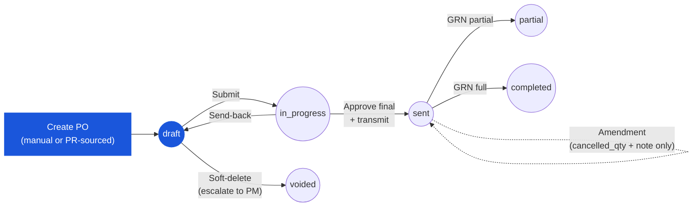

# Purchase Order — User Flow — Purchaser

> **At a Glance**
> **Persona:** Purchaser / Procurement Officer &nbsp;·&nbsp; **Module:** [[purchase-order]] &nbsp;·&nbsp; **Workflow stages:** draft → in_progress → sent (+ amendment on sent) &nbsp;·&nbsp; **Key permissions:** create, edit, submit, transmit, amend, bounce-back
> **What this persona does:** Creates manual or PR-sourced POs, validates pricing and vendor, submits for approval, and transmits to vendor on final approve.

## 1. Role in This Module

The **Purchaser** (also titled **Procurement Officer**) owns the PO from creation through transmission to the vendor — the span from `draft` to `sent`. Two creation paths converge on the same flow: a **manual PO** (`po_type = manual`) raised directly by procurement, and a **PR-sourced PO** (`po_type = purchase_request`) materialised by running Convert-to-PO from the upstream [[purchase-request]] module, which writes one row per (PO line, PR line) pair into the bridge table `tb_purchase_order_detail_tb_purchase_request_detail` ([01-data-model.md](./01-data-model.md) Section 2.5). Once the draft exists the Purchaser fills (or inherits and validates) the header — `vendor_id`, `currency_id`, `exchange_rate`, `credit_term_id`, `order_date`, `delivery_date`, `workflow_id` — and walks each line to verify pricing against the [[vendor-pricelist]], adjust quantity / discount / tax / FOC where authorised, set delivery and payment terms, and submit (`draft → in_progress`, `PO_AUTH_003` and `PO_POST_002`). The Purchaser also holds the transmit action on final approval (`PO_AUTH_006`, `PO_POST_004`), handles amendments to the open PO under the post-`sent` restrictions of `PO_VAL_016`, runs the bounce-back to send the PR back to the Requestor when vendor or spec clarification is unrecoverable, and voids a PO in `draft` when needed (`PO_AUTH_007` reserves void from non-`draft` to the Procurement Manager). The Purchaser operates under `enum_stage_role = purchase` (mirrored from `PR_AUTH_008` on the PR side).

### Workflow position (Purchaser highlighted)

### Permission Matrix — Status × Action (Purchaser)

The Purchaser fully owns the document at `draft` and re-enters on send-back. After `sent` the right to edit collapses to `cancelled_qty` and per-line notes (`PO_VAL_016`). Receipt-driven states (`partial`, `completed`, `closed`) are observed but not directly mutated by the Purchaser. `voided` is reserved for the Procurement Manager (`PO_AUTH_007`).

| Action | draft | in_progress | sent | partial | completed | closed | voided |
|---|---|---|---|---|---|---|---|
| View PO | ✅ | ✅ | ✅ | ✅ | ✅ | ✅ | ✅ |
| Edit header (vendor, currency, terms) | ✅ | ❌ | ❌ | ❌ | ❌ | ❌ | ❌ |
| Add / remove lines | ✅ | ❌ | ❌ | ❌ | ❌ | ❌ | ❌ |
| Edit line qty / price / tax / FOC | ✅ | ❌ | ❌ | ❌ | ❌ | ❌ | ❌ |
| Submit for approval | ✅ (≥1 line + workflow) | ❌ | ❌ | ❌ | ❌ | ❌ | ❌ |
| Self-approve (below threshold) | ❌ | ✅ (`PO_AUTH_004`) | ❌ | ❌ | ❌ | ❌ | ❌ |
| Transmit to vendor | ❌ | ✅ (on final approve, `PO_AUTH_006`) | ❌ | ❌ | ❌ | ❌ | ❌ |
| Set `cancelled_qty` / per-line note (amendment) | ❌ | ❌ | ✅ (`PO_VAL_016`) | ✅ | ❌ | ❌ | ❌ |
| Add Comment / Attachment | ✅ | ✅ | ✅ | ✅ | ✅ | ✅ | ✅ |
| Soft-delete (draft only) | escalate to PM (`PO_AUTH_005`) | ❌ | ❌ | ❌ | ❌ | ❌ | ❌ |
| Void (`PO_AUTH_007`) | ❌ | ❌ | ❌ (PM only) | ❌ (PM only) | ❌ | ❌ | — |
| Early-close (`PO_AUTH_008`) | ❌ | ❌ | ❌ | ❌ (PM / Inv Mgr) | ❌ | — | ❌ |

> ⚠️ **Discrepancy — `IN PROGRESS` not in BRD:** The live UI uses `DRAFT` → `IN PROGRESS` for the FC-approval phase before transmission. BRD `FR-PO-005` defines the flow as `Draft → Sent → Acknowledged → Partial Received → Fully Received → Closed/Cancelled` with no `IN PROGRESS` state. Source: `Test_case/Purchase_Order/Purchaser/INDEX.md` § Status Lifecycle (capture date 2026-04-26). See [02-business-rules.md](./02-business-rules.md) § Status Lifecycle Mapping.

## 2. Entry Point and Primary Flow

**Entry point:** Sidebar → **Purchase Order** module → **Create Purchase Order** for a manual PO, OR Sidebar → **Purchase Request** module → **Approved PRs** queue → **Convert to PO** workbench for a PR-sourced PO. In-app and email notifications "Purchase Request [PR-ID] Ready for PO Conversion" deep-link straight to the workbench. Both paths land the Purchaser on the same PO detail page at `po_status = draft`.

**Primary flow (happy path):**

1. Pick the creation path. For a **manual PO**: from the PO module landing, click **Create Purchase Order** and fill the header (vendor, currency, exchange rate, credit term, order and delivery dates, workflow) on a blank form. For a **PR-sourced PO**: from the Convert-to-PO workbench, select one or more approved PR lines; the system groups them by `(vendor_id, currency_id)` and creates one draft `tb_purchase_order` per group, inserting matching `tb_purchase_order_detail` rows and writing the bridge entries with `pr_detail_qty > 0` per (PO line, PR line) pair (`PO_VAL_014`). The PR-side snapshot — product, UoM, location, delivery point — is denormalised onto the bridge row at conversion time.
2. Open the **draft PO**. The header pre-fills from the vendor master and selected workflow (manual path) or inherits from the source PR(s) (PR-sourced path). Verify `vendor_id` references an active, non-blacklisted vendor (`PO_VAL_002`), `currency_id` and `exchange_rate > 0` (`PO_VAL_003`), `credit_term_id` is set when the vendor requires it (`PO_VAL_005`), and `delivery_date >= order_date` (`PO_VAL_006`). The unique `po_no` is generated by the numbering service (`PO_VAL_001`).
3. Walk each **PO line** in the **Items** tab. For PR-sourced lines the bridge row drives the snapshot; for manual lines the Purchaser picks the product from the catalog. For every line confirm `product_id` is active (`PO_VAL_007`), `order_qty > 0` with `order_unit_id` set (`PO_VAL_008`), and the conversion factor to base UoM is positive (`PO_VAL_009`). FOC lines (`is_foc = true`) are allowed with `price = 0` (`PO_VAL_010`).
4. Validate **pricing against the current vendor pricelist**. The system compares each line's `price` against the active `tb_pricelist_detail` row resolved by `product_id`, vendor, location, and effective date. The deviation indicator flags lines outside the configured tolerance band (e.g. `±5%`). On a deviation the Purchaser can (a) keep the line price and proceed (PR-sourced lines may retain the PR snapshot), (b) refresh to the current pricelist price, or (c) for PR-sourced lines, raise a concern that triggers a bounce-back to the Requestor before submission.
5. Set or confirm **delivery and payment terms** on the header. Payment terms (`credit_term_id`, snapshotted as `credit_term`) come from the vendor master by default; the Incoterm / delivery clause is captured on the header and reflected on each `tb_purchase_order_detail` bridge row's `delivery_point_id`. Adjust per-line `delivery_date` if a staggered schedule is needed. Tax profile and discount rate are validated against `PO_VAL_010` and `PO_VAL_011`.
6. Watch the header totals recalculate. Line subtotal, discount, net, tax, and total are computed per `PO_CALC_001`–`PO_CALC_005`; base-currency dual-posting uses the locked `exchange_rate` via `PO_CALC_006`; FOC lines flow quantity but zero money per `PO_CALC_007`; the header rolls up `total_price`, `total_tax`, `total_amount`, and `total_qty` per `PO_CALC_008`–`PO_CALC_011`; all rounding uses half-up via `PO_CALC_012`.
7. Open the **Attachments** and **Comments** tabs and attach any supporting documents (vendor quote, internal memo) or notes for the approver chain. The activity log records every save event, including header and line changes, via `tb_purchase_order_comment` and `tb_purchase_order_detail_comment`.
8. Run the submit-time check. The PO must have at least one non-soft-deleted line (`PO_VAL_012`), all lines must share the header `vendor_id` and `currency_id` (single-vendor / single-currency invariant, `PO_VAL_013`), and PR-sourced lines must carry the bridge row (`PO_VAL_014`).
9. Click **Submit for approval** (`PO_AUTH_003`, `PO_POST_002`). `po_status` transitions `draft → in_progress`, `last_action = submitted`, `workflow_current_stage` advances to the first approval stage, and `user_action.execute` is populated from the workflow definition. Handoff is to the first-stage approver (typically the Procurement Manager for high-value POs above the tenant threshold; below threshold the Purchaser may hold self-approve rights per `PO_AUTH_004`).
10. On final approval (`in_progress → sent`, `PO_POST_004`), the workflow engine triggers the transmit action. The Purchaser (or the system, if auto-transmit is configured under `PO_AUTH_006`) sends the PO to the vendor via the configured channel — email, EDI, or vendor portal — and the system sets `tb_purchase_order.email` and `approval_date`. `po_status` is now `sent` and the PO is a firm, vendor-facing commitment; the soft budget commitment hardens into a vendor liability.
11. Track the PO on the **Open POs** dashboard. The Purchaser monitors vendor acknowledgement, follows up on delays, and watches the GRN postings (driven by the [[good-receive-note]] module) flip `po_status` from `sent` to `partial` and eventually to `completed` via `PO_POST_006` and `PO_POST_007`. Per-line `received_qty` and the bridge `received_qty` columns update on each GRN post.
12. Handle any post-`sent` amendment requests. Per `PO_VAL_016`, only `cancelled_qty` and per-line notes may be updated after `sent` — material vendor / currency / line changes require voiding the open balance and issuing a new PO. The Purchaser writes a comment for every amendment so the activity log preserves the change history.

## 3. Decision Branches

- **If a PR-sourced line's pricelist deviation exceeds tolerance** (current price vs the PR's snapshotted `pricelist_price` outside the `±X%` band): the Purchaser sees the deviation flag in Step 4 and chooses one of three paths. (a) **Accept snapshot** — the PO line inherits the PR-frozen price; the PO submits with that price. (b) **Refresh to current** — the PO line is updated to the current `tb_pricelist_detail` price before submission; the PR snapshot is unchanged but the PO records the new price. (c) **Bounce-back to Requestor** — the Purchaser abandons conversion for the affected line(s) and triggers the standard PR send-back path; `pr_status` returns to `draft`, the soft commitment is released, and the line re-enters the PR approver chain after the Requestor revises. The bounce-back reason is captured in `tb_purchase_request_comment` for audit. See [[purchase-request]] Section "Decision Branches" for the receiving-side flow.
- **If a manual-PO line has no vendor allocation or unknown pricelist match**: the line cannot pass `PO_VAL_002` / `PO_VAL_007` until a valid vendor + product + price is set. The Purchaser opens the vendor and product pickers, selects the correct combination, and the system writes the snapshotted vendor and pricelist context onto the line. Manual POs do not require a bridge row (`PO_VAL_014` applies only when `po_type = purchase_request`).
- **If only some of the selected PR lines should ship now (partial PR conversion)**: in the Convert-to-PO workbench (Step 1), the Purchaser ticks only the lines (and converted quantities) to ship in this round; unticked lines or unticked quantity remain on the source PR as open balance. The bridge table records exactly which PR-line → PO-line linkages were created with what quantity. The source PR stays at `pr_status = approved` until every line is fully bridged or cancelled, then flips to `completed` (per `PR_POST_007`). The Purchaser (or a teammate) can run a second conversion round later from the same Approved PRs queue.
- **If an amendment is needed after `po_status = sent`** (price correction, quantity reduction, delivery-date shift agreed with the vendor): per `PO_VAL_016`, only `cancelled_qty` and per-line notes may be updated post-`sent`. For a quantity reduction the Purchaser writes the agreed remainder to `cancelled_qty` so `received_qty + cancelled_qty = order_qty` for the affected lines, then logs the amendment in `tb_purchase_order_comment`. For a material change (different price, different product, different vendor) the open balance must be voided via the Procurement Manager (`PO_AUTH_007`) and a fresh PO raised. Amendments must be communicated to the vendor through the channel originally used to transmit (email / EDI / portal).
- **If the Purchaser needs to void in draft** (PO was raised in error, requirement changed before submission): from the PO detail page in `po_status = draft`, the Purchaser can soft-delete (`PO_AUTH_005` reserves hard-delete-in-draft to the Procurement Manager; the Purchaser's path is to abandon-as-draft by leaving the PO in `draft` indefinitely, or escalate to the Procurement Manager for soft-delete). Void from `in_progress`, `sent`, or `partial` is **not available** to the Purchaser — it requires the Procurement Manager (`PO_AUTH_007`, `PO_POST_010`).
- **If vendor clarification surfaces during draft preparation** (spec ambiguity, MOQ conflict, lead-time impossible): for PR-sourced POs the Purchaser does **not** edit PR content — they trigger the PR-side send-back, which returns the PR to the Requestor at `draft` with the clarification reason logged in `tb_purchase_request_comment`. The Requestor revises and re-submits through the full PR approver chain; the PR re-enters the Approved PRs queue and the Purchaser picks it up again for a fresh Convert-to-PO. For manual POs the Purchaser handles the clarification with the vendor directly and edits the draft PO before submission — no upstream PR exists to bounce back.

## 4. Exit Point / Handoffs

The Purchaser's involvement on a given PO ends at one of four documented points; the document state at each handoff is anchored to the `enum_purchase_order_doc_status` value at transfer.

- **Standard submit → approval** — the Purchaser submits the PO and `po_status` transitions `draft → in_progress` (`PO_AUTH_003`, `PO_POST_002`). Handoff is to the first-stage approver (typically the **Procurement Manager** for high-value POs above the tenant threshold; below threshold the Purchaser may self-approve if the workflow permits). The Purchaser's responsibility resumes if the approver issues a send-back (Step 9 above re-routes the PO to `draft` per `PO_POST_005`).
- **Final approval → transmit to vendor** — on final-stage approval (`in_progress → sent`, `PO_POST_004`), the Purchaser (or the auto-transmit handler) sends the PO to the **Vendor** through email / EDI / portal under `PO_AUTH_006`. Handoff is to the Vendor; document state at handoff is `sent`. The PO is now a firm commitment and the soft budget commitment hardens. See the Vendor persona file for the external-side flow.
- **Amendment loop** — when a request to amend a `sent` PO comes in (from the Receiver, Finance, or the Vendor), the Purchaser re-enters the flow at the edit step under the constraints of `PO_VAL_016` (only `cancelled_qty` and per-line notes are mutable post-`sent`). Material changes route to the **Procurement Manager** for void + re-raise; minor changes (quantity short-supply, note) are handled inline by the Purchaser and the amendment is logged in `tb_purchase_order_comment`. The PO does not change status — it remains `sent` or `partial` until the next GRN posting.
- **Void in draft / bounce-back** — when a PO cannot proceed, the Purchaser exits the flow by either (a) escalating to the **Procurement Manager** for a soft-delete in `draft` (`PO_AUTH_005`) or a void from a higher state (`PO_AUTH_007`, `PO_POST_010`) — terminal state `voided` — or (b) for PR-sourced POs, triggering the PR-side send-back, which returns the source PR to the **Requestor** at `pr_status = draft` (`PR_POST_003` on the PR side) and abandons the PO draft. The Requestor revises and re-submits; the PR re-enters the approver chain and eventually returns to the Purchaser's queue for a fresh Convert-to-PO. See [[purchase-request]] § Requestor flow for the receiving side of the bounce-back.

Receipt-driven transitions (`sent → partial → completed` via `PO_POST_006`/`PO_POST_007` and `partial → closed` via `PO_POST_011`) are not Purchaser actions — they are driven by the **Receiver** through GRN posting and, for early closure, the **Procurement Manager** or **Inventory Manager** (`PO_AUTH_008`). The Purchaser monitors these transitions on the Open POs dashboard but does not directly trigger them.

## 5. References

- Parent overview: [03-user-flow.md](./03-user-flow.md) — global PO state machine and cross-persona handoff table.
- Bridge table: [01-data-model.md](./01-data-model.md) Section 2.5 — `tb_purchase_order_detail_tb_purchase_request_detail` (many-to-many PO↔PR line linkage supporting PR consolidation and partial conversion).
- Validation rules: [02-business-rules.md](./02-business-rules.md) Section 2 — `PO_VAL_001`–`PO_VAL_016` (header, line, and submit-time checks referenced throughout this flow).
- Calculation rules: [02-business-rules.md](./02-business-rules.md) Section 3 — `PO_CALC_001`–`PO_CALC_012` (line and header roll-ups, FOC handling, base-currency dual-posting, rounding).
- Authorization rules: [02-business-rules.md](./02-business-rules.md) Section 4 — `PO_AUTH_001`–`PO_AUTH_003` (Purchaser create/edit/submit), `PO_AUTH_006` (transmit to vendor).
- Posting rules: [02-business-rules.md](./02-business-rules.md) Section 5 — `PO_POST_002` (submit), `PO_POST_004` (final approval and transmit), `PO_POST_006` / `PO_POST_007` (receipt-driven transitions).
- `../carmen/docs/purchase-order-management/purchase-order-module.md` — primary carmen/docs source for the PO module business analysis, state diagram, and creation flows.
- Sibling: [03-user-flow-procurement-manager.md](./03-user-flow-procurement-manager.md) — escalation target for high-value approval, void from non-`draft`, and the Manager's override authority.
- Sibling: [03-user-flow-vendor.md](./03-user-flow-vendor.md) — downstream external party that receives the transmitted PO at `po_status = sent`.
- Related: [[purchase-request]] — upstream module; PR-to-PO conversion via the bridge table, and the bounce-back target when vendor / spec clarification is unrecoverable.
- Related: [[vendor-pricelist]] — pricing lookup and deviation reference used in Step 4 above.
- Related: [[good-receive-note]] — downstream fulfilment that drives the `sent → partial → completed` receipt transitions monitored by the Purchaser.
