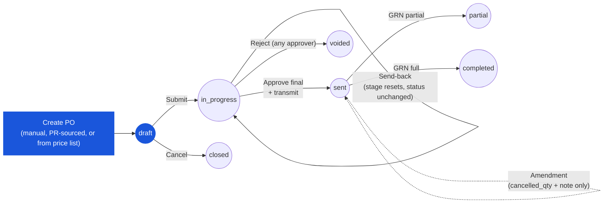

# Purchase Order — User Flow — Purchaser

> **At a Glance**
> **Persona:** Purchaser / Procurement Officer &nbsp;·&nbsp; **Module:** [purchase-order](/en/inventory/purchase-order) &nbsp;·&nbsp; **Workflow stages:** draft → in_progress → sent (+ amendment on sent) &nbsp;·&nbsp; **Key permissions:** create, edit, submit, transmit, amend, bounce-back
> **What this persona does:** Creates manual or PR-sourced POs, validates pricing and vendor, submits for approval, and transmits to vendor on final approve.

## 1. Role in This Module

The **Purchaser** (also titled **Procurement Officer**) owns the PO from creation through transmission to the vendor — the span from `draft` to `sent`. Three creation paths exist: a **manual PO** (`po_type = manual`) raised directly by procurement; a **PR-sourced PO** (`po_type = purchase_request`) materialised by the Convert-to-PO dialog **inside the Purchase Order module** (`po-from-pr-dialog.tsx` — a 2-step dialog: select one or more whole approved PRs, then review the PO group(s) the server has already computed), which writes one row per (PO line, PR line) pair into the bridge table `tb_purchase_order_detail_tb_purchase_request_detail` ([01-data-model.md](./01-data-model.md) Section 2.5); and a **price-list-sourced PO** (`po_type = pricelist`) built through a 4-step wizard (Order Details → Select Vendors → Select Items → Review & Confirm, `routes/procurement/purchase-order/from-price-list/`) that bypasses the PR stage entirely. Once the draft exists the Purchaser fills (or inherits and validates) the header — `vendor_id`, `currency_id`, `exchange_rate`, `credit_term_id`, `order_date`, `delivery_date`, `workflow_id` — and walks each line to verify pricing against the [vendor-pricelist](/en/inventory/vendor-pricelist), adjust quantity / discount / tax / FOC where authorised, set delivery and payment terms, and submit (`draft → in_progress`, `PO_AUTH_003` and `PO_POST_002`). The Purchaser also holds the transmit action on final approval (`PO_AUTH_006`, `PO_POST_004` — bundled into the same approve call, not a separate step), handles amendments to the open PO under the post-`sent` restrictions of `PO_VAL_016`, and manages a `draft` PO via **Cancel** (which lands on `closed`, not `voided` — there is no distinct "void" action available in `draft`). The Purchaser operates under `enum_stage_role = purchase`.

> ⚠️ **Corrected this pass:** the previous version of this page described the conversion as a "Convert-to-PO workbench" reached from the **Purchase Request** module's Approved-PRs queue, with per-line ticking of PR lines and converted quantities, a per-line pricelist-deviation-tolerance indicator, and a `(vendor_id, currency_id)`-only grouping key. None of that matches current source: the real dialog lives in the **Purchase Order** module, operates on whole selected PRs (not per-line quantities), has no per-line deviation-tolerance UI, and groups by `(vendor_id, delivery_date, currency_id)` — confirmed via `buildPoGroupKey` in `purchase-order.service.ts`. Bruno lists `Permissions: None` on both `group-pr` and `confirm-pr`; the frontend dialog chain has no `hasPermission` check. This matches the fact already established for the `purchase-request` module's prior resync pass.

### Workflow position (Purchaser highlighted)

```mermaid
graph LR
    create["Create PO<br/>(manual, PR-sourced, or from price list)"]:::current --> draft(("draft")):::current
    draft -->|"Submit"| inprog(("in_progress"))
    draft -->|"Cancel"| closed(("closed"))
    inprog -->|"Send-back<br/>(stage resets, status unchanged)"| inprog
    inprog -->|"Approve final<br/>+ transmit"| sent(("sent"))
    inprog -->|"Reject (any approver)"| voided(("voided"))
    sent -.->|"Amendment<br/>(cancelled_qty + note only)"| sent
    sent -->|"GRN partial"| partial(("partial"))
    sent -->|"GRN full"| completed(("completed"))
    classDef current fill:#1a56db,color:#fff,stroke:#1a56db;
```

### Permission Matrix — Status × Action (Purchaser)

The Purchaser fully owns the document at `draft`. A send-back keeps the PO at `in_progress` (only the stage cursor resets) — it does not return to `draft`. After `sent` the right to edit collapses to `cancelled_qty` and per-line notes (`PO_VAL_016`). Receipt-driven states (`partial`, `completed`, `closed`) are observed but not directly mutated by the Purchaser. `voided` is only reachable from `in_progress` via reject, performed by whichever approver holds the current stage — not exclusively the Procurement Manager.

| Action | draft | in_progress | sent | partial | completed | closed | voided |
|---|---|---|---|---|---|---|---|
| View PO | ✅ | ✅ | ✅ | ✅ | ✅ | ✅ | ✅ |
| Edit header (vendor, currency, terms) | ✅ | ❌ | ❌ | ❌ | ❌ | ❌ | ❌ |
| Add / remove lines | ✅ | ❌ | ❌ | ❌ | ❌ | ❌ | ❌ |
| Edit line qty / price / tax / FOC | ✅ | ❌ | ❌ | ❌ | ❌ | ❌ | ❌ |
| Submit for approval | ✅ (≥1 line + workflow) | ❌ | ❌ | ❌ | ❌ | ❌ | ❌ |
| Approve at own stage (when assigned) | ❌ | ✅ (`PO_AUTH_011` — no amount threshold gates this) | ❌ | ❌ | ❌ | ❌ | ❌ |
| Transmit to vendor | ❌ | ✅ (bundled into final-stage approve, `PO_AUTH_006`) | ❌ | ❌ | ❌ | ❌ | ❌ |
| Set `cancelled_qty` / per-line note (amendment) | ❌ | ❌ | ✅ (`PO_VAL_016`) | ✅ | ❌ | ❌ | ❌ |
| Add Comment / Attachment | ✅ | ✅ | ✅ | ✅ | ✅ | ✅ | ✅ |
| Soft-delete (draft only) | escalate to PM (`PO_AUTH_005`) | ❌ | ❌ | ❌ | ❌ | ❌ | ❌ |
| Cancel (→ `closed`) | ✅ | ✅ | ✅ | ❌ | ❌ | — | ❌ |
| Reject (→ `voided`, when assigned to the current stage) | ❌ | ✅ | ❌ | ❌ | ❌ | ❌ | — |
| Close (`PO_AUTH_008`) | ❌ | ✅ | ✅ | ✅ (PM / Inv Mgr) | ❌ | — | ❌ |

> ⚠️ **Corrected this pass:** the previous version of this table gated approval on "below threshold" self-approval and reserved "Void" for the Procurement Manager alone from `sent`/`partial`. Neither concept exists in current source — see [02-business-rules.md](./02-business-rules.md) § 4 note. The `IN PROGRESS` status itself is real (confirmed by the `enum_purchase_order_doc_status` enum and the live badge text in e2e specs); it is simply not gated by an amount threshold.

## 2. Entry Point and Primary Flow

**Entry point:** Sidebar → **Purchase Order** module → **Create Purchase Order** for a manual PO or a from-price-list PO, OR from within the **Purchase Order** module's Convert-to-PO dialog (`po-from-pr-dialog.tsx`) for a PR-sourced PO. All three paths land the Purchaser on a PO detail page at `po_status = draft`.

**Primary flow (happy path):**

1. Pick the creation path. For a **manual PO**: from the PO module landing, click **Create Purchase Order** and fill the header (vendor, currency, exchange rate, credit term, order and delivery dates, workflow) on a blank form. For a **PR-sourced PO**: open the Convert-to-PO dialog and (step 1) select one or more whole approved PRs; (step 2) review the PO group(s) the server has already computed — the backend groups the selected PRs' lines by `(vendor_id, delivery_date, currency_id)` (`buildPoGroupKey`) and returns one PO group per unique combination via `POST .../purchase-orders/group-pr`; confirming creates the draft PO(s) via `POST .../purchase-orders/confirm-pr`, writing the bridge entries with `pr_detail_qty > 0` per (PO line, PR line) pair (`PO_VAL_014`). There is no per-line quantity or per-line deviation UI in this dialog — selection is whole-PR, and grouping/consolidation happens server-side. For a **price-list-sourced PO**: run the 4-step from-price-list wizard (Order Details → Select Vendors → Select Items → Review & Confirm), which has no upstream PR at all. The PR-side snapshot — product, UoM, location, delivery point — is denormalised onto the bridge row at conversion time for the PR-sourced path.
2. Open the **draft PO**. The header pre-fills from the vendor master and selected workflow (manual path) or inherits from the source PR(s) (PR-sourced path). Verify `vendor_id` references an active, non-blacklisted vendor (`PO_VAL_002`), `currency_id` and `exchange_rate > 0` (`PO_VAL_003`), `credit_term_id` is set when the vendor requires it (`PO_VAL_005`), and `delivery_date >= order_date` (`PO_VAL_006`). The unique `po_no` is generated by the numbering service (`PO_VAL_001`).
3. Walk each **PO line** in the **Items** tab. For PR-sourced lines the bridge row drives the snapshot; for manual lines the Purchaser picks the product from the catalog. For every line confirm `product_id` is active (`PO_VAL_007`), `order_qty > 0` with `order_unit_id` set (`PO_VAL_008`), and the conversion factor to base UoM is positive (`PO_VAL_009`). FOC lines (`is_foc = true`) are allowed with `price = 0` (`PO_VAL_010`).
4. Review pricing. **Unverified this pass:** whether the create/edit screen exposes a pricelist-deviation indicator or tolerance band was not directly confirmed against the current PO form components — treat any specific tolerance percentage or per-line deviation-override UI described elsewhere as unconfirmed rather than fact.
5. Set or confirm **delivery and payment terms** on the header. Payment terms (`credit_term_id`, snapshotted as `credit_term`) come from the vendor master by default; the Incoterm / delivery clause is captured on the header and reflected on each `tb_purchase_order_detail` bridge row's `delivery_point_id`. Adjust per-line `delivery_date` if a staggered schedule is needed. Tax profile and discount rate are validated against `PO_VAL_010` and `PO_VAL_011`.
6. Watch the header totals recalculate. Line subtotal, discount, net, tax, and total are computed per `PO_CALC_001`–`PO_CALC_005`; base-currency dual-posting uses the locked `exchange_rate` via `PO_CALC_006`; FOC lines flow quantity but zero money per `PO_CALC_007`; the header rolls up `total_price`, `total_tax`, `total_amount`, and `total_qty` per `PO_CALC_008`–`PO_CALC_011`; all rounding uses half-up via `PO_CALC_012`.
7. Open the **Attachments** and **Comments** tabs and attach any supporting documents (vendor quote, internal memo) or notes for the approver chain. The activity log records every save event, including header and line changes, via `tb_purchase_order_comment` and `tb_purchase_order_detail_comment`.
8. Run the submit-time check. The PO must have at least one non-soft-deleted line (`PO_VAL_012`), all lines must share the header `vendor_id` and `currency_id` (single-vendor / single-currency invariant, `PO_VAL_013`), and PR-sourced lines must carry the bridge row (`PO_VAL_014`).
9. Click **Submit for approval** (`PO_AUTH_003`, `PO_POST_002`). `po_status` transitions `draft → in_progress`, `last_action = submitted`, `workflow_current_stage` advances to the first approval stage, and `user_action.execute` is populated from the workflow definition. Handoff is to whichever user(s) the workflow's first stage assigns — a single-stage workflow may assign the Purchaser's own stage, letting the same user submit and later approve; there is no amount-threshold gate.
10. On final approval (`in_progress → sent`, `PO_POST_004`), the same approve call transmits the PO in one step — there is no separate manual "Send to Vendor" action. The system sets `tb_purchase_order.email` and `approval_date` and the channel (email / EDI / vendor portal) fires per tenant configuration. `po_status` is now `sent` and the PO is a firm, vendor-facing commitment.
11. Track the PO on the **Open POs** dashboard. The Purchaser follows up on delays and watches the GRN postings (driven by the [good-receive-note](/en/inventory/good-receive-note) module) flip `po_status` from `sent` to `partial` and eventually to `completed` via `PO_POST_006` and `PO_POST_007`. Per-line `received_qty` and the bridge `received_qty` columns update on each GRN post. **Unverified:** whether the system captures a distinct vendor-acknowledgement event was not confirmed this pass.
12. Handle any post-`sent` amendment requests. Per `PO_VAL_016`, only `cancelled_qty` and per-line notes may be updated after `sent` — material vendor / currency / line changes require voiding the open balance and issuing a new PO. The Purchaser writes a comment for every amendment so the activity log preserves the change history.

## 3. Decision Branches

- **If a manual-PO line has no vendor allocation or unknown pricelist match**: the line cannot pass `PO_VAL_002` / `PO_VAL_007` until a valid vendor + product + price is set. The Purchaser opens the vendor and product pickers, selects the correct combination, and the system writes the snapshotted vendor and pricelist context onto the line. Manual POs do not require a bridge row (`PO_VAL_014` applies only when `po_type = purchase_request`).
- **If only some approved PRs should convert now**: the Convert-to-PO dialog selects whole PRs, not individual lines or partial quantities — there is no per-line ticking or convert-quantity control in the current dialog. Selecting a subset of the approved PRs in step 1 leaves the unselected PRs untouched for a later conversion round; a fully-selected PR's lines all flow into the grouped PO(s) computed in step 2.
- **If an amendment is needed after `po_status = sent`** (price correction, quantity reduction, delivery-date shift agreed with the vendor): per `PO_VAL_016`, only `cancelled_qty` and per-line notes may be updated post-`sent`. For a quantity reduction the Purchaser writes the agreed remainder to `cancelled_qty` so `received_qty + cancelled_qty = order_qty` for the affected lines, then logs the amendment in `tb_purchase_order_comment`. For a material change (different price, different product, different vendor) the PO is ended via **Cancel** (`draft`/`in_progress`/`sent → closed`) and a fresh PO raised — there is no distinct "void" action for a `sent` PO.
- **If the Purchaser needs to end a `draft` PO** (raised in error, requirement changed before submission): **Cancel** is available at `draft` (as at `in_progress` and `sent`) and lands on `closed`, not `voided` — there is no distinct void action reachable from `draft`. Hard soft-delete-in-draft is reserved to the Procurement Manager (`PO_AUTH_005`). The only path to `voided` at all is a direct, terminal `in_progress → voided` reject by whichever approver holds the current stage.

## 4. Exit Point / Handoffs

The Purchaser's involvement on a given PO ends at one of the following documented points; the document state at each handoff is anchored to the `enum_purchase_order_doc_status` value at transfer.

- **Standard submit → approval** — the Purchaser submits the PO and `po_status` transitions `draft → in_progress` (`PO_AUTH_003`, `PO_POST_002`). Handoff is to whichever user(s) the workflow's first stage assigns. The Purchaser's responsibility resumes if an approver sends the PO back — this keeps `po_status = in_progress` and only resets `workflow_current_stage` (`PO_POST_005`); it does not return the PO to `draft`.
- **Final approval → transmit to vendor** — on final-stage approval (`in_progress → sent`, `PO_POST_004`), the same call sends the PO to the **Vendor** through email / EDI / portal under `PO_AUTH_006` — there is no separate manual transmit step. Handoff is to the Vendor; document state at handoff is `sent`.
- **Amendment loop** — when a request to amend a `sent` PO comes in, the Purchaser re-enters the flow at the edit step under the constraints of `PO_VAL_016` (only `cancelled_qty` and per-line notes are mutable post-`sent`). Material changes are handled by cancelling the PO (`sent → closed`) and raising a fresh one; minor changes (quantity short-supply, note) are handled inline by the Purchaser and logged in `tb_purchase_order_comment`.
- **Cancel / end the PO** — the Purchaser (or any user with access; no confirmed role restriction beyond the generic PO permission) can Cancel a `draft`, `in_progress`, or `sent` PO, landing on `closed` with the remainder written to `cancelled_qty`. The only path to the distinct `voided` status is a direct, terminal reject from `in_progress` by whichever approver holds the current stage — there is no "escalate to the Procurement Manager for a void" step for a `draft`, `sent`, or `partial` PO.

Receipt-driven transitions (`sent → partial → completed` via `PO_POST_006`/`PO_POST_007` and `{sent, partial, in_progress} → closed` via `PO_POST_011`) are not Purchaser actions — they are driven by the **Receiver** through GRN posting and, for early closure, the Inventory Manager (`PO_AUTH_008`). The Purchaser monitors these transitions on the Open POs dashboard but does not directly trigger them.

## 5. References

- Parent overview: [03-user-flow.md](./03-user-flow.md) — global PO state machine and cross-persona handoff table.
- Bridge table: [01-data-model.md](./01-data-model.md) Section 2.5 — `tb_purchase_order_detail_tb_purchase_request_detail` (many-to-many PO↔PR line linkage supporting PR consolidation and partial conversion).
- Validation rules: [02-business-rules.md](./02-business-rules.md) Section 2 — `PO_VAL_001`–`PO_VAL_016` (header, line, and submit-time checks referenced throughout this flow).
- Calculation rules: [02-business-rules.md](./02-business-rules.md) Section 3 — `PO_CALC_001`–`PO_CALC_012` (line and header roll-ups, FOC handling, base-currency dual-posting, rounding).
- Authorization rules: [02-business-rules.md](./02-business-rules.md) Section 4 — `PO_AUTH_001`–`PO_AUTH_003` (Purchaser create/edit/submit), `PO_AUTH_006` (transmit to vendor), `PO_AUTH_007` (reject, corrected).
- Posting rules: [02-business-rules.md](./02-business-rules.md) Section 5 — `PO_POST_002` (submit), `PO_POST_004` (final approval and transmit), `PO_POST_005` (send-back, corrected), `PO_POST_006` / `PO_POST_007` (receipt-driven transitions), `PO_POST_010`/`PO_POST_010b` (cancel / reject, corrected).
- `../carmen/docs/purchase-order-management/purchase-order-module.md` — primary carmen/docs source for the PO module business analysis; treat its state diagram and RBAC/threshold claims as historical design intent, not verified current behavior.
- Sibling: [03-user-flow-procurement-manager.md](./03-user-flow-procurement-manager.md) — same generic approver mechanism at whichever stage the workflow assigns.
- Sibling: [03-user-flow-vendor.md](./03-user-flow-vendor.md) — downstream external party that receives the transmitted PO at `po_status = sent`.
- Related: [purchase-request](/en/inventory/purchase-request) — upstream module; PR-to-PO conversion via the bridge table.
- Related: [vendor-pricelist](/en/inventory/vendor-pricelist) — pricing lookup used at conversion / creation time.
- Related: [good-receive-note](/en/inventory/good-receive-note) — downstream fulfilment that drives the `sent → partial → completed` receipt transitions monitored by the Purchaser.
