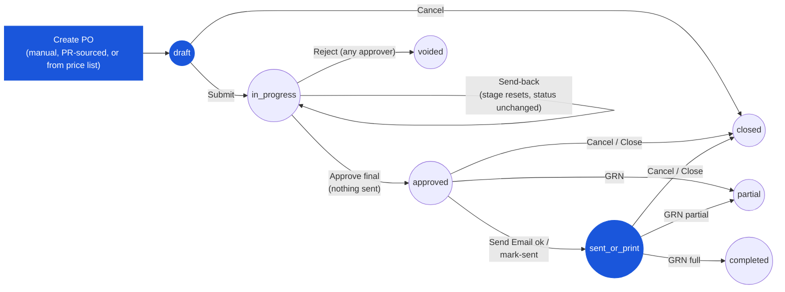

# Purchase Order — User Flow — Purchaser

> **At a Glance**
> **Persona:** Purchaser / Procurement Officer &nbsp;·&nbsp; **Module:** [purchase-order](/en/inventory/purchase-order) &nbsp;·&nbsp; **Workflow stages:** draft → in_progress → approved → sent_or_print (Send Email) &nbsp;·&nbsp; **Key permissions:** create, edit, submit, send email, cancel, delete own draft
> **What this persona does:** Creates manual, PR-sourced or price-list POs, validates pricing and vendor, submits for approval, and — once the PO is `approved` — emails it to the vendor, which is the step that moves it to `sent_or_print`. Re-synced 2026-09-22.

## 1. Role in This Module

The **Purchaser** (also titled **Procurement Officer**) owns the PO from creation through transmission to the vendor — the span from `draft` to `sent_or_print`. Three creation paths exist, all reached from the **Create Purchase Order** dialog (`po-create-dialog.tsx`): a **manual PO** (`po_type = manual`, `/procurement/purchase-order/new`) raised directly by procurement; a **PR-sourced PO** (`po_type = purchase_request`) materialised by the 3-step **From PR** page `/procurement/purchase-order/from-pr` (`step-select-pr.tsx` — pick one or more whole approved PRs; `step-review-group.tsx` — review the PO group(s) the server computed via `group-pr`; `step-result.tsx` — the created PO(s) after `confirm-pr`), which writes one row per (PO line, PR line) pair into the bridge table `tb_purchase_order_detail_tb_purchase_request_detail` ([01-data-model.md](./01-data-model.md) Section 2.3); and a **price-list-sourced PO** (`po_type = pricelist`) built through a 4-step wizard (Order Details → Select Vendors → Select Items → Review & Confirm, `routes/procurement/purchase-order/from-price-list/`) that bypasses the PR stage entirely. Once the draft exists the Purchaser fills (or inherits and validates) the header — `vendor_id`, `currency_id`, `exchange_rate`, `credit_term_id`, `order_date`, `delivery_date`, `delivery_point_id` (header-level since 2026-09-15), `workflow_id` — and walks each line (one product **per delivery location** — a product for two stores is two lines) to verify pricing against the [vendor-pricelist](/en/inventory/vendor-pricelist), adjust quantity / discount / tax / FOC where authorised, and submit (`draft → in_progress`, `PO_AUTH_003` and `PO_POST_002`). Approval ends at `approved` (`PO_POST_004`); the Purchaser then opens **Send Email** on the header (`po-send-email-dialog.tsx`, `use-po-send-email.ts`) to email the PO — optionally with the PDF — to the vendor, which is what moves it to `sent_or_print` (`PO_AUTH_006`, `PO_POST_004b`). The Purchaser also holds **Cancel** on a `draft` / `in_progress` / `approved` / `sent_or_print` PO (lands on `closed`, not `voided`) and may **Delete** a draft they created (`PO_AUTH_005` — owner or super-admin). The Purchaser operates under `enum_stage_role = purchase` / `create`.

> ⚠️ **Corrected 2026-09-22:** the previous version bundled "transmit to vendor" into the final approve call. At HEAD final approval lands on `approved` and transmission is the separate **Send Email** action (or the API-only `mark-sent`). Earlier corrections still stand: the conversion lives in the **Purchase Order** module (now a page, `/procurement/purchase-order/from-pr`, not a dialog), operates on whole selected PRs (not per-line quantities), has no per-line deviation-tolerance UI, and groups by `(vendor_id, delivery_date, currency_id)` — `buildPoGroupKey` in `purchase-order.service.ts`. The backend additionally accepts `delivery_date` / `delivery_point_id` / `note` overrides on `group-pr` / `confirm-pr` (2026-09-15), but the React page does not send them yet. Bruno lists `Permissions: None` on both endpoints; the page has no `hasPermission` check.

### Workflow position (Purchaser highlighted)

```mermaid
graph LR
    create["Create PO<br/>(manual, PR-sourced, or from price list)"]:::current --> draft(("draft")):::current
    draft -->|"Submit"| inprog(("in_progress"))
    draft -->|"Cancel"| closed(("closed"))
    inprog -->|"Send-back<br/>(stage resets, status unchanged)"| inprog
    inprog -->|"Approve final<br/>(nothing sent)"| approved(("approved"))
    inprog -->|"Reject (any approver)"| voided(("voided"))
    approved -->|"Send Email ok /<br/>mark-sent"| sent(("sent_or_print")):::current
    approved -->|"Cancel / Close"| closed
    sent -->|"Cancel / Close"| closed
    approved -->|"GRN"| partial(("partial"))
    sent -->|"GRN partial"| partial
    sent -->|"GRN full"| completed(("completed"))
    classDef current fill:#1a56db,color:#fff,stroke:#1a56db;
```

### Permission Matrix — Status × Action (Purchaser)

The Purchaser fully owns the document at `draft`. A send-back keeps the PO at `in_progress` (only the stage cursor resets) — it does not return to `draft`; re-submitting is accepted because `submit()` matches `in_progress + last_action = reviewed`. From `approved` onward the header and lines are read-only; the Purchaser's remaining levers are **Send Email**, **Cancel**, **Close**, and comments. Receipt-driven states (`partial`, `completed`) are observed but not directly mutated by the Purchaser. `voided` is only reachable from `in_progress` via reject, performed by whichever approver holds the current stage — not exclusively the Procurement Manager.

| Action | draft | in_progress | approved | sent_or_print | partial | completed | closed | voided |
|---|---|---|---|---|---|---|---|---|
| View PO | ✅ | ✅ | ✅ | ✅ | ✅ | ✅ | ✅ | ✅ |
| Edit header (vendor, currency, terms, delivery point) | ✅ | ❌ | ❌ | ❌ | ❌ | ❌ | ❌ | ❌ |
| Add / remove lines (one location per line) | ✅ | ❌ | ❌ | ❌ | ❌ | ❌ | ❌ | ❌ |
| Edit line qty / price / tax / FOC | ✅ | ❌ | ❌ | ❌ | ❌ | ❌ | ❌ | ❌ |
| Dry-run rules (`POST /verify`) | ✅ | ✅ | — | — | — | — | — | — |
| Submit for approval | ✅ (≥1 line + workflow) | ✅ only after a send-back (`last_action = reviewed`) | ❌ | ❌ | ❌ | ❌ | ❌ | ❌ |
| Approve at own stage (when assigned) | ❌ | ✅ (`PO_AUTH_011` — authorization itself is not amount-gated, though which stage this is can be, via workflow `routing_rules`) | ❌ | ❌ | ❌ | ❌ | ❌ | ❌ |
| Send Email to vendor (`PO_AUTH_006`) | ❌ | ❌ | ✅ (→ `sent_or_print`) | ✅ (re-send, logs only) | ✅ | ✅ | ✅ | ❌ |
| Mark sent (API only) | ❌ | ❌ | ✅ | ❌ | ❌ | ❌ | ❌ | ❌ |
| Add Comment / Attachment | ✅ | ✅ | ✅ | ✅ | ✅ | ✅ | ✅ | ✅ |
| Soft-delete (`PO_AUTH_005`) | ✅ if owner (or super-admin) | ❌ | ❌ | ❌ | ❌ | ❌ | ❌ | ❌ |
| Cancel (→ `closed`) | ✅ | ✅ | ✅ | ✅ | ❌ | ❌ | — | ❌ |
| Reject (→ `voided`, when assigned to the current stage) | ❌ | ✅ | ❌ | ❌ | ❌ | ❌ | ❌ | — |
| Close (`PO_AUTH_008`) | ❌ | ✅ | ✅ | ✅ | ✅ | ❌ | — | ❌ |

> ⚠️ **Corrected 2026-09-22:** the previous table had a "Set `cancelled_qty` / per-line note (amendment)" row for `sent` / `partial` — no such per-line amendment endpoint exists; after `approved` the only way `cancelled_qty` changes is Cancel or Close writing the whole remainder (`PO_POST_010`/`011`). It also listed soft-delete as "escalate to PM" — `remove()` checks document ownership, not a Manager role. Earlier corrections stand: no self-approval amount gate, no Manager-exclusive void; *who* may approve at a stage is purely `user_action.execute[]` membership, while *which* stage a PO reaches can be amount-routed by the workflow's `routing_rules` (`PO_AUTH_004`).

## 2. Entry Point and Primary Flow

**Entry point:** Sidebar → **Purchase Order** module → **Create Purchase Order** (`po-create-dialog.tsx`) → **Blank PO** (`/procurement/purchase-order/new`), **From PR** (`/procurement/purchase-order/from-pr`), or **From Price List** (`/procurement/purchase-order/from-price-list`). All three paths land the Purchaser on a PO detail page at `po_status = draft`. The list page defaults to sorting by order date and loads only the active tab (`b121e014`, `14c0c702`).

**Primary flow (happy path):**

1. Pick the creation path. For a **manual PO**: choose **Blank PO** and fill the header (vendor, currency, exchange rate, credit term, order and delivery dates, delivery point, workflow) on a blank form; the vendor picker searches on demand instead of loading the whole BU register (`05ba31b8`). For a **PR-sourced PO**: open **From PR** and (step 1) select one or more whole approved PRs; (step 2) review the PO group(s) the server has already computed — the backend groups the selected PRs' lines by `(vendor_id, delivery_date, currency_id)` (`buildPoGroupKey`) and returns one PO group per unique combination via `POST .../purchase-orders/group-pr` (`delivery_date` returned as ISO, `0325e5c25`); confirming creates the draft PO(s) via `POST .../purchase-orders/confirm-pr` (step 3 lists them), writing the bridge entries with `pr_detail_qty > 0` and `pr_detail_foc_qty` per (PO line, PR line) pair (`PO_VAL_014`). There is no per-line quantity or per-line deviation UI on this page — selection is whole-PR, and grouping/consolidation happens server-side. The backend also accepts `delivery_date` / `delivery_point_id` / `note` overrides on both calls (a supplied date merges PRs that would otherwise split by date), but the React page does not expose them yet. For a **price-list-sourced PO**: run the 4-step from-price-list wizard (Order Details → Select Vendors → Select Items → Review & Confirm), which has no upstream PR at all. The PR-side snapshot — product, UoM, location, delivery point — is denormalised onto the bridge row at conversion time for the PR-sourced path.
2. Open the **draft PO**. The header pre-fills from the vendor master and selected workflow (manual path) or inherits from the source PR(s) (PR-sourced path). Verify `vendor_id` references an active, non-blacklisted vendor (`PO_VAL_002`), `currency_id` and `exchange_rate > 0` (`PO_VAL_003`), `credit_term_id` is set when the vendor requires it (`PO_VAL_005`), and `delivery_date >= order_date` (`PO_VAL_006`). The unique `po_no` is generated by the numbering service (`PO_VAL_001`).
3. Walk each **PO line** in the **Items** tab. Each row is one product for one delivery location (`PO_VAL_019`) — the location cell is on the row itself (`po-item-cells/location-cell.tsx`), not a nested breakdown. For PR-sourced lines the bridge row drives the snapshot and a **view source PR** button opens the originating PR(s) (`pr-source-button.tsx`); for manual lines the Purchaser picks the product from the catalog. For every line confirm `product_id` is active (`PO_VAL_007`), `order_qty > 0` with `order_unit_id` set (`PO_VAL_008`), the conversion factor to base UoM is positive (`PO_VAL_009`), and discount / tax do not exceed the line value (`PO_VAL_017`). FOC lines (`is_foc = true`) are allowed with `price = 0` (`PO_VAL_010`); `foc_qty` is entered per row. A per-row **history** button opens `GET .../purchase-orders/detail/:detail_id/history`. The **Save** button on a draft no longer requires every field to be filled (`a848865f`, 2026-09-21); use **Verify** semantics (`POST /verify`, `PO_VAL_018`) to see every outstanding issue at once before submitting.
4. Review pricing. **Unverified this pass:** whether the create/edit screen exposes a pricelist-deviation indicator or tolerance band was not directly confirmed against the current PO form components — treat any specific tolerance percentage or per-line deviation-override UI described elsewhere as unconfirmed rather than fact.
5. Set or confirm **delivery and payment terms** on the header. Payment terms (`credit_term_id`, snapshotted as `credit_term_name` / `credit_term_value`) come from the vendor master by default; the header `delivery_point_id` (new 2026-09-15) says where the whole order goes, while each bridge row keeps the source PR line's own `delivery_point_id`. There is no per-line `delivery_date` — the date is header-level, and a staggered schedule means separate POs (which is exactly what the `(vendor, delivery_date, currency)` grouping produces). Tax profile and discount rate are validated against `PO_VAL_010`, `PO_VAL_011` and `PO_VAL_017`.
6. Watch the header totals recalculate. Line subtotal, discount, net, tax, and total are computed per `PO_CALC_001`–`PO_CALC_005`; base-currency dual-posting uses the locked `exchange_rate` via `PO_CALC_006`; FOC lines flow quantity but zero money per `PO_CALC_007`; the header rolls up `total_price`, `total_tax`, `total_amount`, and `total_qty` per `PO_CALC_008`–`PO_CALC_011`; all rounding uses half-up via `PO_CALC_012`.
7. Open the **Attachments** and **Comments** tabs and attach any supporting documents (vendor quote, internal memo) or notes for the approver chain. The activity log records every save event, including header and line changes, via `tb_purchase_order_comment` and `tb_purchase_order_detail_comment`.
8. Run the submit-time check. The PO must have at least one non-soft-deleted line (`PO_VAL_012`), all lines must share the header `vendor_id` and `currency_id` (single-vendor / single-currency invariant, `PO_VAL_013`), and PR-sourced lines must carry the bridge row (`PO_VAL_014`).
9. Click **Submit** (`PO_AUTH_003`, `PO_POST_002`). `po_status` transitions `draft → in_progress`, `last_action = submitted`, `workflow_current_stage` advances to the first approval stage, and `user_action.execute` is populated from the workflow definition; `po_no` stays the number assigned at creation. Handoff is to whichever user(s) the workflow's first stage assigns — a single-stage workflow may assign the Purchaser's own stage, letting the same user submit and later approve; authorization to act at that stage is not amount-gated (purely `user_action.execute[]` membership), though the assigned workflow's `routing_rules` may itself route the *next* stage by `total_amount` (`PO_AUTH_004`). A new, never-saved PO can be submitted directly — the form creates it first, then submits (`po-footer-action.tsx`).
10. On final approval (`in_progress → approved`, `PO_POST_004`) the workflow is finished and `approval_date` is set — **nothing has been sent**. The PO header now shows **Send Email** (and **Close** / **Cancel**). The Purchaser opens the Send Email dialog (`po-send-email-dialog.tsx`), picks the BU email profile, recipients, subject and body (seeded PO templates, EN + TH), optionally ticks **attach PDF** (rendered server-side by micro-report), and sends (`POST .../purchase-orders/:id/send-email`). When the SMTP hand-off succeeds, `po_status` moves `approved → sent_or_print` (`PO_POST_004b`) and a `tb_activity` `email_sent` entry records the attempt; a rejected recipient list comes back as `{ sent: false, rejected[] }` with HTTP 200 and the status does not move. A PO handed over by print, fax or phone is recorded with `POST .../purchase-orders/:id/mark-sent` (API only today). The PO is now a firm, vendor-facing commitment.
11. Track the PO on the list page. The Purchaser follows up on delays and watches the GRN postings (driven by the [good-receive-note](/en/inventory/good-receive-note) module) flip `po_status` to `partial` and eventually to `completed` via `PO_POST_006` and `PO_POST_007` — note a GRN may post against an `approved` PO before the email went out. On the detail screen each received line shows its GRN number(s) and the received / FOC-received quantities under the Order / GRN and FOC / GRN columns (read mode only, `b1e578f2`, `90a7ecd4`). **Unverified:** whether the system captures a distinct vendor-acknowledgement event was not confirmed this pass.
12. Handle any post-approval change requests. Nothing on the header or lines is editable after `approved` (`PO_VAL_016`); the only quantity that can still change is the remainder written to `cancelled_qty` by **Cancel** or **Close**. A quantity reduction agreed with the vendor is therefore recorded by closing the PO once the reduced quantity has been received, and a material change (price, product, vendor) by cancelling and raising a fresh PO. The Purchaser writes a comment for every such decision so the activity log preserves the change history.

## 3. Decision Branches

- **If a manual-PO line has no vendor allocation or unknown pricelist match**: the line cannot pass `PO_VAL_002` / `PO_VAL_007` until a valid vendor + product + price is set. The Purchaser opens the vendor and product pickers, selects the correct combination, and the system writes the snapshotted vendor and pricelist context onto the line. Manual POs do not require a bridge row (`PO_VAL_014` applies only when `po_type = purchase_request`).
- **If only some approved PRs should convert now**: the Convert-to-PO dialog selects whole PRs, not individual lines or partial quantities — there is no per-line ticking or convert-quantity control in the current dialog. Selecting a subset of the approved PRs in step 1 leaves the unselected PRs untouched for a later conversion round; a fully-selected PR's lines all flow into the grouped PO(s) computed in step 2.
- **If a change is needed after `po_status ∈ {approved, sent_or_print}`** (price correction, quantity reduction, delivery-date shift agreed with the vendor): per `PO_VAL_016` no header or line field is editable. For a quantity reduction, receive what the vendor will actually deliver and then **Close** — `closePO()` writes the remainder to `cancelled_qty` so `received_qty + cancelled_qty = order_qty`. For a material change (different price, different product, different vendor) the PO is ended via **Cancel** (`draft`/`in_progress`/`approved`/`sent_or_print → closed`) and a fresh PO raised — there is no distinct "void" action and no per-line `cancelled_qty` editor. Log the decision in `tb_purchase_order_comment`.
- **If the email bounces or the vendor address is wrong**: `send-email` returns `{ sent: false, rejected: [...] }` (HTTP 200) and the PO stays `approved`; the attempt is still logged to `tb_activity`. Fix the address in the dialog (or the vendor master) and re-send. If the PO was handed over by another route, use `mark-sent`.
- **If the Purchaser needs to end a `draft` PO** (raised in error, requirement changed before submission): **Delete** is available to the creator of the draft (`PO_AUTH_005` — owner or super-admin, not a Manager privilege), or **Cancel** lands on `closed`, not `voided` — there is no distinct void action reachable from `draft`. The only path to `voided` at all is a direct, terminal `in_progress → voided` reject by whichever approver holds the current stage.

## 4. Exit Point / Handoffs

The Purchaser's involvement on a given PO ends at one of the following documented points; the document state at each handoff is anchored to the `enum_purchase_order_doc_status` value at transfer.

- **Standard submit → approval** — the Purchaser submits the PO and `po_status` transitions `draft → in_progress` (`PO_AUTH_003`, `PO_POST_002`). Handoff is to whichever user(s) the workflow's first stage assigns. The Purchaser's responsibility resumes if an approver sends the PO back — this keeps `po_status = in_progress` and only resets `workflow_current_stage` (`PO_POST_005`); it does not return the PO to `draft`.
- **Final approval → send to vendor** — on final-stage approval (`in_progress → approved`, `PO_POST_004`) the Purchaser gets the PO back with **Send Email** enabled; emailing it (`PO_AUTH_006`, `PO_POST_004b`) is the handoff to the **Vendor** and moves the document to `sent_or_print`. A print / fax handover is recorded via `mark-sent`.
- **Change loop** — when a request to change an `approved` / `sent_or_print` PO comes in, nothing is editable (`PO_VAL_016`): short-supply is absorbed by **Close** after receipt (remainder → `cancelled_qty`), material changes by **Cancel** + a fresh PO. Decisions are logged in `tb_purchase_order_comment`.
- **Cancel / end the PO** — the Purchaser (or any user with access; no role restriction in `cancel()`) can Cancel a `draft`, `in_progress`, `approved`, or `sent_or_print` PO, landing on `closed` with every line's remainder written to `cancelled_qty`. The only path to the distinct `voided` status is a direct, terminal reject from `in_progress` by whichever approver holds the current stage.

Receipt-driven transitions (`{approved, sent_or_print} → partial → completed` via `PO_POST_006`/`PO_POST_007`) are not Purchaser actions — they are driven by the **Receiver** through GRN posting. Early closure (`PO_POST_011`) is available to anyone with the PO open. The Purchaser monitors these transitions on the list and detail pages but does not directly trigger receipt.

## 5. References

- Parent overview: [03-user-flow.md](./03-user-flow.md) — global PO state machine and cross-persona handoff table.
- Bridge table: [01-data-model.md](./01-data-model.md) Section 2.3 — `tb_purchase_order_detail_tb_purchase_request_detail` (many-to-many PO↔PR line linkage supporting PR consolidation and partial conversion; ordered vs received FOC); Section 2.4 — the one-row-one-location response shape.
- Frontend: `../carmen-inventory-frontend-react/routes/procurement/purchase-order/` — `po-create-dialog.tsx`, `from-pr/`, `from-price-list/`, `po-header.tsx` (Send Email / Close / Cancel / Delete buttons, `SEND_EMAIL_STATUSES`), `po-send-email-dialog.tsx`, `po-footer-action.tsx`, `po-item-cells/`.
- Validation rules: [02-business-rules.md](./02-business-rules.md) Section 2 — `PO_VAL_001`–`PO_VAL_016` (header, line, and submit-time checks referenced throughout this flow).
- Calculation rules: [02-business-rules.md](./02-business-rules.md) Section 3 — `PO_CALC_001`–`PO_CALC_012` (line and header roll-ups, FOC handling, base-currency dual-posting, rounding).
- Authorization rules: [02-business-rules.md](./02-business-rules.md) Section 4 — `PO_AUTH_001`–`PO_AUTH_003` (Purchaser create/edit/submit), `PO_AUTH_005` (delete own draft), `PO_AUTH_006` (send email / mark sent), `PO_AUTH_007` (reject, corrected).
- Posting rules: [02-business-rules.md](./02-business-rules.md) Section 5 — `PO_POST_002` (submit), `PO_POST_004` (final approval → `approved`), `PO_POST_004b` (send email / mark sent → `sent_or_print`), `PO_POST_005` (send-back, corrected), `PO_POST_006` / `PO_POST_007` (receipt-driven transitions), `PO_POST_010`/`PO_POST_010b` (cancel / reject, corrected).
- `../carmen/docs/purchase-order-management/purchase-order-module.md` — primary carmen/docs source for the PO module business analysis; treat its state diagram and RBAC/threshold claims as historical design intent, not verified current behavior.
- Sibling: [03-user-flow-procurement-manager.md](./03-user-flow-procurement-manager.md) — same generic approver mechanism at whichever stage the workflow assigns.
- Sibling: [03-user-flow-vendor.md](./03-user-flow-vendor.md) — downstream external party that receives the emailed PO at `po_status = sent_or_print`.
- Related: [purchase-request](/en/inventory/purchase-request) — upstream module; PR-to-PO conversion via the bridge table.
- Related: [vendor-pricelist](/en/inventory/vendor-pricelist) — pricing lookup used at conversion / creation time.
- Related: [good-receive-note](/en/inventory/good-receive-note) — downstream fulfilment that drives the `{approved, sent_or_print} → partial → completed` receipt transitions monitored by the Purchaser.
