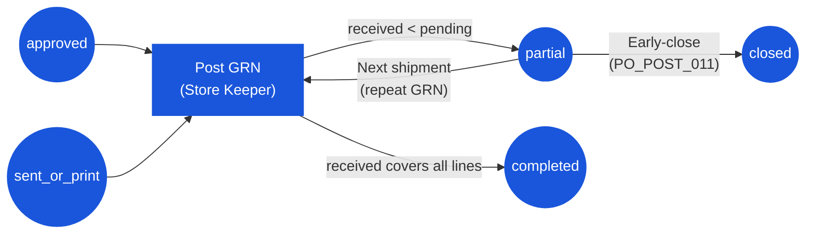

# Purchase Order — User Flow — Receiver

> **At a Glance**
> **Persona:** Receiver / Store Keeper (+ Inventory Manager) &nbsp;·&nbsp; **Module:** [purchase-order](/en/inventory/purchase-order) &nbsp;·&nbsp; **Workflow stages:** approved / sent_or_print → partial → completed (+ closed via early-close) &nbsp;·&nbsp; **Key permissions:** `procurement.purchase_order: create` on the GRN-by-PO route, location `can_use` from `tb_location_user`, post GRN, early-close
> **What this persona does:** Physically inspects vendor deliveries, posts GRN line by line (paid and FOC quantities), and flips PO status from approved / sent_or_print to partial or completed. Re-synced 2026-09-22 — receipt is unlocked at `approved`, before the vendor email.

## 1. Role in This Module

The **Receiver** persona covers the **Receiver / Store Keeper** at the dock and the **Inventory Manager** who oversees receipt closure for the location. Together they own the physical-acceptance leg of the procure-to-pay chain: the Store Keeper inspects the vendor's delivery against the PO and raises the **Good Receive Note** (GRN) line by line, which updates `tb_purchase_order_detail.received_qty`; the Inventory Manager supervises that posting and closes POs once receipt is complete or accepted as final. The PO status on entry to this flow is `approved` or `sent_or_print` (or `partial` for follow-on deliveries) — `findOnePoForGrn` accepts all three (`receivableStatuses`, `purchase-order.service.ts` L1205-1214: "A PO becomes receivable at approval, not at send: goods can arrive before anyone gets round to printing or emailing the order"). The GRN posting itself is performed in the downstream `[good-receive-note](/en/inventory/good-receive-note)` module — this page describes the **PO-side effects only**: how the Receiver's GRN flips `tb_purchase_order.po_status` to `partial` (`PO_POST_006`) or `completed` (`PO_POST_007`) via `updatePoStatuses` in `good-received-note.logic.ts`, how anyone with the PO open closes an `{in_progress, approved, sent_or_print, partial}` PO with the remainder written to `cancelled_qty` (`PO_POST_011`), and how the PO line counters (`received_qty`, `cancelled_qty`) and the bridge counters (`received_qty`, `foc_received_qty`) advance against `order_qty` / `pr_detail_foc_qty`. FOC goods now post to stock on receipt (`f8cd9f0d9`, 2026-09-10) and their received quantity is tracked separately from the paid quantity. Inventory on-hand is incremented by the GRN module, not by the PO. **Unconfirmed:** a prior version of this page asserted that segregation of duties (buyer ≠ GRN poster) is enforced at GRN creation — a repo-wide search of both the GRN and PO backend services for `segregation` / a buyer-vs-poster check found no matching code; treat this as design intent, not a live guard, until confirmed in the good-receive-note module's own resync pass. **Corrected this pass:** a prior version of this page also referenced an `accepted_qty` field distinct from `received_qty` (a "quality inspection" step where the Receiver records what was received vs. what passed inspection). A repo-wide search of the Prisma schema and both the frontend and backend source found zero hits for `accepted_qty` / `acceptedQty` — no such field exists. This mirrors the finding already confirmed and corrected in the [good-receive-note](/en/inventory/good-receive-note) module's own resync pass: a receiving shortfall or quality rejection is recorded simply by entering a lower `received_qty`, with no separate acceptance quantity.

### Workflow position (Receiver highlighted)

### Permission Matrix — Status × Action (Receiver sub-roles)

The Store Keeper drives the per-shipment GRN; the Inventory Manager handles the early-close override. Inventory on-hand effects belong to the GRN / inventory module, not to the PO.

| Action | approved | sent_or_print | partial | completed | closed |
|---|---|---|---|---|---|
| View PO (open / received) | ✅ | ✅ | ✅ | ✅ | ✅ |
| See PO in the GRN vendor / PO pickers (`GET .../purchase-orders/grn*`) | ✅ | ✅ | ✅ | ❌ | ❌ |
| Build GRN draft from PO (`GET .../purchase-orders/grn/:id`, `procurement.purchase_order: create`) | ✅ | ✅ | ✅ | ❌ | ❌ |
| Post GRN — Store Keeper (location `can_use = true`) | ✅ (`PO_AUTH_008`) | ✅ | ✅ | ❌ | ❌ |
| Enter `received_qty` and FOC received per line | ✅ | ✅ | ✅ | ❌ | ❌ |
| Trigger `→ partial` (`PO_POST_006`) | ✅ | ✅ | — | ❌ | ❌ |
| Trigger `→ completed` (`PO_POST_007`) | ✅ | ✅ | ✅ | ❌ | ❌ |
| Early-close `→ closed` (`PO_POST_011`; no role gate, no reason field) | ✅ | ✅ | ✅ | ❌ | — |
| Refuse delivery at dock (no GRN, no system effect) | ✅ | ✅ | ✅ | — | — |
| Edit PO header / lines | ❌ | ❌ | ❌ | ❌ | ❌ |
| Approve / Send Email / Void | ❌ | ❌ | ❌ | ❌ | ❌ |
| Post GRN against own-buyer PO | Unconfirmed — no segregation-of-duties check found in current source | — | — | — | — |

> ℹ️ **No separate acceptance quantity:** a repo-wide search of the Prisma schema and the GRN application code found no `accepted_qty` (or any per-line acceptance/rejection) field anywhere — see the [good-receive-note](/en/inventory/good-receive-note) module's own corrected data model. Inventory on-hand is incremented by `received_qty` alone; a quality issue or receiving shortfall is recorded simply by entering a lower `received_qty` than what was ordered, with the discrepancy noted as a free-text GRN comment. Any agreed write-off against the outstanding balance goes to `cancelled_qty` via the Inventory Manager's close action, not to a distinct acceptance field.

## 2. Entry Point and Primary Flow

**Entry point:** Two equivalent paths into the GRN posting:

- **From the GRN module** — start a new GRN, pick the vendor (`GET .../purchase-orders/grn/vendor` lists vendors with open POs and a `po_count`), then select the PO from `GET .../purchase-orders/grn/vendor/:vendor_id`; each location on each line carries `can_use` computed from the caller's `tb_location_user` rows (`c0b6d549f`), and `GET .../purchase-orders/grn/:id` builds the GRN draft with `remain_qty` / `foc_remain_qty` per location.
- **From the PO detail page** — a `approved` / `sent_or_print` / `partial` PO is read-only for the Receiver; the confirmed entry to receiving is the GRN module. (A prior version of this page described a **Receive** deep-link button on the PO header — no such button exists in `po-header.tsx` at HEAD; treat it as unconfirmed.)

Either entry routes into the same posting screen; the PO-side effects below are identical.

**Primary flow (8 steps):**

1. **Open the PO** at the dock against the physical delivery. The screen shows each line's `order_qty`, the running `received_qty`, `cancelled_qty`, the pending balance (`order_qty − received_qty − cancelled_qty`), and — for PR-sourced lines — the GRN number(s) already posted against it. Authorization is checked under `PO_AUTH_008` (`po_status ∈ {approved, sent_or_print, partial}`, `procurement.purchase_order: create` on the GRN-by-PO route, location `can_use`); no segregation-of-duties check restricting the GRN poster was confirmed in current source.
2. **Verify the physical delivery against the PO** — match the delivery note / packing list to the PO lines, count cartons, and identify any short delivery, over delivery, wrong item, or quality issue before opening the GRN.
3. **Start a new GRN** referencing the PO. The GRN header inherits `vendor_id`, `currency_id`, and delivery location from the PO; the GRN detail rows are pre-populated from `tb_purchase_order_detail` with `pending_qty` as the default editable quantity.
4. **Enter `received_qty` per line** — what physically arrived in the order UoM. May equal, be less than, or (subject to over-delivery policy) exceed the pending balance. There is no separate acceptance-quantity field: a short delivery, wrong item, or quality rejection is recorded by entering a `received_qty` lower than what was ordered, with the discrepancy noted as a free-text GRN comment — not by a second structured quantity.
5. **Review totals and discrepancies** — the GRN screen displays a variance summary (short, over) and the resulting PO line state preview (will this line close, or stay open?).
6. **Post the GRN.** On post, the GRN module commits the transaction: it writes the GRN detail rows, increments `tb_purchase_order_detail.received_qty` by the GRN line quantity (`incrementPoDetailReceivedQty`), increments the bridge row's `received_qty` and `foc_received_qty` (`good-received-note.service.ts` L3720), and increments inventory on-hand by the received quantity **including FOC** (handled inside the GRN / inventory module, not by the PO).
7. **PO state updates** are computed line-wise and applied to the header (`updatePoStatuses`, `good-received-note.logic.ts` L540-568):
   - If at least one PO line still has `received_qty < order_qty − cancelled_qty`, `po_status` is set to `partial` (`PO_POST_006`). The PO remains open for further GRN posts. This can happen straight from `approved`, before the PO was ever emailed.
   - If **every** active PO line satisfies `received_qty ≥ order_qty − cancelled_qty`, `po_status` is set to `completed` (`PO_POST_007`). The PO is closed normally; no further GRNs are accepted.

## 3. Decision Branches

- **Short delivery** (`received_qty < pending_balance`): post the GRN with what physically arrived. The PO transitions to `partial` (or stays at `partial`) under `PO_POST_006`; the unfulfilled balance remains as the pending quantity on the affected lines, available for a subsequent GRN. Notify the Purchaser via the standard activity log so the vendor can be chased for the remainder.
- **Over delivery** (`received_qty > pending_balance`): the GRN module gates this against the tenant over-delivery tolerance. If accepted (within tolerance or with explicit override), the GRN posts the over-shipped quantity, `tb_purchase_order_detail.received_qty` rises above `order_qty − cancelled_qty`, and the PO transitions to `completed` (`PO_POST_007`). If rejected (out of tolerance), the Receiver caps `received_qty` at the pending balance and refuses the excess at the dock — no system record for the rejected excess; the Purchaser logs the vendor-side dispute on the PO.
- **Quality issue** (some of what arrived fails inspection): there is no separate acceptance-quantity field to record this against — post the GRN with `received_qty` set to only the portion that is being kept, and note the rejected portion in a free-text GRN comment. The line's pending balance is reduced by the entered `received_qty` only, and inventory on-hand rises by that same `received_qty`; the rejected portion is not tracked as a structured field anywhere in the GRN or PO schema. The PO does not auto-correct — the resolution path (amendment, return, or credit note with the vendor) is initiated by the Purchaser off-document.
- **Wrong item** (delivery does not match the PO product): **do not post a GRN.** Refuse the delivery at the dock and escalate to the Purchaser, who logs the vendor-side error in `tb_purchase_order_comment`. The PO remains at `sent` (or its prior state) with no quantity change.
- **Partial GRN now, remainder later**: post the GRN for what arrived today; `po_status` becomes `partial` (`PO_POST_006`) and the open balance is carried forward. When the next shipment arrives, repeat steps 1–7 above; the PO either stays `partial` or progresses to `completed` when the final balance clears (`PO_POST_007`).
- **Close PO with remainder cancelled**: when the vendor cannot supply the outstanding quantity, whoever has the PO open closes it under `PO_POST_011` (`closePO()` has no role gate; the React header shows **Close** on `approved` / `sent_or_print`). For each line still pending, the application writes the remainder to `cancelled_qty` so that `received_qty + cancelled_qty = order_qty`; `po_status` becomes `closed` (terminal) and the buyer is notified. The endpoint body is `{}` — no reason field is enforced; record one as a comment if policy requires it.

## 4. Exit Point / Handoffs

The Receiver's involvement on a given PO ends on **GRN post**. From that point the document state on Carmen is one of:

- `partial` — at least one PO line still has open balance; the Receiver may re-enter the flow when the next shipment arrives.
- `completed` — every line is fully received; the PO is at its terminal receipt state and is read-only for inventory purposes. **Unconfirmed:** no downstream vendor-invoice-match or AP-posting feature was found in current source — see [03-user-flow-finance.md](./03-user-flow-finance.md) for the correction. Post-receipt vendor credits go through [Credit Note](/en/inventory/purchase-order/credit-note), which anchors on the GRN and can credit each product on a receipt once.
- `closed` — someone closed the `partial` PO with the remainder written to `cancelled_qty` under `PO_POST_011`.

## 5. References

- Parent overview: [03-user-flow.md](./03-user-flow.md) — global PO state machine and cross-persona handoff table; the `{approved, sent_or_print} → partial → completed` rows and the `partial → closed` row are this persona's territory.
- Backend: `../carmen-turborepo-backend-v2/apps/micro-business/src/procurement/purchase-order/purchase-order.service.ts` (`findAllForGrn` L1351-1622 with `can_use`, `findOnePoForGrn` L1195-1215); `apps/micro-business/src/inventory/good-received-note/good-received-note.logic.ts` (`updatePoStatuses`); Bruno `GET-find-vendors-for-grn`, `GET-find-all-for-grn-by-vendor`, `GET-find-all-for-grn`, `GET-build-grn-draft-from-po`.
- Sibling: [03-user-flow-purchaser.md](./03-user-flow-purchaser.md) — upstream internal persona that transmits the PO and is notified of discrepancies at the dock for amendment / return / credit-note follow-up.
- Sibling: [03-user-flow-procurement-manager.md](./03-user-flow-procurement-manager.md) — holds the close override authority and reviews `partial → closed` decisions alongside the Inventory Manager.
- Sibling: [03-user-flow-vendor.md](./03-user-flow-vendor.md) — external party whose physical delivery this persona accepts at the dock.
- Sibling: [03-user-flow-finance.md](./03-user-flow-finance.md) — documents why no three-way-match / invoice handoff was confirmed after GRN post.
- Related: [good-receive-note](/en/inventory/good-receive-note) — downstream module where the GRN is actually raised and posted; this page describes the PO-side effects only.
- Related: [inventory](/en/inventory/inventory) — on-hand increment from `received_qty` is owned by the inventory module on GRN post; the PO contributes only the on-order pipeline quantity (`order_qty − received_qty − cancelled_qty`) per `PO_XMOD_008`.
- Sibling: [02-business-rules.md](./02-business-rules.md) — `PO_POST_006`, `PO_POST_007`, `PO_POST_011`, `PO_AUTH_008`, and `PO_AUTH_010` for the receipt-side transitions and authorization referenced above.
- `../carmen/docs/purchase-order-management/purchase-order-module.md` — primary carmen/docs source for the PO module business analysis, GRN integration, and the receipt-state transitions.
