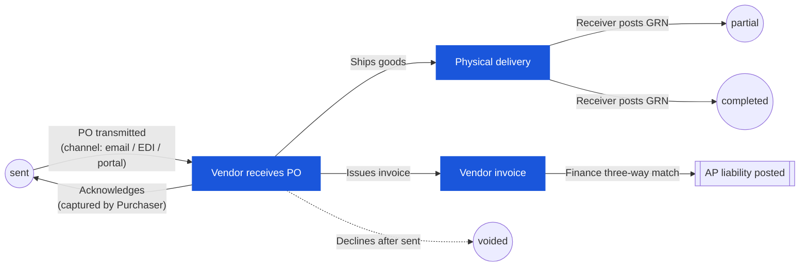

# Purchase Order — User Flow — Vendor

> **At a Glance**
> **Persona:** Vendor (external — no Carmen login) &nbsp;·&nbsp; **Module:** [purchase-order](/en/inventory/purchase-order) &nbsp;·&nbsp; **Workflow stages:** sent (touch points) → partial / completed / voided &nbsp;·&nbsp; **Key permissions:** none direct — events recorded by Purchaser / Receiver / Finance / PM on vendor's behalf
> **What this persona does:** Receives the transmitted PO, acknowledges, fulfils delivery, and issues invoice — every system effect captured by an internal persona.

## 1. Role in This Module

The **Vendor** is an **external party with no Carmen system login**. The vendor receives the transmitted PO, acknowledges acceptance, fulfils the agreed delivery, and issues an invoice for three-way match — but every system-side effect of these actions is recorded by an internal persona on the vendor's behalf. When the PO is transmitted on final approval the system state moves to `sent` (`PO_POST_004`); thereafter the vendor's acknowledgement is captured manually by the **Purchaser** in `tb_purchase_order_comment` (or, where a vendor portal is configured, written directly through the portal callback), the physical delivery has no immediate system effect, the **Receiver**'s GRN posting flips `po_status` to `partial` or `completed` via `PO_POST_006` / `PO_POST_007`, and the vendor's invoice is captured and three-way-matched by the **Finance** persona. The vendor never operates `po_status` directly — its actions drive state only through the internal personas who record them.

### Workflow position (Vendor touch points highlighted)

### Permission Matrix — Vendor Event × System Effect (recorded by internal persona)

The Vendor has **no direct write access** in Carmen. Each vendor-side event is recorded by an internal persona; the table below maps the event to the persona, the system surface, and the PO-state effect (if any).

| Vendor event | Internal persona who records | System surface | `po_status` effect |
|---|---|---|---|
| Acknowledges PO | Purchaser (or portal callback) | `tb_purchase_order_comment` | none (stays `sent`) |
| Ships partial qty | Receiver | GRN posting | `sent → partial` (`PO_POST_006`) |
| Ships full / final balance | Receiver | GRN posting | `sent → completed` or `partial → completed` (`PO_POST_007`) |
| Declines / cancels after `sent` | Procurement Manager | Void (`PO_AUTH_007`) | `sent → voided` (`PO_POST_010`) |
| Cannot supply outstanding balance | Procurement Manager / Inventory Manager | Early-close (`PO_AUTH_008`) | `partial → closed` (`PO_POST_011`) |
| Delivers wrong item / over qty | Receiver (refuses at dock) | none — escalates to Purchaser via `tb_purchase_order_comment` | none |
| Delivers quality-failed goods | Receiver | GRN with `accepted_qty < received_qty` | per `PO_POST_006` / `PO_POST_007` |
| Issues invoice | Finance Officer / AP | AP capture screen + three-way match | none — three-way-match outcome lives on invoice record (`PO_POST_008` / `PO_POST_009`) |

> ⚠️ **Discrepancy — auto-transmit on final approve:** The live UI transmits the PO to the vendor **immediately on final approval** (no separate manual "Send to Vendor" button) — `APPROVED` and `SENT` are observed as effectively the same step. BRD `FR-PO-005` describes a distinct manual *Send* action and an `ACKNOWLEDGED` status that the vendor confirms. Neither the manual send button nor the `ACKNOWLEDGED` status are present in the live UI. Source: `Test_case/Purchase_Order/Purchaser/INDEX.md` § Status Lifecycle (capture date 2026-04-26).

## 2. Entry Point and Primary Flow

**Entry point:** Vendor receives the transmitted PO through the channel configured on the tenant — email PDF, EDI feed, or vendor portal link. The transmission writes `tb_purchase_order.email` and `approval_date`, and the PO is at `po_status = sent`.

**Primary flow (conceptual — system effects only on internal entry):**

1. **Acknowledge receipt of the PO.** Vendor confirms acceptance of terms (price, quantity, delivery date, payment terms). **System effect:** Purchaser records the acknowledgement in `tb_purchase_order_comment` with the confirmation date and reference; if a vendor portal is in use, the portal callback writes the same comment automatically. `po_status` remains `sent`.
2. **Prepare and ship the goods against the agreed delivery date.** Vendor allocates stock, picks, packs, and dispatches the shipment with the delivery note / packing list referencing the `po_no`. **System effect:** none — the physical movement is invisible to Carmen until the Receiver opens it at the dock.
3. **Deliver the goods to the receiving location.** Vendor's logistics partner delivers against the PO and the agreed delivery point. **System effect:** none directly — the **Receiver** persona scans / counts and raises the GRN in the downstream [good-receive-note](/en/inventory/good-receive-note) module, which is what actually flips `po_status` (`sent → partial` or `sent → completed`).
4. **Issue the invoice.** Vendor sends the AP invoice (paper, PDF, or EDI) referencing the `po_no` and the delivered quantities. **System effect:** the **Finance** persona captures the invoice, runs the three-way match (PO ↔ GRN ↔ invoice), and posts the AP liability on successful match; the PO itself is not status-updated by the invoice — three-way match is tracked on the linked invoice record.

## 3. Decision Branches

- **If the vendor declines the PO after transmission** (price disagreement, stock-out, lead-time impossible): vendor communicates the refusal through the original channel. **System effect:** the Purchaser logs the refusal in `tb_purchase_order_comment` and either re-routes for an amendment (within the post-`sent` restrictions of `PO_VAL_016`) or escalates to the **Procurement Manager** for a void from `sent` under `PO_AUTH_007` / `PO_POST_010`. The PO terminal state is `voided`.
- **If the vendor partial-ships** (only some of the ordered quantity is delivered now, balance to follow): vendor ships what is available with the delivery note marked partial. **System effect:** the **Receiver** posts a partial GRN — `received_qty < order_qty − cancelled_qty` on the affected lines — which flips `po_status` to `partial` (`PO_POST_006`). Subsequent shipments are captured by further GRN posts until the balance is cleared (`partial → completed`, `PO_POST_007`) or written off as `cancelled_qty` by the **Procurement Manager** / **Inventory Manager** (`partial → closed`, `PO_POST_011`).
- **If the vendor sends the wrong item, wrong quantity over, or substandard quality**: vendor's discrepancy is detected at the dock. **System effect:** the **Receiver** records the discrepancy on the GRN (variance qty, reason code) and the **Purchaser** is notified to initiate a return / replacement / credit note with the vendor under the amendment loop. The PO does not auto-correct — the resolution is logged in `tb_purchase_order_comment` and any agreed write-off goes to `cancelled_qty` on the affected lines.

## 4. Exit Point / Handoffs

The vendor's involvement on a given PO ends at **invoice issuance**. From that point the document state on Carmen is one of:

- `sent` — PO transmitted but no GRN posted yet (vendor has not delivered, or delivery is in transit).
- `partial` — Receiver has posted at least one GRN but the PO still has open balance on one or more lines.
- `completed` — Receiver has cleared every line via GRN; the PO has reached the terminal receipt state.
- `voided` — PO was voided post-transmission (vendor declined, or material amendment forced re-issue); vendor's invoice, if any, is not matched.

The **three-way match** (PO ↔ GRN ↔ invoice) is run by the **Finance** persona after both the GRN and the invoice are recorded — the PO status itself is not changed by the match outcome, but the AP liability is posted against the matched invoice on success. See the Finance persona file for the receiving-side of the invoice handoff.

## 5. References

- Parent overview: [03-user-flow.md](./03-user-flow.md) — global PO state machine and cross-persona handoff table.
- Sibling: [03-user-flow-purchaser.md](./03-user-flow-purchaser.md) — internal persona that transmits the PO, records vendor acknowledgement, and runs the amendment loop on vendor's behalf.
- Sibling: [03-user-flow-receiver.md](./03-user-flow-receiver.md) — downstream internal persona that physically accepts the vendor's delivery and posts the GRN that drives `sent → partial → completed`.
- Sibling: [03-user-flow-finance.md](./03-user-flow-finance.md) — internal persona that captures the vendor's invoice and runs the three-way match.
- Related: [good-receive-note](/en/inventory/good-receive-note) — downstream module that records the vendor's physical delivery and drives the receipt-state transitions on the PO.
- `../carmen/docs/purchase-order-management/purchase-order-module.md` — primary carmen/docs source for the PO module business analysis, transmission, and three-way-match flow.
