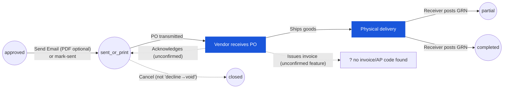

# Purchase Order — User Flow — Vendor

> **At a Glance**
> **Persona:** Vendor (external — no Carmen login) &nbsp;·&nbsp; **Module:** [purchase-order](/en/inventory/purchase-order) &nbsp;·&nbsp; **Workflow stages:** sent_or_print (touch points) → partial / completed / closed &nbsp;·&nbsp; **Key permissions:** none direct — events recorded by Purchaser / Receiver on vendor's behalf
> **What this persona does:** Receives the PO by email (optionally with PDF) or by a print / fax handover that the Purchaser records with `mark-sent`, then fulfils delivery — every system effect captured by an internal persona. Re-synced 2026-09-22.

## 1. Role in This Module

The **Vendor** is an **external party with no Carmen system login**. The vendor receives the PO and fulfils the agreed delivery — the confirmed system-side effect of this is the **Receiver**'s GRN posting, which flips `po_status` to `partial` or `completed` via `PO_POST_006` / `PO_POST_007`. Transmission is now an explicit, confirmed system event (`PO_POST_004b`, 2026-09-08/14): the Purchaser emails the PO through a BU email profile (`POST .../purchase-orders/:id/send-email`, with an optional server-rendered PDF, seeded EN/TH templates), or records a print / fax / phone handover with `POST .../purchase-orders/:id/mark-sent`; either moves the PO `approved → sent_or_print` and writes a `tb_activity` entry (`email_sent` with recipients and outcome, or "Marked as sent to vendor"). A PO that is only `approved` may already be received against — the vendor can deliver against a verbal order before the email goes out. **Unconfirmed this pass:** whether the vendor's acknowledgement is captured anywhere (comment, portal callback, or otherwise), and whether any vendor-invoice / three-way-match feature exists downstream of receipt — a repo-wide search for `three-way`, `vendor_invoice`, and `tb_invoice` found no matches in either the frontend or backend. Treat the acknowledgement and invoice/AP steps below as documented design intent carried over from `carmen/docs`, not confirmed live behavior; see [03-user-flow-finance.md](./03-user-flow-finance.md) for the fuller correction.

### Workflow position (Vendor touch points highlighted)

```mermaid
graph LR
    approved(("approved")) -->|"Send Email (PDF optional)<br/>or mark-sent"| sent(("sent_or_print"))
    sent -->|"PO transmitted"| vendor["Vendor receives PO"]:::current
    vendor -.->|"Acknowledges (unconfirmed)"| sent
    vendor -->|"Ships goods"| recv["Physical delivery"]:::current
    recv -->|"Receiver posts GRN"| partial(("partial"))
    recv -->|"Receiver posts GRN"| completed(("completed"))
    vendor -.->|"Issues invoice (unconfirmed feature)"| inv["? no invoice/AP code found"]
    sent -.->|"Cancel (not 'decline→void')"| closed(("closed"))
    classDef current fill:#1a56db,color:#fff,stroke:#1a56db;
```

### Permission Matrix — Vendor Event × System Effect (recorded by internal persona, where confirmed)

The Vendor has **no direct write access** in Carmen. The table below maps each vendor-side event to what actually happens on the PO side, flagging what is confirmed vs. unconfirmed.

| Vendor event | System surface | `po_status` effect |
|---|---|---|
| Receives the PO | Purchaser's **Send Email** (`send-email`, `tb_activity` `email_sent`) or `mark-sent` | `approved → sent_or_print` (`PO_POST_004b`) |
| Acknowledges PO | **Unconfirmed** — no specific comment/portal-callback code was located this pass | Presumed none; `po_status` stays `sent_or_print` if it happens at all |
| Ships partial qty | Receiver's GRN posting | `{approved, sent_or_print} → partial` (`PO_POST_006`) |
| Ships full / final balance | Receiver's GRN posting | `{approved, sent_or_print} → completed` or `partial → completed` (`PO_POST_007`) |
| Declines / vendor can no longer fulfil | **Cancel** (`{draft, in_progress, approved, sent_or_print} → closed`) or **Close** (`{in_progress, approved, sent_or_print, partial} → closed`) | `→ closed`, remainder written to `cancelled_qty` — **not** `voided`; there is no path from `sent_or_print` to `voided` in current source |
| Delivers wrong item / over qty | Receiver (refuses at dock) | none — escalates via comment |
| Delivers quality-failed goods | Receiver records a lower `received_qty` than ordered and notes the rejection in a free-text GRN comment — there is no separate acceptance-quantity field anywhere in the GRN or PO schema (confirmed absent repo-wide) | per `PO_POST_006` / `PO_POST_007` |
| Issues invoice | **Not implemented** — no invoice-capture screen or AP-posting code exists in current source | none |

## 2. Entry Point and Primary Flow

**Entry point:** Vendor receives the PO by email from the BU's configured email profile (subject / body from the seeded PO template, PDF attached when the Purchaser ticked `attach_pdf`), or by print / fax / phone. No EDI feed or vendor portal exists in current source (repo-wide search for `EDI` / `portal` in the PO module found nothing). The transmission writes a `tb_activity` entry and moves the PO to `po_status = sent_or_print`; `approval_date` was already set at final approval.

**Primary flow (conceptual — confirmed system effects only):**

1. **Acknowledge receipt of the PO** (unconfirmed whether Carmen records this at all).
2. **Prepare and ship the goods against the agreed delivery date.** **System effect:** none — the physical movement is invisible to Carmen until the Receiver opens it at the dock.
3. **Deliver the goods to the receiving location.** **System effect:** none directly — the **Receiver** persona raises the GRN in the downstream [good-receive-note](/en/inventory/good-receive-note) module, which actually flips `po_status` (`sent → partial` or `sent → completed`).
4. **Issue the invoice** — **not implemented** in current source. See [03-user-flow-finance.md](./03-user-flow-finance.md) for the full correction on why no invoice / AP-matching feature was found.

## 3. Decision Branches

- **If the vendor can no longer fulfil the PO after transmission** (price disagreement, stock-out, lead-time impossible): there is no "decline → void" path from `sent_or_print` in current source. The PO is ended via **Cancel** or **Close**, both landing on `closed` with the remainder written to `cancelled_qty` — not `voided` (which is only reachable from `in_progress` via reject).
- **If the email never reached the vendor** (`send-email` returned `sent: false` with a `rejected[]` list): the PO stays `approved`, the failed attempt is in `tb_activity`, and the Purchaser corrects the address and re-sends; nothing on the vendor side changes.
- **If the vendor partial-ships** (only some of the ordered quantity is delivered now, balance to follow): the **Receiver** posts a partial GRN — `received_qty < order_qty − cancelled_qty` on the affected lines — which flips `po_status` to `partial` (`PO_POST_006`). Subsequent shipments are captured by further GRN posts until the balance is cleared (`partial → completed`, `PO_POST_007`) or the remaining balance is written off as `cancelled_qty` via **Close** (`partial → closed`, `PO_POST_011`).
- **If the vendor sends the wrong item, wrong quantity over, or substandard quality**: vendor's discrepancy is detected at the dock. **System effect:** the **Receiver** records the discrepancy on the GRN and the **Purchaser** is notified via comment to initiate a return / replacement with the vendor. The PO does not auto-correct; any agreed write-off goes to `cancelled_qty` on the affected lines.

## 4. Exit Point / Handoffs

The vendor's involvement on a given PO ends at **physical delivery** (confirmed) — invoice issuance is documented design intent, not a confirmed system interaction. From that point the document state on Carmen is one of:

- `approved` — workflow finished, not yet emailed; goods may nonetheless be received against it.
- `sent_or_print` — PO transmitted but no GRN posted yet (vendor has not delivered, or delivery is in transit).
- `partial` — Receiver has posted at least one GRN but the PO still has open balance on one or more lines.
- `completed` — Receiver has cleared every line via GRN; the PO has reached the terminal receipt state.
- `closed` — PO was cancelled or closed post-transmission (vendor could not fulfil, or material amendment forced re-issue) — reachable via **Cancel** or **Close**, not `voided`.

## 5. References

- Parent overview: [03-user-flow.md](./03-user-flow.md) — global PO state machine and cross-persona handoff table.
- Sibling: [03-user-flow-purchaser.md](./03-user-flow-purchaser.md) — internal persona that emails the PO (Send Email dialog) and runs the cancel / close loop on the vendor's behalf.
- Sibling: [03-user-flow-receiver.md](./03-user-flow-receiver.md) — downstream internal persona that physically accepts the vendor's delivery and posts the GRN that drives `{approved, sent_or_print} → partial → completed`.
- Backend: `purchase-order.service.ts` `sendEmailToVendor` (L7264+), `markSent` (L6150+), `EMAILABLE_PO_STATUSES` (L7127); email templates seeded by `ccc72e78b`; PDF via `exportPdfViaMicroReport` → micro-report → FastReport `POST /api/Report/Export/Pdf`.
- Sibling: [03-user-flow-finance.md](./03-user-flow-finance.md) — documents why no invoice / three-way-match feature was confirmed in current source.
- Related: [good-receive-note](/en/inventory/good-receive-note) — downstream module that records the vendor's physical delivery and drives the receipt-state transitions on the PO.
- `../carmen/docs/purchase-order-management/purchase-order-module.md` — primary carmen/docs source for the PO module business analysis and transmission flow; treat its three-way-match description as design intent, not verified current behavior.
