# Purchase Order — User Flow

> **At a Glance**
> **Module:** [purchase-order](/en/inventory/purchase-order) &nbsp;·&nbsp; **Personas:** Purchaser &nbsp;·&nbsp; Procurement Manager &nbsp;·&nbsp; Vendor &nbsp;·&nbsp; Receiver &nbsp;·&nbsp; Finance &nbsp;·&nbsp; Audit / Config
> **Workflow lifecycle:** Draft → In Progress → Sent → Partial → Completed / Closed (with Voided branch)
> **Drill into per-persona views below for action-level detail**

## 1. Overview

This page is the **overview entry point** for the user-flow set of the `purchase-order` module. A Purchase Order (PO) is the procurement-commitment document — a PO header (`tb_purchase_order`) together with one or more detail lines (`tb_purchase_order_detail`) — that takes the agreed line items from one or more approved Purchase Requests and binds the buyer to the vendor at a fixed price, quantity, and delivery date. The lifecycle in Section 2 spans from initial draft creation through internal approval, transmission to the vendor, partial or full receipt against the PO, and finally closure (normal completion or early closure). The personas involved are the **Purchaser** (creates and transmits POs, manages amendments), the **Procurement Manager** (oversight, high-value approval, vendor ranking, override authority), the **Vendor** (external party with no system login — receives, acknowledges, fulfils, invoices), the **Receiver** (physically accepts goods and raises GRN against the PO), the **Finance** team (three-way match and AP posting), and the **Audit / Config** roles (Auditor for read-only review, System Administrator for workflow and integration configuration). The role catalogue itself is defined in [the module landing](/en/inventory/purchase-order) Section 4.

Section 2 below is the **global state machine** — the canonical list of transitions across `enum_purchase_order_doc_status` values, independent of who acts. Each per-persona file (linked from Section 3) describes that persona's *path through* the state machine — their entry point, the actions available to them, the decision branches they face, and the handoff that ends their involvement. Section 4 then summarises the cross-persona handoffs that stitch the individual paths together. Read this overview first to anchor the lifecycle, then drill into the persona file that matches your role.

## 2. Document Lifecycle

The PO document status is stored on `tb_purchase_order.po_status` and constrained to the values declared in `enum_purchase_order_doc_status`: `draft`, `in_progress`, `voided`, `sent`, `partial`, `closed`, `completed`. The transitions below cover the legal moves between them; everything else is rejected by the workflow engine. Note that receipt-driven transitions (`sent → partial → completed`) are triggered by GRN postings in the downstream [good-receive-note](/en/inventory/good-receive-note) module, not by direct user action on the PO.

```mermaid
stateDiagram-v2
    [*] --> draft: create (Purchaser)
    draft --> draft: save / edit
    draft --> in_progress: submit for approval
    draft --> [*]: soft-delete (PO_AUTH_005)
    in_progress --> in_progress: approve intermediate stage
    in_progress --> sent: approve final + transmit
    in_progress --> draft: send-back (any approver)
    in_progress --> voided: reject / void
    sent --> partial: GRN posts partial receipt
    sent --> completed: GRN posts full receipt
    sent --> voided: void (no GRN posted; PO_AUTH_007)
    partial --> partial: subsequent partial GRN
    partial --> completed: GRN clears outstanding balance
    partial --> closed: early-close (Inv. Mgr / PM; PO_AUTH_008)
    completed --> [*]
    closed --> [*]
    voided --> [*]
```

| From state | Action | To state | Allowed for | Pre-conditions |
| ---------- | ------ | -------- | ----------- | -------------- |
| `(none)` | create | `draft` | Purchaser | Header fields validated (`vendor_id`, `currency_id`, `order_date`, `delivery_date`, `workflow_id`); at least one line required before submission. PR linkage written to the bridge table when sourced from PR. |
| `draft` | save (edit) | `draft` | Purchaser (owner) | PO still editable; no workflow stage advanced. Header totals (`total_qty`, `total_price`, `total_tax`, `total_amount`) recalculated on save. |
| `draft` | submit for approval | `in_progress` | Purchaser (owner) | At least one non-deleted line; header complete; selected `workflow_id` is active for scope `purchase-order`. `last_action` set to `submitted`; stage cursor advances to first approval stage. |
| `draft` | delete | `(none)` | Purchaser, Procurement Manager | Soft-delete only (`deleted_at` set); allowed solely while the PO is in `draft` and has never been submitted. |
| `in_progress` | approve (this stage, not final) | `in_progress` | Current-stage approver | Approver is assigned to `workflow_current_stage` with `stage_role = approve`; `last_action` becomes `approved`; stage cursor advances. |
| `in_progress` | approve (final stage) | `sent` | Final-stage approver (typically Procurement Manager for high-value) | All prior stages signed off; high-value threshold check passed where applicable. PO is transmitted to the vendor on this transition (email / EDI / portal as configured). |
| `in_progress` | send-back | `draft` | Any approver on the chain | Reason text required; returns the PO to the Purchaser for revision. Audit comment written. |
| `in_progress` | reject / void | `voided` | Any approver on the chain, System Administrator | Reason text required; workflow terminates with no further actions allowed. |
| `sent` | receive (partial) | `partial` | Receiver via GRN posting | At least one PO line has `received_qty > 0` but `received_qty < order_qty − cancelled_qty` across the PO. State change is computed from line-level GRN postings. |
| `sent` | receive (full) | `completed` | Receiver via GRN posting | Every line satisfies `received_qty + cancelled_qty ≥ order_qty`; all lines closed via GRN in a single transaction. |
| `sent` | void | `voided` | Procurement Manager, System Administrator | Reason text required; allowed only when no GRN has yet posted against any line. |
| `partial` | receive (additional) | `partial` | Receiver via GRN posting | Subsequent GRN posts more quantity but the PO still has at least one open line; state remains `partial`. |
| `partial` | receive (final balance) | `completed` | Receiver via GRN posting | Final GRN clears the outstanding balance on every line; PO transitions to normal completion. |
| `partial` | close (cannot supply) | `closed` | Procurement Manager, Inventory Manager | Vendor cannot supply the outstanding quantity; remaining open qty is treated as cancelled (line `cancelled_qty` written). Reason text required. |
| `completed` | (no further action) | `completed` | — | Terminal state for the receipt path; three-way match in Finance is tracked on the linked invoice, not on the PO status. |

## 3. Persona Index

Each persona below has a dedicated drill-down file describing their entry point, primary flow, decision branches, and exit point. Slugs match the persona role; clicking the link opens the per-persona view.

- [Purchaser](./03-user-flow-purchaser.md) — Creates POs manually or by converting approved PRs (with vendor+currency grouping), validates pricelist pricing, transmits the PO, manages amendments and follow-up.
- [Procurement Manager](./03-user-flow-procurement-manager.md) — Oversees procurement, approves high-value POs and amendments, manages vendor ranking, holds delete-in-draft, void, and early-close override authority.
- [Vendor](./03-user-flow-vendor.md) — External party with no system login; receives the transmitted PO, acknowledges acceptance, fulfils delivery against agreed terms, and issues the invoice for three-way match.
- [Receiver](./03-user-flow-receiver.md) — Receiver / Store Keeper + Inventory Manager. Physically accepts goods, raises the GRN against the PO line by line, and triggers the `sent → partial → completed` receipt-state transitions.
- [Finance](./03-user-flow-finance.md) — Finance Officer / AP + Finance Manager. Reviews PO financial accuracy, runs the three-way match (PO ↔ GRN ↔ invoice), handles currency / FX, and posts the AP liability.
- [Audit / Config](./03-user-flow-audit-config.md) — Auditor (read-only review of POs, amendments, and activity log) and System Administrator (workflow stage configuration, RBAC, numbering, vendor and pricelist integration).

## 4. Cross-Persona Handoffs

The table below captures the moments where the PO moves from one persona's responsibility to another's. Each handoff is anchored to the document state at the point of transfer.

| From persona | Trigger | To persona | Document state at handoff |
| ------------ | ------- | ---------- | ------------------------- |
| Purchaser | Submit for approval | First-stage approver (typically Procurement Manager for high-value) | `in_progress` (stage cursor on first approval stage) |
| Approver (stage N, not final) | Approve at this stage | Approver (stage N+1) | `in_progress` (stage cursor advances) |
| Procurement Manager (final stage) | Approve at final stage and transmit | Vendor | `sent` (PO transmitted; awaiting first GRN) |
| Approver (any stage) | Send-back with reason | Purchaser | `draft` (with revision history and approver comment retained) |
| Vendor | Physical delivery of goods | Receiver | `sent` (system state unchanged until GRN is posted) |
| Receiver | Post GRN — partial fulfilment | Purchaser, Inventory Manager | `partial` (one or more lines still open) |
| Receiver | Post GRN — final balance | Finance (for invoice match) | `completed` (every line fully received) |
| Procurement Manager / Inventory Manager | Close PO with remaining qty as cancelled | Finance (close-out review) | `closed` (remaining qty written as `cancelled_qty`) |
| Procurement Manager / System Administrator | Void with reason | Auditor (post-hoc review only) | `voided` |
| Finance | Three-way match completes and AP posted | (terminal) | `completed` (PO unchanged; AP liability posted against the matched invoice) |

## 5. References

- `../carmen/docs/purchase-order-management/purchase-order-module.md` — primary carmen/docs source for the business analysis, state diagram, and PO creation flows.
- Sibling: [01-data-model.md](./01-data-model.md) — canonical `enum_purchase_order_doc_status` values used in Section 2 above and the bridge table that carries PR→PO traceability.
- Sibling: [02-business-rules.md](./02-business-rules.md) — validation, authorization, posting, and transition rules referenced by each row of Section 2.
- Related modules: [purchase-request](/en/inventory/purchase-request) (upstream source via the PR→PO bridge), [good-receive-note](/en/inventory/good-receive-note) (downstream fulfilment that drives the `partial` / `completed` transitions), [vendor-pricelist](/en/inventory/vendor-pricelist) (price snapshot at PR-to-PO conversion time).
