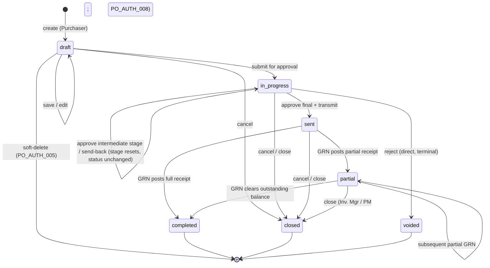

# Purchase Order — User Flow

> **At a Glance**
> **Module:** [purchase-order](/en/inventory/purchase-order) &nbsp;·&nbsp; **Personas:** Purchaser &nbsp;·&nbsp; Procurement Manager &nbsp;·&nbsp; Vendor &nbsp;·&nbsp; Receiver &nbsp;·&nbsp; Finance &nbsp;·&nbsp; Audit / Config
> **Workflow lifecycle:** Draft → In Progress → Sent → Partial → Completed / Closed (with Voided branch)
> **Drill into per-persona views below for action-level detail**

## 1. Overview

This page is the **overview entry point** for the user-flow set of the `purchase-order` module. A Purchase Order (PO) is the procurement-commitment document — a PO header (`tb_purchase_order`) together with one or more detail lines (`tb_purchase_order_detail`) — created manually, from one or more approved Purchase Requests, or directly from a vendor price list, that binds the buyer to the vendor at a fixed price, quantity, and delivery date. The lifecycle in Section 2 spans from initial draft creation through internal approval, transmission to the vendor, partial or full receipt against the PO, and finally closure (normal completion or early closure). The personas involved are the **Purchaser** (creates and submits POs, manages amendments), the **Procurement Manager** (acts as an approver on a configured workflow stage; delete-in-draft authority — the assigned workflow's `routing_rules` can confirmed-ly skip/jump stages by `total_amount`, see [02-business-rules.md](./02-business-rules.md) `PO_AUTH_004`; vendor-ranking configuration remains unconfirmed), the **Vendor** (external party with no system login — receives and fulfils; no confirmed in-system acknowledgement or invoice feature), the **Receiver** (physically accepts goods and raises GRN against the PO), a **Finance** role named in legacy design docs but unconfirmed in current source, and the **Audit / Config** roles (Auditor for read-only review, System Administrator for workflow configuration and numbering). The role catalogue itself is defined in [the module landing](/en/inventory/purchase-order) Section 4.

Section 2 below is the **global state machine** — the canonical list of transitions across `enum_purchase_order_doc_status` values, independent of who acts. Each per-persona file (linked from Section 3) describes that persona's *path through* the state machine — their entry point, the actions available to them, the decision branches they face, and the handoff that ends their involvement. Section 4 then summarises the cross-persona handoffs that stitch the individual paths together. Read this overview first to anchor the lifecycle, then drill into the persona file that matches your role.

## 2. Document Lifecycle

The PO document status is stored on `tb_purchase_order.po_status` and constrained to the values declared in `enum_purchase_order_doc_status`: `draft`, `in_progress`, `voided`, `sent`, `partial`, `closed`, `completed`. The transitions below cover the legal moves between them; everything else is rejected by the workflow engine. Note that receipt-driven transitions (`sent → partial → completed`) are triggered by GRN postings in the downstream [good-receive-note](/en/inventory/good-receive-note) module, not by direct user action on the PO.

```mermaid
stateDiagram-v2
    [*] --> draft: create (Purchaser)
    draft --> draft: save / edit
    draft --> in_progress: submit for approval
    draft --> [*]: soft-delete (PO_AUTH_005)
    in_progress --> in_progress: approve intermediate stage / send-back (stage resets, status unchanged)
    in_progress --> sent: approve final + transmit
    in_progress --> voided: reject (direct, terminal)
    draft --> closed: cancel
    in_progress --> closed: cancel / close
    sent --> closed: cancel / close
    sent --> partial: GRN posts partial receipt
    sent --> completed: GRN posts full receipt
    partial --> partial: subsequent partial GRN
    partial --> completed: GRN clears outstanding balance
    partial --> closed: close (Inv. Mgr / PM; PO_AUTH_008)
    completed --> [*]
    closed --> [*]
    voided --> [*]
```

> ⚠️ **Corrected this pass:** the previous diagram/table showed `in_progress → draft` on send-back and a Procurement-Manager-only "void" reachable from `draft`/`sent`/`partial`. Neither exists in current source. Send-back (`/review`) keeps `po_status = in_progress` and only resets `workflow_current_stage`; the only path to `voided` is a direct, terminal `in_progress → voided` via `/reject`. Ending a PO from `draft`, `sent`, or `partial` goes through **Cancel** or **Close** (both land on `closed`, writing the remainder to `cancelled_qty`), not `voided`.

| From state | Action | To state | Allowed for | Pre-conditions |
| ---------- | ------ | -------- | ----------- | -------------- |
| `(none)` | create | `draft` | Purchaser | Header fields validated (`vendor_id`, `currency_id`, `order_date`, `delivery_date`, `workflow_id`); at least one line required before submission. PR linkage written to the bridge table when sourced from PR; no linkage needed for `manual` or `pricelist` origin. |
| `draft` | save (edit) | `draft` | Purchaser (owner) | PO still editable; no workflow stage advanced. Header totals (`total_qty`, `total_price`, `total_tax`, `total_amount`) recalculated on save. |
| `draft` | submit for approval | `in_progress` | Purchaser (owner) | At least one non-deleted line; header complete; selected `workflow_id` is active for scope `purchase-order`. `last_action` set to `submitted`; stage cursor advances to first approval stage. |
| `draft` | delete | `(none)` | Purchaser, Procurement Manager | Soft-delete only (`deleted_at` set); allowed solely while the PO is in `draft` and has never been submitted. |
| `draft` / `in_progress` / `sent` | cancel | `closed` | Whoever holds the action (no confirmed role restriction) | Withdraws the commitment; per-line remainder written to `cancelled_qty`. |
| `in_progress` | approve (this stage, not final) | `in_progress` | Current-stage approver | Approver is in `user_action.execute[]` for `workflow_current_stage`; `last_action` becomes `approved`; stage cursor advances. Authorization to act is purely `user_action.execute[]` membership — no amount threshold gates *who* may approve. Which stage comes next, however, can itself be amount-driven: the workflow's `routing_rules` may skip or jump stages based on `total_amount` (`PO_AUTH_004`). |
| `in_progress` | approve (final stage) | `sent` | Whoever holds the workflow's final stage | `workflow_next_stage === '-'`. PO is transmitted to the vendor on this same transition (email / EDI / portal as configured); `approval_date` set. |
| `in_progress` | send-back / review | `in_progress` (unchanged) | Any approver on the chain | Resets `workflow_current_stage` to an earlier stage (e.g. back to the creator); `po_status` does not change. Optional reason recorded as a comment. |
| `in_progress` | reject | `voided` | Any approver on the chain | Direct, terminal transition — no intermediate state. |
| `{sent, partial, in_progress}` | close | `closed` | Inventory Manager / Receiver (per `PO_AUTH_008`); no confirmed additional role gate | Vendor cannot supply the outstanding quantity; remaining open qty is written to `cancelled_qty`. |
| `sent` | receive (partial) | `partial` | Receiver via GRN posting | At least one PO line has `received_qty > 0` but `received_qty < order_qty − cancelled_qty` across the PO. State change is computed from line-level GRN postings. |
| `sent` | receive (full) | `completed` | Receiver via GRN posting | Every line satisfies `received_qty + cancelled_qty ≥ order_qty`; all lines closed via GRN in a single transaction. |
| `partial` | receive (additional) | `partial` | Receiver via GRN posting | Subsequent GRN posts more quantity but the PO still has at least one open line; state remains `partial`. |
| `partial` | receive (final balance) | `completed` | Receiver via GRN posting | Final GRN clears the outstanding balance on every line; PO transitions to normal completion. |
| `completed` | (no further action) | `completed` | — | Terminal state for the receipt path. No confirmed three-way-match / invoice feature was found in current source to track beyond this. |

## 3. Persona Index

Each persona below has a dedicated drill-down file describing their entry point, primary flow, decision branches, and exit point. Slugs match the persona role; clicking the link opens the per-persona view.

- [Purchaser](./03-user-flow-purchaser.md) — Creates POs manually, by converting approved PRs (grouped by vendor + delivery date + currency), or from a vendor price list; validates pricelist pricing; submits and manages amendments and follow-up.
- [Procurement Manager](./03-user-flow-procurement-manager.md) — Acts as an approver on a configured workflow stage (same generic mechanism as any other approver; the assigned workflow's `routing_rules` can confirmed-ly skip/jump stages by `total_amount`, `PO_AUTH_004`); holds delete-in-draft authority.
- [Vendor](./03-user-flow-vendor.md) — External party with no system login; receives the transmitted PO and fulfils delivery against agreed terms. No confirmed in-system acknowledgement or invoice feature.
- [Receiver](./03-user-flow-receiver.md) — Receiver / Store Keeper + Inventory Manager. Physically accepts goods, raises the GRN against the PO line by line, and triggers the `sent → partial → completed` receipt-state transitions.
- [Finance](./03-user-flow-finance.md) — Named in legacy design docs as a pre-transmission reviewer and post-receipt AP owner; **unconfirmed** in current source (no distinct stage role, invoice capture, or AP-matching code found).
- [Audit / Config](./03-user-flow-audit-config.md) — Auditor (read-only review of POs, amendments, and activity log) and System Administrator (workflow stage configuration, RBAC, numbering).

## 4. Cross-Persona Handoffs

The table below captures the moments where the PO moves from one persona's responsibility to another's. Each handoff is anchored to the document state at the point of transfer.

| From persona | Trigger | To persona | Document state at handoff |
| ------------ | ------- | ---------- | ------------------------- |
| Purchaser | Submit for approval | First-stage approver | `in_progress` (stage cursor on first approval stage) |
| Approver (stage N, not final) | Approve at this stage | Approver (stage N+1) | `in_progress` (stage cursor advances) |
| Approver (final stage) | Approve at final stage and transmit | Vendor | `sent` (PO transmitted; awaiting first GRN) |
| Approver (any stage) | Send-back / review with reason | Purchaser (or creator-only stage) | `in_progress` unchanged (only `workflow_current_stage` resets — does not reach `draft`) |
| Vendor | Physical delivery of goods | Receiver | `sent` (system state unchanged until GRN is posted) |
| Receiver | Post GRN — partial fulfilment | Purchaser, Inventory Manager | `partial` (one or more lines still open) |
| Receiver | Post GRN — final balance | — | `completed` (every line fully received; no confirmed downstream invoice/AP handoff) |
| Procurement Manager / Inventory Manager | Close PO with remaining qty as cancelled | — (close-out review target unconfirmed) | `closed` (remaining qty written as `cancelled_qty`) |
| Any approver at the current stage | Reject (direct, terminal) | Auditor (post-hoc review only) | `voided` (only reachable from `in_progress`) |

## 5. References

- `../carmen/docs/purchase-order-management/purchase-order-module.md` — primary carmen/docs source for the business analysis, state diagram, and PO creation flows. Treat status-machine and role claims there as historical design intent, not verified current behavior — see [02-business-rules.md](./02-business-rules.md) § 5.1 for the corrected mapping.
- Sibling: [01-data-model.md](./01-data-model.md) — canonical `enum_purchase_order_doc_status` values used in Section 2 above and the bridge table that carries PR→PO traceability.
- Sibling: [02-business-rules.md](./02-business-rules.md) — validation, authorization, posting, and transition rules referenced by each row of Section 2.
- Related modules: [purchase-request](/en/inventory/purchase-request) (upstream source via the PR→PO bridge), [good-receive-note](/en/inventory/good-receive-note) (downstream fulfilment that drives the `partial` / `completed` transitions), [vendor-pricelist](/en/inventory/vendor-pricelist) (price snapshot at PR-to-PO conversion time).
