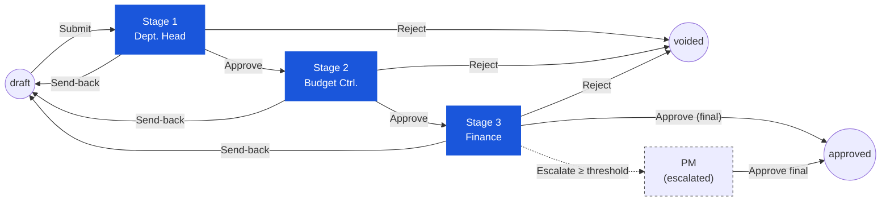

# Purchase Request — User Flow — Approver

> **At a Glance**
> **Persona:** Approver (any `approve`-role stage — illustrated as Dept. Head / Budget Controller / Finance) &nbsp;·&nbsp; **Module:** [purchase-request](/en/inventory/purchase-request) &nbsp;·&nbsp; **Workflow stages:** in_progress (Stage 1 → Stage 2 → Stage 3 → approved) &nbsp;·&nbsp; **Key permissions:** approve / send-back / reject / split, adjust approved_qty &nbsp;·&nbsp; **Re-verified 2026-09-22:** send-back keeps `pr_status = in_progress`; `approved_qty` is only checked for ≥ 0; "Budget Impact" panel and budget commitments have no code path
> **What this persona does:** Reviews submitted PRs at each approval stage and advances, returns, or terminates the document via the workflow.

## 1. Role in This Module

The **Approver** is the umbrella persona that covers the three intermediate decision-makers in the PR approval chain — **Department Head** (Stage 1 approve), **Budget Controller** (Stage 2), and **Finance Officer / Manager** (Stage 3) — all of whom share the same review-and-decide UI but apply it to different concerns (departmental justification, budget availability, and financial-impact correctness respectively). At each stage the Approver opens a submitted PR, reviews the header and lines, optionally adjusts `approved_qty` per line, and chooses one of four actions: **Approve** (advance to the next stage), **Send Back** (move the stage cursor back to a chosen prior stage — the PR stays `in_progress`), **Reject** (terminate the document), or **Split** (per-line accept / reject so the surviving lines continue while the rejected ones are recorded with `current_stage_status = rejected`). The document state remains `in_progress` for every intermediate approval — `pr_status` only flips to `approved` when the **final** approve stage clears (see `PR_POST_004` / `PR_POST_005` in [02-business-rules.md](./02-business-rules.md)). Approvers are not part of vendor allocation or PO conversion — those rights belong to the Procurement Manager / Purchaser persona under `enum_stage_role = purchase` (`PR_AUTH_008`).

### Workflow position (Approver chain highlighted)

### Permission Matrix — Action × Stage Role (Approver)

All three sub-roles share the same review-and-decide UI and the same action set. Differences come from scope (department visibility) and the policy each stage is meant to enforce. Edit rights are scoped to the **line-level Approved Qty / approved unit** fields (plus item note and delivery point — E2E `TC-PR-0604xx`); vendor and pricing fields are read-only at every approve stage (the `purchase` stage owns them). The server only rejects a negative `approved_qty` or a non-order unit, and only through `POST …/verify` (`PR_VAL_013`).

| Action | Dept. Head (Stage 1) | Budget Controller (Stage 2) | Finance (Stage 3) |
|---|---|---|---|
| View own-dept PRs | ✅ | ✅ (all departments) | ✅ (all departments) |
| View Items / Workflow History / Comments | ✅ | ✅ | ✅ |
| Approve (advance stage) | ✅ | ✅ | ✅ |
| Send-back (with reason) | ✅ | ✅ | ✅ |
| Reject — header level (terminate to `voided`) | ✅ | ✅ | ✅ |
| Split — line level (`POST …/:id/split`) | ✅ | ✅ | ✅ |
| Adjust `approved_qty` / `approved_unit` (≥ 0, `PR_VAL_013`) | ✅ | ✅ | ✅ |
| Add Comments | ✅ | ✅ | ✅ |
| Edit vendor / unit price / discount / tax / FOC | ❌ | ❌ | ❌ |
| Delete PR | ❌ | ❌ | ❌ |
| Convert to PO | ❌ | ❌ | ❌ |
| Override prior-stage send-back | ❌ | ❌ | ❌ (Procurement Manager only) |

> ⚠️ **Discrepancy — bulk-toolbar vs row-level actions (BRD FR-PR-005A):** The BRD specifies per-row standalone **Approve / Reject / Send for Review** buttons in the PR list / detail header. The current live UI exposes these only as **bulk toolbar actions** inside Edit Mode (via the Select All dropdown → bulk action toolbar). Confirmed bulk actions: Approve, Reject, Send for Review (BRD "Return Selected"), Split. Standalone row-level buttons remain absent. Source: `Test_case/Purchase_Request/Approver/INDEX.md` (capture date 2026-04-19). Verification status: confirmed HOD; assumed for FC / GM / Owner.

## 2. Entry Point and Primary Flow

**Entry point:** In-app notification → deep link to the PR detail page. Alternatively: Sidebar → **My Approval** (`/procurement/approval`, the cross-document queue read from `sys_v_my_pending` — see [my-approval](/en/inventory/purchase-request/my-approval)) or Sidebar → **Purchase Request** → **My Pending** tab (`GET /api/my-pending/purchase-requests`); both list PRs where the current user appears in `tb_purchase_request.user_action.execute[]` for the current stage.

**Primary flow (happy path) — single stage perspective:**

1. From the **My Approval** queue (or notification link), pick the PR awaiting decision. The queue shows `doc_no`, type, date and status, oldest document first; the PR list's My Pending tab additionally shows requestor, department, stage and total. Click into the PR to open the detail page in read-mostly mode (header and lines are non-editable for the Approver except for `approved_qty` and line-level decision flags).
2. Review the **header**: requestor and department, `pr_date`, `workflow_name`, description, `doc_version`. Use the **Workflow History** sheet and the **comment** sheet to read prior comments (Requestor notes, previous-stage approver comments, system events). *(There is no PR type or header delivery date — see [01-data-model](./01-data-model.md) §5.)*
3. Open the **Items** tab and walk each line. For each line confirm product, store location, delivery point and date, `requested_qty` + unit, FOC quantity, and any line notes; unit price / vendor / discount / tax are visible but read-only. The Approver also sees the inventory context (on-hand, on-order, last receiving info and the line's `last_price`) pulled live from [inventory](/en/inventory/inventory).
4. *(A **Budget Impact** panel with `availableBudget` was asserted in earlier revisions — unconfirmed, no code path; see `PR_VAL_015`.)* Review the footer totals: subtotal, discount, net, tax, grand total (`workflow/pr-footer-action.tsx`).
5. If a quantity needs to come down (requested qty exceeds policy, partial fulfilment is preferred), click **Edit** and change **`approved_qty`** on the affected line. The client schema accepts `≥ 0`; the server (`verify`, `stage_role = approve`) rejects only a negative value or an approved unit that is not an order unit of the product — there is **no** `≤ requested_qty` check (`PR_VAL_013`). `approved_unit_id` and `approved_unit_conversion_factor` are persisted alongside and the header roll-ups recompute on save.
6. Decide the **per-line disposition** if a split is needed: select the lines to keep and use the bulk **Split** action; the selected lines are moved to a new PR (`POST …/:id/split`), the rest stay. Rejected lines stay on the document with `current_stage_status = rejected` and never reach PO conversion (`PR_AUTH_003`).
7. Choose the action from the footer / bulk toolbar: **Approve**, **Send Back**, **Reject**, or **Split**. For Send Back and Reject the dialog (`workflow/pr-action-dialog.tsx`) prompts for a mandatory reason (Send Back also asks for the target stage from `GET …/:pr_id/previous-stages`); for Approve a comment is optional.
8. Confirm the action in the dialog. The system runs authorization checks (`PR_AUTH_002` — current user must be in `user_action.execute[]` for the current stage) and the `doc_version` lock (`PR_VAL_016`). The frontend may call `POST …/verify` with `verify_state = approve` first to list every problem at once (`PR_VAL_017`).
9. On **Approve** at an intermediate stage: the system applies `PR_POST_004` — appends to `workflow_history`, updates `workflow_previous_stage` / `workflow_current_stage` / `workflow_next_stage`, sets `last_action = approved` and `last_action_by_*` to the current user, recomputes `user_action.execute[]` for the next stage from the routing rules in `tb_workflow`, and notifies the next-stage approver. `pr_status` stays `in_progress`.
10. On **Approve** at the **final** stage: `PR_POST_005` flips `pr_status` from `in_progress` to `approved` (`purchase-request.service.ts:1913`), the workflow history marks the chain complete, notifications go to the Requestor, and the PR becomes eligible for PO conversion (see [purchase-order](/en/inventory/purchase-order)).
11. The Approver returns to the **My Approval** queue, where the just-decided PR has dropped out (the view excludes `approved`, and a stage transition rewrites `execute[]`). The action and any comment appear in the PR's `tb_purchase_request_comment` log immutably (`PR_POST_008`).

## 3. Decision Branches

- **If the Approver chooses Send Back** instead of Approve: the dialog requires a reason and a target stage (any earlier stage, `GET …/:pr_id/previous-stages`). On confirm the system applies `PR_POST_003`: `workflow_current_stage` moves to the target, `last_action = reviewed`, and `pr_status` is written as `in_progress` — even when the target is the requestor's create stage the PR does **not** return to `draft` (`purchase-request.service.ts:2052`). A notification is fired to the users at the target stage. The Approver's involvement ends here.
- **If the Approver chooses Reject at header level** (entire PR is unjustified, duplicate, or otherwise unacceptable): the dialog requires a reason. On confirm `PR_AUTH_004` + `PR_POST_006` apply: `pr_status` moves to `voided` (terminal), `workflow_history` is appended, and a `type = system` comment captures the rejection. The Requestor is notified and the chain ends — no further stages run.
- **If the Approver wants to accept some lines and reject others (Split)**: select the lines and use bulk **Split** (`POST …/:id/split`) so the selected lines continue on a new PR while the rest stay behind, or reject individual lines so they carry `current_stage_status = rejected` (`PR_AUTH_003`). Rejected lines stay visible on the document for audit and never convert to PO.
- **If the Approver adjusts `approved_qty`**: header roll-ups recompute and the new `total_amount` is what subsequent stages see. If the new total crosses a threshold boundary defined in `tb_workflow`, the routing for the *next* stage may change (e.g. small-amount PRs may skip Stage 4 per `PR_AUTH_005`).
- **If the PR's `base_total_amount` exceeds a configured escalation threshold**: per `PR_AUTH_005`, additional stages or an escalation path to the **Procurement Manager** may be inserted. The Approver still completes their stage normally; the threshold logic fires automatically on the stage transition and reroutes the next notification. The Approver does not see threshold breaches as an error — the workflow engine handles them.
- **If the Approver is temporarily unavailable**: **(unconfirmed — no delegation code found).** An earlier revision of this page asserted that the Approver could delegate their stage per `PR_AUTH_006`, with the delegate inheriting approve / send-back / reject / split-reject rights for a delegation window, `last_action_by_id` reflecting the delegate, and the audit comment capturing the delegation source. A repo-wide search of the frontend workflow admin and the backend workflow orchestrator found no delegation, reassignment, proxy, or substitute-approver mechanism anywhere. The only confirmed way to keep the chain moving with the primary Approver absent is for another user already named in `user_action.execute[]` for that stage (e.g. a second `assigned_users` entry configured on the stage) to act instead, or for a System Administrator to edit the stage's assigned users via `/system-admin/workflow`.
- **If the Approver tries to act on a PR they are not authorised for** (not in `user_action.execute[]` for the current stage, or PR is already at a later stage): the action buttons are disabled and an inline message explains. `PR_AUTH_002` enforces this server-side as well.

## 4. Exit Point / Handoffs

The Approver's involvement ends at the moment they commit a header-level decision in Section 2 step 8. Where the document goes next depends on which decision was taken:

- **Intermediate-stage Approve** (Stage 1 or Stage 2, or Stage 3 when Stage 4 still runs): `pr_status` stays `in_progress`; `workflow_current_stage` advances; handoff is to the **next-stage Approver** (Budget Controller, Finance, or Procurement Manager respectively).
- **Final-stage Approve** (last stage clears): `pr_status` flips to `approved` (`PR_POST_005`); handoff is to whoever runs the Convert-to-PO dialog. The PR remains in `approved` until every line is fully bridged to a PO, at which point `pr_status` flips to `completed` (`PR_POST_007`).
- **Send Back** (any stage): `pr_status` stays `in_progress` and `workflow_current_stage` moves to the chosen earlier stage; if that is the Requestor's create stage, the **Requestor** picks it up again at [03-user-flow-requestor.md](./03-user-flow-requestor.md) Section 2 step 2 — still as an `in_progress` document.
- **Header Reject** (any stage): `pr_status` flips to `voided` (terminal, `PR_POST_006`); the **Auditor** reviews post-hoc but no further user action is possible. The Requestor sees the status on the PR list.
- **Threshold-driven escalation**: `pr_status` stays `in_progress`; the workflow engine inserts (or re-routes to) an additional stage owned by the **Procurement Manager**. The current Approver has already exited; the Procurement Manager picks up from their own My Approval queue with the same Section 2 flow.

Document state on every transition is recorded by `enum_purchase_request_doc_status = { draft, in_progress, voided, approved, completed }` and the workflow timeline in `workflow_history`. There is no administrative void — `voided` is written only by Reject (`PR_AUTH_007` is unconfirmed).

## 5. References

- Parent overview: [03-user-flow.md](./03-user-flow.md)
- Authorization rules: [02-business-rules.md](./02-business-rules.md) Section 4 — `PR_AUTH_001`–`PR_AUTH_008`, stage chain, threshold routing (confirmed); delegation (`PR_AUTH_006`, unconfirmed)
- Posting rules: [02-business-rules.md](./02-business-rules.md) Section 5 — `PR_POST_003` (send-back), `PR_POST_004` (intermediate approve), `PR_POST_005` (final approve), `PR_POST_006` (reject / void / cancel)
- `../carmen/docs/purchase-request-management/PR-User-Experience.md` — primary source for the approval-process sequence, Approver UI flow, and per-stage permission matrix
- `../carmen/docs/purchase-request-management/PR-Overview.md` — module overview, approver role definitions (Department Head, Budget Controller, Finance), and integration points
- `../carmen/docs/purchase-request-management/purchase-request-module-prd.md` — product requirements driving the multi-stage approval chain and threshold-based routing
- Sibling: [01-data-model.md](./01-data-model.md) — `tb_purchase_request.workflow_current_stage`, `stages_status`, `user_action`, `workflow_history`, `enum_purchase_request_doc_status`
- Sibling: [03-user-flow-requestor.md](./03-user-flow-requestor.md) — upstream persona; receives PRs returned via Send Back
- Sibling: [the module landing](/en/inventory/purchase-request) Section 4 — canonical Approver role description and stage chain
