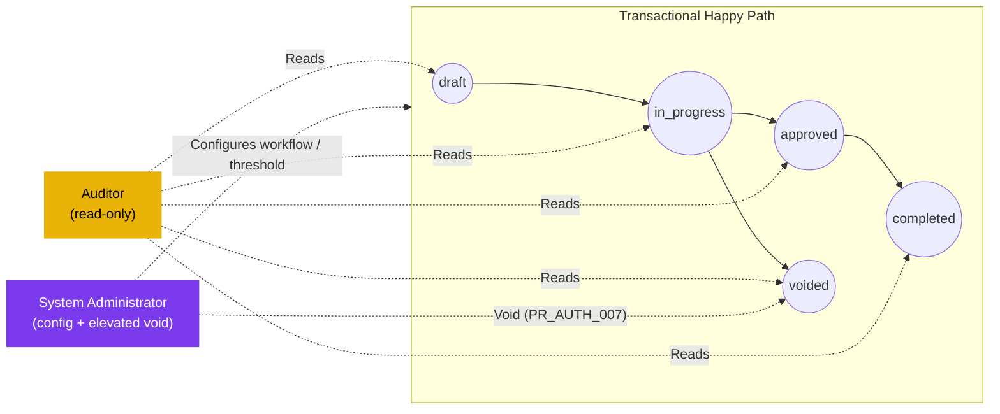

# Purchase Request — User Flow — Audit & Config

> **At a Glance**
> **Persona:** Auditor (read-only) + System Administrator (config) &nbsp;·&nbsp; **Module:** [purchase-request](/en/inventory/purchase-request) &nbsp;·&nbsp; **Workflow stages:** off-path — observes all states; Sysadmin holds elevated void (PR_AUTH_007) &nbsp;·&nbsp; **Key permissions:** audit/read history, configure workflow / thresholds / delegation, elevated void
> **What this persona does:** Reviews the immutable audit trail (Auditor) and owns workflow, threshold, delegation, and policy configuration (Sysadmin).

## 1. Role in This Module

The **Audit / Config** persona axis groups two distinct roles that both sit **outside the transactional happy path** of the `purchase-request` module but are essential to its governance and operability. The **Auditor** is a read-only persona who reviews the immutable activity trail of every PR — the status-history timeline in `workflow_history`, the comment log in `tb_purchase_request_comment` (`PR_POST_008`), every header / line / status / vendor / pricelist change captured as system events, and the per-stage authorization snapshot in `user_action` — and verifies that documents comply with policy, that segregation of duties was respected (no single user acted as Requestor and Approver on the same PR, no out-of-band approvals), and that the audit trail is complete and tamper-evident. The Auditor has **no write surface** in the module: they cannot approve, reject, send back, edit lines, change workflows, or void PRs. The **System Administrator** is a configuration persona who owns the **workflow and policy surface** for the module — workflow stages and their `stage_role` chain, amount thresholds that drive routing and escalation (`PR_AUTH_005`), delegation rules and windows (`PR_AUTH_006`), per-PR-type defaults (default workflow per `enum_purchase_request_type`, line-level tax-treatment defaults, default approve / reject mandatory-reason policies), tax codes and tax-inclusive/exclusive defaults consumed by `PR_CALC_002`–`PR_CALC_004`, currency rate sources feeding `exchange_rate` and `PR_CALC_006` snapshots, and the user / role / business-unit assignments that determine who lands in `user_action.execute[]` at each stage. Neither role is on the request-to-PO happy path; each has its own entry point, its own surface, and its own exit semantics: the Auditor exits via a generated report with no PR state change, the Sysadmin exits via a saved configuration that takes effect for future PRs while preserving snapshot semantics for PRs already `in_progress`. The pair is documented here on a single persona axis because both roles are peripheral to the transactional flow and share a common pattern of "off-path, governance-oriented" operation.

### Position relative to the transactional flow (off-path observers)

### Permission Matrix — Action × Sub-persona (Audit / Config)

The two sub-personas have complementary, non-overlapping rights. Auditors observe and report; Sysadmins configure and (exceptionally) void. Neither participates in approve / send-back / reject.

| Action | Auditor | System Administrator |
|---|---|---|
| Read `workflow_history` / `tb_purchase_request_comment` | ✅ | ✅ |
| Read header / lines / snapshots (vendor / pricelist / exchange rate) | ✅ | ✅ |
| Build ad-hoc audit query (filtered) | ✅ | ✅ |
| Flag PR in audit case file (audit-side store only) | ✅ | ❌ |
| Export report (CSV / PDF) — sensitive fields require export-approver | ✅ | ✅ |
| Edit workflow stages / `stage_role` chain | ❌ | ✅ |
| Edit amount thresholds (`PR_AUTH_005`) | ❌ | ✅ |
| Edit delegation rules / windows (`PR_AUTH_006`) | ❌ | ✅ |
| Assign / remove users from `user_action.execute[]` | ❌ | ✅ |
| Edit PR-type defaults / tax codes / currency rates | ❌ | ✅ |
| Save configuration with `effective_from` (snapshot for in-flight PRs) | ❌ | ✅ |
| Roll back configuration to prior version | ❌ | ✅ |
| Void in-flight PR (`PR_AUTH_007`, `PR_POST_006`) | ❌ | ✅ |
| Edit PR header / lines / vendor / pricing | ❌ | ❌ |
| Approve / Reject / Send-back / Split-Reject | ❌ | ❌ |

> ℹ️ **Auditor → Sysadmin escalation:** when an audit finding requires a state change (e.g. void of a non-compliant PR), the Auditor flags the case file and the **System Administrator** performs the void under `PR_AUTH_007`. The Auditor never executes the action themselves.

## 2. Entry Point and Primary Flow

### Auditor flow

**Entry point:** Sidebar → **Audit** workspace → **PR Activity Queries** (or, when starting from a known document, Sidebar → **Purchase Request** module → open a PR → **Activity Log** tab). The Auditor lands on a query-builder surface scoped to the `purchase-request` document family, not on the My Approvals / My PRs queues used by transactional personas.

**Primary flow (happy path — Auditor):**

1. From **Audit → PR Activity Queries**, select the audit query template (e.g. "All PRs voided in period", "All send-backs by stage", "All split-rejects", "Threshold escalations", "Delegations exercised", "All status transitions for a PR") or build an ad-hoc query against `workflow_history`, `tb_purchase_request_comment`, and the header / detail snapshots.
2. Apply **filters**: date range (`pr_date`, `last_action_at`, or `created_at`), department / business unit, requestor, approver / delegate, `pr_status` value, `enum_purchase_request_type`, `base_total_amount` band, and threshold-breach flag. Filter chips appear above the result table; an empty filter set is rejected to prevent unbounded scans.
3. Review the **result set**: each row is one PR (or one event, depending on query shape) with `pr_no`, requestor, current state, last action, last actor, and the relevant audit fact for the query (e.g. void reason, send-back hop, split-reject line count). Sort by any column; click into a row to drill into the **full activity trail** for that PR.
4. On the drill-down page, walk the **status timeline** from `created_at` to the current state: every `workflow_history` row (stage entered, stage cleared, by whom, with what comment), every `tb_purchase_request_comment` entry (user comments and `type = system` comments capturing rule-driven actions), every line-level decision (`current_stage_status` per line), and every snapshot reference (vendor / pricelist / exchange-rate snapshots taken at submit and at approval per `PR_CALC_006`). Verify the trail is contiguous (no gaps, no out-of-order timestamps) and that every state transition has both an actor and a justification where required.
5. If an anomaly is found (e.g. an approval recorded outside the stage's `user_action.execute[]`, a void without a reason comment, a delegate acting outside their window), **flag** the PR in the audit case file with a note. Flagging does **not** change the PR — it writes to an audit-side store only.
6. **Export the report** as CSV / PDF for the period or for the case file. Exports of sensitive fields (e.g. requestor names, full justification text, attachment payloads) require a secondary approval per the data-export policy described in [02-business-rules.md](./02-business-rules.md) Section 4 — the Auditor submits the export request and an export-approver releases it. The exported report and approval record are themselves audit objects.

### System Administrator flow

**Entry point:** Sidebar → **Configuration** workspace → **PR Workflow Settings** (for stages, thresholds, delegation), **PR Type Defaults** (for `enum_purchase_request_type` defaults and tax-treatment defaults), **Tax Codes**, **Currency Rates**, or **Users & Roles** (for `user_action.execute[]` assignment). Each surface is a separate page under the same workspace.

**Primary flow (happy path — Sysadmin, workflow / threshold / delegation change):**

1. **Identify the policy change.** Triggered externally — e.g. Finance wants a new Stage 4 high-value approver, a department restructure changes who owns Stage 1, a delegation needs to be activated for an upcoming leave window, or a threshold band needs adjusting after a budget review. Open a change ticket and link the policy reference (memo / approval) before opening the configuration surface.
2. **Open the relevant configuration page.** For workflow / threshold changes: **Configuration → PR Workflow Settings** → select the workflow row (per business unit / per PR type) → open the stage editor. For delegation: **Configuration → Delegation Rules** → pick the delegating user → set delegate and window. For PR-type defaults: **Configuration → PR Type Defaults**.
3. **Adjust the settings** in the staged editor: add / remove / reorder stages, change a stage's `stage_role` (`approve`, `purchase`, `review`), assign or remove users from `user_action.execute[]`, edit the amount threshold that triggers escalation to the `purchase` stage per `PR_AUTH_005`, set the delegation window (`start_at`, `end_at`, delegate user, scope per `PR_AUTH_006`), or change the PR-type default workflow / tax treatment. All edits accumulate in a pending-configuration draft; nothing persists until Save.
4. **Preview the impact.** The configuration page shows a side-panel summary: the active-PR count that will continue under the old snapshot, the new-PR count that will use the new rules (forecasted from recent creation rate), the stages that change, and any users newly added to or removed from `user_action.execute[]`. For threshold changes the panel shows the band shift and how many recent PRs would have routed differently. The Sysadmin can revise or discard the draft at this point.
5. **Save the configuration.** The system writes the new configuration with an `effective_from` timestamp, records the change in a system-side configuration audit log (independent of `tb_purchase_request_comment`), and notifies the affected user populations (e.g. newly-added approvers, the delegating and delegate users). PRs already in `in_progress` keep their original configuration **snapshot** — workflow stage chain, threshold band, and tax / currency context they were submitted under are pinned per the snapshot semantics described in [02-business-rules.md](./02-business-rules.md) Section 6. New PRs created after `effective_from` use the new configuration.
6. **Verify activation.** Pick a representative new test PR (or simulate one in a non-production environment) and confirm the new routing fires as expected: stages, threshold breach behaviour, and delegate inheritance. If a regression is found, roll back by re-opening the configuration and reverting to the prior version (every saved version is retained in the configuration audit log).
7. **Close the change ticket** with the configuration audit-log link. From this point the change is in force for new PRs; the Sysadmin's involvement ends until the next policy change.

## 3. Decision Branches

- **If the Auditor finds a policy violation** (e.g. an approval by a user not in `user_action.execute[]`, a void without a mandatory reason, a delegate acting outside their `PR_AUTH_006` window): the Auditor **cannot act on the PR in-module** (read-only). The Auditor escalates via the audit case file — flags the PR, attaches the evidence (timeline screenshot, comment-log excerpt, configuration version diff), and routes the case to the responsible business owner (Finance, Compliance, or the relevant department head) for out-of-band remediation. If remediation requires a system-level action (e.g. a void to terminate a non-compliant PR), that action is performed by the System Administrator under `PR_AUTH_007`, not by the Auditor.
- **If the Sysadmin attempts a configuration change while an in-flight PR depends on the current rules**: the save is allowed (rules are not locked by in-flight PRs), but the change does **not** retroactively re-route or re-rank existing in-flight PRs. The configuration page surfaces a count of affected `in_progress` PRs in the preview panel; those PRs continue under their snapshot per [02-business-rules.md](./02-business-rules.md) Section 6 and only feel the new rules if they are sent back to `draft` and re-submitted (in which case the resubmission uses the new configuration). This is the same snapshot-preservation behaviour that protects `PR_CALC_006` exchange rates.
- **If a delegation is activated for an immediate window**: the delegate inherits the delegating user's `user_action.execute[]` membership for the window's scope (per `PR_AUTH_006`). Notifications for any PR currently sitting at a stage owned by the delegating user are re-fanned to the delegate. When the delegation window expires (`end_at` reached), the delegate's inherited rights drop automatically; PRs still at that stage continue with the original user's `user_action.execute[]` (which never changed) — no PR re-routing is required.
- **If a delegation window is set with `start_at` in the future**: the delegate gains nothing until `start_at`. The system schedules an activation event; at `start_at` the delegation goes live and notifications begin re-fanning. The Sysadmin can revoke the pending delegation at any time before activation without side effects.
- **If the Auditor requests an export that includes sensitive fields** (full requestor name, full free-text justifications, vendor pricelist snapshots, attachment payloads): the export goes into a **pending** state and requires approval from a data-export approver per the export policy. The Auditor cannot bypass this step. While pending, the export is invisible outside the audit case file; on approval, the export is materialised and a download link is recorded in the case file with the approver's identity.
- **If a Sysadmin change blocks an in-flight PR** (e.g. the configuration removes a user from `user_action.execute[]` on a stage where that user is the only one assigned, and a PR is currently waiting at that stage with no other approver): the preview panel flags the deadlock in step 4. If the Sysadmin saves anyway, the affected PR will time out at that stage and require manual intervention — typically a one-off delegation (`PR_AUTH_006`) or a Sysadmin-initiated void (`PR_AUTH_007`) — to unblock. The configuration audit log records the change and the deadlock warning so the audit trail makes the cause clear.

## 4. Exit Point / Handoffs

The Audit / Config persona axis exits in one of the following ways, depending on which role acted:

- **Auditor — report generated.** A query result, drill-down trail, or case file is materialised (on-screen review or exported to CSV / PDF after the export-approval flow). **No PR state is changed**: `pr_status`, `workflow_current_stage`, `workflow_history`, `tb_purchase_request_comment`, and every snapshot on the document remain exactly as they were before the Auditor opened the page. The Auditor's handoff is **out-of-band** to whichever business owner (Finance, Compliance, department head, or the System Administrator) is responsible for any remediation the audit surfaced. If the Auditor's case file recommends a void, the System Administrator performs the void under `PR_AUTH_007`.
- **Auditor — case file closed without action.** When the audit query / drill-down finds no anomaly, the Auditor closes the case file with a "no findings" note. No PR state change; the case file itself is retained as evidence that the period / scope was audited.
- **Sysadmin — configuration saved.** A new version of the configuration (workflow stages, thresholds, delegation rules, PR-type defaults, tax codes, currency rates, or user-role assignments) is written with an `effective_from` timestamp and recorded in the configuration audit log. **PRs created after `effective_from`** use the new configuration; **PRs already in `in_progress`** retain their original snapshotted configuration per [02-business-rules.md](./02-business-rules.md) Section 6 — including stage chain, threshold band, tax treatment, and `PR_CALC_006` exchange-rate semantics. Notifications to affected user populations fire on save. Handoff is **forward in time** — the next Requestor who creates a PR sees the new behaviour automatically.
- **Sysadmin — void on an in-flight PR (`PR_AUTH_007`).** Distinct from configuration save: when the Sysadmin uses their elevated `void` right to retract a single PR (typically following an Auditor case file), `pr_status` flips from `in_progress` (or `approved`) to `voided` (terminal); the soft (or hard) commitment is released; a mandatory reason is captured in `tb_purchase_request_comment` (`PR_POST_006`); and `workflow_history` records the void. Handoff is to the **Auditor** for post-hoc review and to the **Requestor** who sees the voided status on their **My PRs** dashboard. No further user action on the PR is possible.
- **Sysadmin — configuration rolled back.** If verification in step 6 of the primary flow finds a regression, the Sysadmin reverts to the prior configuration version. The rollback is itself a configuration save with its own `effective_from`; PRs created between the original change and the rollback are not retroactively re-evaluated (snapshot semantics), but new PRs created after the rollback use the reverted configuration. The configuration audit log captures both the forward change and the rollback, preserving a clean trail.

Document state across all Audit / Config exits is governed by `enum_purchase_request_doc_status = { draft, in_progress, voided, approved, completed }`. The Auditor flow never moves a PR across this enum; the Sysadmin's configuration flow also never moves a PR across the enum (only future PRs are affected). The only Sysadmin action that does change a PR's state is the elevated void under `PR_AUTH_007`, and that is treated as an exceptional, audit-triggered operation rather than a routine configuration step.

## 5. References

- Parent overview: [03-user-flow.md](./03-user-flow.md)
- Authorization rules: [02-business-rules.md](./02-business-rules.md) Section 4 — `PR_AUTH_002` (per-stage executors), `PR_AUTH_005` (amount-threshold routing), `PR_AUTH_006` (delegation), `PR_AUTH_007` (elevated void / sysadmin-only state changes), `PR_AUTH_008` (`enum_stage_role` ownership)
- Posting rules: [02-business-rules.md](./02-business-rules.md) Section 5 — `PR_POST_006` (void), `PR_POST_008` (immutable audit comments)
- Cross-module rules: [02-business-rules.md](./02-business-rules.md) Section 6 — snapshot semantics for configuration changes, `PR_CALC_006` exchange-rate snapshot parallels for tax / currency / threshold context
- `../carmen/docs/purchase-request-management/PR-Module-Structure.md` — configuration surface (workflow stages, thresholds, delegation, PR-type defaults, tax / currency / user-role configuration)
- `../carmen/docs/purchase-request-management/PR-User-Experience.md` — activity-log UX, audit-trail presentation, drill-down conventions
- `../carmen/docs/purchase-request-management/PR-Overview.md` — Auditor and System Administrator stakeholder roles, governance integration points
- `../carmen/docs/purchase-request-management/purchase-request-module-prd.md` — product requirements for the audit log, configuration surface, and elevated administrative actions
- Sibling: [03-user-flow-requestor.md](./03-user-flow-requestor.md) — upstream persona whose actions feed the audit trail
- Sibling: [03-user-flow-approver.md](./03-user-flow-approver.md) — approval-chain decisions captured in `workflow_history` for audit review
- Sibling: [03-user-flow-purchaser.md](./03-user-flow-purchaser.md) — downstream persona whose PO-conversion handoff is audited
- Sibling: [03-user-flow-procurement-manager.md](./03-user-flow-procurement-manager.md) — escalation and rule-set changes that the Sysadmin's threshold / workflow configuration enables
- Sibling: [the module landing](/en/inventory/purchase-request) Section 4 — canonical Auditor and System Administrator role descriptions
- Cross-link: [inventory-adjustment](/en/inventory/inventory-adjustment) — sibling audit-trail surface for inventory-side governance
- Cross-link: [purchase-order](/en/inventory/purchase-order) — downstream module whose conversion events are observed in the PR audit trail
