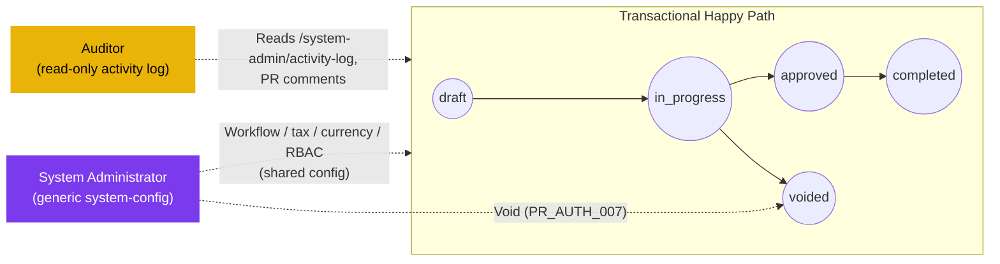

# Purchase Request — User Flow — Audit & Config

> **At a Glance**
> **Persona:** Audit / Config (Auditor + System Administrator) &nbsp;·&nbsp; **Module:** [purchase-request](/en/inventory/purchase-request) &nbsp;·&nbsp; **Confirmed surface:** generic per-document activity log (Auditor, read-only — `/system-admin/activity-log`); generic workflow-stage editor with a **Routing** tab that supports amount/department/category-threshold stage routing (`/system-admin/workflow`), tax-profile (`/config/tax-profile`), currency + exchange-rate (`/config/currency`, `/config/exchange-rate`), and user / role screens (`/system-admin/user`, `/system-admin/role`) shared across every document type, not PR-specific (System Administrator) &nbsp;·&nbsp; **Not confirmed:** a PR-specific "Audit workspace" query builder, a PR-specific "Configuration workspace," delegation windows, or per-PR-type defaults

> ⚠️ **Major correction this pass.** The previous version of this page described a dedicated sidebar **"Audit"** workspace with a **"PR Activity Queries"** query builder (audit templates, filter chips, case-file flagging, export-approval workflow) and a dedicated sidebar **"Configuration"** workspace with child pages — **PR Workflow Settings** (stage editor plus a Threshold Rules panel, preview/forecast panel, and `effective_from` versioning), **PR Type Defaults**, **Delegation Rules**, **Tax Codes**, and **Currency Rates**. This was settled against current source in `.specs/resync-2026-07-15-progress.md` (commit `df8ab13`, "settle PR audit-config deferral vs system-admin screens"), which read every route in `router.tsx` and every screen component under `routes/system-admin/` and `routes/config/`:
> - **No route or component matching an "audit workspace," "PR Activity Queries," or a PR-specific configuration workbench exists anywhere** in `carmen-inventory-frontend-react`. There is also no "PR detail → Activity Log tab" — the PR detail page has a comment sheet only.
> - "PR Activity Queries" maps only partially onto the generic **`/system-admin/activity-log`** screen (`activity-log-component.tsx`): a plain list filterable by `action` / `entity_type` / `user`, not a query-template builder — no filter chips beyond that, no PR-specific scoping, and no per-query audit-of-audit log.
> - "PR Workflow Settings" maps onto the generic **`/system-admin/workflow`** stage editor (real: stages, SLA, assigned users, `hide_fields`, for `workflow_type = purchase_request` rows among others), which also has a **Routing** tab — a repo-wide search of the frontend and backend for `threshold` / `delegat` found no matching keyword, but a follow-up pass (2026-07-29) searching for the actual implementation terms (`routing_rules`, `total_amount`, `evaluateCondition`) found that this Routing tab *is* a real, live amount-threshold routing mechanism: a per-workflow rule set (`tb_workflow.data.routing_rules`) that compares `total_amount` (sum of PR line `total_price`), `department`, or `category` against an operator (`eq`/`gt`/`lt`/`gte`/`lte`/`between`) and, on match, skips or jumps to a named stage — evaluated by the workflow orchestrator on submit and every approve action. It has no preview/forecast panel and no `effective_from` versioning (the fabricated elaborations from the prior page version), and it is generic (shared by PR, PO, and SR workflows), not a PR-specific "Threshold Rules panel." A **delegation**-window mechanism, by contrast, was not found anywhere by either search. **This means the `PR_AUTH_005`** (amount thresholds) **entry in [02-business-rules.md](./02-business-rules.md) is confirmed live behavior; the `PR_AUTH_006`** (delegation) **entry remains unconfirmed design intent** — both business-rules entries and every other page in this module citing them were corrected in the same follow-up pass.
> - "PR Type Defaults" and "Delegation Rules" have **no equivalent anywhere** in current source.
> - "Tax Codes" maps onto the generic **`/config/tax-profile`** master-data screen (`tax-profile-component.tsx` / `tax-profile-dialog.tsx`) — a flat `tax_rate` field per row, not an effective-dated rate table.
> - "Currency Rates" maps onto the generic **`/config/currency`** + **`/config/exchange-rate`** master-data screens — no `effective_from` versioning was found on either.
> - "Users & Roles" maps onto the real **`/system-admin/user`** + **`/system-admin/role`** access-control screens — generic, not PR-specific.
> This exact pattern (an elaborate audit-workspace + configuration-workspace narrative with no matching route) was independently found and corrected in the `purchase-order` module's own resync pass — see [purchase-order/03-user-flow-audit-config.md](/en/inventory/purchase-order/03-user-flow-audit-config), which ran the same repo-wide searches and found nothing supporting either workspace anywhere in the product.

## 1. Role in This Module

The **Auditor** is a read-only role. The one confirmed surface is the generic **`/system-admin/activity-log`** screen — a filterable list of `action` / `entity_type` / `user` events across all document types, including `purchase_request` rows — plus the PR detail page's own comment sheet (`tb_purchase_request_comment`, immutable for `type = system` rows per `PR_POST_008`) that any user with read access to a PR can already see. Whether a distinct "Auditor" role gates either surface differently from any other viewer with read access was not confirmed this pass. The Auditor cannot approve, reject, send back, edit lines, or void a PR.

The **System Administrator** configures the workflow definition referenced by a PR's `workflow_id` (stages, `stage_role`, `user_action.execute[]` membership, and the **Routing** tab's amount/department/category-threshold rules — generic system-config functionality shared across document types via `/system-admin/workflow`, not PR-specific), tax rates (`/config/tax-profile`), currency and exchange-rate masters (`/config/currency`, `/config/exchange-rate`), and RBAC user/role assignments (`/system-admin/user`, `/system-admin/role`). No PR-specific amount-threshold editor (the real one is generic, not PR-specific), delegation-window manager (no equivalent anywhere), or per-PR-type default screen was found. Separately, the System Administrator (jointly with Finance) holds the elevated **void** right under `PR_AUTH_007`, which is a real, confirmed action distinct from any of the configuration screens above.

### Position relative to the transactional flow

```mermaid
graph LR
    subgraph transactional["Transactional Happy Path"]
        draft(("draft")) --> inprog(("in_progress"))
        inprog --> approved(("approved"))
        approved --> completed(("completed"))
        inprog --> voided(("voided"))
    end
    auditor["Auditor<br/>(read-only activity log)"]:::audit -.->|"Reads /system-admin/activity-log,<br/>PR comments"| transactional
    sysadmin["System Administrator<br/>(generic system-config)"]:::cfg -.->|"Workflow / tax / currency / RBAC<br/>(shared config)"| transactional
    sysadmin -.->|"Void (PR_AUTH_007)"| voided
    classDef audit fill:#eab308,color:#000,stroke:#eab308;
    classDef cfg fill:#7c3aed,color:#fff,stroke:#7c3aed;
```

### Permission Matrix — Action × Sub-persona (Audit / Config)

| Action | Auditor | System Administrator |
|---|---|---|
| Read `/system-admin/activity-log` (filtered by `action` / `entity_type` / `user`) | ✅ | ✅ |
| Read PR header / lines / `tb_purchase_request_comment` (via the PR detail page, same as any reader) | ✅ | ✅ |
| Edit workflow stages / `stage_role` / `user_action.execute[]` (`/system-admin/workflow`, generic) | ❌ | ✅ |
| Edit tax rates (`/config/tax-profile`, generic) | ❌ | ✅ |
| Edit currency / exchange-rate masters (`/config/currency`, `/config/exchange-rate`, generic) | ❌ | ✅ |
| Edit RBAC user / role assignments (`/system-admin/user`, `/system-admin/role`, generic) | ❌ | ✅ |
| Configure an amount-threshold routing rule (`/system-admin/workflow` **Routing** tab, generic) | ❌ | ✅ |
| Configure a delegation window | **Not confirmed to exist** | **Not confirmed to exist** |
| Edit PR header / lines / vendor / pricing | ❌ | ❌ |
| Approve / Reject / Send-back / Split-Reject | ❌ | ❌ |
| Void an in-flight or approved PR (`PR_AUTH_007`) | ❌ | ✅ |

## 2. Entry Point and Primary Flow

### 2.1 Auditor

**Entry point:** Sidebar → **System Admin** → **Activity Log** (`/system-admin/activity-log`). **Not confirmed:** a dedicated PR-scoped query workspace, a query-template picker, or a drill-down page beyond the activity-log's own detail sheet.

**Confirmed flow:** Open `/system-admin/activity-log`, filter by `entity_type = purchase_request` (or a narrower `action` / `user` filter), and review the resulting list — each row shows the action, actor, and timestamp; clicking a row opens the detail sheet (`activity-log-detail-sheet.tsx`) with the recorded event payload. For a specific PR's own comment history, open the PR detail page directly and read `tb_purchase_request_comment` (`type = system` rows are immutable per `PR_POST_008`). No PR state is changed by either read path.

### 2.2 System Administrator

**Entry point:** the generic system-config and config screens — **`/system-admin/workflow`** (workflow stages and stage-role assignment), **`/config/tax-profile`** (tax rates), **`/config/currency`** and **`/config/exchange-rate`** (currency masters and rates), and **`/system-admin/user`** / **`/system-admin/role`** (RBAC). None of these are PR-specific; each is shared across every document type in the product and documented in its own right under [system-config](/en/inventory/system-config) (out of scope to duplicate here).

**Confirmed flow:** open the relevant screen, edit the row (workflow stage / `stage_role` / assigned user, tax rate, exchange rate, or role-permission grant), and save. Workflow edits affect PRs created after the change; PRs already `in_progress` carry their assigned `workflow_id` and stage cursor, so an in-flight PR is not silently rerouted mid-workflow by a later stage-definition edit (this follows from the workflow being referenced by ID, not re-resolved live — the practical extent of "snapshot" behavior beyond that was not verified this pass). **Not confirmed:** any preview/forecast panel showing affected in-flight or projected PR counts before save, or a versioned/effective-dated configuration history for any of these screens.

## 3. Decision Branches

- **If the Auditor finds an activity-log gap or an anomalous entry**: escalate outside the module — no PR-specific "case file" or flagging feature was confirmed. A generic activity-log or audit-trail feature beyond the filtered list, if one exists, is documented in [reporting-audit](/en/inventory/reporting-audit), not here.
- **If a Sysadmin needs to end a stuck PR** (e.g., a workflow edit leaves no eligible approver at a stage after an RBAC change): the confirmed remediation is the System Administrator's own elevated **void** under `PR_AUTH_007`, or escalation to Finance. There is no confirmed delegation mechanism to temporarily reassign the stuck stage — a repo-wide search for a delegation-window feature returned nothing (see the correction note above).
- **If the Sysadmin edits a tax rate, exchange rate, or workflow stage while a PR is in flight under the old values**: the edit does not appear to retroactively rewrite an in-flight PR's own snapshotted fields (`exchange_rate`, `vat_rate`, etc., captured at submit — see [02-business-rules.md](./02-business-rules.md) Section 6), but no configuration-side preview panel or affected-PR count was found to confirm this is surfaced to the Sysadmin before saving.

## 4. Exit Point / Handoffs

Neither role transitions a PR across `enum_purchase_request_doc_status = { draft, in_progress, voided, approved, completed }` through the read or configuration paths described above.

- **Auditor** — the activity-log read never changes state. Any remediation the Auditor's review surfaces is handed off out-of-band to Finance, Compliance, or the System Administrator.
- **System Administrator (configuration)** — a workflow / tax / currency / RBAC edit is saved and takes effect for future PRs and (for RBAC) future actions; it never itself moves a PR's `pr_status`.
- **System Administrator (void)** — the one action in this persona axis that does change PR state: `pr_status` flips to `voided` (terminal) under `PR_AUTH_007` / `PR_POST_006`, releasing the budget soft-commitment and appending a mandatory-reason system comment. Handoff is to the Requestor (sees `voided` on **My PRs**) and to the Auditor (sees the void in the activity log on next query).

## 5. References

- Parent overview: [03-user-flow.md](./03-user-flow.md)
- Authorization rules: [02-business-rules.md](./02-business-rules.md) Section 4 — `PR_AUTH_002` (per-stage executors), `PR_AUTH_007` (elevated void, Finance / System Administrator scope), `PR_AUTH_008` (`enum_stage_role` ownership for PO conversion). **`PR_AUTH_005`** (amount thresholds) is confirmed live behavior via the `/system-admin/workflow` **Routing** tab (see the correction note above). **`PR_AUTH_006`** (delegation) remains unconfirmed — no matching delegation code was found anywhere.
- Posting rules: [02-business-rules.md](./02-business-rules.md) Section 5 — `PR_POST_006` (void), `PR_POST_008` (immutable audit comments).
- Cross-module rules: [02-business-rules.md](./02-business-rules.md) Section 6 — snapshot semantics (`exchange_rate`, tax fields) captured at submit, relevant to what a Sysadmin's master-data edit does and does not retroactively affect.
- Related (generic config, not PR-specific): [system-config/workflow](/en/inventory/system-config/workflow).
- Sibling: [03-user-flow-requestor.md](./03-user-flow-requestor.md) — upstream persona whose actions appear in the activity log.
- Sibling: [03-user-flow-approver.md](./03-user-flow-approver.md) — approval-chain decisions captured in `workflow_history` for audit review.
- Sibling: [03-user-flow-purchaser.md](./03-user-flow-purchaser.md) — downstream persona whose PO-conversion handoff is observable in the activity log.
- Sibling: [03-user-flow-procurement-manager.md](./03-user-flow-procurement-manager.md) — escalation path for a stuck PR that does not go through this persona axis.
- Cross-link: [purchase-order/03-user-flow-audit-config.md](/en/inventory/purchase-order/03-user-flow-audit-config) — sibling module where the identical fabricated audit/config-workspace narrative was independently found and corrected; the full list of searches run.
- Cross-link: [inventory-adjustment](/en/inventory/inventory-adjustment) — sibling module with the same generic-activity-log-only audit surface.
