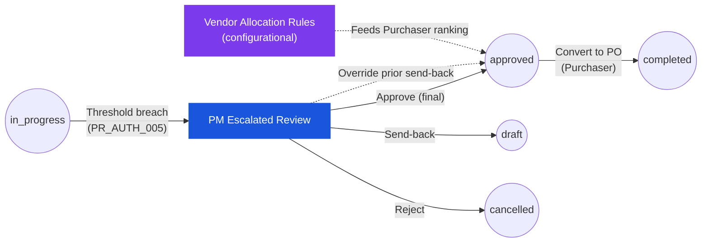

# Purchase Request — User Flow — Procurement Manager

> **At a Glance**
> **Persona:** Procurement Manager &nbsp;·&nbsp; **Module:** [[purchase-request]] &nbsp;·&nbsp; **Workflow stages:** in_progress (escalated final approve) + configurational (Allocate Vendor rules) &nbsp;·&nbsp; **Key permissions:** high-value approve, override prior send-back, vendor-ranking config
> **What this persona does:** Acts as the escalated final-approve authority for high-value PRs and owns the vendor allocation rule set that feeds the Purchaser.

## 1. Role in This Module

The **Procurement Manager** is the senior procurement persona that owns two distinct surfaces in the `purchase-request` module. The **transactional** surface is the final escalated approval stage above Finance: when a PR's `base_total_amount` breaches a configured high-value threshold (`PR_AUTH_005`), or when the workflow routes a strategically sensitive PR explicitly to procurement, the document lands in the Procurement Manager's queue for an oversight decision (approve, send back, reject, or split-reject) that uses the same review-and-decide UI as the rest of the Approver chain but with broader scope — including the right to override an Approver-issued send-back when business need warrants. The **configurational** surface is the Allocate Vendor rule set: the Procurement Manager maintains the vendor-ranking and pricelist-priority configuration that drives every Purchaser's vendor-selection ranking, tunes the scoring weights (vendor rank vs. lowest price vs. last-receiving history) and per-vendor priority overrides, and runs bulk oversight actions on PRs stuck in `in_progress` beyond an SLA window. Procurement Managers operate under `enum_stage_role = purchase` (`PR_AUTH_008`) on the configurational side and on the same `approve` action set as the Approver chain (`PR_AUTH_002`–`PR_AUTH_004`) on the transactional side. They differ from the base Approver because they hold both escalation-chain authority **and** ownership of the vendor allocation rules that feed downstream Purchaser flow; they differ from the Purchaser because they do not personally run vendor allocation on individual PRs — they configure the rules that drive it.

### Workflow position (PM transactional path highlighted)

### Permission Matrix — Surface × Action (Procurement Manager)

The Manager engages with the module across two surfaces. Transactional rights are scoped to the escalated stage (`PR_AUTH_005`); configurational rights are scoped to the Allocate Vendor rule workbench (`PR_AUTH_008`).

| Action | Transactional (Escalated stage) | Configurational (Allocate Vendor rules) |
|---|---|---|
| View PR (escalated) | ✅ | — |
| Approve (final stage, → `approved`) | ✅ | — |
| Send-back (with reason) | ✅ | — |
| Reject (terminate → `cancelled`) | ✅ | — |
| Split-Reject — line level | ✅ | — |
| Adjust `approved_qty` (`PR_VAL_013`) | ✅ | — |
| Override prior-stage Approver send-back | ✅ | — |
| Maintain vendor ranking criteria & weights | — | ✅ |
| Set per-vendor priority overrides / blacklist | — | ✅ |
| Bulk action on stuck `in_progress` PRs (send-back / ping / re-allocate) | ✅ (per-PR `PR_AUTH_002`) | ✅ (bulk wrapper) |
| Save rule set with `effective_from` timestamp | — | ✅ |
| Delegate the role (`PR_AUTH_006`) | ✅ (delegable) | ❌ (config not delegable by default) |
| Edit PR header / lines / vendor / pricing | ❌ | ❌ |
| Void PR (`PR_AUTH_007`) | ❌ (sysadmin only) | ❌ |

> ℹ️ **Snapshot semantics:** saving a new Allocate Vendor rule set takes effect for **new** PRs only. PRs already at `in_progress` retain their snapshotted vendor allocation (parallels `PR_CALC_006` exchange-rate snapshot). Re-allocation against the new rules requires either a send-back to `draft` and resubmission, or a one-off bulk re-allocate from Stuck PR Oversight.

## 2. Entry Point and Primary Flow

**Entry point — transactional:** Email / in-app notification "Purchase Request [PR-ID] Escalated for Procurement Manager Review" → click the deep link, which lands directly on the PR detail page. Alternatively: Sidebar → **Purchase Request** module → **Escalated PRs** queue (filtered to PRs where the workflow has routed the current stage to a `purchase`-role user as the escalation target, typically because `base_total_amount` exceeded a `tb_workflow` threshold per `PR_AUTH_005`).

**Entry point — configurational:** Sidebar → **Procurement** workspace → **Vendor Allocation Rules** (the Allocate Vendor configuration surface described in `../carmen/docs/purchase-request-management/PR-Module-Structure.md`). The same workspace also exposes the **Stuck PR Oversight** view filtered to PRs that have been in `in_progress` beyond a configurable SLA.

**Primary flow (happy path — transactional, high-value approval):**

1. From the **Escalated PRs** queue (or notification link), pick the PR awaiting an escalated decision. The queue shows `pr_no`, requestor, department, `base_total_amount` in transaction and base currency, the originating stage that triggered the escalation, the threshold band that fired, and the time the PR has been waiting at this escalated stage. Click into the PR to open the detail page in read-mostly mode (header and lines are non-editable except for `approved_qty` and line-level decision flags, identical to the base Approver UI).
2. Review the **full upstream context**: header (PR type, requestor, department, `pr_date`, required delivery date, currency, `exchange_rate`, `workflow_name`, justification, attachments), the prior Approver decisions in the **Activity Log** (Department Head note, Budget Controller budget commentary, Finance review), and any system events including threshold breach annotations. The Activity Log surfaces every prior stage's comment from `tb_purchase_request_comment` so the Procurement Manager has the same picture every prior decision-maker had, plus the escalation reason.
3. Open the **Items** tab and walk each line, confirming product, store location, `requested_qty`, unit of measure, `approved_qty` (if Approvers reduced it earlier), unit price, FOC, discount, tax treatment, line delivery date, line notes, and the inventory context (on-hand, on-order, reorder level, average monthly usage, last purchase price) pulled live from [[inventory]] and the preferred-vendor / pricelist context pulled from [[vendor-pricelist]]. For high-value PRs, also confirm the consolidated vendor-impact view — which lines auto-allocated to which vendor under the current Allocate Vendor rules — so the Procurement Manager can sense-check the downstream vendor commitment they are about to authorise.
4. Open the **Budget Impact** panel for the full PR-level budget footprint (total budget, soft commitments from this and other open PRs / POs, hard commitments, resulting `availableBudget`) — the Procurement Manager pays attention to portfolio-level budget headroom across departments, not just the originating cost-centre.
5. If a quantity needs adjustment at this stage (rare at the escalated stage, but allowed), edit `approved_qty` on the affected line per `PR_VAL_013` — new value must be `> 0` and `≤ requested_qty` after UoM conversion; `approved_unit_id` and `approved_unit_conversion_factor` are persisted alongside. Header roll-ups (`base_sub_total_amount`, `base_total_amount`, etc.) recompute on save and may shift the line out of the high-value band on re-submit.
6. Decide the **per-line disposition** if split-reject is needed: mark individual lines accept / reject with a reason on each rejected line. Per `PR_AUTH_003`, rejected lines stay on the document with `current_stage_status = rejected` and never reach PO conversion; accepted lines continue.
7. Choose the **header-level action** from the action bar: **Approve** (clear the escalated stage), **Send Back** (return to the prior stage or the Requestor — overrides prior Approver send-back decisions when applicable), **Reject** (terminate the document), or commit a **Split-Reject** by leaving Approve checked with at least one rejected line. Reject and Send Back require a mandatory reason; Approve allows an optional comment.
8. Confirm the action in the dialog. The system runs authorization checks (`PR_AUTH_002` — current user must be in `user_action.execute[]` for the escalated stage; `PR_VAL_013` on any edited `approved_qty`).
9. On **Approve** at the escalated stage, since this is the **final** approve stage in the chain by definition (escalation routes to procurement as the last `approve`-role step before `purchase`), the system applies `PR_POST_005`: `pr_status` flips from `in_progress` to `approved`, the workflow stepper marks the chain complete, notifications go to the Requestor ("Approved") and to the Purchaser queue, and the PR becomes eligible for PO conversion. The soft commitment persists until the Purchaser creates the PO.
10. The Procurement Manager returns to the **Escalated PRs** queue, where the just-decided PR has dropped out. The action and any comment appear in the PR's `tb_purchase_request_comment` log immutably (`PR_POST_008`).

**Primary flow (configurational — Allocate Vendor rule tuning):**

1. Navigate to **Procurement → Vendor Allocation Rules**. The screen lists the active rule set (per-organisation, per-business-unit) with: the prioritised criteria stack (default order: **vendor rank** → **lowest unit price** → **last-receiving history**), the scoring weights per criterion, per-vendor priority overrides, and the effective date range of the current configuration.
2. Review the **current ranking** in the simulation panel: pick a representative product or product category and see how candidate vendors rank under the current weights — vendor name, current pricelist price, lead time, historical fulfilment rate, computed score, and resulting rank.
3. Adjust **scoring weights** (e.g. shift more weight from price to delivery-history) or set / clear **per-vendor priority overrides** (pin a strategic vendor to top rank, blacklist a vendor for a product family, exclude a vendor from auto-allocation while keeping it manually selectable). Each change is staged in a pending-configuration draft and previewed live in the simulation panel before save.
4. Save the updated rule set. The system writes the new configuration with a new effective-from timestamp and notifies the Purchaser team. New PRs and any **re-allocation** triggered on existing PRs in `draft` will use the new rules; PRs already in `in_progress` retain their snapshotted vendor allocation per `PR_CALC_006`-style snapshot semantics described in [02-business-rules.md](./02-business-rules.md) Section 6.
5. Optionally, from the **Stuck PR Oversight** view, run a **bulk action** on PRs that have been in `in_progress` past the SLA window: send-back to the originating Requestor with a templated reason, escalate to the next stage with a "ping" comment, or, for PRs blocked solely on vendor allocation, trigger a one-off re-allocation against the just-saved rule set. Bulk actions still flow through the per-PR authorization checks (`PR_AUTH_002`) and write per-PR audit comments (`PR_POST_008`).

## 3. Decision Branches

- **If the escalated PR is so large or strategically sensitive that further executive sign-off is needed** (beyond the PR module's configured chain): the Procurement Manager records the executive approval out-of-band (email, board minutes), attaches the evidence to the PR, then commits Approve in the system. The PR module itself does not model an above-procurement stage — anything beyond `enum_stage_role = approve` ends at `purchase`. The Procurement Manager's Approve is the system's final word.
- **If the Procurement Manager chooses to override a prior Approver send-back**: the Activity Log shows the prior send-back reason. The Procurement Manager can either (a) confirm the send-back (PR remains in `draft` or at the prior stage) or (b) override by issuing **Approve** directly from the escalated stage — bypassing the resend-back loop. The override is recorded in `workflow_history` with the Procurement Manager's user id and a mandatory justification comment captured in `tb_purchase_request_comment`.
- **If the Procurement Manager chooses Send Back** instead of Approve at the escalated stage: dialog requires a reason. On confirm, `PR_POST_003` applies — `workflow_current_stage` moves one step back; depending on workflow configuration this may be Finance (Stage 3), Budget Controller (Stage 2), or all the way back to the Requestor at `draft`. The soft budget commitment is released only if the rollback reaches the Requestor's create stage. The Procurement Manager's involvement ends here.
- **If the Procurement Manager chooses header-level Reject**: dialog requires a reason. On confirm, `PR_AUTH_004` + `PR_POST_006` apply — `pr_status` moves to `cancelled` (terminal), the soft budget commitment is released, `workflow_history` is appended, and a `type = system` comment captures the rejection. The chain ends with no further stages.
- **If a rule-set change is attempted while a PR is mid-flow (`in_progress`) and that PR depends on the rules being changed**: the configuration surface allows the save (vendor rules are not locked by individual in-flight PRs), but the change does **not** retroactively re-rank existing in-flight PRs. Each in-flight PR keeps its snapshotted vendor allocation; the new rules only apply to: (a) brand-new PRs created after the effective-from timestamp, (b) PRs returned to `draft` via send-back that get re-allocated on re-submit, and (c) PRs explicitly run through the one-off bulk re-allocation from Stuck PR Oversight. This snapshot-preservation behaviour mirrors `PR_CALC_006` exchange-rate semantics.
- **If a bulk action targets a PR the Procurement Manager is not authorised on** (e.g. a different business unit's PR scoped out of their `user_action.execute[]`): that PR is silently excluded from the bulk result with an explanatory line in the bulk-action audit log. Authorised PRs proceed; unauthorised ones don't, and the manager is shown the count of each in the result dialog.
- **If the Procurement Manager is temporarily unavailable** and has delegated their stage: per `PR_AUTH_006` the delegate inherits the same transactional rights (approve, send back, reject, split-reject) for the delegation window. Configurational rights (rule maintenance) are **not** delegable by default — rule edits remain reserved for the Procurement Manager role per `PR_AUTH_008`.

## 4. Exit Point / Handoffs

The Procurement Manager's involvement ends in one of the following ways, with the exit depending on which surface (transactional or configurational) the manager last acted on:

- **Transactional — Escalated-stage Approve (final approve in the chain).** `pr_status` flips from `in_progress` to `approved` per `PR_POST_005`; handoff is to the **Purchaser** queue ([03-user-flow-purchaser.md](./03-user-flow-purchaser.md)) for vendor validation and PO conversion. The soft budget commitment persists until PO creation converts it to a hard commitment (see [[purchase-order]]). The PR remains in `approved` until every line is fully bridged or cancelled, at which point `pr_status` flips to `completed` (`PR_POST_007`).
- **Transactional — Send Back.** `pr_status` stays `in_progress` but `workflow_current_stage` moves one step back; if the rollback reaches the Requestor's create stage, the document returns to `draft` and the **Requestor** picks it up again at [03-user-flow-requestor.md](./03-user-flow-requestor.md) Section 2 step 2. The soft budget commitment is released only when the rollback reaches the create stage; for shorter rollbacks the prior approver receives the handoff and the commitment remains in place.
- **Transactional — Header Reject.** `pr_status` flips to `cancelled` (terminal, `PR_POST_006`); the soft budget commitment is released; the **Auditor** reviews post-hoc but no further user action is possible. The Requestor sees the cancellation in their **My PRs** dashboard.
- **Configurational — Rule set saved.** No PR state change. The new rule set takes effect for future PRs created after the effective-from timestamp; existing PRs at `in_progress` retain their original snapshotted vendor allocations and pricelist references. The **Purchaser team** is notified that the Allocate Vendor configuration has changed; the next Convert-to-PO action they run on a brand-new approved PR will use the updated ranking.
- **Configurational — Bulk action committed.** Targeted PRs experience the per-action effect (send-back to `draft` per `PR_POST_003`, escalation ping with no state change, or one-off re-allocation that updates `vendor_id` / `pricelist_*` snapshots on PR detail rows). Each affected PR receives a `type = system` comment (`PR_POST_008`) recording the bulk action and its origin. Subsequent flow for each PR proceeds per its new state (Requestor picks up `draft`, next-stage approver picks up after a ping, etc.).

Document state across all transitions is recorded by `enum_purchase_request_doc_status = { draft, in_progress, voided, approved, completed, cancelled }` and the workflow timeline in `workflow_history`. Voiding (`pr_status → voided`) is reserved for Finance or system-admin per `PR_AUTH_007` and is not part of the standard Procurement Manager flow.

## 5. References

- Parent overview: [03-user-flow.md](./03-user-flow.md)
- Authorization rules: [02-business-rules.md](./02-business-rules.md) Section 4 — `PR_AUTH_002` (per-stage executors), `PR_AUTH_003` (line-level actions and split-reject), `PR_AUTH_004` (header reject), `PR_AUTH_005` (amount-threshold routing and escalation), `PR_AUTH_006` (delegation), `PR_AUTH_008` (`enum_stage_role = purchase` owns vendor allocation rules)
- Posting rules: [02-business-rules.md](./02-business-rules.md) Section 5 — `PR_POST_003` (send-back), `PR_POST_005` (final approve → `approved`), `PR_POST_006` (reject / void / cancel), `PR_POST_008` (immutable audit comments)
- Cross-module rules: [02-business-rules.md](./02-business-rules.md) Section 6 — vendor / pricelist snapshot semantics, budget soft→hard commitment handoff, snapshot-preservation behaviour during rule changes
- `../carmen/docs/purchase-request-management/PR-Module-Structure.md` — Allocate Vendor module surface, vendor-allocation configuration shape, threshold-routing configuration
- `../carmen/docs/purchase-request-management/PR-User-Experience.md` — review-and-decide UI shared with the base Approver chain, escalation procedures
- `../carmen/docs/purchase-request-management/PR-Overview.md` — Procurement Manager stakeholder role, workflow engine integration (escalation procedures), vendor management
- `../carmen/docs/purchase-request-management/purchase-request-module-prd.md` — product requirements for threshold-based routing and the Allocate Vendor rule configuration
- Sibling: [03-user-flow-approver.md](./03-user-flow-approver.md) — base approval flow this extends; the review-and-decide UI and split-reject mechanics are inherited
- Sibling: [03-user-flow-purchaser.md](./03-user-flow-purchaser.md) — downstream persona that consumes the vendor-allocation rules the Procurement Manager maintains
- Sibling: [03-user-flow-requestor.md](./03-user-flow-requestor.md) — bounce-back target for send-back that reaches the create stage
- Sibling: [index.md](./index.md) Section 4 — canonical Procurement Manager role description
- Cross-link: [[vendor-pricelist]] — pricelist data feeding the Allocate Vendor ranking
- Cross-link: [[purchase-order]] — downstream module receiving the final-approved PR for conversion
