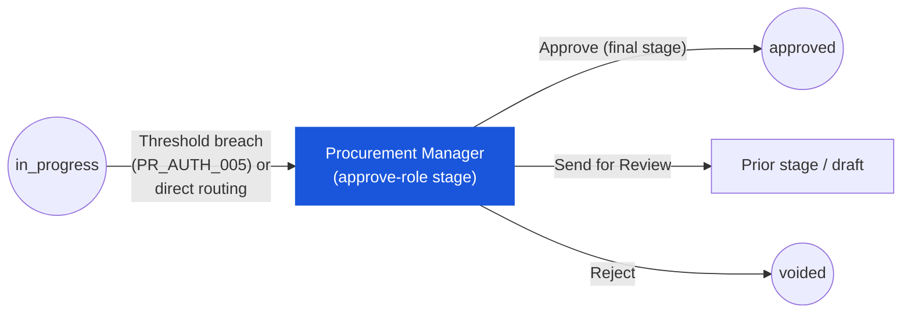

# Purchase Request — User Flow — Procurement Manager

> **At a Glance**
> **Persona:** Procurement Manager / General Manager &nbsp;·&nbsp; **Module:** [purchase-request](/en/inventory/purchase-request) &nbsp;·&nbsp; **Workflow stages:** in_progress (escalated / high-value approve stage) &nbsp;·&nbsp; **Key permissions:** approve / send-back / reject / split-reject at the escalated stage, same as any Approver stage
> **What this persona does:** Acts as the escalated final-approve authority for high-value or strategically sensitive PRs, using the identical review-and-decide UI as the rest of the Approver chain.

## 1. Role in This Module

The **Procurement Manager** (also seen as **General Manager** in the current test fixtures) is a business title layered onto an `approve`-role stage in the **same** configurable workflow as the Department Head / Budget Controller / Finance stages — the current source has no dedicated Procurement Manager screen, route, or API surface distinct from the generic Approver UI described in [03-user-flow-approver.md](./03-user-flow-approver.md). When a PR's `base_total_amount` breaches a configured high-value threshold (`PR_AUTH_005`), or the workflow is configured to route a PR straight to this role, the document lands in the Procurement Manager's **My Pending** queue like any other stage handoff. They review the PR (header, lines, Activity Log, Budget Impact) and take one of the same actions available at every stage — **Approve**, **Reject**, **Send for Review** (send-back), **Split** — from the Edit-Mode bulk toolbar. If their stage is the chain's last `approve`-role stage, Approve flips `pr_status` from `in_progress` to `approved` (`PR_POST_005`), handing the PR to whichever stage or module comes next (typically the `purchase`-role stage, or directly to PO conversion once approved — see [03-user-flow-purchaser.md](./03-user-flow-purchaser.md)).

> ⚠️ **Discrepancy — no vendor-ranking configuration screen found in current source.** Earlier revisions of this page described a distinct "configurational surface" for the Procurement Manager — a Vendor Allocation Rules screen with scoring weights, per-vendor priority overrides, and a "Stuck PR Oversight" bulk-action view. No matching route, component, or backend endpoint exists in `../carmen-inventory-frontend-react/` or `../carmen-turborepo-backend-v2/` as of this pass, and no such route appears in `.specs/resync-2026-07-15-routes-inventory.txt`. Vendor ranking for **Auto Allocate** is resolved server-side by the vendor-pricelist price-compare lookup (see [vendor-pricelist](/en/inventory/vendor-pricelist)); there is no user-facing screen in the current build for tuning its ranking criteria. Treat the previous "configurational surface" content as aspirational / not yet built — logged to the progress log's Discrepancy log for this pass.

### Workflow position

```mermaid
graph LR
    inprog(("in_progress")) -->|"Threshold breach<br/>(PR_AUTH_005) or<br/>direct routing"| pm["Procurement Manager<br/>(approve-role stage)"]:::current
    pm -->|"Approve (final stage)"| approved(("approved"))
    pm -->|"Send for Review"| prior["Prior stage / draft"]
    pm -->|"Reject"| voided(("voided"))
    classDef current fill:#1a56db,color:#fff,stroke:#1a56db;
```

### Permission Matrix — Action × the escalated stage

Identical rights and UI to the base Approver chain (see [03-user-flow-approver.md](./03-user-flow-approver.md) for the full matrix); the only difference is scope (which PRs route here) and the amount/authority the stage represents.

| Action | Escalated / high-value stage |
|---|---|
| View PR | ✅ |
| Approve (advance / final) | ✅ |
| Send for Review (with reason) | ✅ |
| Reject — header level (→ `voided`) | ✅ |
| Split — line level | ✅ |
| Adjust `approved_qty` (`PR_VAL_013`) | ✅ |
| Edit vendor / unit price / discount / tax / FOC | ❌ (reserved for the `purchase`-role stage) |
| Delete PR | ❌ |
| Convert to PO | ❌ (separate dialog in the Purchase Order module, `enum_stage_role = purchase` territory) |

## 2. Entry Point and Primary Flow

**Entry point:** Notification deep link, or Sidebar → **Purchase Request** module → **My Pending** (filtered to PRs where the signed-in user is in `user_action.execute[]` for the current stage).

**Primary flow (happy path):** identical to the base Approver flow in [03-user-flow-approver.md](./03-user-flow-approver.md) Section 2 — open the PR, review header / lines / Budget Impact / Activity Log, optionally adjust `approved_qty` per `PR_VAL_013`, then take a bulk action (Approve / Reject / Send for Review / Split) from the Edit-Mode toolbar. The only distinguishing factor is which PRs are routed to this stage (threshold-breach or direct workflow configuration), not a different set of screens or actions.

## 3. Decision Branches

Decision branches mirror the base Approver chain (see [03-user-flow-approver.md](./03-user-flow-approver.md) Section 3): Send for Review with reason, header Reject with reason, Split-Reject per line, delegation while unavailable (`PR_AUTH_006`). No decision branch specific to a configuration surface exists in the current build.

## 4. Exit Point / Handoffs

- **Approve at the final stage.** `pr_status` flips from `in_progress` to `approved` (`PR_POST_005`); handoff is to whoever runs the separate Convert-to-PO dialog in the Purchase Order module ([03-user-flow-purchaser.md](./03-user-flow-purchaser.md)).
- **Send for Review.** `workflow_current_stage` moves back one step; if that reaches the Requestor's create stage, `pr_status` returns to `draft` and the **Requestor** picks it up ([03-user-flow-requestor.md](./03-user-flow-requestor.md)).
- **Header Reject.** `pr_status` flips to `voided` (terminal, `PR_POST_006`); the **Auditor** reviews post-hoc.

Document state across all transitions is recorded by `enum_purchase_request_doc_status = { draft, in_progress, voided, approved, completed }`.

## 5. References

- Parent overview: [03-user-flow.md](./03-user-flow.md)
- Authorization rules: [02-business-rules.md](./02-business-rules.md) Section 4 — `PR_AUTH_002`, `PR_AUTH_005` (threshold routing), `PR_AUTH_006` (delegation)
- Posting rules: [02-business-rules.md](./02-business-rules.md) Section 5 — `PR_POST_003` (send-back), `PR_POST_005` (final approve → `approved`), `PR_POST_006` (reject / void)
- E2E: no dedicated Procurement Manager persona-journey spec exists yet; the escalated / high-value path is exercised via the `gmTest` fixture in `../carmen-inventory-frontend-e2e/tests/301-pr.spec.ts` (e.g. `TC-PR-060005` — reject a very-high-value PR).
- Sibling: [03-user-flow-approver.md](./03-user-flow-approver.md) — base approval flow this reuses verbatim
- Sibling: [03-user-flow-purchaser.md](./03-user-flow-purchaser.md) — downstream: the separate `purchase`-role stage and the Convert-to-PO dialog
- Sibling: [the module landing](/en/inventory/purchase-request) Section 4 — canonical Procurement Manager role description
- Cross-link: [purchase-order](/en/inventory/purchase-order) — downstream module receiving the final-approved PR for conversion
