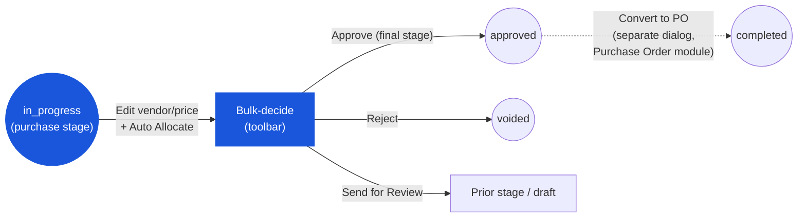

# Purchase Request — User Flow — Purchaser

> **At a Glance**
> **Persona:** Purchaser / Purchasing Staff — holds the `enum_stage_role = purchase` stage inside the PR's own approval chain, and separately operates the PR→PO conversion dialog in the Purchase Order module &nbsp;·&nbsp; **Module:** [purchase-request](/en/inventory/purchase-request) &nbsp;·&nbsp; **Workflow stages:** in_progress (own `purchase`-role stage: edit vendor/pricing, then bulk-decide like any other stage) → approved → completed (via a separate Convert-to-PO dialog) &nbsp;·&nbsp; **Key permissions:** edit vendor / unit price / discount / tax profile at the `purchase` stage, Auto Allocate, bulk Approve / Reject / Send for Review / Split, select approved PRs for PO conversion
> **What this persona does:** At their stage in the PR's own approval chain, sets or validates vendor and pricing per line and bulk-decides like any other approver. Separately, from the Purchase Order module, selects one or more already-`approved` PRs and converts them to purchase orders (grouped automatically by vendor, delivery date, and currency).

## 1. Role in This Module

The **Purchaser** (Purchasing Staff) most commonly shows up as the stage tagged `enum_stage_role = purchase` inside the **same** multi-stage PR workflow as the Department Head / Budget Controller / Finance stages — it is a stage role, not a separate document status. While the PR is `in_progress` and `workflow_current_stage` points at this stage, the Purchaser's Edit Mode unlocks the line fields that were read-only for the earlier approve-role stages — **vendor, unit price, discount, and tax profile** — while `approved_qty` stays locked (the Approver chain already set it, per `PR_VAL_013`). An **Auto Allocate** bulk action calls the vendor-pricelist price-compare lookup per line and fills vendor, price, tax profile, and tax rate from the result; the Purchaser may also override any line manually via the Price Comparison dialog. Once vendor and pricing look right, the Purchaser takes the **same bulk workflow actions available to any stage** — **Approve**, **Reject**, **Send for Review** (send-back), **Split** — from the Edit-Mode bulk toolbar (there are no standalone per-row Approve/Reject buttons in the current UI; see the discrepancy callout in [02-business-rules.md](./02-business-rules.md) Section 4). If `purchase` is the chain's last stage, bulk **Approve** is what flips `pr_status` from `in_progress` to `approved` (`PR_POST_005`).

Separately — and only once a PR's `pr_status` is already `approved` — the Purchaser (or anyone with purchase-order create rights) opens the **Convert to PO** dialog from the **Purchase Order** module (`routes/procurement/purchase-order/po-from-pr-dialog.tsx` — this screen lives outside the purchase-request module). It is a two-step wizard operating on whole PRs, not a per-line workbench: **Step 1** picks a PO workflow and ticks one or more approved PRs from a list fetched from `GET .../purchase-requests/for-po`; **Step 2** calls `POST .../purchase-orders/group-pr`, which groups the selected PRs' lines automatically by `(vendor, delivery_date, currency)` into draft PO groups for review; **Confirm** calls `POST .../purchase-orders/confirm-pr` to create the PO(s). The current implementation converts **whole selected PRs** — it has no per-line vendor-reallocation control, no pricelist-deviation-tolerance indicator, and no partial "convert quantity" field in the UI. Per `PR_POST_007`, once every line of a source PR is linked to a PO line, that PR flips from `approved` to `completed`.

### Workflow position

### Permission Matrix — the `purchase` stage (while `pr_status = in_progress`)

| Action | At the `purchase` stage |
|---|---|
| View PR | ✅ |
| Edit vendor / unit price / discount / tax profile per line | ✅ (Edit Mode) |
| Edit `approved_qty` | ❌ (set by the Approver chain; read-only per `PR_VAL_013`) |
| Run Auto Allocate (bulk vendor + price + tax fill) | ✅ |
| Bulk Approve / Reject / Send for Review / Split (toolbar) | ✅ |
| Standalone row-level Approve / Reject buttons | ❌ (BRD gap — bulk toolbar only) |
| Delete PR | ❌ (Requestor-on-draft only) |

### Permission Matrix — the separate Convert-to-PO dialog, by source-PR `pr_status`

| Action | `approved` | `completed` |
|---|---|---|
| Select PR for conversion | ✅ | ❌ (already fully converted; excluded from the "for PO" list) |
| Auto-group selected PRs by vendor + delivery date + currency | ✅ | — |
| Confirm → create PO(s), bridge PR lines to PO lines | ✅ | — |
| Per-line partial conversion / convert-qty adjustment | Not exposed in the current UI | — |

## 2. Entry Point and Primary Flow

**Entry point — stage decision:** Sidebar → **Purchase Request** module → **My Pending** (PRs currently at a stage assigned to the signed-in user) or a notification deep link → PR detail page.

**Primary flow — stage decision (happy path):**

1. Open a PR sitting at the `purchase` stage (`pr_status = in_progress`, `workflow_current_stage` assigned to the Purchaser). The detail page opens in view mode with the full header, lines, and Activity Log from every prior stage.
2. Click **Edit** to enter Edit Mode. Vendor, unit price, discount, and tax profile become editable per line; `approved_qty` stays read-only.
3. Optionally click **Auto Allocate** to bulk-fill vendor, price, pricelist reference, and tax from the current pricelist for every line that has a product, requested unit, and currency set; or open the Price Comparison dialog on an individual line to pick a vendor manually.
4. Select the lines to act on (or **Select All**) and choose a bulk action from the toolbar: **Approve** (advance — or, if this is the chain's last stage, flip to `approved`), **Reject** (terminate → `voided`, reason required), **Send for Review** (send back to a prior stage, reason required), or **Split** (accept some lines, reject others).
5. Confirm in the dialog. The PR either advances (`pr_status` stays `in_progress` with the stage cursor moved), flips to `approved` (final stage clears), returns to a prior stage / `draft` (send-back), or terminates (`voided`).

**Entry point — PO conversion:** Sidebar → **Purchase Order** module → **Create from PR** (`PoFromPrDialog`).

**Primary flow — PO conversion (happy path):**

1. Open the Convert-to-PO dialog. **Step 1**: pick the PO workflow the new purchase order(s) should follow, then the dialog loads approved-and-not-yet-fully-converted PRs; tick one or more whole PRs.
2. Click **Next**. The system calls the group-PR endpoint, which buckets the selected PRs' lines by `(vendor, delivery_date, currency)` and returns one draft-PO group per bucket.
3. **Step 2** reviews each group — PO number placeholder, vendor, delivery date, currency, line count, and total — expandable to see the underlying product lines.
4. Click **Confirm**. The system creates one `tb_purchase_order` per group with its detail lines, and links each source PR line to its new PO line. Per `PR_POST_007`, a source PR whose lines are now all linked flips from `approved` to `completed`; a PR with any remaining unconverted line stays `approved`.

## 3. Decision Branches

- **If a line has no vendor allocated at the `purchase` stage**: run **Auto Allocate** again (it fills from the current active pricelist) or open Price Comparison on the line to pick a vendor manually before bulk-approving.
- **If the PR is missing required pricing when a bulk action is attempted**: validation blocks the action; the Purchaser fixes the flagged line(s) and retries.
- **If the Purchaser disagrees with the request as a whole**: choose bulk **Reject** with a reason (`pr_status → voided`, terminal) or bulk **Send for Review** with a reason and target stage (returns to a prior stage, or to `draft` if the target is the Requestor's create stage).
- **If some lines are acceptable and others are not**: use **Split** to accept a subset and reject the rest; rejected lines are flagged `current_stage_status = rejected` and drop out of further processing while the accepted lines continue.
- **If the selected PRs for PO conversion span more than one vendor, delivery date, or currency**: the group-PR step produces multiple draft-PO groups automatically — one PO per distinct `(vendor, delivery_date, currency)` combination; the Purchaser does not manually split them.
- **If a PR selected for conversion has already been fully converted (`pr_status = completed`)**: it does not appear in the PR-for-PO list, so it cannot be selected again.

## 4. Exit Point / Handoffs

- **Bulk Approve at the chain's last stage.** `pr_status` flips from `in_progress` to `approved` (`PR_POST_005`); the PR becomes eligible for PO conversion. Handoff is to whoever next opens the Purchase Order module's Convert-to-PO dialog — not necessarily the same user.
- **Bulk Approve at an intermediate stage.** `pr_status` stays `in_progress`; handoff is to the next stage's assigned user(s).
- **Bulk Send for Review.** The PR returns to a prior stage (or to `draft`, handing off to the **Requestor** — see [03-user-flow-requestor.md](./03-user-flow-requestor.md)).
- **Bulk Reject.** `pr_status` flips to `voided` (terminal); the **Auditor** reviews post-hoc.
- **Convert to PO confirmed.** Fully-bridged source PRs flip from `approved` to `completed` (`PR_POST_007`); handoff is to the [purchase-order](/en/inventory/purchase-order) module for vendor commitment and tracking to receipt. Partially-bridged PRs (if a future release adds partial conversion) would stay `approved`; the current UI converts whole PRs at a time.

Document state across these transitions is recorded by `enum_purchase_request_doc_status = { draft, in_progress, voided, approved, completed }`. Voiding via administrative void (as opposed to a workflow reject) is reserved for Finance / system-admin per `PR_AUTH_007`.

## 5. References

- Parent overview: [03-user-flow.md](./03-user-flow.md)
- Bridge table: [01-data-model.md](./01-data-model.md) Section 2 — `tb_purchase_order_detail_tb_purchase_request_detail` (PR↔PO line linkage)
- Posting rules: [02-business-rules.md](./02-business-rules.md) Section 5 — `PR_POST_005` (final approve → `approved`), `PR_POST_007` (convert to PO → bridge writes + `completed`)
- Frontend: `../carmen-inventory-frontend-react/routes/procurement/purchase-request/pr-item-fields.tsx` (Auto Allocate, per-stage editable fields), `../carmen-inventory-frontend-react/routes/procurement/purchase-order/po-from-pr-dialog.tsx` (Convert-to-PO dialog)
- API contracts: `../carmen-turborepo-backend-bruno/collections/carmen-inventory/procurement/purchase-order/POST-group-pr-for-po-procurement-purchase-order.bru`, `POST-confirm-pr-to-po-procurement-purchase-order.bru`
- E2E: `../carmen-inventory-frontend-e2e/tests/304-pr-purchaser-journey.spec.ts` — persona-journey spec covering the `purchase`-stage edit + bulk-decide flow. Convert-to-PO is covered separately (more loosely) in `../carmen-inventory-frontend-e2e/tests/301-pr.spec.ts` under "PR — Convert to PO — Purchase Staff".
- Sibling: [03-user-flow-approver.md](./03-user-flow-approver.md) — the same bulk-toolbar decision mechanics apply at every approve-role and purchase-role stage
- Sibling: [03-user-flow-requestor.md](./03-user-flow-requestor.md) — send-back target when the rollback reaches the create stage
- Sibling: [the module landing](/en/inventory/purchase-request) Section 4 — canonical Purchaser role description
- Cross-link: [purchase-order](/en/inventory/purchase-order) — downstream module that receives the converted POs
- Cross-link: [vendor-pricelist](/en/inventory/vendor-pricelist) — pricelist source for Auto Allocate and Price Comparison
