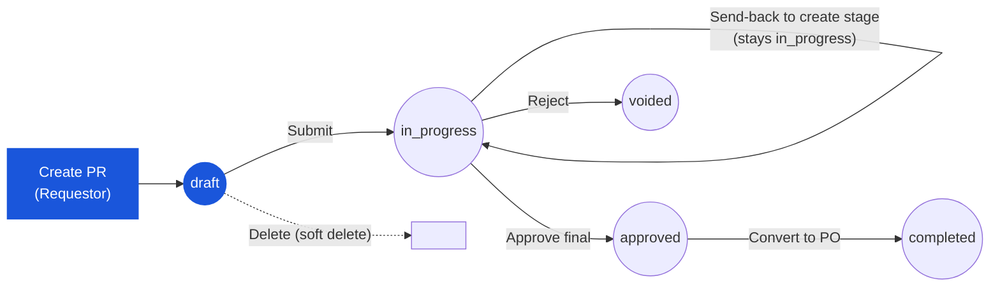

# Purchase Request — User Flow — Requestor

> **At a Glance**
> **Persona:** Requestor (hotel / department staff) &nbsp;·&nbsp; **Module:** [purchase-request](/en/inventory/purchase-request) &nbsp;·&nbsp; **Workflow stages:** draft → submit → in_progress (+ send-back re-entry at the `create` stage, delete from draft) &nbsp;·&nbsp; **Key permissions:** `procurement.purchase_request.view` (+ `view_department` / `view_all` for list scope), create / edit / delete own draft, submit, resubmit after send-back &nbsp;·&nbsp; **Re-verified 2026-09-22** against `routes/procurement/purchase-request/` and `purchase-request.validate.ts` — this page was last written from the concept docs on 2026-05-20 and carried several screens that do not exist (PR type, Review tab, budget validation, `Alt+N`, auto-save); they are removed below
> **What this persona does:** Originates the PR — fills header and line list, attaches supporting docs, submits for approval, and revises on send-back.

## 1. Role in This Module

The **Requestor** is the hotel or department staff member who originates a Purchase Request — the upstream demand signal that authorises procurement before any external commitment is made to a vendor. They own the PR while it is in `draft`: they fill the header (**workflow** — required, the only routing choice there is; **department**; **PR date**; description / note — there is *no* PR-type, job/cost-code or header delivery-date field, see [01-data-model](./01-data-model.md) §5), build the line grid (product, store location, delivery point, delivery date, requested quantity + unit, optional FOC quantity + unit, currency; unit price, vendor, discount and tax are the `purchase` stage's job), add comments / attachments, and **Submit** when the request is ready. Their involvement does not end at submit: when an approver chooses **Send Back** to the `create` stage the PR stays `in_progress` but its stage cursor returns to them, and they revise and resubmit; while the PR is still `draft` they may **Delete** it. They are not part of the approval, vendor-allocation, or PO-conversion steps — those belong to the Approver chain, the Purchaser, and the Procurement Manager respectively (see [the module landing](/en/inventory/purchase-request) Section 4).

### Workflow position (Requestor highlighted)

### Permission Matrix — Status × Action (Requestor)

The Requestor is **the owner** of a PR while it is in `draft` (`created_by_id` or `requestor_id` equals the signed-in user — `common/helpers/document-ownership.helper.ts`). After submit they can act again only when a send-back parks the PR at the `create` stage, which puts their id back into `user_action.execute[]`.

| Action | draft (own) | in_progress (at `create` stage after send-back) | in_progress (other stage) | approved | completed | voided |
|---|---|---|---|---|---|---|
| View PR | ✅ | ✅ | ✅ | ✅ | ✅ | ✅ |
| Edit header / lines | ✅ | ✅ | ❌ | ❌ | ❌ | ❌ |
| Add / remove items | ✅ | ✅ | ❌ | ❌ | ❌ | ❌ |
| Add comments | ✅ | ✅ | ✅ | ✅ | ✅ | ✅ |
| Save with incomplete lines (qty `0`) | ✅ (since 2026-09-21) | ✅ | ❌ | ❌ | ❌ | ❌ |
| Submit | ✅ (≥1 line, each buying or FOC) | ✅ (resubmit) | ❌ | ❌ | ❌ | ❌ |
| Delete | ✅ (soft delete; list row menu, detail **Delete**, or multi-select batch) | ❌ ("Only draft purchase requests can be deleted") | ❌ | ❌ | ❌ | — |
| Duplicate | ✅ | ✅ | ✅ | ✅ | ✅ | ✅ (any status — `/new?duplicate_id=`) |

> ℹ️ **Send-back loop:** `pr_status` never returns to `draft` after a send-back (`purchase-request.service.ts:2052` rewrites `in_progress`); what changes is `workflow_current_stage`. Revision history is preserved in `workflow_history` and the comment log (`PR_POST_008`).

## 2. Entry Point and Primary Flow

**Entry point:** Sidebar → **Purchase Request** → list (`/procurement/purchase-request`, default sort by date, tabs *My Pending* / *All*) → **New** (`pr-create-dialog.tsx`) → **Blank** (`/procurement/purchase-request/new`) or **From Template** (`/procurement/purchase-request/from-template`, see [templates/purchase-request](/en/inventory/templates/purchase-request)). A **Duplicate** action on any existing PR opens `/new?duplicate_id=<id>` pre-filled the same way.

**Primary flow (happy path):**

1. Open the new-PR form. Nothing is written yet — the row is created on the first **Save** (`POST /:bu_code/purchase-requests`, `stage_role = create`), which generates `pr_no` server-side, stamps `pr_date` (today by default) and snapshots the requestor from the signed-in user.
2. Fill the header: pick the **workflow** (required — the form blocks creation when no workflow is creatable for the user, "noCreatableWorkflow"), confirm the **department**, enter a **description**. Currency and exchange rate live on each line, not on the header.
3. In the item grid click **Add Item** and, per line, pick the **product** (a hover / expand row shows on-hand, on-order and last receiving info live from [inventory](/en/inventory/inventory)), **location**, **delivery point**, **delivery date** (required), **requested qty + unit**, optional **FOC qty + unit**, and **currency**. A line may be saved with quantity `0` — the draft form only enforces required references (`pr-form-schema.ts`).
4. Click **Save** whenever convenient; an incomplete draft saves (commit `a848865f`). Every save echoes `doc_version`; a stale version gets `409` ([system-config/doc-version](/en/inventory/system-config/doc-version)).
5. Add **comments / attachments** from the comment sheet (`tb_purchase_request_comment`), and optionally **Print** / **Export**.
6. Click **Submit**. The client first runs `findRowsMissingQty` — every line must have `requested_qty > 0` **or** `foc_qty > 0` — and shows an "incompleteItems" warning instead of the confirm dialog when a row fails. On confirm the client calls `PATCH …/:id/submit` (`stage_role = create`, `doc_version`). The server re-checks workflow / requestor / department / PR date / at-least-one-line / per-line quantity and unit rules (`purchase-request.validate.ts`), stops at the first failure, and on success flips `pr_status` to `in_progress`, sets `last_action = submitted`, initialises `workflow_current_stage` / `stages_status`, and fills `user_action.execute[]` for the first stage. To see *all* problems at once before submitting, the client (or a tester) can call `POST …/verify` with `verify_state = submit` (`PR_VAL_017`).
7. Track progress from the list's **My Pending** tab, the detail page's status badge and **Workflow History** sheet, or the cross-module [My Approval](/en/inventory/purchase-request/my-approval) queue (which also lists the user's own drafts). The Requestor's primary path ends here; they re-enter only on send-back (Section 3).

## 3. Decision Branches

- **If a required header field is missing at save** (`workflow_id`, `department_id`, `pr_date`, or a line without product / location / unit / currency / delivery point / delivery date): the Zod schema blocks the save and highlights the field; the PR (if it exists) stays `draft`.
- **If a line has no quantity at submit** (`requested_qty = 0` and `foc_qty = 0`): the client toast names the incomplete rows and the confirm dialog does not open; the server would answer `"Detail line N: needs a requested_qty or a foc_qty"` (`PR_ERROR.LINE_ORDERS_NOTHING`). A **FOC-only** line (`requested_qty = 0`, `foc_qty > 0`, `foc_unit_id` set) is accepted.
- **If the PR has no lines at submit** (`PR_VAL_006`): the client schema requires at least one item; the server answers `"PR must have at least one detail line"`.
- **If an approver chooses Send Back to the create stage**: `workflow_current_stage` returns to the create stage, `last_action = reviewed`, the reason is appended to `workflow_history` and the comment log, and the Requestor's id is back in `user_action.execute[]`; the PR remains `in_progress`. The Requestor re-enters at Section 2 step 2 and resubmits at step 6.
- **If the Requestor wants to abandon a PR they have not yet submitted**: **Delete** (detail page or list row / multi-select). The server soft-deletes the header and lines (`deleted_at`) — draft only, owner or super-admin (`PR_VAL_018`). There is no "cancel to `voided`" action; `voided` is reserved for an approver's Reject.
- **If the Requestor tries to edit a PR after submit** while it sits at another stage: all edit controls are read-only. The only way back is an approver's Send Back to the create stage.
- **If someone else's draft is opened**: view only — Edit / Delete / Submit are hidden, and a delete attempt is refused up front (`pr-ownership.ts`, commit `9fb747c2`).
- *(A budget-validation branch and an "Available / Warning / Exceeded" indicator were asserted in earlier revisions — unconfirmed, no code path; see `PR_VAL_015`.)*

## 4. Exit Point / Handoffs

The Requestor's primary involvement ends when the PR transitions from `draft` to `in_progress` at step 6 of Section 2. The document is then picked up by the users named in `user_action.execute[]` for the first stage (see [03-user-flow-approver.md](./03-user-flow-approver.md)).

A second handoff direction is **back to the Requestor on send-back**: an approver may return the PR to the create stage with a reason. This is not a true exit — the Requestor revises and resubmits. Cycles repeat until the PR is either approved (final stage) or rejected (`voided`).

Terminal exits for the Requestor (no further action possible by them) are:

- **Deleted in draft** — row soft-deleted; it disappears from every list and from the pending queue.
- **Rejected by an approver** — `pr_status = voided`, terminal. Auditor reviews post-hoc.
- **Approved and converted to PO** — `pr_status = completed`, terminal. The Purchaser owns the conversion; the Requestor sees the linked PO in the PR detail page for traceability.

## 5. References

- Parent overview: [03-user-flow.md](./03-user-flow.md)
- `../carmen/docs/purchase-request-management/PR-User-Experience.md` — primary source for the creation, submission, and send-back flows
- `../carmen/docs/purchase-request-management/PR-Overview.md` — module overview, requestor role definition, integration points
- `../carmen/docs/purchase-request-management/purchase-request-module-prd.md` — product requirements driving the Requestor flow
- Sibling: [01-data-model.md](./01-data-model.md) — `tb_purchase_request`, `tb_purchase_request_detail`, `enum_purchase_request_doc_status`
- Sibling: [02-business-rules.md](./02-business-rules.md) — `PR_VAL_006` (at-least-one-line), `PR_VAL_008` (buy-or-FOC per line), `PR_VAL_017` (verify), `PR_VAL_018` (delete)
- Frontend: `../carmen-inventory-frontend-react/routes/procurement/purchase-request/` — `pr-create-dialog.tsx`, `pr-new-content.tsx`, `pr-form.tsx`, `pr-form-schema.ts`, `use-pr-form-actions.ts` (`handleSubmitPr`), `pr-ownership.ts`, `from-template/`
- Backend: `../carmen-turborepo-backend-v2/apps/micro-business/src/procurement/purchase-request/logic/purchase-request.validate.ts`, `purchase-request.service.ts` (`delete`, `deleteBatch`)
- E2E: `../carmen-inventory-frontend-e2e/tests/302-pr-creator-journey.spec.ts`, gap report `docs/test-cases/gaps/302-pr-creator-journey-gap.md`
- Sibling: [the module landing](/en/inventory/purchase-request) Section 4 — canonical Requestor role description
