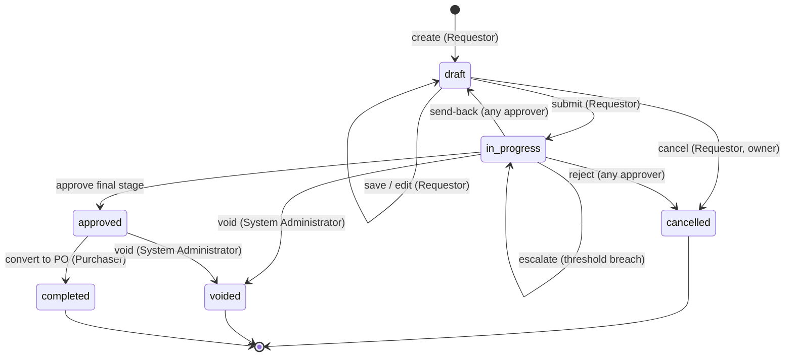

# Purchase Request — User Flow

> **At a Glance**
> **Module:** [purchase-request](/en/inventory/purchase-request) &nbsp;·&nbsp; **Personas:** Requestor &nbsp;·&nbsp; Approver &nbsp;·&nbsp; Procurement Manager &nbsp;·&nbsp; Purchaser &nbsp;·&nbsp; Audit / Config
> **Workflow lifecycle:** Draft → In Progress (multi-stage approval) → Approved → Completed (with Cancelled / Voided branches)
> **Drill into per-persona views below for action-level detail**

## 1. Overview

This page is the **overview entry point** for the user-flow set of the `purchase-request` module. It covers the lifecycle of a single Purchase Request document — a PR header (`tb_purchase_request`) together with one or more PR detail lines (`tb_purchase_request_detail`) — from the moment a Requestor first saves a draft, through the multi-stage approval chain, to either conversion into a purchase order or termination by void / cancellation. The personas involved are the **Requestor** (who originates and revises the PR), the **Approver** chain (Department Head, Budget Controller, Finance, and any escalated stages), the **Purchaser** (who converts the approved PR to a PO), the **Procurement Manager** (oversight and high-value approval), and the **Audit / Config** roles (Auditor for read-only review, System Administrator for workflow configuration). The role catalogue itself is defined in [the module landing](/en/inventory/purchase-request) Section 4.

Section 2 below is the **global state machine** — the canonical list of transitions across `enum_purchase_request_doc_status` values, independent of who acts. Each per-persona file (linked from Section 3) describes that persona's *path through* the state machine — their entry point, the actions available to them, the decision branches they face, and the handoff that ends their involvement. Section 4 then summarises the cross-persona handoffs that stitch the individual paths together. Read this overview first to anchor the lifecycle, then drill into the persona file that matches your role.

## 2. Document Lifecycle

The PR document status is stored on `tb_purchase_request.pr_status` and constrained to the values declared in `enum_purchase_request_doc_status`: `draft`, `in_progress`, `voided`, `approved`, `completed`, `cancelled`. The transitions below cover the legal moves between them; everything else is rejected by the workflow engine.

| From state | Action | To state | Allowed for | Pre-conditions |
| ---------- | ------ | -------- | ----------- | -------------- |
| `(none)` | create | `draft` | Requestor | Header fields validated (`requestor_id`, `department_id`, `pr_date`, `workflow_id`); no lines required yet. |
| `draft` | save (edit) | `draft` | Requestor (owner) | PR still owned by the requestor; no workflow stage advanced. |
| `draft` | submit | `in_progress` | Requestor (owner) | At least one non-deleted line (`PR_VAL_006`); all per-line validations pass; selected `workflow_id` is active for scope `purchase-request`. Soft budget commitment created on transition. |
| `draft` | cancel | `cancelled` | Requestor (owner) | PR has never been submitted (still owned by the requestor); no workflow stage advanced. Releases any in-progress edits. |
| `in_progress` | approve (this stage, not final) | `in_progress` | Current-stage approver | Approver is assigned to the current `workflow_current_stage` with `stage_role = approve`; `last_action` becomes `approved` and the stage cursor advances. |
| `in_progress` | approve (final stage) | `approved` | Final-stage approver | Approver is assigned to the final approval stage; all prior stages have signed off; budget soft-commitment retained pending PO conversion. |
| `in_progress` | send-back | `draft` | Any approver on the chain | Reason text required; soft budget commitment released until re-submission. Audit comment written. |
| `in_progress` | reject | `cancelled` | Any approver on the chain | Reason text required; soft budget commitment released; workflow terminates with no further actions allowed. |
| `in_progress` | void | `voided` | System Administrator (or other elevated role) | Reason text required; used for administrative voids after submission (e.g. duplicate, compliance issue). Soft budget commitment released. |
| `in_progress` | escalate (threshold breach) | `in_progress` | Workflow engine / current-stage approver | Header `base_total_amount` exceeds the configured high-value threshold; routes to Procurement Manager as the next stage. State unchanged but stage cursor jumps. |
| `approved` | convert to PO | `completed` | Purchaser | All approved lines bridged into one or more `tb_purchase_order` records; the PR is closed against further conversion. Soft commitment hardens into PO commitment. |
| `approved` | void | `voided` | System Administrator | Used when an approved PR must be retracted before conversion (rare; reason required). |

## 3. Persona Index

Each persona below has a dedicated drill-down file describing their entry point, primary flow, decision branches, and exit point. Slugs match the persona role; clicking the link opens the per-persona view.

- [Requestor](./03-user-flow-requestor.md) — Creates and submits PRs, responds to send-backs, cancels own drafts.
- [Approver](./03-user-flow-approver.md) — Multi-stage approval chain (Department Head, Budget Controller, Finance Officer / Manager), with approve / send-back / reject / split-reject actions per stage.
- [Purchaser](./03-user-flow-purchaser.md) — Picks up approved PRs, validates vendor allocation and pricing, and converts them to purchase orders.
- [Procurement Manager](./03-user-flow-procurement-manager.md) — Oversees the procurement function, approves high-value or escalated PRs, tunes vendor ranking and Allocate Vendor rules.
- [Audit / Config](./03-user-flow-audit-config.md) — Auditor (read-only review of PRs and activity log) and System Administrator (workflow stage configuration, threshold setup, delegation rules).

## 4. Cross-Persona Handoffs

The table below captures the moments where the PR moves from one persona's responsibility to another's. Each handoff is anchored to the document state at the point of transfer.

| From persona | Trigger | To persona | Document state at handoff |
| ------------ | ------- | ---------- | ------------------------- |
| Requestor | Submit | First-stage approver (typically Department Head) | `in_progress` (stage cursor on first approval stage) |
| Approver (stage N, not final) | Approve at this stage | Approver (stage N+1) | `in_progress` (stage cursor advances to next stage) |
| Approver (final stage) | Approve at final stage | Purchaser | `approved` |
| Approver (any stage) | Send-back with reason | Requestor | `draft` (with revision history and approver comment retained) |
| Current-stage approver | Header amount breaches high-value threshold | Procurement Manager | `in_progress` (escalated; stage cursor on Procurement Manager stage) |
| Purchaser | Convert to PO | Purchase Order module (and indirectly Receiver / GRN downstream) | `completed` (one or more `tb_purchase_order` records generated, linked back to the PR) |
| System Administrator | Void with reason | Auditor (post-hoc review only) | `voided` |
| Approver | Reject with reason | Auditor (post-hoc review only) | `cancelled` |

## 5. References

- `../carmen/docs/purchase-request-management/PR-User-Experience.md` — primary source for the user-experience flows (creation, approval, vendor comparison, template usage).
- `../carmen/docs/purchase-request-management/PR-Overview.md` — module overview, user roles, integration points.
- `../carmen/docs/purchase-request-management/purchase-request-module-prd.md` — product requirements driving the flows.
- Sibling: [01-data-model.md](./01-data-model.md) — canonical `enum_purchase_request_doc_status` values used in Section 2 above.
- Sibling: [02-business-rules.md](./02-business-rules.md) — validation, authorization, and posting rules referenced by each transition.
