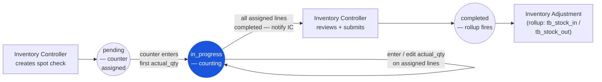

# Spot Check — User Flow — Counter

> **At a Glance**
> **Persona:** Counter (floor-level counter) &nbsp;·&nbsp; **Module:** [[spot-check]] &nbsp;·&nbsp; **Workflow stages:** pending → in_progress (first actual_qty entry; edit assigned lines; notify IC) &nbsp;·&nbsp; **Key permissions:** enter / edit actual_qty on assigned lines, line-level comments, sign-off back to IC
> **What this persona does:** Walks the location, counts in-scope items, and records actual_qty against the assigned spot-check sheet.

## 1. Persona

**Counter** — the floor-level worker who performs the physical count of in-scope items or locations on assigned spot checks, records counted quantities on the detail sheet (`tb_spot_check_detail.actual_qty`) accurately and on time, flags items that are damaged, unlabelled, or unfamiliar via line-level comments, and signs off completed sheets back to the Inventory Controller. Authority anchor for `SPC_AUTH_002`.

### Workflow position (Counter highlighted)

### Permission Matrix — V1 Status × Action (Counter)

The Counter is a data-entry persona scoped to their assigned location. They can read and write `actual_qty` on their lines and add comments, but cannot submit the spot-check document or change any configuration. Rows are derived from Section 3 (Primary Actions) of this file; rule citations refer to [[spot-check/02-business-rules]] § 4 / § 5.

| Action | Spot check `pending` | Spot check `in_progress` | Spot check `completed` |
|---|---|---|---|
| View assigned spot-check sheet (location-scoped lines) | ✅ (`SPC_AUTH_004`) | ✅ (`SPC_AUTH_004`) | ✅ (read-only) |
| Enter first `actual_qty` (triggers `pending → in_progress`) | ✅ (`SPC_AUTH_002`) | — | ❌ |
| Enter / edit `actual_qty` on assigned location lines | — | ✅ (`SPC_VAL_005` — qty ≥ 0) | ❌ (`SPC_VAL_007` — immutable) |
| Flag damaged / unlabelled / unfamiliar item (comment + photo) | — | ✅ (`SPC_AUTH_002`) | ❌ |
| Add free-text comment to spot check | — | ✅ (`SPC_AUTH_002`) | ❌ |
| Sign off completed sheet (notify Inventory Controller) | — | ✅ (notification; no status change) | — |
| Submit spot check (`in_progress → completed`) | ❌ (`SPC_AUTH_002` — Inventory Controller only) | ❌ (`SPC_AUTH_002` — Inventory Controller only) | — |
| View lines outside assigned location | ❌ (`SPC_AUTH_004` — location-scoped) | ❌ (`SPC_AUTH_004` — location-scoped) | ❌ |
| Re-enter a recount line flagged by Inventory Controller | — | ✅ (ideally a different counter to remove bias) | ❌ |

## 2. Entry Points

- **My spot-check assignments** — list of `tb_spot_check` documents with `pending` or `in_progress` status where the counter has a location-grant.
- **Spot-check sheet view** — drill into one spot check and see the detail lines for the assigned location.
- **Mobile / handheld scanner** — typical floor device for scanning product barcodes and entering `actual_qty` line by line; spot checks tend to be even more mobile-friendly than full physical counts because the scope is small.

## 3. Primary Actions

| Action | State precondition | State effect | Notes |
| ------ | ------------------ | ------------ | ----- |
| Open assigned spot-check sheet | Spot check in `pending` or `in_progress`; counter has location-grant | (read) detail lines visible | Per `SPC_AUTH_004`. |
| Enter first `actual_qty` | Spot check in `pending` | Spot check advances to `in_progress` | First line entry triggers transition. |
| Enter / edit `actual_qty` on a line | Line within assigned location | `actual_qty` saved; `counted_at` / `counted_by_id` stamped | `actual_qty ≥ 0` per `SPC_VAL_005`. |
| Flag damaged / unlabelled / unfamiliar item | Line on assigned spot check | `tb_spot_check_detail_comment` row created with attachment (photo) | Soft-flag; Inventory Controller reviews. |
| Add comment to spot check | Spot check in `in_progress` | `tb_spot_check_comment` row created | Free-text notes (e.g. "shelf restock in progress, recommend recount line 4"). |
| Sign off completed sheet | All assigned lines have non-null `actual_qty` | Notification fires to Inventory Controller | Counter does not submit the document — Inventory Controller does, per `SPC_AUTH_002`. |

## 4. Decision Points

- **Damaged / unfamiliar items.** When a counter finds an item that doesn't match the sheet (unlabelled, damaged, miscategorised), the line is flagged with a comment + photo; the variance handling decision is the Inventory Controller's.
- **Zero-on-shelf vs zero-counted.** If the sheet shows `on_hand_qty > 0` but the counter sees nothing, `actual_qty = 0` is entered explicitly (not left blank). Blank `actual_qty` blocks submit per `SPC_VAL_004`; entered-zero proceeds to variance flag.
- **Recount lines.** When a line is flagged for recount, the recount is ideally performed by a **different counter** to remove individual counting bias — convention rather than hard schema constraint.

> **TODO:** Source the exact mobile / scanner UI screens and any blind-count (book qty hidden) toggle from `../carmen-inventory-frontend/`. Confirm whether the same blind-count tenant policy used in physical-count applies here.

## 5. Exit / Handoff

| Trigger | Handoff to | Artefact |
| ------- | ---------- | -------- |
| Complete all assigned lines | Inventory Controller | Notification + completion tag in comment thread. |
| Flag line for further inspection | Inventory Controller | `tb_spot_check_detail_comment` with damaged / unlabelled tag. |
| (no submit action) | Inventory Controller | Counter cannot submit; only Inventory Controller per `SPC_AUTH_002`. |

## 6. References

- **Primary (TODO):** carmen/docs source — does not exist for this module.
- **Frontend (TODO):** `../carmen-inventory-frontend/` — Counter / mobile UI; check cmobile (`../cmobile/`) for the PWA-side spot-check sheet implementation if applicable.
- **E2E (TODO):** `../carmen-inventory-frontend-e2e/tests/` — no spot-check spec currently exists.
- Related: [[spot-check/03-user-flow]] (overview), [[spot-check/02-business-rules]] (`SPC_AUTH_002`, `SPC_VAL_004`–`SPC_VAL_005`), [[spot-check/03-user-flow-inventory-controller]] (the handoff partner), [[physical-count/03-user-flow-counter]] (full-count counterpart counter flow).
