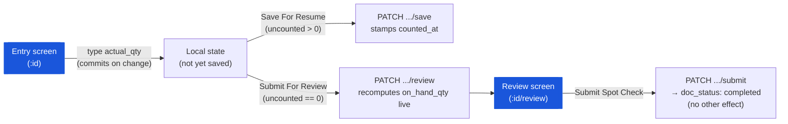

# Spot Check — User Flow — Entry & Review Screens

> **At a Glance**
> **Screens:** `spot-check/:id` (`sc-entry-component.tsx`) and `spot-check/:id/review` (`sc-review-component.tsx`) &nbsp;·&nbsp; **Module:** [spot-check](/en/inventory/spot-check) &nbsp;·&nbsp; **Role:** the same single `inventory_management.spot_check`-gated user documented in [03-user-flow-inventory-controller.md](/en/inventory/spot-check/03-user-flow-inventory-controller)
> **What this persona does:** enters `actual_qty` per sampled product, optionally attaches a note/photo per line, saves progress, submits for review, and confirms the final submit.

## 1. Screen Scope

This page — carried over from an earlier draft's "Counter" persona name — documents the real entry and review screens. There is no zone assignment, no counter-to-location grant, and no restriction limiting which lines a given user can edit: any user holding the module permission can edit any line on any spot check.

### Entry screen actions (`sc-entry-component.tsx`)

```mermaid
graph LR
    entry[["Entry screen\n(:id)"]]:::current
    entry -->|"type actual_qty\n(commits on change)"| commit["Local state\n(not yet saved)"]
    commit -->|"Save For Resume\n(uncounted > 0)"| save["PATCH .../save\nstamps counted_at"]
    commit -->|"Submit For Review\n(uncounted == 0)"| review["PATCH .../review\nrecomputes on_hand_qty live"]
    review --> reviewScreen[["Review screen\n(:id/review)"]]:::current
    reviewScreen -->|"Submit Spot Check"| submit["PATCH .../submit\n→ doc_status: completed\n(no other effect)"]
    classDef current fill:#1a56db,color:#fff,stroke:#1a56db;
```

### What the entry screen shows

- **Header** (`sc-entry-header.tsx`) — location name/code, method badge, status badge, `counted/total` count, percent complete, a progress bar, and the spot check's `start_date`.
- **Search + status filter pills** — All / Counted / Uncounted, filtering the visible product rows client-side; search matches product name/code/SKU/local name.
- **Refresh button** — re-fetches the spot check (does not re-run the sampling logic or add new lines — a spot check's product set is fixed at creation, unlike physical-count's Refresh).
- **Import / Export** — Export writes an `.xlsx` of the current effective counts (id, product code/name/local name/SKU, unit, `actual_qty`); Import reads a spreadsheet back and matches rows by SKU, reporting matched/skipped counts.
- **Product rows** (`EntryItemRow`, virtualized) — product name/code/local name/SKU, an `actual_qty` number input, a calculator button (for computing a total from case/unit quantities), a unit-of-measure label, and an "Add Notes" link opening a shared notes dialog (free text + photo attachments, backed by `tb_spot_check_detail_comment`). Book quantity (`on_hand_qty`) is never shown on this screen.
- **"Set X Empty to Zero"** — bulk-fills every still-uncounted line's local value to `0` (does not save by itself).
- **Save For Resume vs. Submit For Review** — the footer shows **Save For Resume** whenever any line is still uncounted; once every line has a value (from local edits or a prior save), Save disappears and only **Submit For Review** remains. This is a client-side gate only — the backend enforces no completeness check on either call.

### What the review screen shows (`sc-review-component.tsx` via the shared `ReviewComponent`)

- Location name/code, and four summary counts from the review payload: **matches** (`diff_qty === 0`), **variances**, **overages** (`diff_qty > 0`), **shortages** (`diff_qty < 0`).
- A list of variance-only lines, each showing system quantity (`on_hand_qty` — recomputed live by the preceding Submit-for-Review call), actual quantity, variance (`diff_qty`), and unit.
- A single **Submit Spot Check** button — the final, terminal action for the whole document. Its only effect is `doc_status → completed` and an `end_date` stamp; no other document is created and nothing is written to the inventory ledger.

## 2. Entry Points

- **From the list screen** — Start (new) or Resume navigates directly to `spot-check/:id` (see [03-user-flow-inventory-controller.md](/en/inventory/spot-check/03-user-flow-inventory-controller)).
- **From the History tab** — clicking any historical spot check, regardless of `doc_status`, also routes to `spot-check/:id`; there is no separate read-only detail view (see the caveat below).

## 3. Primary Actions

| Action | State precondition | State effect | Notes |
| ------ | ------------------ | ------------ | ----- |
| Enter/edit `actual_qty` on a line | Any status | Local state only, until Save or Submit for Review | No client-side minimum was found (unlike physical-count's `≥ 0` clamp on the entry row). |
| Attach a note/photo to a line | Any time | `POST /spot-check-detail-comment/:detailId` (multipart: `message`, `type`, `files`) | Backed by `tb_spot_check_detail_comment`; the same shared notes-dialog component physical-count uses. |
| Save For Resume | At least one line has a value; document `pending` or `in_progress` | `PATCH .../save` — stamps `counted_at`/`counted_by_id` and recomputes `diff_qty` on the submitted lines against whatever `on_hand_qty` is currently stored; first call also flips `pending → in_progress`; requires `doc_version` | Rejected outside `{pending, in_progress}` (`SPC_VAL_007`). |
| Submit For Review | Every line has a locally-entered value (`uncountedCount === 0`, client gate only) | `PATCH .../review` — recomputes `on_hand_qty`/`diff_qty` for every line from the live ledger balance; stamps `counted_at`/`counted_by_id`; navigates to `/review` | Does **not** change `doc_status`; has **no** status guard at all — will run against a `completed`/`void` document too if triggered (e.g. via the History tab). |
| Submit (final, from `/review`) | Document not already `completed`/`void` | `PATCH .../submit` — `doc_status → completed`; stamps `end_date` | No completeness check (`SPC_VAL_008`). Terminal; no rollup, no ledger effect. |

## 4. Decision Points

- **Save now vs. keep typing.** Saving mid-count is the only action that flips `doc_status` from `pending` to `in_progress` — relying solely on Submit for Review to finish the sheet means the document may reach `completed` having never passed through `in_progress` at all. This has no functional consequence (both paths reach the same terminal state) but is worth knowing when reading `doc_status` in a report or dashboard.
- **Reopening from History.** Because the History tab's click handler routes to the entry screen for any status, opening a `completed` spot check and clicking through to Submit for Review will silently overwrite its detail rows' `on_hand_qty`/`actual_qty`/`diff_qty`/`counted_at` — only the very last step, the terminal Submit, is actually blocked on a second attempt.
- **Import vs. manual entry.** Import matches rows to lines by product SKU and reports a matched/skipped count — useful for bulk-loading a handheld scanner export; it does not validate quantities against any tolerance, since none exists.

## 5. Exit / Handoff

| Trigger | Handoff to | Artefact |
| ------- | ---------- | -------- |
| Submit (final) | (terminal — no handoff) | `tb_spot_check.doc_status = completed`; `end_date` stamped. No other document created. |
| Navigate back | [List screen](/en/inventory/spot-check/03-user-flow-inventory-controller) | No state change (unless a Save or Submit for Review call already fired). |

## 6. References

- **Frontend:** `../carmen-inventory-frontend-react/routes/inventory-management/spot-check/sc-entry-component.tsx`, `sc-review-component.tsx`, `sc-entry-header.tsx`, `sc-entry-notes-dialog.tsx`.
- **Backend:** `../carmen-turborepo-backend-v2/apps/micro-business/src/inventory/spot-check/spot-check.service.ts` (`saveItems`, `reviewItems`, `getReview`, `submit`).
- **E2E:** `../carmen-inventory-frontend-e2e/tests/` — no spot-check spec currently exists; manual test-case catalog at `docs/test-cases/760-spot-check.md`.
- Related: [spot-check/03-user-flow](/en/inventory/spot-check/03-user-flow) (overview), [spot-check/02-business-rules](/en/inventory/spot-check/02-business-rules) (`SPC_VAL_007`–`008`, `SPC_POST_001`–`004`), [spot-check/03-user-flow-inventory-controller](/en/inventory/spot-check/03-user-flow-inventory-controller) (the same role's list/create-screen journey).
