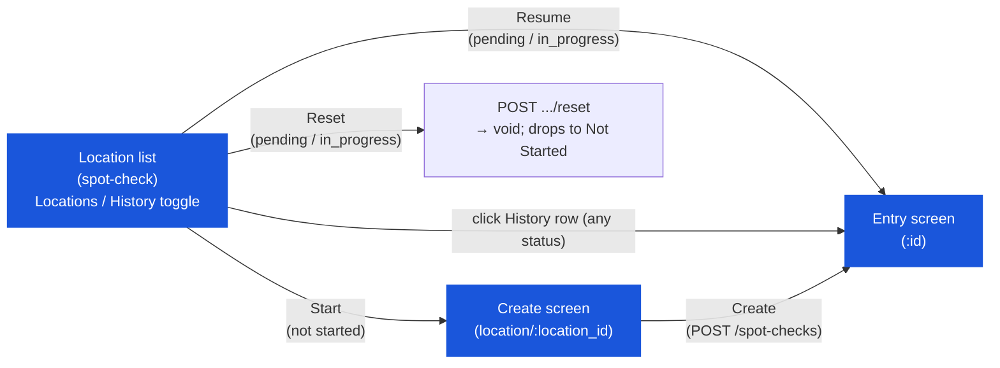

# Spot Check — User Flow — List & Create Screens

> **At a Glance**
> **Screens:** `spot-check` (`sc-component.tsx`) and `spot-check/location/:location_id` (`sc-form.tsx` via `spot-check-by-location-content.tsx`) &nbsp;·&nbsp; **Module:** [spot-check](/en/inventory/spot-check) &nbsp;·&nbsp; **Role:** any user holding `inventory_management.spot_check` — the same single role documented in [03-user-flow-counter.md](/en/inventory/spot-check/03-user-flow-counter), viewed from the list/create screens rather than the entry/review screens
> **What these screens do:** show every location's spot-check status (grouped into Resume / Not Started, plus a full History tab), and start a new spot check for a not-yet-checked location.

## 1. Screen Scope

This page — carried over from an earlier draft's "Inventory Controller" persona name — documents the `spot-check` list screen and the `spot-check/location/:location_id` create screen. There is no code-level distinction between an "Inventory Controller" and a "Counter": both this pair of screens and the entry/review screens in [03-user-flow-counter.md](/en/inventory/spot-check/03-user-flow-counter) are gated by the identical `inventory_management.spot_check` permission, and the same user typically moves through all four screens in one session.

### Screen layout (`sc-component.tsx`)

### What the list screen shows

- **Locations / History toggle** — **Locations** view (`GET /spot-check/current`) buckets every eligible location into **Resume** (has a `pending`/`in_progress` spot check) or **Not Started** (none); **History** view (`GET /spot-checks`, paginated) lists every spot check ever created, any status, with location/status/method filters.
- **KPI tiles** (Locations view only) — All / Resume / Not Started counts, each clickable as a filter.
- **"Include Not Count" checkbox** — toggles `include_not_count` on the `/current` call; unchecked (default), only locations with `physical_count_type = yes` appear (the same per-location flag [physical-count](/en/inventory/physical-count) uses for its own period-end gate — spot check itself is not a period-end gate); checked, locations flagged `no` are added too.
- **Search bar** — filters visible location/history cards by name/code (Locations) or spot-check number/location (History), client-side.
- **Location cards** (`ScLocationCard`) — one per location; "Not Started" locations show a **Start** button; locations with an in-flight spot check show a resume-info panel (spot-check number, method badge, counted/total progress, status badge) plus **Resume** and **Reset** buttons.
- **History cards** (`ScHistoryCard`) — one per historical spot check, clickable to open it (routes to the same entry screen documented in [03-user-flow-counter.md](/en/inventory/spot-check/03-user-flow-counter), regardless of the spot check's status).

### What the create screen shows (`sc-form.tsx`, always in "add" mode here)

- **Method picker** (`ScMethodPicker`) — three cards: **Random** (system samples N products), **High Value** (system samples the N highest-value products), **Manual** (pick specific products).
- **Location** — locked to the `location_id` from the URL; not editable on this screen.
- **Items** field — shown for Random and High Value; the sample size (`size`).
- **Min Value** field — shown only for High Value; an optional cost floor (`minimum_cost`) excluding cheaper products from the ranking.
- **Product transfer** (manual method only) — a two-column picker moving products between "Available" and "Selected."
- **Description** / **Note** — free-text, optional.
- **Create** button — `POST /spot-checks`; on success, navigates straight to the entry screen (`spot-check/:id`).

## 2. Entry Points

- **Location list** (`spot-check`) — the only entry point; there is no separate scheduler or calendar screen.
- **History tab** — reopens any previously-created spot check (any status) at the same entry screen.

## 3. Primary Actions

| Action | State precondition | State effect | Notes |
| ------ | ------------------ | ------------ | ----- |
| Start a spot check (Random) | Location has no in-flight spot check | `POST /spot-checks` with `method: "random"`, `items: N`; new document at `pending`; navigates to `/:id` | Per `SPC_VAL_001`–`002`. |
| Start a spot check (High Value) | Same, plus an open/locked `tb_period` must exist | `POST /spot-checks` with `method: "high_value"`, `items: N`, optional `minimum_cost`; new document at `pending` | Rejects with `SPOT_CHECK_NO_ACTIVE_PERIOD` if no period is open/locked (`SPC_VAL_004`). |
| Start a spot check (Manual) | Same | `POST /spot-checks` with `method: "manual"`, `product_id: [...]`; new document at `pending` | At least one selected product must be in the eligible pool (`SPC_VAL_003`). |
| Resume an in-progress check | Location has a `pending`/`in_progress` spot check | Navigates directly to `/:id` — no new document created | Pure client-side route change. |
| Reset a spot check | Location has a `pending`/`in_progress` spot check | `POST /spot-checks/:id/reset` — `doc_status → void`; location falls back to Not Started | Rejected on `void`/`completed` (`SPC_VAL_006`); does **not** clear `tb_spot_check_detail` rows. |
| Open a history row | Any spot check, any status | Navigates to `/:id` — the entry screen, regardless of `doc_status` | See the caveat in [03-user-flow.md](/en/inventory/spot-check/03-user-flow) § 2.1 about `reviewItems()` having no completed/void guard. |
| Filter by location count-required flag | Check/uncheck "Include Not Count" | List includes/excludes `physical_count_type = no` locations | Does not affect any period-end gate — spot check is not one. |

## 4. Decision Points

- **Random vs. High Value vs. Manual.** Random maintains general coverage; High Value concentrates the sample on the products with the highest recent receipt cost at that location (subject to an active fiscal period existing); Manual is the deliberate, event-driven choice — a specific suspected discrepancy or incident.
- **Include Not Count or not.** Unchecked (default) limits the list to the same locations [physical-count](/en/inventory/physical-count)'s period-end gate cares about — but since spot check is not itself a gate, this toggle only affects which locations are convenient to reach from this screen, not any downstream requirement.
- **Reset vs. let it sit.** Resetting voids the current in-flight document outright (no way to recover it) rather than pausing it — there is no "cancel and keep for later" option; a genuinely paused count is better left as `pending`/`in_progress` and resumed later than reset.

## 5. Exit / Handoff

| Trigger | Handoff to | Artefact |
| ------- | ---------- | -------- |
| Create / Start / Resume | [Entry screen](/en/inventory/spot-check/03-user-flow-counter) — same user, same session | `tb_spot_check` in `pending` (new) or `pending`/`in_progress` (resumed). |
| Reset | (terminal for that document) | `tb_spot_check.doc_status = void`; location shows as Not Started again. |

## 6. References

- **Frontend:** `../carmen-inventory-frontend-react/routes/inventory-management/spot-check/sc-component.tsx`, `sc-form.tsx`, `sc-location-card.tsx`, `sc-history-card.tsx`, `sc-method-picker.tsx`, `sc-reset-dialog.tsx`.
- **Backend:** `../carmen-turborepo-backend-v2/apps/micro-business/src/inventory/spot-check/spot-check.service.ts` (`create`, `reset`, `findCurrentByLocation`), `spot-check.logic.ts` (sampling).
- **E2E:** `../carmen-inventory-frontend-e2e/tests/` — no spot-check spec currently exists; manual test-case catalog at `docs/test-cases/760-spot-check.md`.
- Related: [spot-check/03-user-flow](/en/inventory/spot-check/03-user-flow) (overview), [spot-check/02-business-rules](/en/inventory/spot-check/02-business-rules) (`SPC_VAL_001`–`004`, `SPC_VAL_006`, `SPC_AUTH_001`), [spot-check/03-user-flow-counter](/en/inventory/spot-check/03-user-flow-counter) (the same role's entry/review journey).
