# Spot Check — User Flow

> **At a Glance**
> **Module:** [[spot-check]] &nbsp;·&nbsp; **Personas:** Inventory Controller &nbsp;·&nbsp; Counter &nbsp;·&nbsp; Audit / Config
> **Workflow lifecycle:** Pending → In Progress → Completed (variance rollup to [[inventory-adjustment]]) with Void branch
> **Drill into per-persona views below for action-level detail**

## 1. Overview

This page is the **overview entry point** for the user-flow set of the `spot-check` module. Unlike [[physical-count]]'s three-tier period / document / detail exercise, a spot check is a **two-tier ad-hoc check** — one `tb_spot_check` header per (location, time-window) pairing with a `method` (random / high_value / manual) and `size`, plus `tb_spot_check_detail` rows holding per-product `on_hand_qty` (book snapshot) / `actual_qty` (counted) / `diff_qty` (variance). The work moves quickly along this hierarchy: Inventory Controller opens the spot check, the system (or the controller, for `method = manual`) samples `size` items, assigns a Counter; the Counter walks the location and enters physical quantities line by line; the Inventory Controller inspects variance, triggers recounts, approves completion; the rollup then writes a variance adjustment to [[inventory-adjustment]] which is the path to the [[inventory]] ledger.

Section 2 below describes the **document lifecycle state machine** for `tb_spot_check.doc_status` (`pending → in_progress → completed`, plus the `void` cancel path), independent of who acts. Each per-persona file (linked from Section 3) describes that persona's *path through* this state space — entry point, available actions, decision branches, handoff that ends their involvement. Section 4 then summarises the cross-persona handoffs that stitch the individual paths together (Inventory Controller → Counter for assignment; Counter → Inventory Controller for completed-sheet sign-off; Inventory Controller → Approver/Finance for variance-adjustment approval via [[inventory-adjustment]]).

> **TODO:** Source the canonical UI screens / wizard flows from `../carmen-inventory-frontend/` once a `spot-check` route is discoverable; cross-reference E2E specs at `../carmen-inventory-frontend-e2e/tests/` once added (no `spot-check` spec exists as of this writing). No carmen/docs source folder exists for this module.

## 2. Document Lifecycle

**Document-level state machine (`enum_spot_check_status`):**

```mermaid
stateDiagram-v2
    [*] --> pending : Inventory Controller creates tb_spot_check (location + method + size) — SPC_VAL_001/002; on_hand_qty snapshot captured per line
    pending --> in_progress : Counter enters first actual_qty — SPC_AUTH_004; counted_at / counted_by_id stamped
    in_progress --> in_progress : Counter enters/edits actual_qty on assigned lines OR Inventory Controller flags line for recount (SPC_VAL_006)
    in_progress --> completed : Inventory Controller submits — all lines have actual_qty (SPC_VAL_004); recount flags resolved; rollup fires (SPC_POST_001)
    pending --> void : Inventory Controller cancels before counting starts — SPC_VAL_008; no rollup
    in_progress --> void : Inventory Controller cancels mid-count — SPC_VAL_008; partial entries preserved; no rollup
    completed --> [*]
    void --> [*]

    note right of completed
        Terminal — immutable (SPC_VAL_007).
        Satisfies End Period Close Stage 2 (BR-PE-006).
        Variance rollup fires: diff_qty > 0 -> tb_stock_in (SPOT_CHECK_OVERAGE);
        diff_qty < 0 -> tb_stock_out (SPOT_CHECK_SHORTAGE) — SPC_POST_001.
        Note: variance posting to inventory is PENDING (see 02-business-rules § 5.1).
    end note

    note right of void
        Terminal alternative — no ledger effect.
        Cancelled checks do not satisfy End Period Close Stage 2.
    end note
```

### 2.1 Document-level transitions (`enum_spot_check_status`)

| From state | Action | To state | Allowed for | Pre-conditions |
| ---------- | ------ | -------- | ----------- | -------------- |
| `(none)` | create `tb_spot_check` for `(location, method, size)` | `pending` | Inventory Controller | Location is inventory- or consignment-type per `SPC_VAL_001`; `method` and `size` set per `SPC_VAL_002`. Sample generated per `SPC_VAL_003` (random / high_value) or empty for manual. `on_hand_qty` snapshot captured per line. |
| `pending` | counter enters first `actual_qty` | `in_progress` | Counter | Counter has location-grant for the spot check per `SPC_AUTH_004`. |
| `in_progress` | edit `actual_qty` / add detail comments | `in_progress` | Counter (own lines) | Lines within counter's location-grant. |
| `in_progress` | flag variance line for recount | `in_progress` | Inventory Controller | Variance breach per `SPC_VAL_006`. Triggers recount sub-flow. |
| `in_progress` | submit (all lines counted) | `completed` | Inventory Controller | All detail lines have non-null `actual_qty` per `SPC_VAL_004`; all recount flags resolved. Fires variance rollup per `SPC_POST_001`. |
| `pending` | cancel before counting starts | `void` | Inventory Controller | Allowed per `SPC_VAL_008`; no rollup triggered. |
| `in_progress` | cancel mid-count | `void` | Inventory Controller | Allowed per `SPC_VAL_008`; no rollup triggered; partial entries preserved in audit log. |
| `completed` | view / report / audit | `completed` | All personas (per scope) | Terminal. Immutable per `SPC_VAL_007`. |
| `void` | view / audit | `void` | All personas (per scope) | Terminal alternative. No ledger effect. |

### 2.2 Variance-rollup fan-out

The `in_progress → completed` transition on `tb_spot_check` is the **rollup event**. Per `SPC_POST_001` / `SPC_POST_002`:

- Lines with `diff_qty > 0` group into one or more `tb_stock_in` documents under reason `SPOT_CHECK_OVERAGE` (or aliased `COUNT_OVERAGE`).
- Lines with `diff_qty < 0` group into one or more `tb_stock_out` documents under reason `SPOT_CHECK_SHORTAGE` (or aliased `COUNT_SHORTAGE`).
- Lines with `diff_qty = 0` produce no rollup row.
- Each rollup document carries `info.spotCheckId = <tb_spot_check.id>` for the back-join.
- Adjustment post (per [[inventory-adjustment/03-user-flow]]) writes the inventory transaction and GL entry; the spot check itself does not write to the ledger directly.

> **TODO:** Document the rollup-document-numbering convention (whether one rollup per spot check, one per reason, or one per line) when frontend logic is confirmed. Confirm reason-code naming.

## 3. Persona Files

Each file describes one persona group's path through the lifecycle above. The three groups collapse from the source personas in [[spot-check]] § 4:

- **[[spot-check/03-user-flow-inventory-controller|Inventory Controller]]** — defines selection criteria (`method`, `size`), schedules and launches spot checks, assigns Counters, monitors progress, reviews variances, approves or rejects recount requests, approves adjustments for posting.
- **[[spot-check/03-user-flow-counter|Counter]]** — performs the physical count of in-scope items or locations and records counted quantities accurately and on time.
- **[[spot-check/03-user-flow-audit-config|Audit / Config]]** — Auditor independently reviews spot-check results, recount evidence, and posted adjustments to confirm controls operating and shrinkage investigated. Sysadmin (implicit) configures tolerance / sampling defaults / reason codes.

## 4. Cross-Persona Handoffs

| From persona | Trigger | To persona | Handoff artefact |
| ------------ | ------- | ---------- | ---------------- |
| Inventory Controller | Generates spot check + assigns counter | Counter | `tb_spot_check` in `pending`; counter location-grant. |
| Counter | Completes assigned lines | Inventory Controller | `tb_spot_check_detail` lines all have non-null `actual_qty`. |
| Inventory Controller | Flags variance line for recount | Counter (ideally different from original counter) | Detail-comment with recount-required tag. |
| Inventory Controller | Submits the spot check | System → rollup → [[inventory-adjustment]] | `tb_spot_check.doc_status = completed`; rollup `tb_stock_in` / `tb_stock_out` created. |
| Inventory Controller | Routes rollup adjustment for approval | Audit / Config (Approver / Finance via adjustment side) | `tb_stock_in` / `tb_stock_out` in `in_progress`. |
| Approver / Finance (on adjustment side) | Approves rollup adjustment | System → [[inventory]] ledger | `tb_stock_in` / `tb_stock_out` in `completed`; `tb_inventory_transaction` written. |
| Auditor | Reviews completed spot checks + posted adjustments | (read-only — terminal) | Full chain readable: spot-check sheet, recount records, approvals, posted adjustments, journal entries. |

> **TODO:** Diagram these handoffs once Mermaid / sequence-diagram convention is established for the wiki. Cross-link to [[inventory-adjustment/03-user-flow]] for the rollup-side flow.

## 5. References

- **Primary (TODO):** carmen/docs source — does not exist for this module.
- **Frontend (TODO):** `../carmen-inventory-frontend/` — UI flow source.
- **E2E (TODO):** `../carmen-inventory-frontend-e2e/tests/` — no spot-check spec currently exists.
- Related flow pages: [[inventory-adjustment/03-user-flow]] (rollup-side flow), [[physical-count/03-user-flow]] (full-count counterpart flow with three-tier structure).
