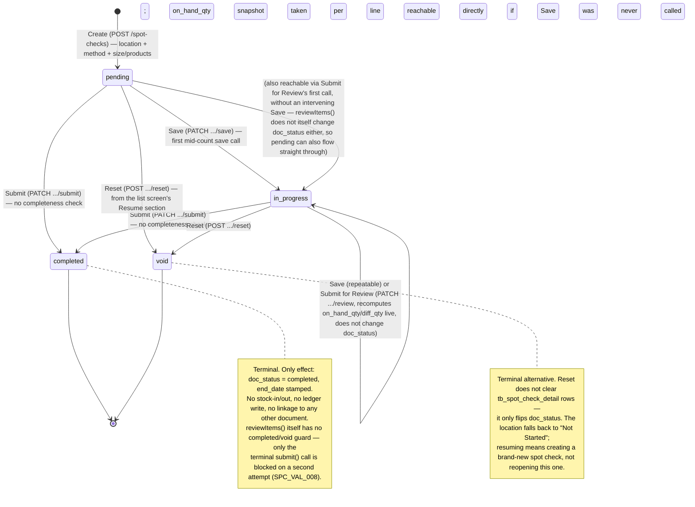

# Spot Check — User Flow

> **At a Glance**
> **Module:** [spot-check](/en/inventory/spot-check) &nbsp;·&nbsp; **Persona:** one undifferentiated role, gated by a single permission (`inventory_management.spot_check`) — the two files linked below split its journey by screen (list/create vs. entry/review), not by a real role difference
> **Workflow lifecycle (`enum_spot_check_status`):** `pending → in_progress → completed`, or `pending`/`in_progress → void` (Reset). `pending → completed` directly (skipping `in_progress`) is also reachable if a Save is never triggered mid-count.
> **Real screens:** `spot-check` (list) → `spot-check/location/:location_id` (create) → `spot-check/:id` (entry) → `spot-check/:id/review` (variance review + final submit)

## 1. Overview

This page is the **overview entry point** for the user-flow set of the `spot-check` module. The real implementation is a single continuous journey with no hand-off between different people: one permission-gated user opens the location list (`spot-check`), starts a check for a location with no in-flight spot check (`spot-check/location/:location_id`) by picking a sampling `method` and scope, enters `actual_qty` per sampled product on the entry screen (`spot-check/:id`), clicks **Submit for Review** once every line has a locally-entered value, reviews the computed variance on `spot-check/:id/review`, and clicks the final **Submit** — the action that closes the document (`doc_status = completed`) and, unlike [physical-count](/en/inventory/physical-count), produces **no other effect of any kind**: no rollup document, no ledger write.

Section 2 below describes the real document-lifecycle state machine for `tb_spot_check.doc_status`. Section 3 links two files that describe the same real flow from two screen-based angles — the list/create screens (`03-user-flow-inventory-controller.md`) and the entry/review screens (`03-user-flow-counter.md`) — retained as separate pages for continuity with this wiki's page layout, not because a distinct "Inventory Controller" and "Counter" role exists in code. Section 4 is a correction note pointing at `03-user-flow-audit-config.md`, which documents the confirmed absence of any Approver/Auditor/Sysadmin surface for this module.

## 2. Document Lifecycle

**Document-level state machine (`enum_spot_check_status`):**

```mermaid
stateDiagram-v2
    [*] --> pending : Create (POST /spot-checks) — location + method + size/products; on_hand_qty snapshot taken per line
    pending --> in_progress : Save (PATCH .../save) — first mid-count save call
    in_progress --> in_progress : Save (repeatable) or Submit for Review (PATCH .../review, recomputes on_hand_qty/diff_qty live, does not change doc_status)
    pending --> in_progress : (also reachable via Submit for Review's first call, without an intervening Save — reviewItems() does not itself change doc_status either, so pending can also flow straight through)
    pending --> completed : Submit (PATCH .../submit) — no completeness check; reachable directly if Save was never called
    in_progress --> completed : Submit (PATCH .../submit) — no completeness check
    pending --> void : Reset (POST .../reset) — from the list screen's Resume section
    in_progress --> void : Reset (POST .../reset)
    completed --> [*]
    void --> [*]

    note right of completed
        Terminal. Only effect: doc_status = completed, end_date stamped.
        No stock-in/out, no ledger write, no linkage to any other document.
        reviewItems() itself has no completed/void guard — only the
        terminal submit() call is blocked on a second attempt (SPC_VAL_008).
    end note

    note right of void
        Terminal alternative. Reset does not clear tb_spot_check_detail rows —
        it only flips doc_status. The location falls back to "Not Started";
        resuming means creating a brand-new spot check, not reopening this one.
    end note
```

### 2.1 Document-level transitions (`enum_spot_check_status`)

| From state | Action | To state | Allowed for | Pre-conditions |
| ---------- | ------ | -------- | ----------- | -------------- |
| `(none)` | Create (`POST /spot-checks`) for `(location, method, size or product_id[])` | `pending` | Any user with `inventory_management.spot_check` | Location exists (`SPC_VAL_001`); eligible product pool non-empty (`SPC_VAL_002`); `manual` requires a non-empty, pool-matching `product_id[]` (`SPC_VAL_003`); `high_value` requires an open/locked `tb_period` to exist (`SPC_VAL_004`). `on_hand_qty` snapshot captured per line at this moment. |
| `pending` | Save (`PATCH .../save`) | `in_progress` | Same user | Non-empty `items[]` (`SPC_VAL_007`). Stamps `counted_at`/`counted_by_id`; recomputes `diff_qty` against the currently-stored `on_hand_qty`. |
| `in_progress` | Save (repeat) | `in_progress` | Same user | Same as above; repeatable. |
| `pending` / `in_progress` | Submit for Review (`PATCH .../review`) | (no status change) | Same user | Recomputes `on_hand_qty`/`diff_qty` live for every line from the current ledger balance; stamps `counted_at`/`counted_by_id`; navigates to `/review`. Not blocked by an incomplete document. |
| `pending` / `in_progress` | Submit (`PATCH .../submit`, from `/review`) | `completed` | Same user | No completeness check (`SPC_VAL_008`) — succeeds even with uncounted lines. Stamps `end_date`. Terminal; no other document or ledger effect. |
| `pending` / `in_progress` | Reset (`POST .../reset`) | `void` | Same user, from the list screen's Resume section | Rejected if already `void` or `completed` (`SPC_VAL_006`). Does not clear detail rows. |
| `completed` / `void` | view only | (unchanged) | Any user with the module permission (read) | Reachable from the list's History tab regardless of status; the entry screen renders identically, though Save is blocked by `SPC_VAL_007` and the terminal Submit is blocked by `SPC_VAL_008` — but Submit for Review is **not** blocked and will silently rewrite detail rows if triggered again (see [02-business-rules.md](/en/inventory/spot-check/02-business-rules) `SPC_POST_004`). |

### 2.2 What the final Submit does — and does not do

Per `SPC_POST_001`–`003`:

- `doc_status` becomes `completed`; `end_date` is stamped. That is the entire effect.
- **No `tb_stock_in`/`tb_stock_out` document is created.** No `tb_inventory_transaction` row is written. No field on any table records that this spot check ever happened, beyond the spot-check's own rows.
- Correcting a confirmed variance is a fully separate, manual action: a user must go create an ordinary [inventory-adjustment](/en/inventory/inventory-adjustment) Stock In/Out document themselves. Nothing pre-fills it, links to it, or even reminds the user to create it.

## 3. Persona Files

Both files below describe the **same single permission-gated role**, split by which screen it is using:

- **[List / Create screens](/en/inventory/spot-check/03-user-flow-inventory-controller)** — opening the location list, choosing a sampling method and scope, starting a new spot check.
- **[Entry / Review screens](/en/inventory/spot-check/03-user-flow-counter)** — line entry, notes, import/export, Submit for Review, and the final Submit.

## 4. Confirmed-Absent Persona Group

An earlier draft of this wiki module described a third persona group — an Inventory Controller distinct from a Counter, plus an Auditor and an implicit Sysadmin — assigning counters, flagging variance lines for recount, approving rollup adjustments, and configuring tolerance thresholds and reason codes. A targeted search of the frontend, backend, and Bruno collection found no matching permission key, route, workflow stage, or configuration screen for any of this. See [03-user-flow-audit-config.md](/en/inventory/spot-check/03-user-flow-audit-config) for the correction note.

## 5. References

- **Frontend:** `../carmen-inventory-frontend-react/routes/inventory-management/spot-check/` (`sc-component.tsx`, `sc-form.tsx`, `sc-entry-component.tsx`, `sc-review-component.tsx`).
- **Backend:** `../carmen-turborepo-backend-v2/apps/micro-business/src/inventory/spot-check/spot-check.service.ts`.
- **E2E:** `../carmen-inventory-frontend-e2e/tests/` — no spot-check spec currently exists; manual test-case catalog at `docs/test-cases/760-spot-check.md`.
- Related flow pages: [inventory-adjustment/03-user-flow](/en/inventory/inventory-adjustment/03-user-flow) (where a confirmed variance must be manually corrected), [physical-count/03-user-flow](/en/inventory/physical-count/03-user-flow) (full-count counterpart flow).
