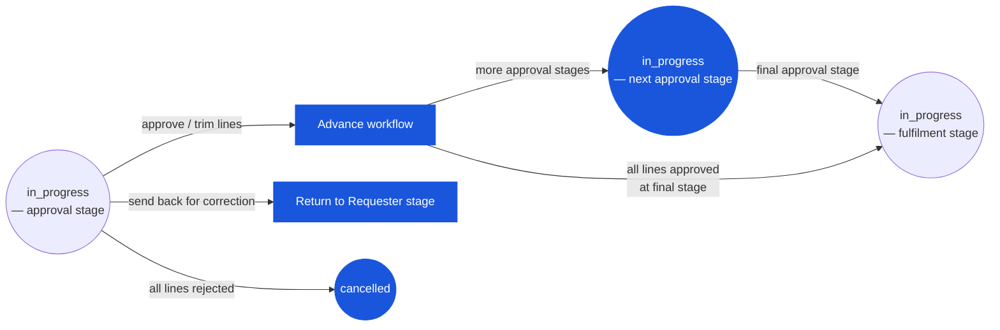

# Store Requisition — User Flow — Approver

> **At a Glance**
> **Persona:** Approver (Department Head + later-stage Ops / Cost Controller) &nbsp;·&nbsp; **Module:** [[store-requisition]] &nbsp;·&nbsp; **Workflow stages:** in_progress (approval stage) → in_progress (fulfilment) / cancelled / draft (send-back) &nbsp;·&nbsp; **Key permissions:** approve, trim approved_qty, reject (line / header), split-reject, send-back
> **What this persona does:** Reviews submitted SR lines against need, par level, and budget; approves, trims, rejects, or sends back via workflow stage advance.

## 1. Role in This Module

The **Approver** persona is the **Department Head** (or, at later approval stages in a multi-tier workflow, the Operations Manager / Cost Controller) who owns the review of a submitted SR before it can be released for fulfilment. The Approver is the control gate between the outlet's demand (`requested_qty`) and the store's release authority (`approved_qty ≤ requested_qty`). On entry the SR is at `doc_status = in_progress` with `workflow_current_stage` pointing at an approval stage where the Approver is in `user_action.execute`. The Approver reviews each line against operational need, par levels, current source availability, and budget; approves in full, trims `approved_qty` down, rejects with a reason, or sends the document back to the requester for correction. Per-line approval / review / rejection signatures (`approved_by_id`, `review_by_id`, `reject_by_id` plus name / date / message columns) are persisted directly on `tb_store_requisition_detail` for audit; per-line `history` JSON appends a `{ seq, name, status, message, by, at }` entry for every action. The Approver never advances `doc_status` directly — they advance `workflow_current_stage`; the header status stays `in_progress` throughout the approval phase. Segregation of duties forbids the requester from being the approver (`SR_AUTH_011`); the SR module enforces this at the approve action. Approval delegation (a Department Head assigning their approval right to a deputy) is handled at the workflow layer (`tb_workflow` config), not on the SR itself.

### Workflow position (Approver highlighted)

### Permission Matrix — V2 Action × Stage Role (Approver)

The Approver acts at `doc_status = in_progress` while `workflow_current_stage` points to an approval stage where the Approver is in `user_action.execute`. The SR module enforces Segregation of Duties: the Approver must not be the same user as the Requester (`SR_AUTH_011`). In multi-tier workflows the same action set applies at each stage; the second-stage Approver (Operations Manager / Cost Controller) sees the first-stage signature as additional context.

| Action | First-stage Approver (Dept Head) | Second-stage Approver (Ops Mgr / multi-tier) |
|---|---|---|
| Open SR pending approval | ✅ (`SR_AUTH_005`) | ✅ (after first-stage acts) |
| Approve line in full (`approved_qty = requested_qty`) | ✅ (`SR_AUTH_005`) | ✅ (`SR_AUTH_005`) |
| Trim `approved_qty` down (`0 < approved_qty < requested_qty`) | ✅ (`SR_AUTH_005`) | ✅ (`SR_AUTH_005`) |
| Reject line (`approved_qty = 0` + mandatory `reject_message`) | ✅ (`SR_AUTH_005`, `SR_VAL_010`) | ✅ (`SR_AUTH_005`, `SR_VAL_010`) |
| Send back line for correction (`review_message` non-empty) | ✅ (`SR_AUTH_005`) | ✅ (`SR_AUTH_005`) |
| Split decision — mix approve / reject / send-back per line | ✅ (`SR_AUTH_006`) | ✅ (`SR_AUTH_006`) |
| Approve own SR (where Approver = Requester) | ❌ (SOD: `SR_AUTH_011`) | ❌ (SOD: `SR_AUTH_011`) |
| Raise `approved_qty` above `requested_qty` | ❌ (`SR_VAL_010`) | ❌ (`SR_VAL_010`) |
| Commit / issue goods | ❌ (SOD: Approver ≠ Fulfiller `SR_AUTH_012`) | ❌ (SOD: `SR_AUTH_012`) |

> ℹ️ **Multi-tier escalation:** When the SR's total value exceeds the first-stage approver's threshold, the workflow advances to a second-stage approver after the first stage acts. Each stage's approver sees previous signatures as context; further trimming or rejection is permitted at each stage.

## 2. Entry Point and Primary Flow

**Entry point:** Three paths into the approve action.

- **Approvals dashboard → Pending SR approvals** — list view filtered to `(doc_status = 'in_progress', workflow_current_stage = '<approver-stage>', user_action.execute CONTAINS me)`; the approver picks an SR to open.
- **Notification → SR submitted for your approval** — email / in-app notification on submit deep-links to the SR detail; same approve action surface.
- **Multi-tier approval — second-stage approver** — a tenant with two or more approval levels has a second-stage approver (e.g. Operations Manager for SRs above a value threshold). The same workflow advances the document from the first-stage to the second-stage approver after first-stage approval; same approve action surface, but the Approver sees the first-stage approver's signature on each line as additional context.

**Primary flow (happy path, 8 steps):**

1. **Open the SR.** The detail view shows the header (source / destination, `sr_type`, dates, requester, description, dimension), the lines with their `requested_qty` and the UI-only enrichment block (current source on-hand, on-order, last price, last vendor, product category — not persisted on the SR), and the workflow history.
2. **Verify the request against context.** For each line: is the quantity consistent with the outlet's par level (`product.par_level` joined per outlet)? Does it match the recipe demand for any production planned in the period (`info.recipe_id` if present)? Is the source on-hand sufficient? Is the cost-centre allocation (`dimension`) consistent with the outlet's budget? The screen surfaces budget-impact hints if Finance has wired the budget module to the approver view.
3. **Per-line decision.** For each line the Approver chooses one of:
   - **Approve in full**: set `approved_qty = requested_qty`. Per-line: `approved_by_id`, `approved_by_name`, `approved_date_at = now()`, optional `approved_message`.
   - **Trim down**: set `approved_qty ∈ (0, requested_qty)`. Per-line: same signature columns; `approved_message` typically explains the trim ("source on-hand limited", "par-level cap", "budget cap"). `approved_qty > requested_qty` is rejected by `SR_VAL_010`.
   - **Reject the line**: set `approved_qty = 0`. Per-line: `reject_by_id`, `reject_by_name`, `reject_date_at = now()`, `reject_message` is **mandatory** (`SR_VAL_010` second clause). The requester sees the reason on resubmit and may amend.
   - **Send back the line for correction**: set `review_by_id`, `review_by_name`, `review_date_at = now()`, `review_message` non-empty. The workflow routes the document back to the requester stage with this line flagged; the Approver does not set `approved_qty` (it remains `0` from the default until the requester resubmits and the line is approved on the next pass).
4. **Split decision across lines.** Mix of outcomes on the same SR is fine — some lines approved (in full or trimmed), some rejected, some sent back. The action set is per-line; the screen shows running totals of "approved value" and "rejected value" for context.
5. **Confirm the action.** Click **Submit Approval Decision**. The system fires `SR_VAL_010` per line (cap check on `approved_qty`, reject-message presence), `SR_AUTH_005` (Approver is in `user_action.execute`), `SR_AUTH_011` (Approver ≠ Requester), and `SR_AUTH_006` (split & reject is permitted if at least one line has `approved_qty > 0`).
6. **Workflow advance.** When all lines on the current stage have been actioned (no line left at status `submit` with no decision), the system advances `workflow_current_stage` to the next stage. Possibilities: (a) next approval stage for multi-tier workflows (typically a higher-level approver); (b) the fulfilment stage when all approvals complete and at least one line has `approved_qty > 0`; (c) automatic move to `cancelled` if all active lines were rejected (`Σ approved_qty = 0`); (d) return to requester stage when any line was sent back for review.
7. **Notify downstream personas.** The system notifies the next stage's users (`user_action.execute` of the new stage): typically the Fulfiller at the source location is alerted that an approved SR is ready to pick. The requester is notified of the outcome — approval, trim, rejection, or send-back — per line.
8. **Audit trail recorded.** `last_action` is updated (`approved` for full / partial approve, `rejected` for full reject, `reviewed` for send-back) along with `last_action_at_date` and `last_action_by_id`; `workflow_history` gets an entry; each touched line gets a `history` JSON append. The approver's per-line signature columns (`approved_by_*`, `review_by_*`, `reject_by_*`) are the formal audit signature; the comment table is for additional discussion thread.

## 3. Decision Branches

- **Trim to source availability**: the source on-hand is less than the requested quantity. The Approver trims `approved_qty` to the available stock (or to a buffer below it for safety). The trim is recorded with `approved_message = "trimmed to source on-hand"` (or similar). The fulfiller will see the trimmed value at issue time.
- **Trim to par-level cap**: the outlet has a par-level discipline (max held quantity per product per outlet). If the requested quantity would push the outlet's holding above par, the Approver trims to the par allowance. Same signature pattern.
- **Trim to budget cap**: the outlet's cost-centre is approaching its monthly budget; the Approver trims discretionary lines (non-essential ingredients) and leaves essentials at the requested quantity. The trim is documented in `approved_message`.
- **Reject for missing justification**: an unusual or high-value line lacks a justification note. The Approver chooses send-back (not reject) and writes `review_message = "please provide rationale for the requested quantity"`; the line is returned to the requester for amendment.
- **Reject the entire SR**: every line is rejected with `reject_message`. The system automatically moves the document to `cancelled` (`SR_POST_004` tail → `SR_POST_009`); the requester is notified.
- **Send back a single line, approve the rest**: the workflow allows mixed outcomes per line. The Approver approves the lines that are fine and sends back the questioned line; the SR returns to the requester at the requester stage, but the already-approved lines remain approved (they do not revert). When the requester amends and resubmits, the questioned line re-enters the approval stage as a new pass; the already-approved lines do not.
- **Multi-tier escalation**: the SR's total value exceeds the first-stage approver's threshold. After the first-stage approver acts (approve / trim), the workflow advances to the second-stage approver instead of fulfilment. The second-stage approver sees the first-stage signature and may further trim or reject.
- **Delegation**: the named approver is on leave; the workflow has been configured to delegate to a deputy. The deputy sees the SR in their queue and acts; the per-line signature records the deputy's id, with a `system` comment noting the delegation chain.
- **Time-out / SLA escalation**: the SR has been in the approval queue past the tenant's SLA window. The workflow may auto-escalate to a higher approver or notify the inventory controller; the original approver does not lose authority but is reminded with priority flags.

## 4. Exit Point / Handoffs

The Approver's involvement on a given SR ends at one of four boundaries:

- **All lines actioned, workflow advances to fulfilment** — handoff to the **Fulfiller** at the source location. The document is `in_progress` and now in the fulfiller's queue; the approver is no longer in `user_action.execute` for the current stage. Per-line `approved_qty`, `approved_by_*`, and `approved_message` are the contract the fulfiller will fulfil against.
- **All lines actioned, workflow advances to next approval stage** — handoff to the **next-stage Approver** (multi-tier workflows). The current approver's signature is preserved; the next-stage approver acts on the lines that survived the first stage.
- **Any line sent back for correction** — handoff back to the **Requester**. The SR re-enters the requester workflow stage; the already-approved lines remain approved (they do not revert to `submit`); the requester addresses the `review_message` and resubmits.
- **All lines rejected** — `in_progress → cancelled` automatic per `SR_POST_004` tail; the document terminates; the requester is notified per-line.

The Approver may also dispute a downstream issue post-commit (e.g. the fulfiller short-fulfilled an approved line); the resolution is via Inventory Controller variance review and `[[inventory-adjustment]]`, not via re-opening the SR.

## 5. References

- Parent overview: [03-user-flow.md](./03-user-flow.md) — the canonical five-value lifecycle on `enum_doc_status` and the cross-persona handoff table; Section 4 row "Approver → Fulfiller" and "Approver → Requester (send-back)" anchor this persona's exits.
- `../carmen/docs/store-requisitions/SR-User-Experience.md` § Approving a Store Requisition — carmen/docs source for the approver (named "James Wilson, Department Head" in the persona narrative); journey steps map onto Section 2 above.
- `../carmen/docs/store-requisitions/SR-Overview.md` § User Roles → Approver row — carmen/docs source for the persona's responsibility scope.
- `../carmen/docs/store-requisitions/Store Requisitions.md` § UC-64 (Approve Requisition Requests), § UC-65 (Deny Requisition Requests), § UC-66 (Modify Requisition Requests) — use-case sources for the approve / trim / reject decisions in Section 2 above.
- Sibling: [03-user-flow-requester.md](./03-user-flow-requester.md) — upstream persona; the Approver's input is the Requester's submitted SR.
- Sibling: [03-user-flow-fulfiller.md](./03-user-flow-fulfiller.md) — downstream persona; the Approver's `approved_qty` is the cap the Fulfiller works within.
- Sibling: [03-user-flow-audit-config.md](./03-user-flow-audit-config.md) — Inventory Controller and Auditor monitor approval patterns (chronic over-approval, chronic rejection) and the Sysadmin configures the workflow stages / thresholds that bound the Approver's authority.
- Sibling: [01-data-model.md](./01-data-model.md) — per-line approval / review / rejection signature columns on `tb_store_requisition_detail` (`approved_by_*`, `review_by_*`, `reject_by_*`), the `history` and `stages_status` JSON timelines.
- Sibling: [02-business-rules.md](./02-business-rules.md) — `SR_VAL_010` (approval invariant: `approved_qty ≤ requested_qty`, reject-message mandatory), `SR_AUTH_005`–`SR_AUTH_006` (approve / trim / send-back authority), `SR_AUTH_011` (Requester ≠ Approver SoD), `SR_POST_003`–`SR_POST_004` (approve / reject posting effects within `in_progress`).
- Related: [[recipe]] — recipe-driven SRs carry `info.recipe_id`; the Approver sees the recipe context as part of the per-line decision.
- Related: [[inventory]] — source-availability context surfaced at approve time (UI enrichment); the Approver's trim decisions ripple into the fulfiller's pick.
